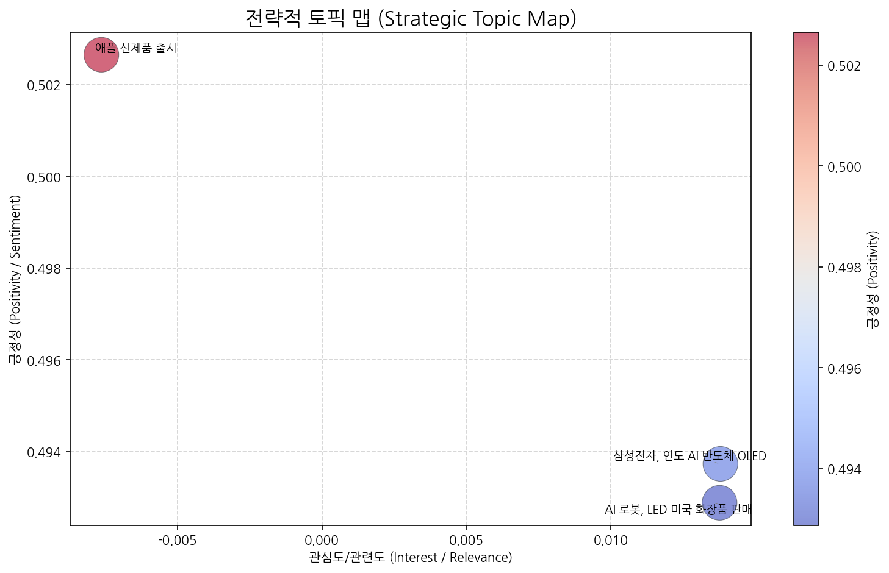
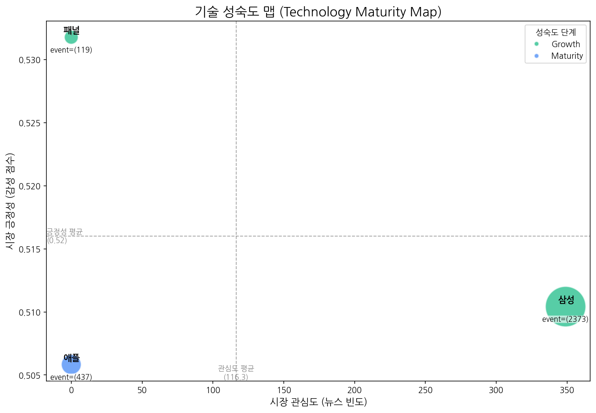
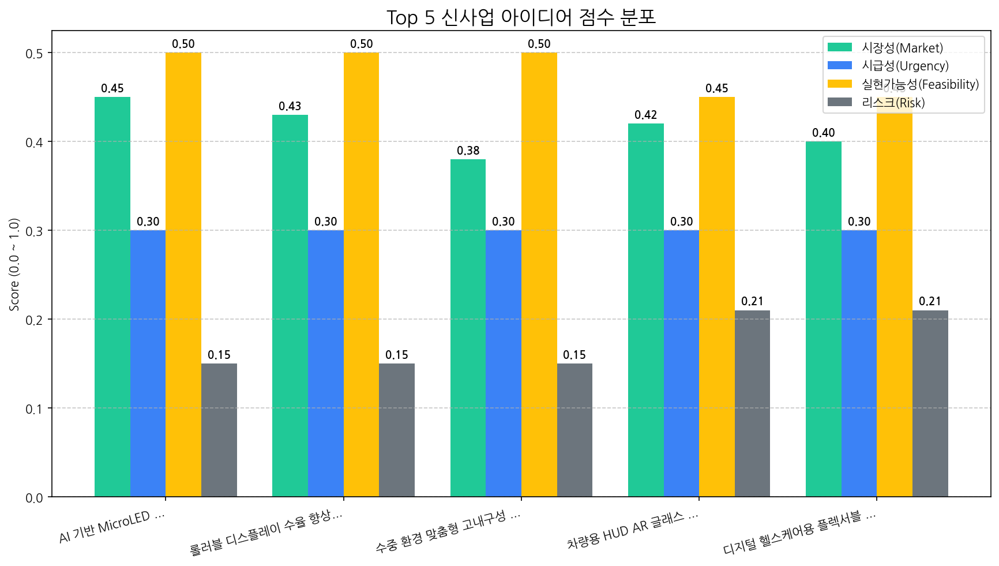

# Monthly Strategic Review (2025-09-20 ~ 2025-10-19)

## 1. 전략적 시장 포지셔닝 맵

| 토픽명                  | 요약                                                                             | 핵심 키워드       |
|:---------------------|:-------------------------------------------------------------------------------|:-------------|
| 삼성전자, 인도 AI 반도체 OLED | 삼성전자가 인도 시장을 중심으로 AI, 반도체, OLED 디스플레이 기술을 활용한 프리미엄 사업을 확장하는 전략과 관련된 내용입니다.     | 기술, ai, oled |
| AI 로봇, LED 미국 화장품 판매 | AI와 로봇 기술을 활용한 LED 디스플레이 관련 기술이 화장품 판매 및 미국 시장에서 보이는 동향과 전주 지역의 전망을 다루는 내용입니다. | ai, 동기, 판매   |
| 애플 신제품 출시            | 애플의 M5 칩을 탑재한 맥북 프로, 폴더블폰, 비전 프로 등 다양한 신제품 출시 및 AI 기술 적용에 대한 뉴스.               | 프로, 맥북, 애플   |

## 2. 기술 수명 주기 및 R&D 투자 타이밍 분석

| 기술   | 단계       | 판단 근거                                                                                           |
|:-----|:---------|:------------------------------------------------------------------------------------------------|
| 삼성   | Growth   | 높은 출시 빈도와 투자 건수는 삼성 기술이 시장에서 성장 단계에 있음을 시사합니다.                                                  |
| 애플   | Maturity | 뉴스 언급 빈도가 낮고, 긍정적 시장 감성을 유지하며, 출시 이벤트는 활발하지만 투자나 수주와 같은 성장을 위한 이벤트가 상대적으로 적어 성숙기에 접어들었다고 판단됩니다. |
| 패널   | Growth   | 뉴스 언급은 적지만 투자 및 출시 이벤트가 수주 이벤트보다 압도적으로 많아 시장이 성장기에 진입한 것으로 판단됩니다.                               |

## 3. 경쟁사 전략적 의도 및 파트너 관계망 분석

### 기업별 토픽 집중도 (상위 5개사)
- (데이터 없음)

## 4. 전략적 리스크 관리 및 완화 액션 제안

- (데이터 없음)

## 5. 데이터 기반 신사업 아이디어 및 초기 검증

| 아이디어                               | 가치 제안                                                                                        |   총점 |
|:-----------------------------------|:---------------------------------------------------------------------------------------------|-----:|
| AI 기반 MicroLED 디스플레이 화질 자동 보정 시스템  | AI 기반 실시간 화질 분석 및 보정, 수동 보정 대비 50% 이상 시간 단축, 불량률 감소, 균일한 화질 유지, 생산 비용 절감                     |  3.5 |
| 롤러블 디스플레이 수율 향상을 위한 AI 공정 모니터링 서비스 | AI 기반 실시간 공정 데이터 분석 및 이상 감지, 불량 예측 정확도 90% 이상, 수율 20% 향상, 공정 최적화 및 자동 제어, 생산 비용 절감           |  3.4 |
| 수중 환경 맞춤형 고내구성 OLED 디스플레이          | 최대 수심 1000m에서도 작동, 염분 및 부식에 강한 특수 코팅, 넓은 시야각 및 고해상도, 저전력 설계, 극한 환경에서의 안정적인 성능 보장             |  3.3 |
| 차량용 HUD AR 글래스 일체형 OLED 패널         | 넓은 시야각, 고해상도 AR 정보 제공, 운전자 맞춤형 인터페이스, 글래스 일체형 디자인으로 공간 효율성 극대화, 기존 HUD 대비 몰입감 및 정보 전달력 3배 향상 |  3.1 |
| 디지털 헬스케어용 플렉서블 마이크로 LED 패치         | 피부 부착형 초경량 디자인, 실시간 생체 신호 모니터링 및 시각적 정보 제공, 사용자 맞춤형 건강 관리 기능, 저전력 구동, 높은 내구성 및 신뢰성           |  3   |

## 6. 향후 2주 실행 계획 (Action Plan)

| Hypothesis                                                                                                | Target                                                    | KPI                                                            | Owner   | Due        |
|:----------------------------------------------------------------------------------------------------------|:----------------------------------------------------------|:---------------------------------------------------------------|:--------|:-----------|
| MicroLED 디스플레이 제조사들은 현재 화질 불균일 문제 해결에 어려움을 겪고 있으며, 자동 보정 시스템 도입에 대한 니즈가 존재한다.                             | 국내 MicroLED 디스플레이 제조사 3곳 (A사, B사, C사) 기술 담당자 인터뷰          | 인터뷰 대상 3곳 중 2곳 이상에서 현재 화질 불균일 문제 해결의 어려움 및 자동 보정 시스템 도입 의향을 확인 | 사업개발팀   | 2025-11-02 |
| AI 기반 화질 분석 및 보정 알고리즘은 수동 보정 대비 시간 단축 및 불량률 감소 효과를 가져올 수 있다.                                              | 자체 개발한 MicroLED 디스플레이 시뮬레이션 환경에서 AI 알고리즘과 수동 보정 비교 테스트 진행 | AI 알고리즘 보정 시간이 수동 보정 시간 대비 50% 이상 단축, 시뮬레이션 환경에서의 불량률 10% 감소   | 기술기획팀   | 2025-11-02 |
| MicroLED 디스플레이 제조사들은 초기 투자 비용 대비 장기적인 생산 비용 절감 효과에 대한 정보가 제공될 경우, AI 기반 자동 보정 시스템 도입에 긍정적인 의사 결정을 내릴 것이다. | 인터뷰를 통해 자동 보정 시스템의 예상 투자 비용 및 ROI 분석 자료 제공, 데모 시연 진행      | 인터뷰 대상 3곳 중 1곳 이상으로부터 시스템 도입에 대한 긍정적 검토 의사 (POC 진행 의사) 확보      | 사업개발팀   | 2025-11-02 |
