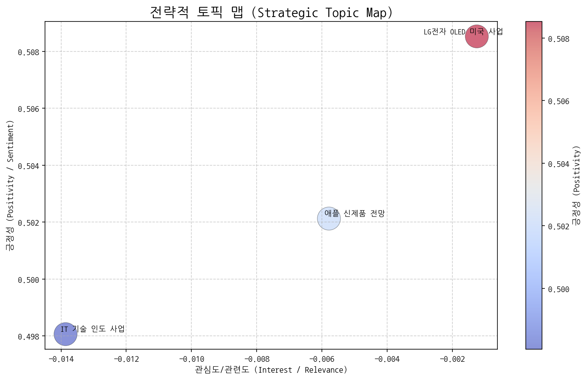
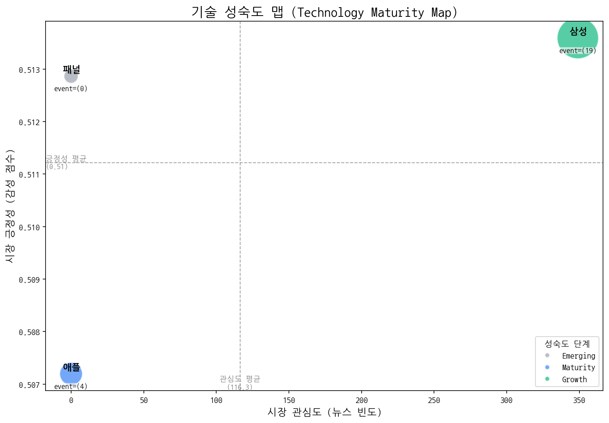
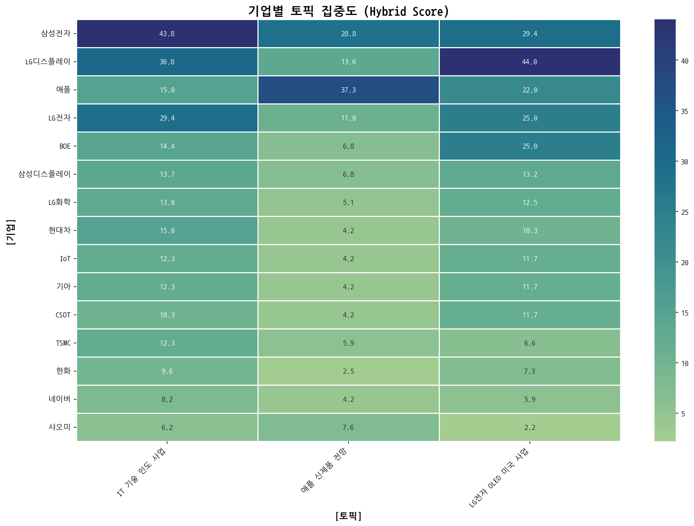
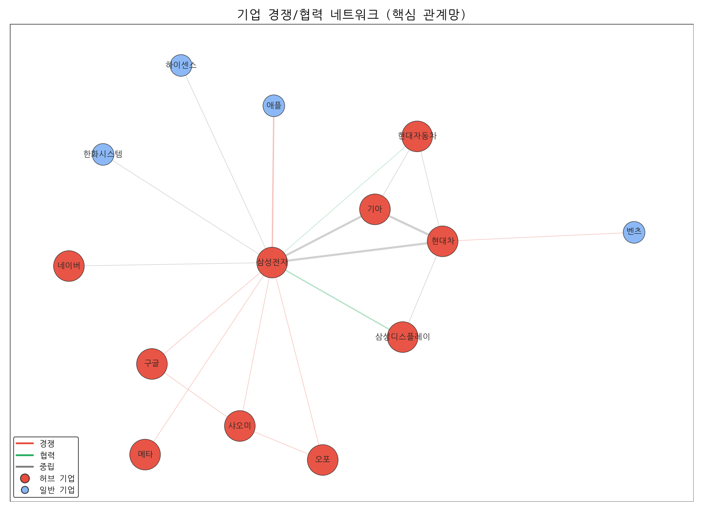
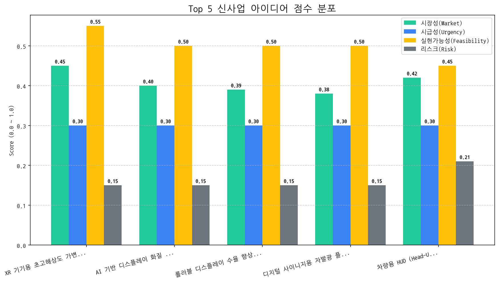

# Monthly Strategic Review (2025-09-20 ~ 2025-10-19)

## 1. 전략적 시장 포지셔닝 맵

| 토픽명             | 요약                                                              | 핵심 키워드          |
|:----------------|:----------------------------------------------------------------|:----------------|
| IT 기술 인도 사업     | 삼성전자, LG 등 주요 IT 브랜드의 AI, 반도체, 디스플레이 기술 관련 인도 사업 확장 및 경쟁 심화 전망. | 기술, ai, 디스플레이   |
| 애플 신제품 전망       | 애플의 M5 칩, 폴더블폰, AI 기능, 비전 프로 등 차세대 맥북 및 신제품 출시 관련 정보.           | 프로, 맥북, 애플      |
| LG전자 OLED 미국 사업 | LG전자의 3분기 OLED TV 및 디스플레이 사업 실적, 특히 미국 시장에서의 장비 및 패널 사업 관련 내용.  | oled, 디스플레이, 장비 |

## 2. 기술 수명 주기 및 R&D 투자 타이밍 분석

| 기술   | 단계       | 판단 근거                                                                                              |
|:-----|:---------|:---------------------------------------------------------------------------------------------------|
| 패널   | Emerging | 뉴스 언급 빈도가 0회이고 투자, 출시, 수주 이벤트도 발생하지 않아 시장 관심이 낮으며, 시장 감성 점수 또한 중간 수준으로 초기 단계로 판단됩니다.               |
| 애플   | Maturity | 최근 뉴스 언급 빈도가 없고, 투자 및 수주 이벤트가 없으며, 시장 감성 점수가 중간 수준인 반면 출시 이벤트만 발생했다는 것은 애플 기술이 성숙 단계에 진입했음을 시사합니다. |
| 삼성   | Growth   | 뉴스 언급 빈도가 높고, 시장 감성 점수가 중간 수준이며, 출시 이벤트가 투자 이벤트보다 많아 성장기에 있는 것으로 판단됩니다.                            |

## 3. 경쟁사 전략적 의도 및 파트너 관계망 분석

### 3.1. 기업x토픽 MATRIX (상위 15개사)

### 기업별 토픽 집중도 (상위 5개사)
| org   | topic_0    | topic_1   | topic_2    |
|:------|:-----------|:----------|:-----------|
| ASUS  | 2.73 (1%)  | 2.54 (1%) | 0.73 (0%)  |
| AUO   | 3.42 (1%)  | 1.69 (1%) | 2.94 (1%)  |
| BMW   | 2.73 (1%)  | nan       | 1.47 (0%)  |
| BOE   | 14.36 (4%) | 6.78 (3%) | 24.95 (8%) |
| BYD   | 1.37 (0%)  | nan       | nan        |

### 3.2. 기업 경쟁/협력 관계망

### 가장 강한 관계 Top 5
| source   | target   |   weight | rel_type    |
|:---------|:---------|---------:|:------------|
| 기아       | 현대차      |        5 | neutral     |
| 삼성전자     | 현대차      |        4 | neutral     |
| 기아       | 삼성전자     |        4 | neutral     |
| 삼성전자     | 애플       |        3 | rivalry     |
| 삼성디스플레이  | 삼성전자     |        3 | partnership |

## 4. 전략적 리스크 관리 및 완화 액션 제안

- (데이터 없음)

## 5. 데이터 기반 신사업 아이디어 및 초기 검증

| 아이디어                                     | 가치 제안                                                                                                                 |   총점 |
|:-----------------------------------------|:----------------------------------------------------------------------------------------------------------------------|-----:|
| XR 기기용 초고해상도 가변 주사율 OLED 패널              | 초고해상도(8K 이상), 가변 주사율(최대 240Hz) 지원으로 최상의 XR 경험 제공. 저전력 소자 및 구동 회로 설계로 전력 효율 극대화. 경쟁사 대비 높은 해상도와 주사율로 차별화된 몰입감 제공.      |  3.6 |
| AI 기반 디스플레이 화질 자동 보정 솔루션                 | AI 기반 실시간 화질 분석 및 자동 보정으로 최적의 화질 유지. 사용자 시청 환경 및 콘텐츠에 따른 맞춤형 화질 제공. 경쟁사 대비 정확하고 빠른 화질 보정으로 차별화된 시청 경험 제공.             |  3.3 |
| 롤러블 디스플레이 수율 향상을 위한 AI 공정 모니터링 서비스       | AI 기반 실시간 공정 데이터 분석 및 이상 감지로 수율 향상. 불량 예측 및 원인 분석을 통한 생산 비용 절감. 경쟁사 대비 정확하고 빠른 공정 분석으로 생산 효율 극대화.                     |  3.3 |
| 디지털 사이니지용 자발광 플렉서블 LED 필름                | 자유로운 형태 구현, 간편한 설치, 뛰어난 화질로 차별화된 광고 효과 제공. 기존 사이니지 대비 설치 공간 제약 최소화 및 유지보수 용이성 향상. 경쟁사 대비 높은 유연성과 내구성으로 다양한 환경에 적용 가능. |  3.3 |
| 차량용 HUD (Head-Up Display) 투명 MicroLED 패널 | 기존 HUD 대비 월등한 시인성, 넓은 시야각, AR 기반 정보 제공으로 운전 안전성 및 편의성 극대화. 경쟁사 대비 높은 투명도와 밝기로 차별화된 프리미엄 HUD 경험 제공.                    |  3.1 |

## 6. 향후 2주 실행 계획 (Action Plan)

| Hypothesis                                                                                                                         | Target                                                           | KPI                                                               | Owner   | Due        |
|:-----------------------------------------------------------------------------------------------------------------------------------|:-----------------------------------------------------------------|:------------------------------------------------------------------|:--------|:-----------|
| 북미 빅테크 XR 기기 제조사들은 현재 디스플레이 기술보다 높은 해상도와 주사율, 그리고 낮은 전력 소비를 가진 OLED 패널에 대해 높은 관심을 보일 것이다.                                          | 북미 빅테크 XR 기기 제조사 (Apple, Meta, Google)의 디스플레이 기술 담당 부서 책임자 3인 이상 | 3개 기업 담당자 모두 기술 미팅 요청 및 제품 개발 로드맵 공유 의사 확인                        | 사업개발팀   | 2025-11-02 |
| 현재 기술 수준으로 초고해상도 가변 주사율 OLED 패널 개발 시, 목표 성능(8K 이상, 최대 240Hz, 경쟁사 대비 전력 효율 15% 향상) 달성이 가능하며, 기존 OLED 번인 문제를 해결할 수 있는 기술적 솔루션이 존재한다. | OLED 패널 개발 핵심 기술 담당 연구원 5명 이상                                    | 목표 성능 달성 가능성에 대한 기술 검토 보고서 작성 및 번인 문제 해결을 위한 3가지 이상의 솔루션 제시       | 기술기획팀   | 2025-11-02 |
| 초고해상도 가변 주사율 OLED 패널의 생산 비용이 기존 OLED 패널 대비 20% 이내로 증가하며, XR 기기 제조사들이 제시하는 목표 가격 범위 내에서 공급이 가능하다.                                   | 제조/생산 관련 부서 책임자 및 재무 담당자                                         | 초고해상도 가변 주사율 OLED 패널의 예상 생산 비용 산출 및 목표 가격 범위 내 공급 가능 여부 검토 보고서 작성 | 생산관리팀   | 2025-11-02 |
