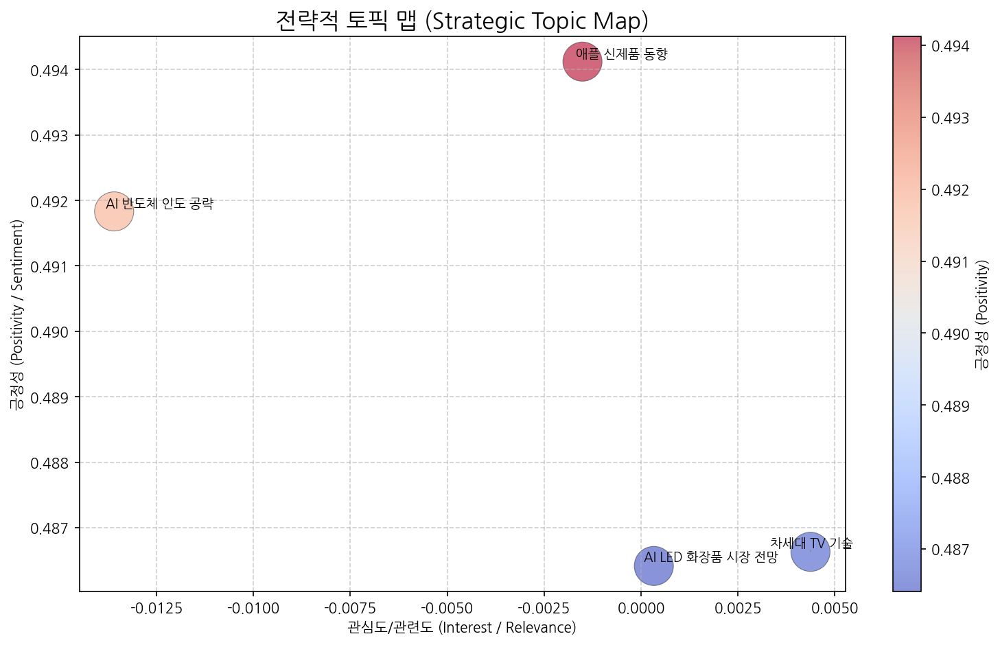
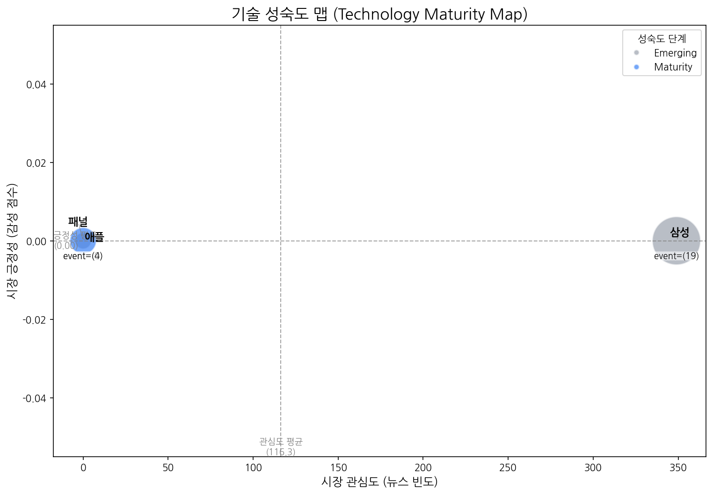
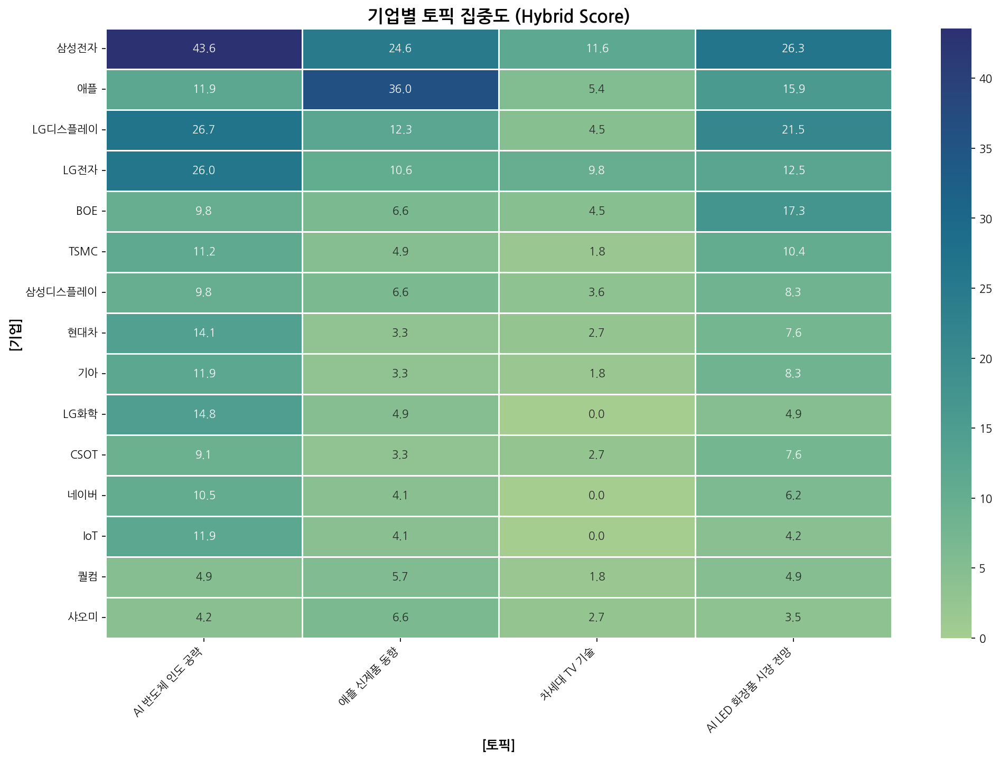
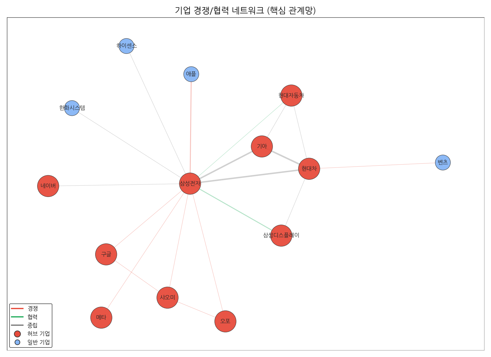
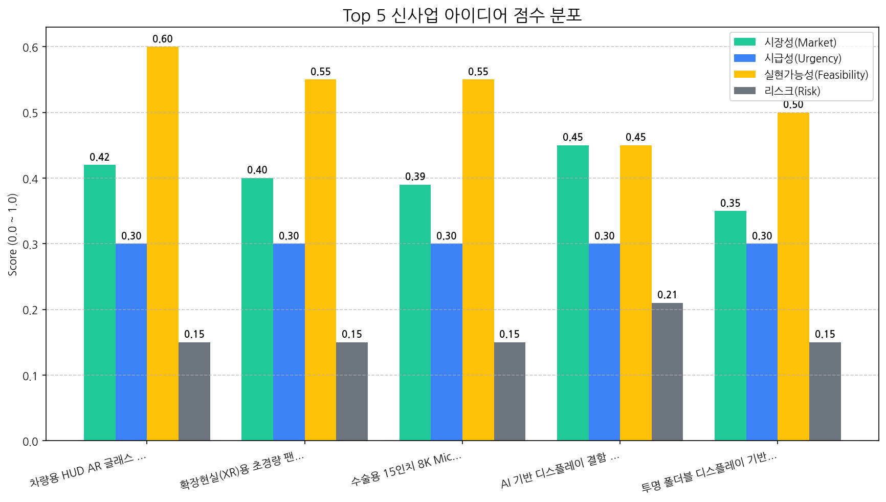

# Monthly Strategic Review (2025-09-20 ~ 2025-10-19)

## 1. 전략적 시장 포지셔닝 맵

| 토픽명              | 요약                                                                                                              | 핵심 키워드         |
|:-----------------|:----------------------------------------------------------------------------------------------------------------|:---------------|
| AI 반도체 인도 공략     | 삼성전자를 비롯한 기술 기업들이 AI, 반도체, 전기차 기술을 바탕으로 인도 시장에서 사업 확장 및 브랜드 강화를 추진하며, 특히 패션 등 다양한 분야에서 AI 기술을 활용하는 전략을 모색하는 내용. | 기술, ai, 반도체    |
| 애플 신제품 동향        | 애플의 새로운 맥북 프로, 비전, M5 칩, 폴더블 기기 출시 가능성, AI 기술 적용, 그리고 터치 인터페이스 관련 소식을 다루는 내용입니다.                                | 프로, 맥북, 애플     |
| 차세대 TV 기술        | OLED, QLED, 마이크로 LED 등 차세대 TV 디스플레이 기술과 관련된 뉴스이며, RGB, 프레임, 화질, 투명 디스플레이 등 관련 기술 요소 및 혁신을 다루고 있습니다.             | 올레드, qled, rgb |
| AI LED 화장품 시장 전망 | AI 기술을 활용한 LED 디스플레이와 화장품 판매 동향, 특히 미국과 중국 시장을 중심으로 전주 LED 전망을 포함한 시장 전반의 흐름을 분석하는 뉴스입니다.                       | ai, 동기, 디스플레이  |

## 2. 기술 수명 주기 및 R&D 투자 타이밍 분석

| 기술   | 단계       | 판단 근거                                                                |
|:-----|:---------|:---------------------------------------------------------------------|
| 패널   | Emerging | 뉴스 언급, 시장 감성, 주요 이벤트 발생이 모두 극히 저조하여 시장 관심과 활동이 미미한 초기 단계로 판단됩니다.     |
| 삼성   | Emerging | 낮은 시장 감성 점수와 투자 및 출시 이벤트만 발생한 것으로 보아 시장의 관심은 높으나 아직 성장 초기 단계로 판단됩니다. |
| 애플   | Maturity | 뉴스 언급 빈도와 시장 감성 점수가 낮고, 출시 외 투자 및 수주 이벤트가 없어 성숙기에 접어든 것으로 판단됩니다.     |

## 3. 경쟁사 전략적 의도 및 파트너 관계망 분석

### 3.1. 기업x토픽 MATRIX (상위 15개사)

### 기업별 토픽 집중도 (상위 5개사)
| org   | topic_0   | topic_1   | topic_2   | topic_3    |
|:------|:----------|:----------|:----------|:-----------|
| ASUS  | 2.11 (1%) | 2.46 (1%) | 2.68 (3%) | 0.69 (0%)  |
| AUO   | 1.41 (0%) | 2.46 (1%) | 1.79 (2%) | 4.16 (2%)  |
| BMW   | 1.41 (0%) | nan       | nan       | 0.69 (0%)  |
| BOE   | 9.84 (3%) | 6.55 (3%) | 4.47 (5%) | 17.33 (8%) |
| BYD   | 1.41 (0%) | nan       | 0.89 (1%) | 1.39 (1%)  |

### 3.2. 기업 경쟁/협력 관계망

### 가장 강한 관계 Top 5
| source   | target   |   weight | rel_type    |
|:---------|:---------|---------:|:------------|
| 기아       | 현대차      |        5 | neutral     |
| 삼성전자     | 현대차      |        4 | neutral     |
| 기아       | 삼성전자     |        4 | neutral     |
| 삼성전자     | 애플       |        3 | rivalry     |
| 삼성디스플레이  | 삼성전자     |        3 | partnership |

## 4. 전략적 리스크 관리 및 완화 액션 제안

| Date       | Topic      |   sentiment_drop | impact_range   | summary                                                                                    | mitigation                                                                                     |
|:-----------|:-----------|-----------------:|:---------------|:-------------------------------------------------------------------------------------------|:-----------------------------------------------------------------------------------------------|
| 2025-10-19 | OLED_Topic |            0.109 | 중기/PR          | OLED 기술의 한계와 관련된 부정적 내용이 보도되었습니다. 특히, 고해상도 구현 시 전력 소모, 수명, 발열 문제와 풀컬러 구현 기술의 미성숙이 지적되었습니다. | OLED 기술의 단점을 보완하기 위한 연구 개발 투자 확대가 필요합니다. 동시에, OLED 기술의 장점과 개선 노력을 적극적으로 홍보하여 부정적 인식을 완화해야 합니다. |

## 5. 데이터 기반 신사업 아이디어 제안

| 아이디어                              | 가치 제안                                                                                    |   총점 |
|:----------------------------------|:-----------------------------------------------------------------------------------------|-----:|
| 차량용 HUD AR 글래스 일체형 디스플레이          | 넓은 시야각과 고해상도 AR 정보 제공으로 운전 몰입도 및 안전성 향상, 운전자 맞춤형 정보 제공, 차량 디자인 통합 용이성                    |  3.6 |
| 확장현실(XR)용 초경량 팬케이크 렌즈 모듈          | 초경량, 초소형 디자인으로 XR 기기 착용감 개선, 고화질 영상 제공으로 몰입감 향상, 다양한 XR 기기 디자인 적용 가능                     |  3.4 |
| 수술용 15인치 8K MicroLED 무안경 3D 디스플레이 | 압도적인 해상도와 무안경 3D 기술로 수술 시야 확보 및 공간 인식 능력 향상, AI 기반 영상 분석 및 증강현실 정보 제공, 수술 시간 단축 및 정확도 향상 |  3.4 |
| AI 기반 디스플레이 결함 예측 및 분석 서비스        | AI 기반 실시간 결함 예측 및 분석, 결함 발생 원인 자동 분석 및 개선 방안 제시, 수율 향상 및 생산 비용 절감                        |  3.2 |
| 투명 폴더블 디스플레이 기반 스마트 윈도우           | 투명도 조절, 정보 표시, 에너지 절감 기능 통합, 폴더블 디자인으로 공간 활용도 극대화, 건물 외관 디자인 차별화                         |  3.2 |

## 6. Top 1 신사업 아이디어 검증 (향후 2주 실행 계획))

| Hypothesis                                                                                      | Target                                                  | KPI                                                                                                             | Owner   | Due        |
|:------------------------------------------------------------------------------------------------|:--------------------------------------------------------|:----------------------------------------------------------------------------------------------------------------|:--------|:-----------|
| 글로벌 완성차 OEM들은 넓은 시야각과 고해상도 AR 정보를 제공하는 차량용 HUD AR 글래스 일체형 디스플레이에 경쟁사 대비 20% 높은 가격을 지불할 의향이 있다.  | BMW, Mercedes-Benz, Tesla의 HUD 시스템 개발 및 구매 담당자          | 3개 OEM 중 2개 이상의 기업으로부터 제품 개발 및 협업에 대한 NDA 체결 및 LOI 확보                                                           | 사업개발팀   | 2025-11-02 |
| 운전자 시선 추적 및 AR 정보 자동 조정 기술이 적용된 차량용 HUD AR 글래스 일체형 디스플레이는 기존 HUD 대비 운전자의 인지 반응 속도를 15% 향상시킨다.   | 자사 내 운전 시뮬레이터 및 VR 환경 구축, 피실험자 20명 (운전 경력 5년 이상)        | 피실험자 20명 중 15명 이상이 AR 글래스 일체형 HUD 환경에서 인지 반응 속도 15% 향상 및 안전성 개선에 대한 설문 결과 4점(5점 만점) 이상 평가                       | 기술기획팀   | 2025-11-02 |
| 고휘도, 고투과율 AR 글래스용 디스플레이 패널의 시제품 제작 비용이 목표 단가(기존 HUD 패널 대비 2배) 이내로 양산 가능하며, 목표 수율(85%) 달성이 가능하다. | AR 글래스용 디스플레이 패널 시제품 제작 및 성능 테스트 (휘도, 투과율, 시야각, 해상도 측정) | 시제품 제작 비용이 목표 단가 이내이며, 목표 수율 85% 이상 달성 및 성능 테스트 결과 목표 스펙 충족 (휘도 5,000nit 이상, 투과율 80% 이상, 시야각 30도 이상, 해상도 4K 이상) | 기술개발팀   | 2025-11-02 |
