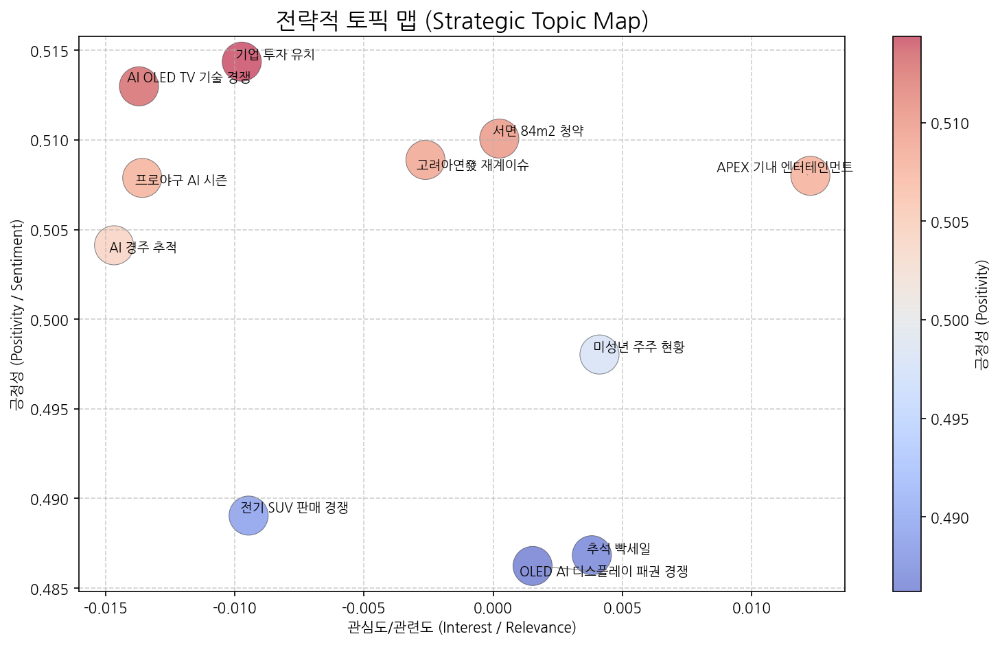
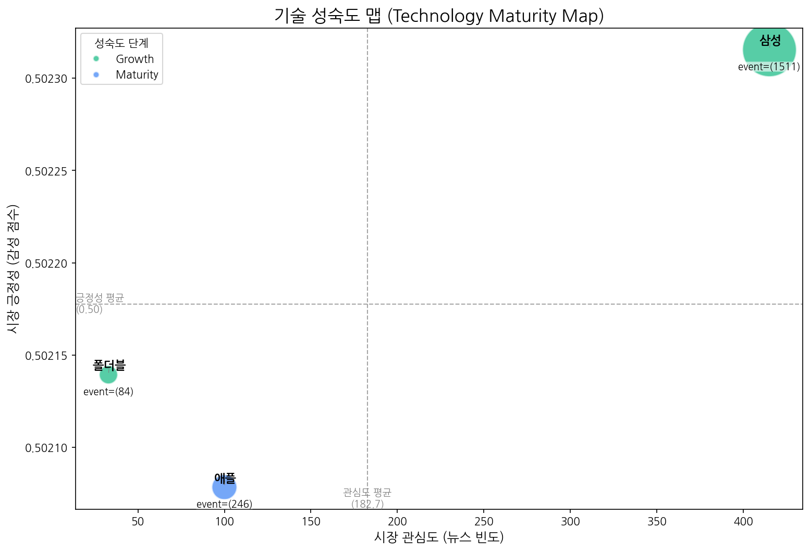
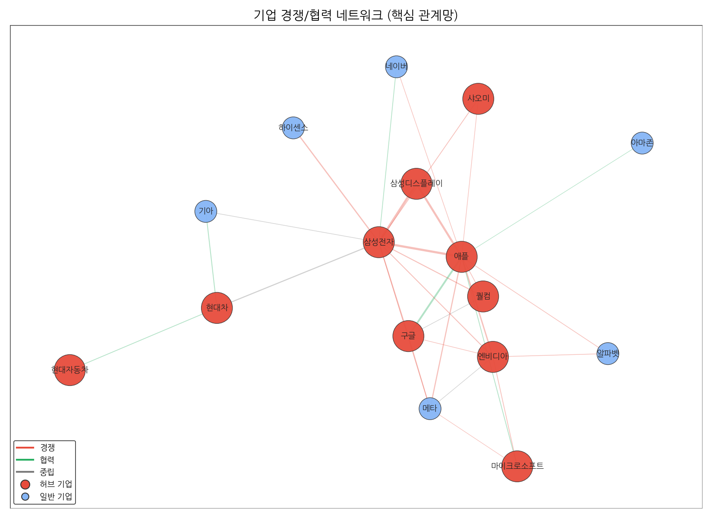
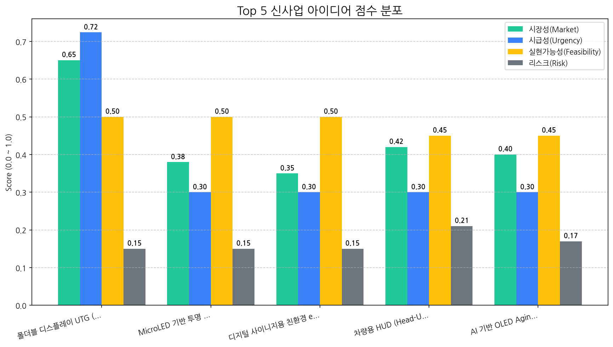

# Monthly Strategic Review (2025-09-23 ~ 2025-10-22)

## Executive Summary

## 월간 전략 브리핑 (2024년 5월)

**대상:** CEO 및 경영진

**작성자:** [당신의 이름], CSO

**날짜:** 2024년 5월 16일

---

### 1. 월간 핵심 동향 (Key Trends)

*   **OLED AI 디스플레이 패권 경쟁 심화:** OLED 기술을 기반으로 AI 기능을 통합한 디스플레이 시장 경쟁이 격화되고 있습니다. 특히, TV 시장에서 AI 기반 화질 개선, 콘텐츠 추천, 사용자 맞춤형 기능 등이 중요한 차별화 요소로 부상하고 있습니다. “프로야구 AI 시즌”이라는 토픽이 부상한 것으로 보아 스포츠 콘텐츠 시청 경험 향상에 AI 기술이 적극적으로 활용될 것으로 예상됩니다.
*   **폴더블 디스플레이 시장 성장 및 기술 경쟁 가속화:** 폴더블 디스플레이 기술은 성장기에 접어들었으며, 특히 삼성전자를 중심으로 기술 혁신이 빠르게 진행되고 있습니다. UTG (Ultra-Thin Glass) 코팅 공정 개선이 최우선 신사업 아이디어로 제시된 점은 내구성 향상과 더불어 차별화된 폴더블 경험 제공을 위한 경쟁 심화를 시사합니다.
*   **삼성-애플 간 경쟁 구도 심화:** 삼성전자와 애플 간의 경쟁 관계는 여전히 강력하며, 디스플레이 기술 경쟁과 더불어 전반적인 소비자 시장에서의 점유율 확보 경쟁이 지속될 것으로 예상됩니다. 애플의 Maturity 단계 진입은 성숙 시장에서 혁신을 통한 차별화 전략이 중요하다는 점을 시사합니다.

### 2. 전략적 시사점 (Strategic Implications)

*   **기회 요인:**
    *   **OLED AI 디스플레이 시장 선점:** AI 기술을 활용한 차세대 디스플레이 개발 및 상용화를 통해 경쟁 우위를 확보하고, 고부가가치 시장을 선점할 수 있습니다.
    *   **폴더블 디스플레이 시장 성장 주도:** UTG 코팅 공정 개선을 통해 폴더블 디스플레이의 내구성과 사용성을 향상시키고, 시장 성장을 주도할 수 있습니다.
    *   **스포츠 콘텐츠 시장 공략:** AI 기반 화질 개선 및 사용자 맞춤형 기능 제공을 통해 스포츠 콘텐츠 시청 경험을 극대화하고, 관련 시장을 공략할 수 있습니다.

*   **위협 요인:**
    *   **경쟁 심화:** OLED AI 디스플레이 시장 경쟁 심화는 가격 경쟁 및 기술 혁신 압박으로 이어질 수 있습니다.
    *   **기술 격차:** 경쟁사 대비 AI 기술 및 디스플레이 기술 경쟁력 확보에 실패할 경우 시장 경쟁에서 뒤쳐질 수 있습니다.
    *   **애플의 견고한 시장 점유율:** 애플의 견고한 시장 점유율은 새로운 시장 진입 및 점유율 확대에 어려움을 초래할 수 있습니다.

### 3. 최우선 실행 과제 (Top Priority Action Items)

*   **AI 디스플레이 기술 경쟁력 강화:** AI 기반 화질 개선, 콘텐츠 추천, 사용자 맞춤형 기능 등 차세대 디스플레이 기술 개발에 집중 투자하고, 관련 특허 확보에 적극적으로 나섭니다.
*   **폴더블 디스플레이 UTG 코팅 공정 개선 프로젝트 가속화:** AI 기반 실시간 품질 검사 시스템 개발 및 도입을 통해 UTG 코팅 공정의 효율성을 극대화하고, 폴더블 디스플레이의 내구성과 품질을 획기적으로 향상시킵니다.
*   **스포츠 콘텐츠 특화 디스플레이 마케팅 강화:** "프로야구 AI 시즌" 트렌드를 활용하여 스포츠 콘텐츠 시청에 최적화된 디스플레이 제품을 개발하고, 관련 마케팅 캠페인을 적극적으로 전개합니다.

## 1. 전략적 시장 포지셔닝 맵

### 전략적 인사이트 및 실행과제 제안
#### 📈 4분면 분석

**※주의:** 정확한 X, Y축 값을 모르므로, 주어진 토픽의 요약 정보와 일반적인 시장 상황에 대한 이해를 바탕으로 토픽들을 분류했습니다. 실제 데이터가 주어진다면 더 정확한 분석이 가능합니다.

- **주력 영역 (관심도 높음, 긍정성 높음)**:
    - **AI OLED TV 기술 경쟁**: AI와 OLED라는 핵심 기술 트렌드가 결합되어 높은 시장 관심과 긍정적 전망을 동시에 받는 영역입니다. 디스플레이 기술 혁신과 프리미엄 TV 시장 성장에 대한 기대감이 반영되어 있습니다.
- **기회 영역 (관심도 낮음, 긍정성 높음)**:
    - **APEX 기내 엔터테인먼트**: 6년 연속 월드 클래스 어워드 수상은 긍정적이나, B2B 산업이고 소비자 직접 관심도는 낮을 수 있습니다. 팬데믹 이후 항공 산업 회복과 함께 성장 잠재력이 높은 틈새시장입니다.
    - **기업 투자 유치**: 아산 기업 유치 및 경기도 전기차/반도체 투자 관련 뉴스는 지역 경제 활성화와 투자 유치에 대한 긍정적 전망을 보여주지만, 개별 투자 건에 대한 일반 대중의 관심도는 상대적으로 낮을 수 있습니다.
- **경쟁/위험 영역 (관심도 높음, 긍정성 낮음)**:
    - **OLED AI 디스플레이 패권 경쟁**: 기술 패권 경쟁이라는 키워드에서 알 수 있듯이, 시장 관심도는 높지만 국가 간 경쟁 심화와 불확실성 확대로 인해 긍정적이지만은 않은 영역입니다.
    - **고려아연發 재계이슈**: 재계 전반과 정치권까지 연루된 이슈로 시장의 관심도는 높지만, 기업 이미지 타격 및 불확실성 확대로 인해 긍정성은 낮습니다.
- **틈새/장기 영역 (관심도 낮음, 긍정성 낮음)**:
    - **프로야구 AI 시즌**: 특정 스포츠 팬들에게는 관심사일 수 있지만, 일반 대중에게는 관심도가 낮고, AI 활용에 대한 긍정적 효과도 아직은 제한적일 수 있습니다.
    - **전기 SUV 판매 경쟁**: 전기차 시장 경쟁 심화에 대한 우려와 환경 규제 강화 등의 요인으로 인해 긍정적인 시각과 관심도가 상대적으로 낮을 수 있습니다. 자원순환에 대한 관심도 아직 초기 단계입니다.
    - **추석 빡세일**: 특정 시기에만 집중되는 단기적 이벤트이며, 과도한 할인 경쟁에 대한 피로감 등으로 인해 긍정성과 관심도가 낮을 수 있습니다.
    - **서면 84m2 청약**: 특정 지역 부동산 시장에 대한 정보이며, 일반적인 시장 참여자들의 관심도는 낮을 수 있습니다. 부동산 시장 상황에 따라 긍정성도 달라질 수 있습니다.
    - **미성년 주주 현황**: 특정 계층에 대한 정보이며, 투자 관련 관심도는 낮고, 사회적 시선에 따라 긍정성도 낮을 수 있습니다.
    - **AI 경주 추적**: 특정 기술 분야에 대한 정보이며, 일반적인 시장 참여자들의 관심도는 낮을 수 있습니다. 기술의 상용화 가능성과 윤리적 문제에 따라 긍정성도 달라질 수 있습니다.

####  actionable insights

- **APEX 기내 엔터테인먼트**: 
    - **초기 액션 아이템**: APEX 수상 내역 및 기내 엔터테인먼트 솔루션에 대한 심층 분석 보고서를 작성하고, 주요 항공사(대한항공, 아시아나 등)의 엔터테인먼트 담당 부서에 데모 시연 및 협업 제안 미팅을 요청한다.
- **OLED AI 디스플레이 패권 경쟁**:
    - **초기 액션 아이템**: 경쟁 환경 변화에 따른 단기 및 장기적 시나리오를 수립하고, 각 시나리오별 리스크 관리 및 기회 포착 전략을 마련한다. 또한, 경쟁사(삼성, 중국 업체 등)의 기술 개발 동향 및 시장 전략을 면밀히 모니터링하고, 자체 기술 경쟁력 강화 방안을 검토한다.

### 토픽 상세 정보
| 토픽명                 | 요약                                                                                                                | 핵심 키워드           |
|:--------------------|:------------------------------------------------------------------------------------------------------------------|:-----------------|
| OLED AI 디스플레이 패권 경쟁 | OLED 디스플레이, AI 기술, 반도체 분야에서 삼성전자와 중국, 미국 간의 기술 패권 경쟁 심화 및 TV, 패널 시장에 미치는 영향 분석.                                   | oled, ai, 디스플레이  |
| AI OLED TV 기술 경쟁    | AI 기술이 접목된 OLED TV 시장에서 LG와 삼성전자를 중심으로 디스플레이 기술 경쟁이 심화되고 있으며, 특히 중국 시장과 시니어 고객층을 겨냥한 기술 혁신 및 반도체 기술 발전이 주요 이슈이다.  | ai, oled, tv     |
| 프로야구 AI 시즌          | 삼성, NC, KT, LG 등 프로야구 시즌 관련 AI 활용 및 경기 내용 논의.                                                                     | 삼성, samsung, its |
| 전기 SUV 판매 경쟁        | 현대차, 폴스타 등 전기 SUV 모델의 판매 경쟁 및 자원순환 관련 새로운 동향 분석.                                                                  | 주행, suv, 전기차     |
| 추석 빡세일              | 추석 연휴를 맞아 다양한 상품을 할인 판매하는 행사를 소개합니다.                                                                              | 추석, 선보인다, 연휴     |
| 기업 투자 유치            | 아산 기업 유치 및 경기도 전기차/반도체 투자 관련 뉴스.                                                                                  | 기업이, 기업, 아산      |
| 고려아연發 재계이슈          | 고려아연 최창걸 명예회장 관련 이슈가 재계 전반, 특히 한화/GS그룹과의 관계, 정치권(국민의힘, 장관)까지 엮이며 논란이 되는 상황을 다루는 뉴스 토픽. 비철금속 사업과 관련된 내용도 포함될 수 있음. | 부회장, 비철금속, 명예회장  |
| 서면 84m2 청약          | 부산 서면의 2호선 인근 단지에서 전용면적 84m2 아파트의 1순위 청약이 최고 경쟁률로 마감된 내용.                                                         | 서면, 청약, 1순위      |
| 미성년 주주 현황           | 시가총액 상위 상장사 미성년 주주들의 평균 주식 보유 현황 분석.                                                                              | 미성년자, 주주, 상장사    |
| AI 경주 추적            | Vision AI 기술을 활용하여 경주에서 달리는 말의 움직임을 추적하고 분석하는 내용입니다.                                                              | race, vision, 말을 |
| APEX 기내 엔터테인먼트      | APEX에서 기내 엔터테인먼트 관련 월드 클래스 어워드를 6년 연속 수상한 내용.                                                                     | apex, 기내, 어워드    |

## 2. 기술 수명 주기 및 R&D 투자 타이밍 분석

| 기술   | 단계       | 판단 근거                                                                              |
|:-----|:---------|:-----------------------------------------------------------------------------------|
| 폴더블  | Growth   | 출시 이벤트가 투자 및 수주 이벤트보다 훨씬 많고 뉴스 언급 빈도와 시장 감성 점수가 중간 수준이므로 폴더블 기술은 성장 단계에 있다고 판단됩니다. |
| 애플   | Maturity | 꾸준한 출시와 투자가 발생하지만, 시장 감성 점수가 중간 수준이고 수주 비율이 낮은 것으로 보아 성숙기에 접어든 것으로 판단됩니다.          |
| 삼성   | Growth   | 삼성 기술은 출시 이벤트가 투자를 넘어서고 뉴스 언급 빈도가 높아 시장의 관심이 증가하는 성장 단계로 판단됩니다.                    |

## 3. 경쟁사 전략적 의도 및 파트너 관계망 분석

### 3.1 기업별 전략 방향성 분석
| 기업   | 핵심 집중 토픽                                          | 전략 방향성 해석                                                                                                           |
|:-----|:--------------------------------------------------|:--------------------------------------------------------------------------------------------------------------------|
| 삼성전자 | OLED AI 디스플레이 패권 경쟁, AI OLED TV 기술 경쟁, 프로야구 AI 시즌 | 삼성전자는 OLED 디스플레이 기술 리더십을 AI와 결합하여 TV 시장에서의 경쟁 우위를 확보하고, AI 기술을 스포츠와 같은 새로운 영역으로 확장하여 소비자 경험 혁신을 추구하고 있습니다.          |
| LG전자 | AI OLED TV 기술 경쟁, OLED AI 디스플레이 패권 경쟁, 프로야구 AI 시즌 | LG전자는 AI 기술을 활용한 OLED 디스플레이 경쟁력 강화에 집중하며, 프리미엄 TV 시장에서의 리더십을 공고히 하고 AI 기술을 기반으로 스포츠 콘텐츠 분야에서도 새로운 사업 기회를 모색하고 있습니다. |
| 애플   | OLED AI 디스플레이 패권 경쟁, AI OLED TV 기술 경쟁, 기업 투자 유치   | 애플은 OLED AI 디스플레이 기술력을 바탕으로 AI TV 시장을 선점하고, 외부 투자를 유치하여 AI 기반 디스플레이 기술 경쟁력을 강화하려는 전략을 추진 중입니다.                      |

### 3.2 경쟁/협력 관계망 분석 및 실행과제

| 주요 관계          | 유형      | 액션 아이템 제안                        |
|:---------------|:--------|:---------------------------------|
| 삼성전자 ↔ 애플      | rivalry | 애플 신제품 분석 및 삼성 제품 경쟁력 강화 전략 수립   |
| 삼성디스플레이 ↔ 삼성전자 | rivalry | 차세대 디스플레이 기술 트렌드 및 삼성전자 의존도 분석.  |
| 삼성디스플레이 ↔ 애플   | rivalry | 애플 OLED 공급망 다변화 전략 파악 및 대응 방안 모색 |

 >두 기업이 함께 언급된 문맥 안에서, 키워드의 빈도가 **경쟁 > 협력**인 경우 'rivalry', 반대의 경우 'partnership'으로 분류

## 4. 전략적 리스크 관리 및 완화 액션 제안

- (데이터 없음)

## 5. 데이터 기반 신사업 아이디어 제안

| 아이디어                                                              | 가치 제안                                                                                                                                        |   총점 |
|:------------------------------------------------------------------|:---------------------------------------------------------------------------------------------------------------------------------------------|-----:|
| 폴더블 디스플레이 UTG (Ultra-Thin Glass) 코팅 공정 개선을 위한 AI 기반 실시간 품질 검사 시스템 | AI 기반 실시간 품질 검사 시스템을 통해 UTG 코팅 공정의 불량률을 획기적으로 줄이고, 생산성을 향상시킵니다. 데이터 기반 공정 개선을 통해 UTG 코팅 품질을 최적화하고, 폴더블 디스플레이 경쟁력을 강화합니다.                     |  5.4 |
| MicroLED 기반 투명 디스플레이 키오스크                                         | MicroLED 기반 투명 디스플레이를 통해 선명하고 생생한 정보를 제공하며, 혁신적인 디자인의 키오스크를 구현하여 고객 경험을 향상시킵니다. 투명 디스플레이를 통해 제품 전시 효과를 극대화하고, 공간 활용도를 높입니다.                  |  3.3 |
| 디지털 사이니지용 친환경 ePaper 디스플레이                                        | 전력 소비를 획기적으로 줄이고 폐기물 발생을 최소화한 친환경 ePaper 디스플레이를 통해 ESG 경영을 실천하고, 지속 가능한 디지털 사이니지 환경을 구축합니다. 뛰어난 시인성으로 광고 효과를 극대화하고, 다양한 환경에서 안정적인 운영을 지원합니다. |  3.2 |
| 차량용 HUD (Head-Up Display) 증강현실 (AR) 글래스 일체형 솔루션                   | HUD와 AR 글래스를 통합하여 넓은 시야각, 풍부한 정보량, 뛰어난 몰입감을 제공하며, 운전자의 안전과 편의성을 극대화합니다. 글래스 일체형으로 착용 편의성을 높이고, 차량과의 완벽한 연동을 통해 최적화된 AR 경험을 제공합니다.            |  3.1 |
| AI 기반 OLED Aging 예측 및 보정 기술 서비스                                   | AI 기반으로 OLED 패널의 Aging 정도를 실시간으로 예측하고, 픽셀 단위의 정밀한 보정 기술을 제공하여 번인 현상을 최소화하고 화질을 유지합니다. 패널 수명 연장을 통해 고객 만족도를 높이고, 제품 경쟁력을 강화합니다.               |  3.1 |

 #### [아이디어 검증: 2주 Action Plan]
| Hypothesis                                                                                                            | Target                                  | KPI                                                                   | Owner   | Due        |
|:----------------------------------------------------------------------------------------------------------------------|:----------------------------------------|:----------------------------------------------------------------------|:--------|:-----------|
| UTG 코팅 공정에서 AI 기반 실시간 품질 검사 시스템 도입 시, 현재 육안 검사 대비 불량률을 15% 이상 감소시킬 수 있다.                                              | 자사 폴더블 디스플레이 생산 라인 (pilot 라인)           | AI 기반 시스템 적용 후 1주일간 불량률 데이터 측정, 육안 검사 기반 불량률 대비 15% 이상 감소 확인          | 생산기술팀   | 2025-11-05 |
| UTG 코팅 전문 기업은 AI 기반 실시간 품질 검사 시스템 도입에 대해 긍정적인 투자 의향을 가지고 있으며, 기존 장비와의 호환성을 최우선 고려 사항으로 생각한다.                          | UTG 코팅 전문 기업 3곳 (A사, B사, C사) 기술 담당자 인터뷰 | 3곳의 인터뷰 대상 기업 모두 AI 기반 시스템 도입에 대한 긍정적 답변 및 기존 장비 호환성에 대한 구체적인 요구사항 확인 | 사업개발팀   | 2025-11-05 |
| AI 모델 학습 데이터 확보를 위해 2주 내에 UTG 코팅 표면의 정상/불량 이미지 1000장 이상을 확보할 수 있으며, 확보된 데이터를 기반으로 80% 이상의 정확도를 가진 초기 AI 모델을 개발할 수 있다. | 자사 폴더블 디스플레이 생산 라인, 외부 이미지 데이터 구매 (협력사) | UTG 코팅 표면의 정상/불량 이미지 1000장 이상 확보 및 초기 AI 모델 정확도 80% 이상 달성             | AI 개발팀  | 2025-11-05 |
