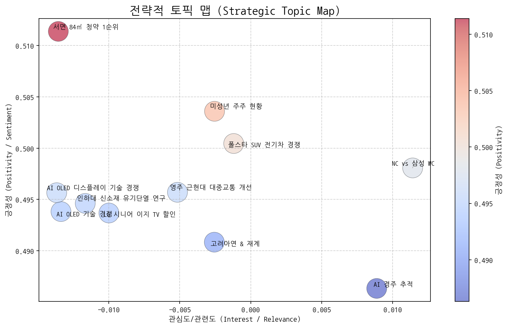
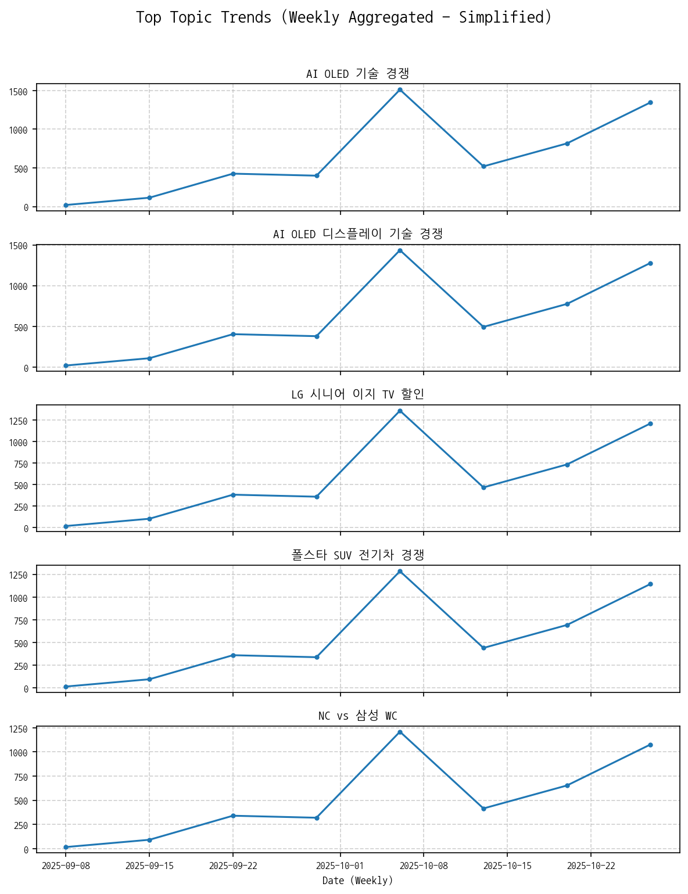
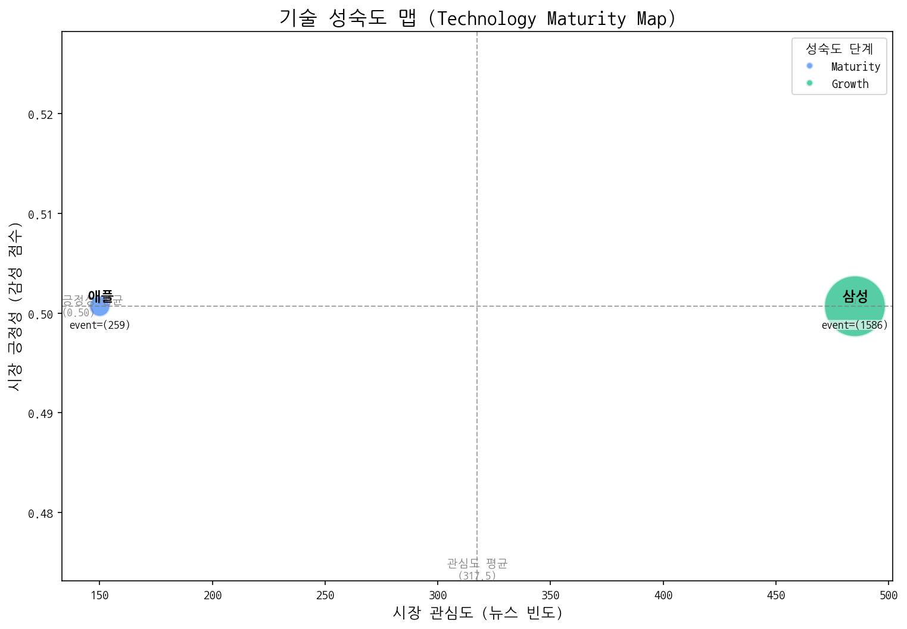
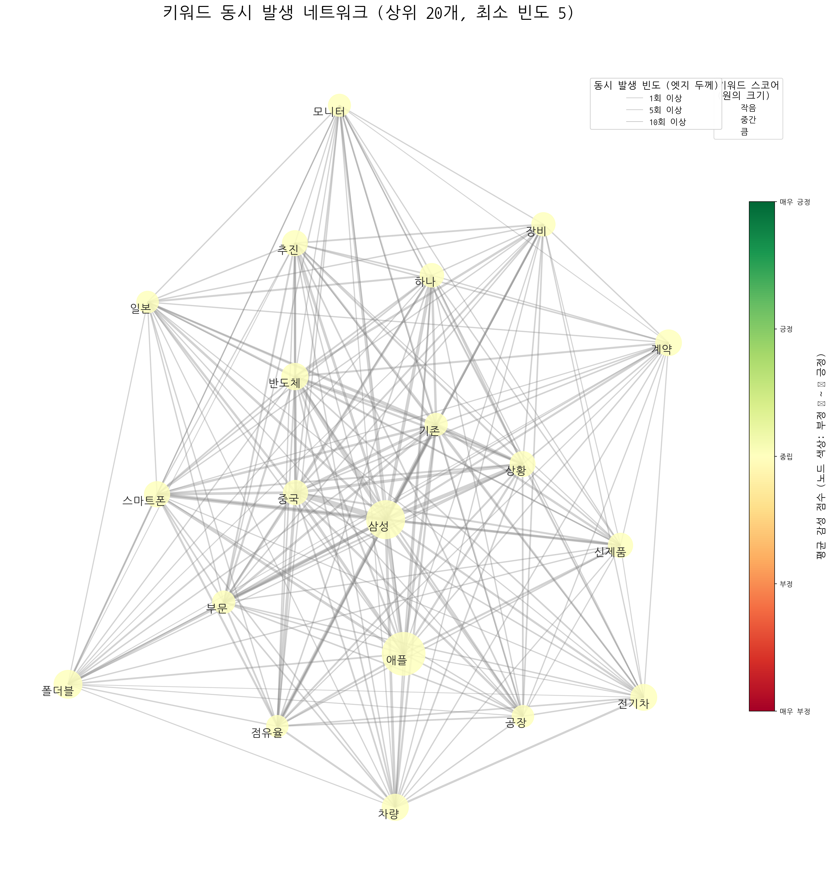
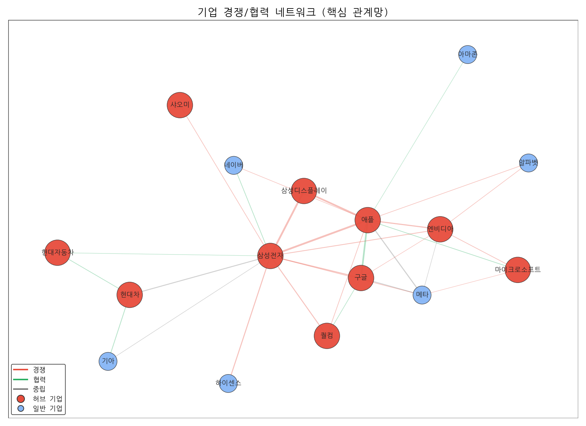
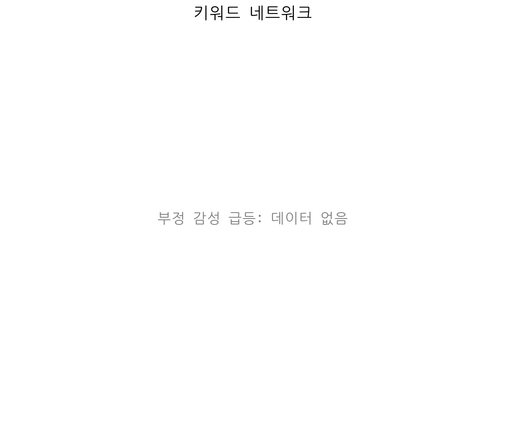
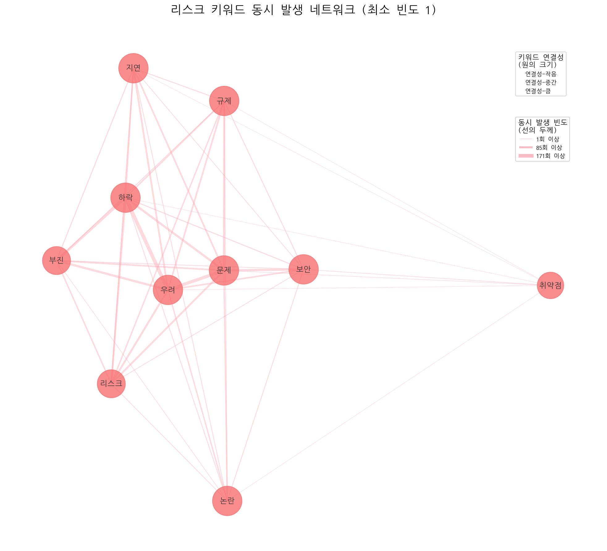
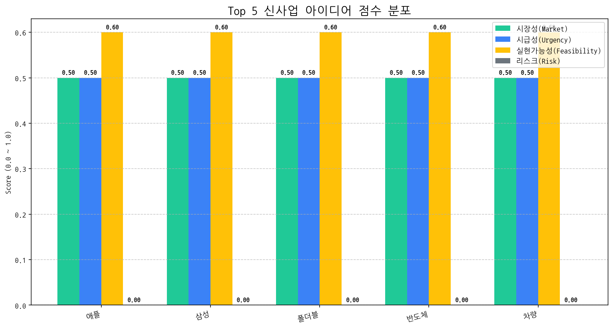

# Monthly Strategic Review (2025-09-25 ~ 2025-10-24)

## Executive Summary

## 월간 전략 브리핑 (Monthly Strategy Briefing)

**대상:** CEO 및 경영진
**작성자:** [당신의 이름], CSO
**날짜:** 2024년 5월 15일 (가정)

### 1. 월간 핵심 동향 (Key Trends)

*   **AI OLED 기술 경쟁 심화:** AI 기술을 접목한 OLED 디스플레이 경쟁이 핵심 화두로 부상하고 있습니다. 이는 단순 화질 개선을 넘어 사용자 경험 혁신을 위한 차세대 디스플레이 경쟁의 시작을 의미합니다.
*   **프리미엄 시장 경쟁 심화 & 시니어 시장 공략 시도:** LG전자의 시니어 이지 TV 할인 정책은 프리미엄 시장의 경쟁 심화와 함께 특정 타겟 고객층을 공략하는 새로운 시장 세분화 전략의 가능성을 보여줍니다.
*   **애플 & 삼성 기술 성숙도 & 경쟁 관계 심화:** 애플의 기술 성숙도 증가 및 삼성과의 강력한 경쟁 관계는 디스플레이 산업 전반에 걸쳐 큰 영향을 미치고 있습니다. 특히, 애플의 디스플레이 기술 내재화/차별화 시도는 경쟁 구도를 더욱 복잡하게 만들 수 있습니다.

### 2. 전략적 시사점 (Strategic Implications)

**기회:**

*   **AI OLED 시장 선점:** AI 기술을 활용한 OLED 디스플레이 기술 혁신을 통해 경쟁 우위를 확보하고 시장을 선도할 수 있습니다. AI 기반 화질 개선, 개인 맞춤형 디스플레이 설정, 스마트 홈 연동 등 다양한 부가 가치를 창출할 수 있습니다.
*   **세분화된 시장 공략:** 시니어 시장과 같이 특정 타겟 고객층의 니즈를 충족시키는 특화된 제품 및 서비스를 개발하여 새로운 시장 기회를 창출할 수 있습니다.

**위협:**

*   **기술 경쟁 심화:** AI OLED 기술 경쟁에서 뒤쳐질 경우 경쟁력 약화 및 시장 점유율 하락으로 이어질 수 있습니다. 지속적인 연구 개발 투자를 통해 기술 격차를 유지하고 새로운 기술 트렌드를 선도해야 합니다.
*   **애플의 영향력 확대:** 애플의 디스플레이 기술 내재화 및 차별화 시도는 기존 공급망 구조에 변화를 가져올 수 있으며, 우리의 시장 입지에 위협을 가할 수 있습니다.
*   **폴더블 기술의 불확실성:** 폴더블 기술의 성숙도에 오류가 발생한 점은 기술적 난관이 존재한다는 것을 의미하며, 관련 투자 및 전략 수립에 신중을 기해야 합니다.

### 3. 최우선 실행 과제 (Top Priority Action Items)

*   **AI OLED 기술 경쟁력 강화:**
    *   AI 알고리즘 기반 화질 개선, 개인 맞춤형 디스플레이 솔루션, 저전력 기술 등 AI OLED 관련 핵심 기술 개발에 집중 투자합니다.
    *   AI 기술 전문 인력 확보 및 관련 기술 스타트업과의 협력/인수를 적극적으로 검토합니다.
*   **애플 관련 사업 전략 재검토:**
    *   애플의 디스플레이 기술 동향 및 내재화 전략을 면밀히 분석하고, 기존 공급 계약 유지 및 새로운 협력 기회 모색을 위한 전략을 수립합니다.
    *   애플 의존도를 줄이기 위해, 새로운 고객 확보 및 시장 다변화를 추진합니다.

이 브리핑을 바탕으로 다음 단계를 논의하고 구체적인 실행 계획을 수립할 것을 제안합니다.

## 1. 전략적 시장 포지셔닝 맵

### 전략적 인사이트 및 실행과제 제안
#### 📈 4분면 분석

**전제:** 시장 관심도와 시장 긍정성은 데이터 기반으로 측정하기 어렵기 때문에, 주어진 토픽들의 내용과 현재 시장 상황에 대한 일반적인 이해를 바탕으로 주관적인 판단을 내렸습니다.  따라서 실제 분석과는 차이가 있을 수 있습니다.

- **주력 영역 (관심도 높음, 긍정성 높음)**:
    *   **AI OLED 기술 경쟁, AI OLED 디스플레이 기술 경쟁**: AI와 OLED는 현재 디스플레이 시장의 핵심 기술이며, 기술 경쟁은 혁신과 성장을 견인하므로 긍정적인 관심이 높습니다. 이러한 기술 우위를 확보하기 위한 경쟁은 지속적으로 주력해야 할 부분입니다.

- **기회 영역 (관심도 낮음, 긍정성 높음)**:
    *   **LG 시니어 이지 TV 할인**: 고령화 사회로 진입하면서 시니어 시장은 성장 가능성이 높지만, 아직까지 주류 시장의 관심은 상대적으로 낮습니다. 하지만, 편의성을 강조한 시니어 맞춤형 제품은 긍정적인 반응을 얻을 수 있으며, 새로운 시장 기회를 창출할 수 있습니다.
    *   **AI 경주 추적**: AI 비전 기술은 다양한 분야에 적용될 수 있지만, 경주 추적은 아직 틈새 시장에 머물러 있습니다. 그러나 스포츠와 엔터테인먼트 분야에서의 잠재력은 높으며, 기술 발전과 함께 관심이 증가할 가능성이 있습니다.

- **경쟁/위험 영역 (관심도 높음, 긍정성 낮음)**:
    *   **폴스타 SUV 전기차 경쟁**: 전기차 시장은 성장하고 있지만, 경쟁 심화, 가격 경쟁, 충전 인프라 부족 등의 문제로 인해 긍정적인 전망만 있는 것은 아닙니다. 특히 새로운 모델 출시 경쟁은 과열 양상을 보일 수 있으며, 자원순환 문제는 해결해야 할 과제입니다.
    *   **서면 84㎡ 청약 1순위**: 부동산 시장은 금리 인상, 경기 침체 등의 영향으로 불확실성이 높습니다. 특정 지역의 청약 경쟁률이 높더라도 시장 전체의 긍정적인 신호로 해석하기 어렵습니다. 오히려 높은 경쟁률은 가격 거품 논란을 야기할 수 있습니다.
    *   **미성년 주주 현황**: 기업의 사회적 책임에 대한 관심이 높아지면서 미성년 주주 현황에 대한 관심도 높아지고 있지만, 편법 증여, 불공정 경쟁 등의 부정적인 시각도 존재합니다.

- **틈새/장기 영역 (관심도 낮음, 긍정성 낮음)**:
    *   **NC vs 삼성 WC**: 특정 스포츠 이벤트는 일시적인 관심은 끌 수 있지만, 시장 전체에 미치는 영향은 제한적입니다.
    *   **인하대 신소재 유기단열 연구**: 학술 연구는 장기적인 관점에서 중요하지만, 단기적인 시장 관심도는 낮습니다.
    *   **고려아연 & 재계**: 특정 기업의 이슈는 관련 업계에만 영향을 미치며, 일반적인 시장 관심도는 낮습니다.
    *   **영주 근현대 대중교통 개선**: 특정 지역의 교통 개선은 지역 주민들에게는 중요하지만, 전체 시장에 미치는 영향은 미미합니다.

#### actionable insights

-   **[선정된 '기회' 토픽명]**: LG 시니어 이지 TV 할인
    *   **초기 액션 아이템 제안**: 시니어 시장 분석을 위한 설문 조사 실시 (기존 고객 및 잠재 고객 대상). 시니어의 니즈를 파악하고, 이지 TV의 할인 판매 효과를 측정하여 향후 제품 개발 및 마케팅 전략 수립에 활용합니다.

-   **[선정된 '위험' 토픽명]**: 폴스타 SUV 전기차 경쟁
    *   **초기 액션 아이템 제안**: 경쟁사(현대차, 테슬라 등)의 전기차 모델 가격, 스펙, 판매량, 고객 반응 등을 비교 분석. 폴스타 SUV 전기차의 차별화 전략 및 가격 경쟁력 확보 방안을 모색합니다. 또한, 전기차 자원순환 관련 정부 정책 및 기술 동향을 파악하고, 이에 대한 대응 전략을 수립합니다.

### 토픽 상세 정보
| 토픽                  | 요약                                                                                                      | 핵심 키워드           |
|:--------------------|:--------------------------------------------------------------------------------------------------------|:-----------------|
| AI OLED 기술 경쟁       | AI, OLED, 반도체 기술을 중심으로 삼성전자, 중국, 미국 간의 TV 및 디스플레이 기술 경쟁과 관련된 내용입니다. 특히 갤럭시를 포함한 삼성전자의 전략과 시장 상황을 보여줍니다. | ai, oled, 중국     |
| AI OLED 디스플레이 기술 경쟁 | 미중 반도체 기술 패권 경쟁 속에서 AI와 OLED 디스플레이 기술을 적용한 TV 시장을 중심으로 삼성전자와 중국 업체의 경쟁 심화 가능성을 다룬 내용.                   | ai, oled, 디스플레이  |
| LG 시니어 이지 TV 할인     | LG전자가 시니어 고객을 위한 이지 TV를 할인 판매하는 내용입니다. 헬프 기능과 같은 편의 기능이 강조될 것으로 보입니다.                                   | 시니어, tv, lg      |
| 폴스타 SUV 전기차 경쟁      | 폴스타의 새로운 SUV 전기차 모델 판매와 현대차의 관련 동향, 그리고 전기차 시장에서의 자원순환 이슈를 다룸.                                          | 주행, 자원순환, 폴스타    |
| NC vs 삼성 WC         | NC와 삼성의 와일드카드 결정전 경기 및 승리 관련 내용. 삼성 선발 투수와 감독 언급.                                                       | nc, 시즌, 삼성       |
| 인하대 신소재 유기단열 연구     | 인하대 신소재공학과 학생과 교수가 유기 단열재의 난연 특성을 연구하는 내용입니다.                                                           | 학생은, 교수, 신소재공학과  |
| 고려아연 & 재계           | 고려아연 최창걸 명예회장과 재계(한화, GS 등), 정치권(국민의힘) 관련 이슈 논의. 비철금속 사업 관련 내용 포함 가능성.                                  | 부회장, 명예회장, 비철금속  |
| 서면 84㎡ 청약 1순위       | 부산광역시 서면 단지의 84㎡ 아파트 청약이 1순위로 최고 경쟁률을 기록했을 것으로 예상되며, 해당 단지는 2호선 역세권에 위치하고 전용면적을 강조하고 있음.                | 서면, 청약, 1순위      |
| 미성년 주주 현황           | 상장사 시총 상위 기업의 미성년 주주 현황 분석 및 1인당 평균 보유 시가총액 비교.                                                         | 미성년자, 주주, 상장사    |
| AI 경주 추적            | AI 비전 기술로 경주에서 말의 움직임을 추적하고 화면에 보여주는 기술에 대한 내용입니다.                                                      | race, vision, 말을 |
| 영주 근현대 대중교통 개선      | 경북 영주시의 근현대 유산과 스카이(교통수단)를 활용한 관광 활성화를 위해 대중교통 처우 개선 및 5분 거리 조성 등을 촉구하는 내용.                             | 재가, 촉구했다, 근현대    |

### 토픽 성장/하락 추세
|   topic_id | topic_name          |   momentum_score |
|-----------:|:--------------------|-----------------:|
|          0 | AI OLED 기술 경쟁       |            1.165 |
|          1 | AI OLED 디스플레이 기술 경쟁 |            1.165 |
|          3 | 폴스타 SUV 전기차 경쟁      |            0     |
|          5 | 인하대 신소재 유기단열 연구     |            0     |
|          6 | 고려아연 & 재계           |            0     |
|          7 | 서면 84㎡ 청약 1순위       |            0     |
|          8 | 미성년 주주 현황           |            0     |
|          9 | AI 경주 추적            |            0     |
|         10 | 영주 근현대 대중교통 개선      |            0     |
|          4 | NC vs 삼성 WC         |           -0.383 |
|          2 | LG 시니어 이지 TV 할인     |           -1.471 |

## 2. 기술 수명 주기 및 R&D 투자 타이밍 분석

| 기술   | 단계       | 판단 근거                                                                                                                                                                                                                                                         |
|:-----|:---------|:--------------------------------------------------------------------------------------------------------------------------------------------------------------------------------------------------------------------------------------------------------------|
| 폴더블  | Error    | 429 You exceeded your current quota, please check your plan and billing details. For more information on this error, head to: https://ai.google.dev/gemini-api/docs/rate-limits. To monitor your current usage, head to: https://ai.dev/usage?tab=rate-limit. |
|      |          | * Quota exceeded for metric: generativelanguage.googleapis.com/generate_content_free_tier_requests, limit: 15                                                                                                                                                 |
|      |          | Please retry in 59.542118236s. [violations {                                                                                                                                                                                                                  |
|      |          |   quota_metric: "generativelanguage.googleapis.com/generate_content_free_tier_requests"                                                                                                                                                                       |
|      |          |   quota_id: "GenerateRequestsPerMinutePerProjectPerModel-FreeTier"                                                                                                                                                                                            |
|      |          |   quota_dimensions {                                                                                                                                                                                                                                          |
|      |          |     key: "model"                                                                                                                                                                                                                                              |
|      |          |     value: "gemini-2.0-flash"                                                                                                                                                                                                                                 |
|      |          |   }                                                                                                                                                                                                                                                           |
|      |          |   quota_dimensions {                                                                                                                                                                                                                                          |
|      |          |     key: "location"                                                                                                                                                                                                                                           |
|      |          |     value: "global"                                                                                                                                                                                                                                           |
|      |          |   }                                                                                                                                                                                                                                                           |
|      |          |   quota_value: 15                                                                                                                                                                                                                                             |
|      |          | }                                                                                                                                                                                                                                                             |
|      |          | , links {                                                                                                                                                                                                                                                     |
|      |          |   description: "Learn more about Gemini API quotas"                                                                                                                                                                                                           |
|      |          |   url: "https://ai.google.dev/gemini-api/docs/rate-limits"                                                                                                                                                                                                    |
|      |          | }                                                                                                                                                                                                                                                             |
|      |          | , retry_delay {                                                                                                                                                                                                                                               |
|      |          |   seconds: 59                                                                                                                                                                                                                                                 |
|      |          | }                                                                                                                                                                                                                                                             |
|      |          | ]                                                                                                                                                                                                                                                             |
| 애플   | Maturity | 애플은 뉴스 언급 빈도가 높고, 출시 이벤트가 활발하며, 시장 감성 점수가 중간 수준으로 유지되는 안정적인 성숙기에 접어들었다고 판단됩니다.                                                                                                                                                                                |
| 삼성   | Growth   | 높은 출시 빈도와 투자 건수를 고려할 때, 삼성 기술은 시장에서 활발히 성장하는 단계로 판단됩니다.                                                                                                                                                                                                       |

## 3. 경쟁사 전략적 의도 및 파트너 관계망 분석

### 3.1 기업별 전략 방향성 분석
| 기업   | 핵심 집중 토픽                                            | 전략 방향성 해석                                                                                                       |
|:-----|:----------------------------------------------------|:----------------------------------------------------------------------------------------------------------------|
| 삼성전자 | AI OLED 디스플레이 기술 경쟁, AI OLED 기술 경쟁, LG 시니어 이지 TV 할인 | 삼성전자는 AI 기술을 접목한 OLED 디스플레이 기술 경쟁력 강화에 집중하며, 경쟁사 LG전자의 시니어 TV 시장 공략에 대응하는 차별화된 프리미엄 전략을 추구하고 있습니다.              |
| 애플   | AI OLED 기술 경쟁, AI OLED 디스플레이 기술 경쟁, 폴스타 SUV 전기차 경쟁  | 애플은 AI 기술력을 OLED 디스플레이에 접목하여 차세대 디스플레이 경쟁력을 확보하고, 폴스타와의 협력을 통해 전기차 시장 진출을 모색하며 미래 기술 경쟁력을 강화하려는 전략을 추진하고 있습니다.  |
| LG전자 | AI OLED 디스플레이 기술 경쟁, AI OLED 기술 경쟁, LG 시니어 이지 TV 할인 | LG전자는 AI 기반 OLED 디스플레이 기술 우위를 통해 프리미엄 TV 시장에서의 경쟁력을 강화하고, 동시에 시니어 고객층을 위한 맞춤형 제품 할인 전략을 통해 시장 점유율 확대를 꾀하고 있습니다. |

### 3.2 경쟁/협력 관계망 분석 및 실행과제

| 주요 관계          | 유형      | 액션 아이템 제안                             |
|:---------------|:--------|:--------------------------------------|
| 삼성전자 ↔ 애플      | rivalry | 애플 신제품 분석 및 삼성 제품 차별화 포인트 발굴.         |
| 삼성디스플레이 ↔ 삼성전자 | rivalry | 삼성전자 차세대 제품 디스플레이 전략 긴급 분석 및 대응 방안 모색 |
| 삼성디스플레이 ↔ 애플   | rivalry | 애플 OLED 공급망 다변화 전략 파악 및 대응 시나리오 준비    |

 >두 기업이 함께 언급된 문맥 안에서, 키워드의 빈도가 **경쟁 > 협력**인 경우 'rivalry', 반대의 경우 'partnership'으로 분류

## 4. 전략적 리스크 관리 및 완화 액션 제안

- (리스크/이슈 데이터 없음)

## 5. 데이터 기반 신사업 아이디어 제안

| 아이디어   | 가치 제안                  |   총점 |
|:-------|:-----------------------|-----:|
| 애플     | 애플 도입으로 비용/품질/경험을 개선.  |   60 |
| 삼성     | 삼성 도입으로 비용/품질/경험을 개선.  |   60 |
| 폴더블    | 폴더블 도입으로 비용/품질/경험을 개선. |   60 |
| 반도체    | 반도체 도입으로 비용/품질/경험을 개선. |   60 |
| 차량     | 차량 도입으로 비용/품질/경험을 개선.  |   60 |

 #### [아이디어 검증: 2주 Action Plan]
| Hypothesis                                                                                                      | Target                                                   | KPI                                                                           | Owner   | Due        |
|:----------------------------------------------------------------------------------------------------------------|:---------------------------------------------------------|:------------------------------------------------------------------------------|:--------|:-----------|
| 기업 고객들은 기존 솔루션 대비 Apple 제품 도입 시 보안 및 데이터 관리 효율성이 향상된다고 인지하고, 추가 비용을 지불할 의향이 있다.                                 | 정보보안 담당자 및 IT 인프라 관리자 5명 이상 인터뷰 (제조, 금융, 공공 각 1개 이상)     | 인터뷰 참여자 중 60% 이상이 Apple 제품 도입으로 인한 보안 및 관리 효율성 향상에 대한 긍정적 답변 및 추가 비용 지불 의향 확인 | 사업개발팀   | 2025-11-07 |
| Apple 제품 기반 솔루션 도입 시, 특정 산업군 (예: 디자인, 엔지니어링)에서 업무 생산성 및 협업 효율성이 유의미하게 향상된다.                                     | 디자인 및 엔지니어링 관련 기업 3곳 선정, Apple 제품 파일럿 테스트 진행 및 사용자 설문 조사 | 파일럿 테스트 참여자 설문 조사 결과, 70% 이상이 업무 생산성 및 협업 효율성 향상에 긍정적으로 응답                    | 기술기획팀   | 2025-11-07 |
| Apple 제품 도입에 필요한 MDM(Mobile Device Management) 솔루션 및 관련 기술 지원 파트너십 구축을 통해 B2B 시장 진입 장벽을 낮추고 초기 시장 점유율 확보가 가능하다. | 잠재적 MDM 솔루션 파트너사 3곳과 기술 협력 및 사업 제휴 가능성 논의                | 최소 1곳 이상의 MDM 솔루션 파트너사와 기술 협력 MOU 체결                                          | 전략제휴팀   | 2025-11-07 |
