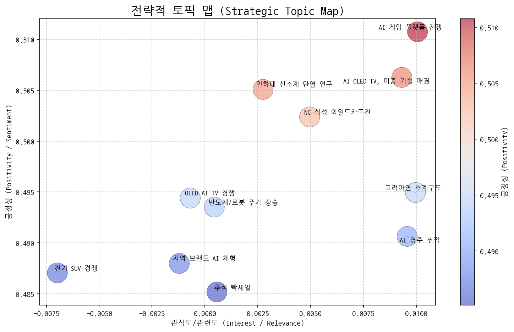
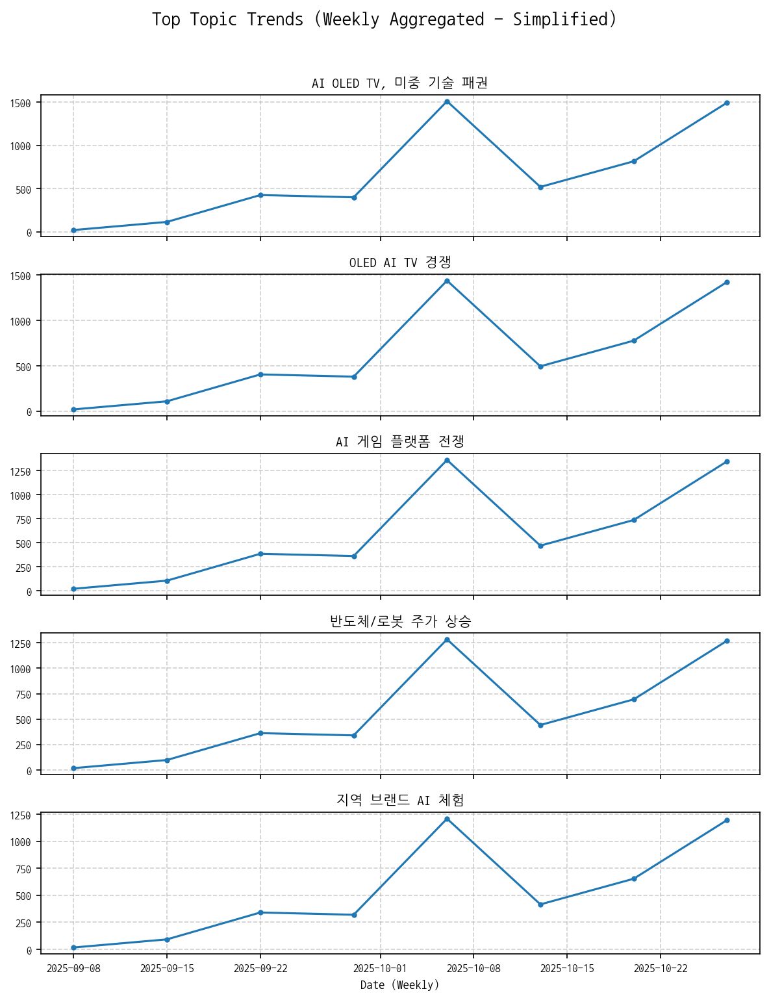
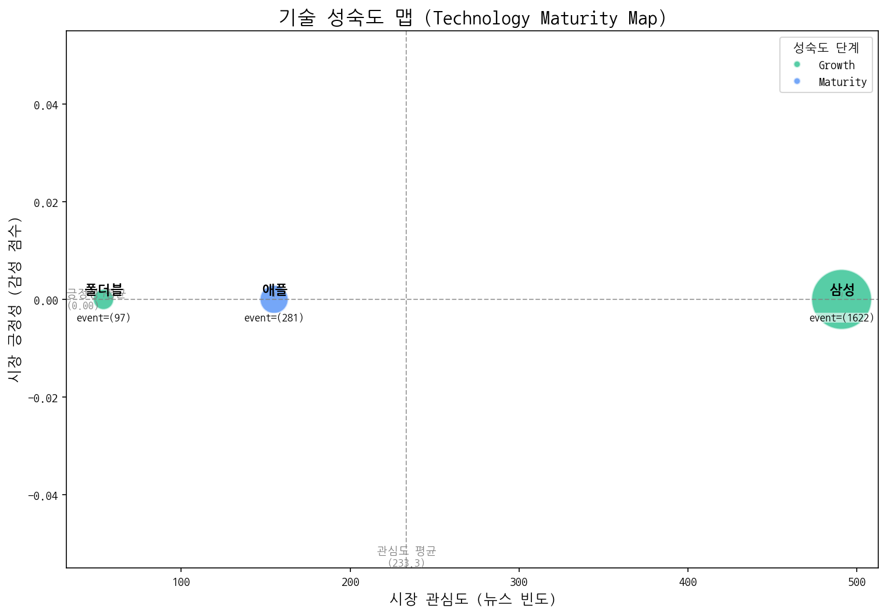
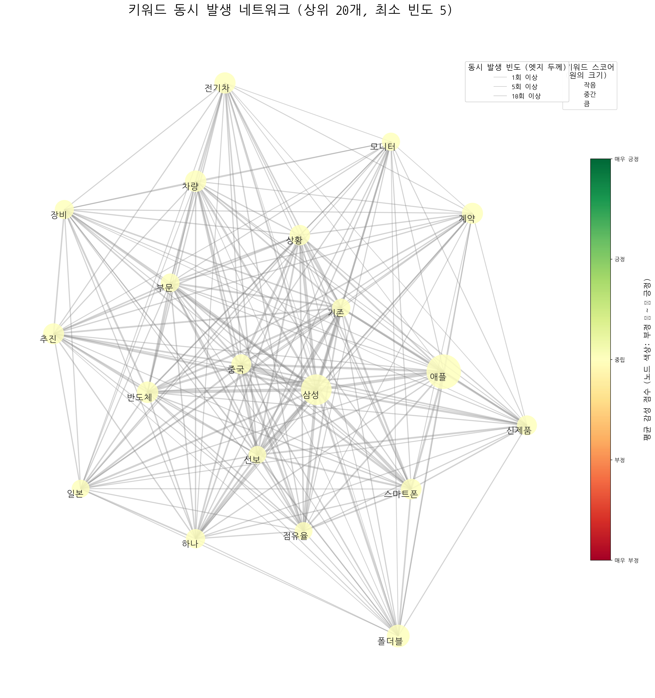
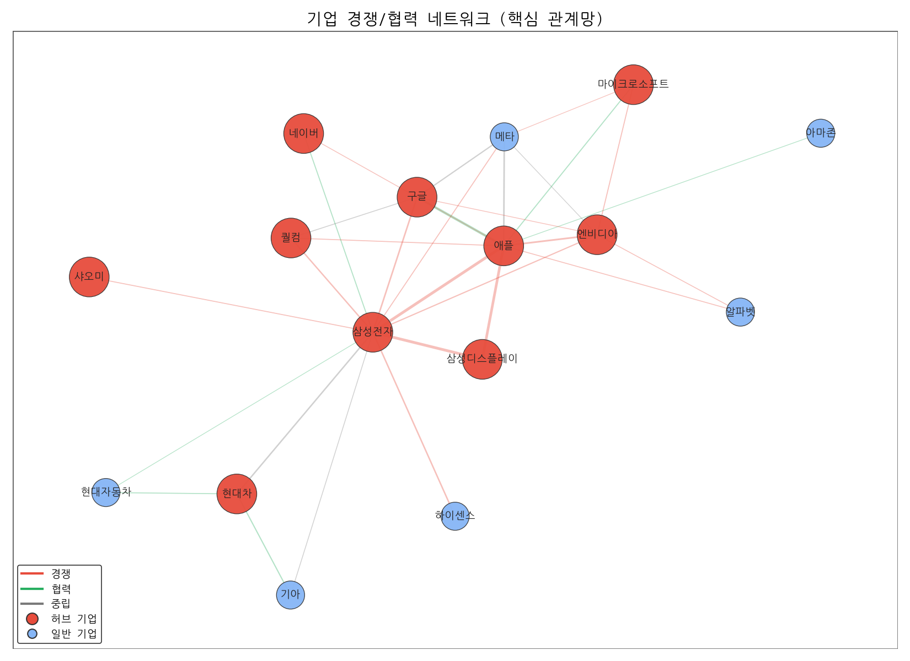
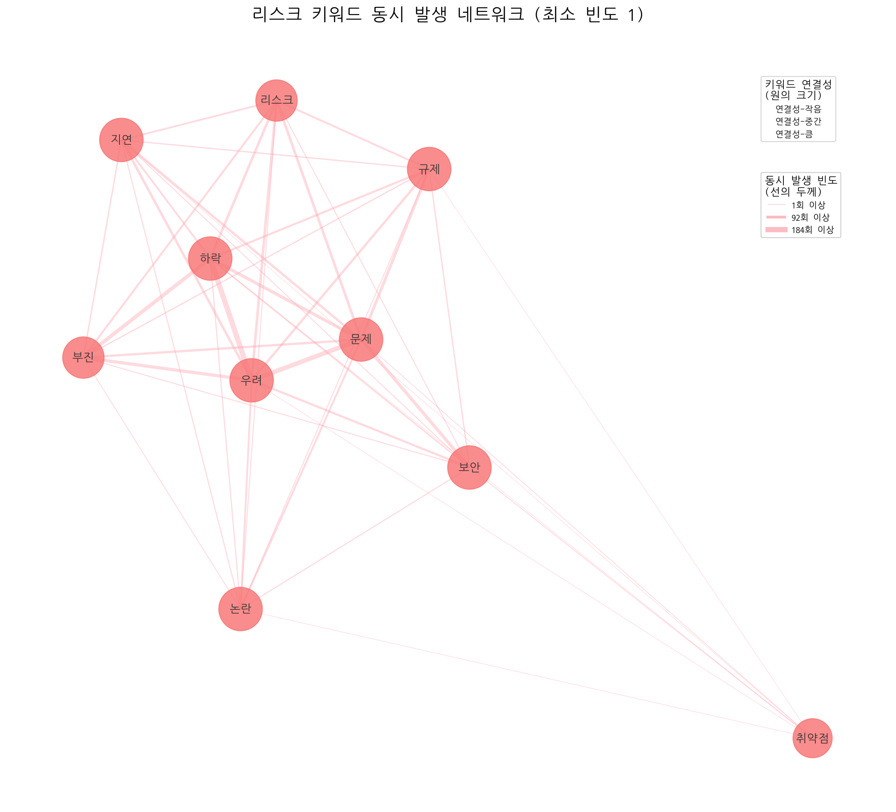
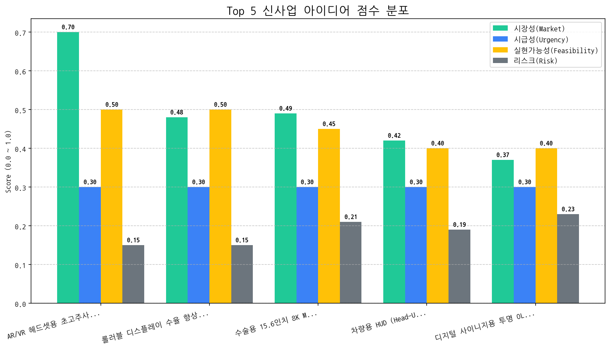

# Monthly Strategic Review (2025-09-26 ~ 2025-10-25)

## Executive Summary

## 월간 전략 브리핑 (2024년 5월)

**CEO 및 경영진께,**

지난 한 달간의 시장 데이터를 분석한 결과를 바탕으로 핵심 동향, 전략적 시사점, 그리고 최우선 실행 과제를 보고드립니다.

---

### 1. 월간 핵심 동향 (Key Trends)

*   **AI 디스플레이 주도권 경쟁 심화:** AI 기술을 탑재한 OLED TV를 중심으로 미중 기술 패권 경쟁이 본격화되고 있으며, 삼성전자와 LG전자를 비롯한 주요 기업들이 OLED AI TV 시장 선점을 위한 치열한 경쟁을 벌이고 있습니다. 동시에, AI 게임 플랫폼 시장 경쟁도 격화되고 있어 AI 기술을 활용한 디스플레이 경험 혁신이 중요한 화두로 떠오르고 있습니다.
*   **디스플레이 기술 성숙도 변화:** 삼성의 디스플레이 기술은 지속적으로 성장하고 있으며, 특히 폴더블 디스플레이 기술 성숙도가 눈에 띄게 향상되고 있습니다. 반면, 애플은 디스플레이 기술 성숙도 측면에서 이미 성숙 단계에 접어든 것으로 판단됩니다.
*   **삼성-애플 Rivalry 심화:** 삼성전자와 애플 간의 경쟁 관계가 더욱 심화되고 있습니다. 특히 디스플레이 기술 경쟁력 확보를 위한 양사의 노력이 경쟁 심화에 더욱 불을 지피고 있습니다.

### 2. 전략적 시사점 (Strategic Implications)

*   **기회:**
    *   **AI 디스플레이 시장 선점:** AI 기술과 디스플레이 기술의 융합을 통해 고부가가치 제품 및 서비스를 창출하고 시장을 선도할 수 있습니다.
    *   **폴더블 시장 성장:** 폴더블 디스플레이 기술 성숙도 향상에 따라 폴더블 기기 시장이 확대될 것으로 예상됩니다. 폴더블 디스플레이 기술 경쟁력 강화는 시장 점유율 확대로 이어질 수 있습니다.
    *   **AR/VR 시장 선점:** AR/VR 헤드셋용 초고주사율 가변형 OLED 마이크로 디스플레이 개발을 통해 차세대 디스플레이 시장을 선점할 수 있습니다.
*   **위협:**
    *   **미중 기술 패권 경쟁 심화:** 미중 기술 패권 경쟁 심화에 따른 불확실성 증가는 사업 환경에 부정적인 영향을 미칠 수 있습니다.
    *   **경쟁 심화:** OLED AI TV 시장 및 AI 게임 플랫폼 시장 경쟁 심화는 수익성 악화로 이어질 수 있습니다.
    *   **애플의 기술적 성숙:** 애플의 기술적 성숙은 시장 혁신의 정체를 의미할 수 있으며, 이는 경쟁 우위 확보에 어려움을 초래할 수 있습니다.

### 3. 최우선 실행 과제 (Top Priority Action Items)

1.  **AI 디스플레이 기술 경쟁력 강화:** AI 기반 화질/음질 개선, 사용자 경험 최적화 기술 개발에 집중 투자하여 OLED AI TV 시장 경쟁 우위를 확보해야 합니다. 특히, AI 게임 플랫폼과의 연동을 강화하여 차별화된 게이밍 경험을 제공하는 전략을 수립해야 합니다.
2.  **차세대 디스플레이 기술 개발 가속화:** AR/VR 헤드셋용 초고주사율 가변형 OLED 마이크로 디스플레이 개발에 역량을 집중하여 미래 디스플레이 시장을 선점해야 합니다. 특히, 삼성의 폴더블 기술 성장을 벤치마킹하여 폴더블 디스플레이 기술 경쟁력을 강화하는 노력을 병행해야 합니다.
3.  **파트너십 전략 재검토:** 경쟁 심화에 대응하고 새로운 성장 동력을 확보하기 위해, AI, 소프트웨어, 콘텐츠 분야의 주요 기업들과 전략적 파트너십을 구축해야 합니다. 특히, 애플과의 경쟁 구도를 고려하여 협력 가능한 분야를 발굴하고, 새로운 협력 모델을 구축해야 합니다.
---

상기 내용을 바탕으로 다음 달 전략 실행 계획을 구체화하고, 지속적인 시장 상황 모니터링 및 데이터 분석을 통해 변화에 신속하게 대응할 수 있도록 노력하겠습니다.

감사합니다.

**[귀하의 이름]**

**최고 전략 책임자 (CSO)**

## 1. 전략적 시장 포지셔닝 맵

### 전략적 인사이트 및 실행과제 제안
## 시장 전략 컨설팅 보고서

#### 📈 4분면 분석

**참고:** 토픽의 관심도와 긍정성은 데이터에 명시적으로 제공되지 않았으므로, 토픽 요약 정보와 일반적인 시장 상황에 대한 이해를 바탕으로 주관적인 판단을 내렸습니다. 따라서 실제 시장 데이터와는 차이가 있을 수 있습니다.

- **주력 영역 (관심도 높음, 긍정성 높음)**: `반도체/로봇 주가 상승`, `OLED AI TV 경쟁`. 반도체와 로봇 산업의 성장세는 투자자들의 높은 관심을 받으며 긍정적인 전망을 유지하고 있으며, OLED AI TV 경쟁은 프리미엄 TV 시장의 성장과 함께 기술 혁신을 주도하며 소비자들의 기대감을 높이고 있습니다. 이 영역은 지속적인 투자와 기술 개발을 통해 시장 우위를 확보해야 합니다.

- **기회 영역 (관심도 낮음, 긍정성 높음)**: `지역 브랜드 AI 체험`, `AI 경주 추적`, `인하대 신소재 단열 연구`.  AI 기술을 지역 경제 활성화에 접목하거나, 특정 분야(경주, 소재)에 적용하는 것은 아직 시장의 관심이 높지 않지만, 혁신적인 시도로 긍정적인 잠재력을 가지고 있습니다. 이러한 영역은 파일럿 프로젝트나 협업을 통해 성공 사례를 창출하여 시장의 관심을 유도할 수 있습니다.

- **경쟁/위험 영역 (관심도 높음, 긍정성 낮음)**: `AI OLED TV, 미중 기술 패권`, `AI 게임 플랫폼 전쟁`, `고려아연 후계구도`, `전기 SUV 경쟁`. AI OLED TV 및 미중 기술 패권 경쟁은 높은 관심도에도 불구하고 불확실성과 리스크가 존재하며, AI 게임 플랫폼 전쟁은 대기업들의 과점 가능성으로 인해 중소기업에게는 위협 요인이 될 수 있습니다. 고려아연 후계구도는 기업 내부 문제로 인해 기업 이미지에 부정적인 영향을 줄 수 있으며, 전기 SUV 경쟁은 과도한 경쟁으로 인한 수익성 악화 가능성이 있습니다.  이 영역은 리스크 관리 및 차별화 전략이 중요합니다.

- **틈새/장기 영역 (관심도 낮음, 긍정성 낮음)**: `추석 빡세일`, `NC-삼성 와일드카드전`.  특정 시기나 이벤트에 한정된 토픽으로, 시장에 미치는 영향이 제한적이며 장기적인 관점에서 큰 의미를 부여하기 어렵습니다.  이 영역은 단기적인 마케팅 활동에 활용하거나, 데이터 분석을 통해 장기적인 트렌드를 파악하는 데 활용할 수 있습니다.

####  actionable insights

- **[선정된 '기회' 토픽명]**: `AI 경주 추적`
    *   **초기 액션 아이템 제안**:  AI 기반 경주 추적 기술을 개발하는 스타트업 3곳 리스트업 및 기술 제휴 가능성 타진. 경마장 또는 관련 기관과의 협력 가능성 모색.

- **[선정된 '위험' 토픽명]**: `AI OLED TV, 미중 기술 패권`
    *   **초기 액션 아이템 제안**: 미중 기술 패권 경쟁 관련 최신 규제 동향 및 관련 기업(특히 삼성전자)에 미치는 영향 분석 보고서 작성. 경쟁 심화에 따른 리스크 관리 방안 및 기회 요인 발굴.

### 토픽 상세 정보
| 토픽                   | 요약                                                                                                                                             | 핵심 키워드           |
|:---------------------|:-----------------------------------------------------------------------------------------------------------------------------------------------|:-----------------|
| AI OLED TV, 미중 기술 패권 | 삼성전자를 중심으로 AI, OLED TV, 디스플레이, 반도체 기술 경쟁 심화와 중국, 미국 간의 기술 패권 경쟁 상황을 다룸.                                                                        | ai, oled, tv     |
| OLED AI TV 경쟁        | LG와 삼성전자가 OLED, AI 기술을 적용한 TV 디스플레이 시장에서 중국 기술 기업들과 경쟁하는 상황. 특히 삼성전자의 RGB OLED 기술과 관련된 내용이 포함됨.                                                | oled, ai, tv     |
| AI 게임 플랫폼 전쟁         | 미국 주도 AI 기술이 적용된 새로운 게임 플랫폼 경쟁 심화 (KT 참여). 괴수(거대 기업)들의 시장 선점 예상.                                                                               | ai, 게임, said     |
| 반도체/로봇 주가 상승         | 미국 시장에서 반도체, 로봇, AI 관련 부품 및 장비 주가가 오른 거래일 마감 상황을 다룬 뉴스입니다.                                                                                     | 반도체, 로봇, 거래일     |
| 지역 브랜드 AI 체험         | 지역 브랜드 활성화를 위한 AI 기술 활용 체험 행사 및 현대차, 뷰티, 자원순환, 만들기 등 다양한 체험 프로그램이 서면에서 직접 진행됨.                                                                 | 자원순환, 체험, 지역     |
| 전기 SUV 경쟁            | 포르쉐, 폴스타 등 전기차 브랜드의 SUV 모델 출시 및 판매 관련 소식. 특히 전기차 시장에서 SUV 모델의 경쟁이 심화될 것으로 예상됨. 전주 지역에서의 전기차 판매도 언급.                                            | 주행, 판매, 전기차      |
| NC-삼성 와일드카드전         | NC와 삼성이 와일드카드 결정전에서 맞붙었으며, 삼성 선발과 감독의 전략, 승리 여부 등이 주요 내용으로 보인다.                                                                                | 시즌, nc, 삼성       |
| 인하대 신소재 단열 연구        | 인하대 신소재공학과 학생과 교수가 유기 단열 및 난연 특성을 가진 신소재를 연구하여 디스플레이 등에 활용 가능성을 탐색하는 내용입니다.                                                                    | 학생은, 교수, 신소재공학과  |
| 추석 빡세일               | 추석 연휴를 맞아 다양한 상품 할인 행사를 진행하며, 구매를 유도하는 내용.                                                                                                     | 추석, 선보인다, 상품을    |
| 고려아연 후계구도            | 최창걸 고려아연 명예회장과 관련된 후계 구도 및 재계, 정치권과의 연관성에 대한 내용으로 추정됩니다. 고려아연, 한화, GS그룹 등 재계 인사들과 국민의힘 장관 등 정치권 인물들이 언급되는 것으로 보아, 후계 구도가 복잡하게 얽혀 있을 가능성이 있습니다. | 부회장, 비철금속, 명예회장  |
| AI 경주 추적             | AI 기술(Vision AI)이 경주 장면에서 말의 움직임을 추적하고 화면에 표시하는 기술에 대한 내용입니다.                                                                                  | race, vision, 말을 |

### 토픽 성장/하락 추세
|   topic_id | topic_name           |   momentum_score |
|-----------:|:---------------------|-----------------:|
|          2 | AI 게임 플랫폼 전쟁         |            0     |
|          4 | 지역 브랜드 AI 체험         |            0     |
|          3 | 반도체/로봇 주가 상승         |            0     |
|          9 | 고려아연 후계구도            |            0     |
|          8 | 추석 빡세일               |            0     |
|          5 | 전기 SUV 경쟁            |            0     |
|          7 | 인하대 신소재 단열 연구        |            0     |
|         10 | AI 경주 추적             |            0     |
|          0 | AI OLED TV, 미중 기술 패권 |           -2.071 |
|          1 | OLED AI TV 경쟁        |           -2.071 |
|          6 | NC-삼성 와일드카드전         |           -2.636 |

## 2. 기술 수명 주기 및 R&D 투자 타이밍 분석

| 기술   | 단계       | 판단 근거                                                                                |
|:-----|:---------|:-------------------------------------------------------------------------------------|
| 삼성   | Growth   | 높은 출시 빈도와 투자 건수를 고려할 때, 삼성 기술은 시장에서 활발하게 성장하고 있는 단계로 판단됩니다.                          |
| 폴더블  | Growth   | 높은 출시 빈도와 투자 건수는 폴더블 기술이 시장에서 성장하고 있음을 나타내지만, 낮은 시장 감성 점수는 아직 성숙 단계에 이르지 못했음을 시사합니다. |
| 애플   | Maturity | 뉴스 언급 빈도가 높고, 출시 이벤트가 많으며 투자 건수가 많지만 시장 감성 점수가 낮아 성숙 단계로 판단됩니다.                      |

## 3. 경쟁사 전략적 의도 및 파트너 관계망 분석

### 3.1 기업별 전략 방향성 분석
| 기업   | 핵심 집중 토픽                                          | 전략 방향성 해석                                                                                                                                              |
|:-----|:--------------------------------------------------|:-------------------------------------------------------------------------------------------------------------------------------------------------------|
| 삼성전자 | AI OLED TV, 미중 기술 패권, OLED AI TV 경쟁, 반도체/로봇 주가 상승 | 삼성전자는 미중 기술 패권 경쟁 속에서 AI 기술을 접목한 OLED TV를 중심으로 프리미엄 TV 시장 경쟁력을 강화하고, 반도체와 로봇 사업의 성장 잠재력을 통해 주가 상승을 견인하려는 전략을 추진 중입니다.                                  |
| LG전자 | AI OLED TV, 미중 기술 패권, OLED AI TV 경쟁, AI 게임 플랫폼 전쟁 | LG전자는 AI 기반 OLED TV 기술 리더십을 강화하고, 미중 기술 패권 경쟁 속에서 AI 게임 플랫폼 생태계를 확장하며 프리미엄 TV 시장에서의 경쟁 우위를 확보하려는 전략을 추진하고 있습니다.                                        |
| 애플   | AI OLED TV, 미중 기술 패권, OLED AI TV 경쟁, AI 게임 플랫폼 전쟁 | 애플은 AI 기술을 중심으로 OLED TV 시장 진출을 모색하며, 미중 기술 패권 경쟁 속에서 AI 및 디스플레이 기술력을 활용한 프리미엄 제품으로 경쟁 우위를 확보하고, AI 게임 플랫폼 시장 선점을 통해 새로운 성장 동력을 창출하려는 단기 전략을 추진하고 있습니다. |

### 3.2 경쟁/협력 관계망 분석 및 실행과제

| 주요 관계          | 유형      | 액션 아이템 제안                          |
|:---------------|:--------|:-----------------------------------|
| 삼성전자 ↔ 애플      | rivalry | 애플 신제품 출시 전략 분석 및 대응 방안 수립         |
| 삼성디스플레이 ↔ 삼성전자 | rivalry | 삼성전자 차세대 TV 전략 긴급 분석 및 대응 방안 수립.   |
| 삼성디스플레이 ↔ 애플   | rivalry | 애플 OLED 공급망 다변화 전략 파악 및 대응 시나리오 준비 |

 >두 기업이 함께 언급된 문맥 안에서, 키워드의 빈도가 **경쟁 > 협력**인 경우 'rivalry', 반대의 경우 'partnership'으로 분류

## 4. 전략적 리스크 관리 및 완화 액션 제안

- (리스크/이슈 데이터 없음)

## 5. 데이터 기반 신사업 아이디어 제안

| 아이디어                                    | 가치 제안                                                                                         |   총점 |
|:----------------------------------------|:----------------------------------------------------------------------------------------------|-----:|
| AR/VR 헤드셋용 초고주사율 가변형 OLED 마이크로 디스플레이    | 초고주사율 (240Hz 이상) 구현, 가변형 디스플레이로 시력 최적화, 높은 해상도 및 명암비, 얇고 가벼운 디자인, 저전력 소모                      |  4.4 |
| 롤러블 디스플레이 수율 향상을 위한 AI 기반 공정 이상 감지 시스템  | 롤러블 디스플레이 수율 향상 (20% 목표), 불량 발생 원인 신속 분석, 공정 비용 절감, 생산성 향상, 데이터 기반 의사결정 지원                    |  3.6 |
| 수술용 15.6인치 8K MicroLED 폴더블 디스플레이        | 최고 수준의 해상도 및 색 재현율, 폴더블 디자인으로 공간 활용 극대화, 다양한 각도에서 정보 공유 가능, 수술 영상 및 데이터 실시간 통합 관리, 의료진 피로도 감소 |  3.3 |
| 차량용 HUD (Head-Up Display) 증강현실 (AR) 글래스 | 운전자 시야 방해 최소화, AR 기반 직관적인 정보 제공, AI 기반 위험 예측 및 경고, 기존 HUD 대비 저렴한 비용, 간편한 설치 및 유지보수            |  3   |
| 디지털 사이니지용 투명 OLED 키오스크                  | 제품 전시와 정보 제공 동시 수행, 투명 디스플레이로 주변 환경과 조화, AI 기반 맞춤형 광고 제공, 고객 경험 향상, 높은 광고 효과                  |  2.7 |

 #### [아이디어 검증: 2주 Action Plan]
| Hypothesis                                                                                                          | Target                                         | KPI                                                                                               | Owner   | Due        |
|:--------------------------------------------------------------------------------------------------------------------|:-----------------------------------------------|:--------------------------------------------------------------------------------------------------|:--------|:-----------|
| 북미 빅테크 AR/VR 헤드셋 제조사들은 초고주사율(240Hz 이상) 및 가변형 OLED 마이크로 디스플레이 기능에 대해 경쟁력 있는 가격으로 구매할 의향이 있다.                         | 메타, 애플, 소니의 AR/VR 헤드셋 개발 및 구매 담당 고위 임원 (최소 5명) | 5명의 인터뷰 대상 중 최소 3명이 제품 사양 및 가격에 대한 긍정적 피드백 제공 (잠재적 협업 의사 확인)                                      | 사업개발팀   | 2025-11-08 |
| OLED on Silicon (OoS) 기술 기반으로 240Hz 이상의 주사율을 가진 가변형 마이크로 디스플레이 시제품 제작이 기술적으로 가능하다.                                  | OoS 기술 전문가, 디스플레이 개발 엔지니어 (사내 핵심 기술 인력)        | OoS 기반 240Hz 가변형 마이크로 디스플레이 시제품의 설계 및 주요 기술적 난제 해결 방안 제시 (기술 로드맵 확보)                              | 기술기획팀   | 2025-11-08 |
| 현재 파악된 OLED 소자 수명 및 번인 문제를 해결하기 위한 기술적 솔루션 (새로운 소자, 구동 방식 등) 개발 가능성이 존재하며, 솔루션 적용 시 AR/VR 헤드셋에 적합한 수준의 수명 확보가 가능하다. | OLED 소자 전문가, 번인 문제 해결 전문가 (사내 연구소 및 외부 자문)     | AR/VR 헤드셋 사용 환경 (높은 밝기, 장시간 사용)에서 OLED 소자 수명 및 번인 문제를 최소화할 수 있는 최소 2가지 이상의 기술적 솔루션 확보 (기술 검토 보고서) | 연구개발팀   | 2025-11-08 |
