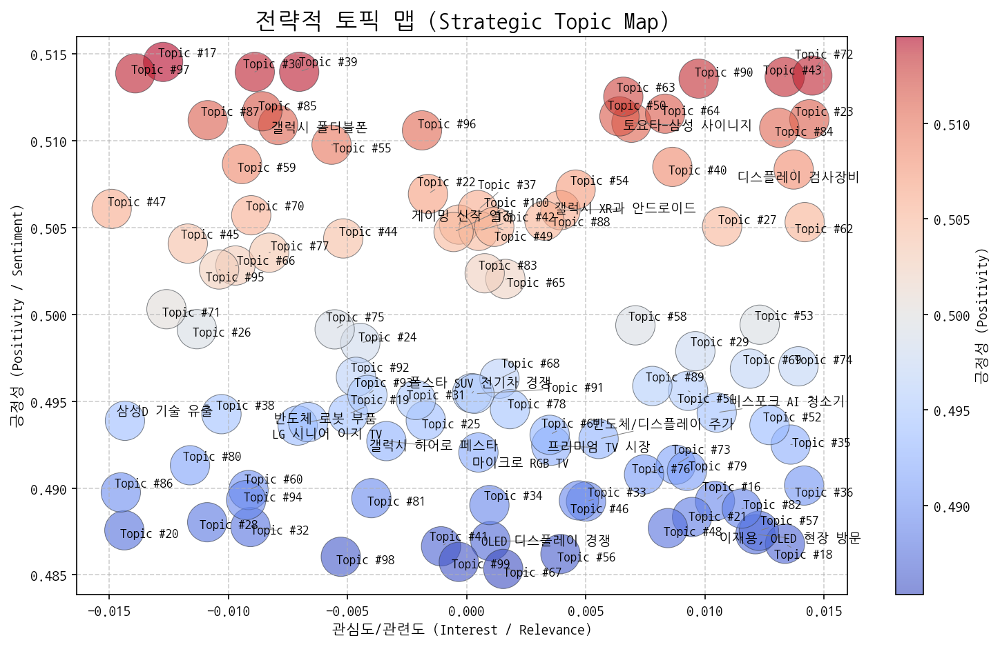
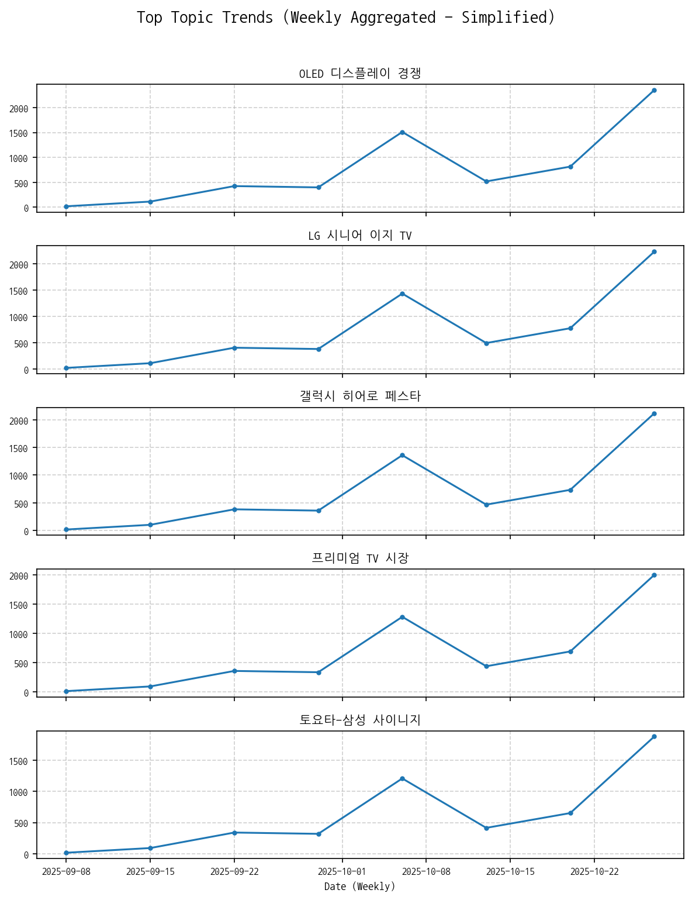
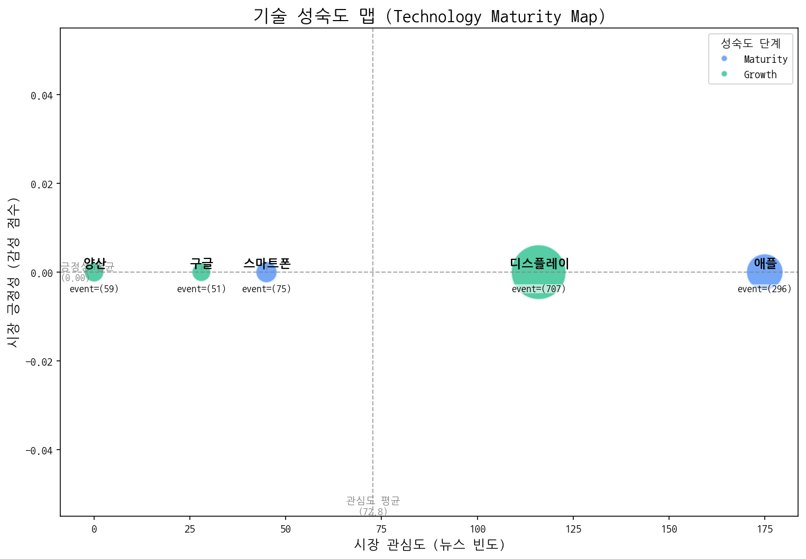
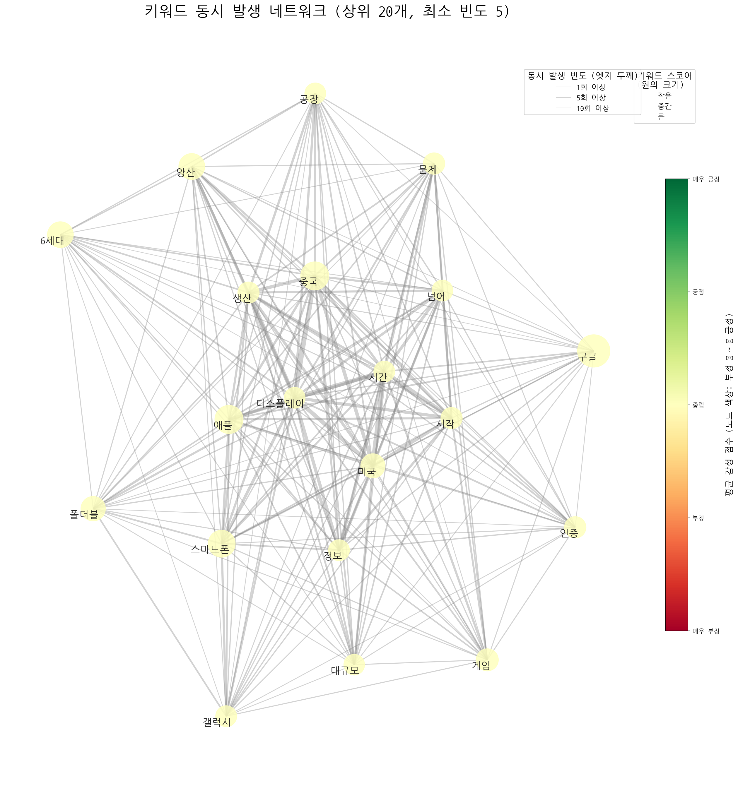
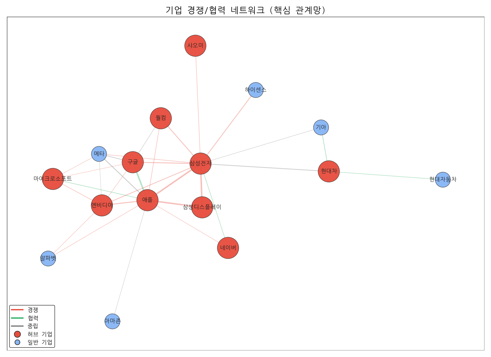
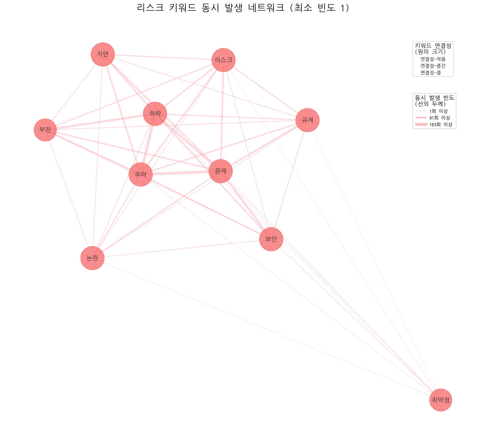
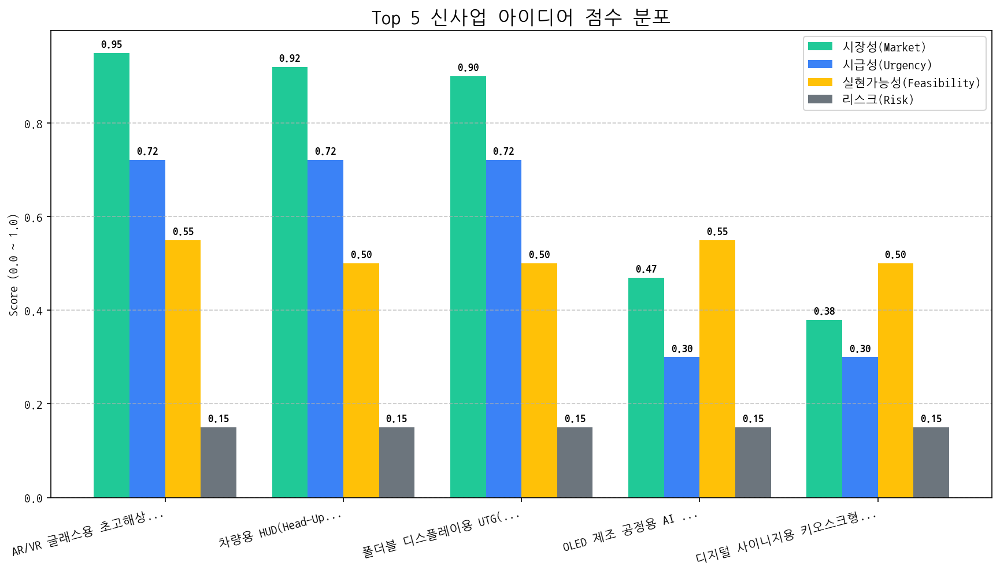

# Monthly Strategic Review (2025-09-27 ~ 2025-10-26)

## Executive Summary

## 월간 전략 브리핑 (Monthly Strategy Briefing)

**작성일:** 2024년 5월 16일

**작성자:** [당신 이름], CSO

### 1. 월간 핵심 동향 (Key Trends)

*   **OLED 디스플레이 경쟁 심화:** OLED 디스플레이 기술 경쟁이 더욱 치열해지고 있으며, 특히 삼성전자와 애플 간의 경쟁 관계가 더욱 공고해지고 있습니다. 이는 프리미엄 디스플레이 시장에서의 경쟁 우위를 확보하기 위한 양사의 노력이 가속화되고 있음을 시사합니다.

*   **타겟 고객 다변화:** LG 시니어 이지 TV 사례에서 보듯, 특정 연령대나 특수 고객층을 위한 맞춤형 제품 및 서비스에 대한 수요가 증가하고 있습니다. 이는 시장 세분화 및 고객 맞춤형 전략의 중요성이 더욱 커지고 있음을 의미합니다.

*   **미래 디스플레이 기술 경쟁 본격화:** AR/VR 글래스용 초고해상도 Micro-OLED on Silicon 패널이 최우선 신사업 아이디어로 부상한 것은 차세대 디스플레이 기술 경쟁이 본격화되고 있음을 보여줍니다. 특히 몰입형 경험을 위한 디스플레이 기술 개발의 중요성이 강조되고 있습니다.

### 2. 전략적 시사점 (Strategic Implications)

**기회 요인:**

*   **OLED 기술 리더십 강화:** 경쟁 심화는 기술 혁신과 차별화된 제품 개발을 통해 시장 점유율을 확대할 수 있는 기회입니다. 특히 차세대 OLED 기술 개발에 집중 투자하여 경쟁 우위를 확보해야 합니다.
*   **세분화 시장 공략:** 고령층, 특정 취미를 가진 고객 등 세분화된 시장을 공략하여 새로운 성장 동력을 확보할 수 있습니다. 고객 맞춤형 제품 및 서비스 개발을 통해 충성도를 높이고 시장 점유율을 확대해야 합니다.
*   **AR/VR 시장 선점:** AR/VR 시장은 높은 성장 잠재력을 가지고 있으며, 초고해상도 Micro-OLED on Silicon 패널 개발은 시장을 선점할 수 있는 중요한 기회입니다. 기술 개발뿐만 아니라 관련 생태계 구축에도 적극적으로 참여해야 합니다.

**위협 요인:**

*   **경쟁 심화에 따른 수익성 악화:** OLED 디스플레이 경쟁 심화는 가격 경쟁을 유발하여 수익성을 악화시킬 수 있습니다. 기술 혁신과 차별화된 제품 개발을 통해 가격 경쟁에서 벗어나야 합니다.
*   **기술 성숙도에 따른 투자 리스크:** 스마트폰과 같이 이미 성숙 단계에 접어든 기술에 대한 투자는 수익률이 낮을 수 있습니다. 성장 단계에 있는 양산 및 구글 관련 기술에 대한 투자를 확대하고, 미래 기술 개발에 대한 투자를 병행해야 합니다.
*   **파트너십 및 경쟁 관계의 복잡성:** 삼성전자와 애플의 경쟁 관계에서 보듯, 파트너십과 경쟁 관계가 복잡하게 얽혀있습니다. 경쟁 환경 변화에 대한 지속적인 모니터링과 유연한 전략 수립이 필요합니다.

### 3. 최우선 실행 과제 (Top Priority Action Items)

1.  **차세대 OLED 기술 로드맵 구체화 및 투자 확대:**  AR/VR, 차량용 디스플레이 등 미래 시장을 겨냥한 차세대 OLED 기술 개발 로드맵을 구체화하고, 핵심 기술 확보를 위한 투자 및 인력 확보를 최우선적으로 추진합니다. 특히 Micro-OLED on Silicon 패널 개발에 대한 집중 투자가 필요합니다.

2.  **고객 맞춤형 제품 포트폴리오 확장:**  고령층, 특정 취미를 가진 고객 등 세분화된 시장을 위한 맞춤형 제품 및 서비스 개발을 확대합니다. 고객 데이터를 기반으로 니즈를 정확히 파악하고, 차별화된 가치를 제공할 수 있는 제품 및 서비스 개발에 집중합니다.  시장조사, 고객 인터뷰, 프로토타입 테스트 등을 통해 고객 피드백을 적극적으로 반영합니다.

3.  **AR/VR 생태계 파트너십 강화:**  AR/VR 관련 기업 및 연구 기관과의 협력을 강화하여 기술 경쟁력을 확보하고, 시장 생태계를 구축합니다.  AR/VR 글래스 제조사, 콘텐츠 개발사, 플랫폼 제공사 등과의 파트너십을 통해 시너지를 창출하고, 시장을 선도할 수 있는 기회를 모색합니다.

## 1. 전략적 시장 포지셔닝 맵

### 전략적 인사이트 및 실행과제 제안
네, 시장 전략 컨설턴트로서 주어진 데이터를 분석하고, 4분면 분석과 함께 핵심 토픽 선정 및 액션 아이템을 제안해 드리겠습니다.

**중요:** LLM 해석 실패로 요약 정보가 없는 토픽들은 분석에서 제외했습니다. 따라서 분석은 제공된 요약 정보가 있는 토픽에 한정됩니다. 긍정성/관심도는 주관적인 판단에 의해 할당되므로, 실제 데이터와 다를 수 있습니다.

#### 📈 4분면 분석

*   **주력 영역 (관심도 높음, 긍정성 높음)**:
    *   **갤럭시 폴더블폰**: 폴더블폰 시장의 성장세와 삼성의 선두적인 위치를 고려할 때, 여전히 시장의 높은 관심과 긍정적인 전망을 가지고 있습니다. 폴더블폰 기술 혁신과 폼팩터 다양화에 대한 기대감이 지속적으로 나타나고 있습니다.
    *   **전략적 의미**: 지속적인 기술 혁신과 사용자 경험 개선을 통해 시장 지배력을 강화하고, 경쟁사와의 차별화를 추구해야 합니다.
*   **기회 영역 (관심도 낮음, 긍정성 높음)**:
    *   **LG 시니어 이지 TV**: 시니어 시장을 겨냥한 LG전자의 이지 TV는 고령화 사회에서 성장 잠재력이 높지만, 아직 시장의 관심도는 높지 않습니다. 사용 편의성과 헬스케어 기능 등 차별화된 가치 제안이 필요합니다.
    *   **토요타-삼성 사이니지**: 삼성의 사이니지 기술이 토요타 자동차 전시장과 같은 새로운 분야에 적용되는 것은 긍정적이지만, 아직은 틈새 시장으로 여겨지고 있습니다.
    *   **전략적 의미**: 타겟 고객층에 대한 맞춤형 마케팅과 파트너십 확대를 통해 시장 인지도를 높이고, 새로운 수요를 창출해야 합니다.
*   **경쟁/위험 영역 (관심도 높음, 긍정성 낮음)**:
    *   **삼성D 기술 유출**: 기술 유출 사건은 기업 이미지와 경쟁력에 부정적인 영향을 미칠 수 있으며, 시장의 우려를 야기합니다. 보안 강화와 신뢰 회복이 시급합니다.
    *   **OLED 디스플레이 경쟁**: OLED 디스플레이 기술 경쟁은 치열하며, 기술 우위 확보를 위한 투자와 경쟁이 심화될수록 수익성 악화 가능성이 존재합니다.
    *   **프리미엄 TV 시장**: 프리미엄 TV 시장 경쟁 심화는 높은 기술력과 마케팅 비용을 요구하며, 가격 경쟁으로 이어질 수 있습니다.
    *   **전략적 의미**: 리스크 관리 및 위기 대응 시스템을 구축하고, 차별화된 기술력과 브랜드 가치를 통해 경쟁 우위를 확보해야 합니다.
*   **틈새/장기 영역 (관심도 낮음, 긍정성 낮음)**:
    *   **반도체 로봇 부품**: 반도체 및 로봇 부품 산업은 장기적인 성장 잠재력이 있지만, 현재 시장의 관심도와 긍정성은 낮습니다. 기술 개발 및 투자에 대한 지속적인 노력이 필요합니다.
    *   **디스플레이 검사장비**: 디스플레이 검사장비 산업은 기술적인 전문성이 요구되며, 시장 규모가 제한적일 수 있습니다.
    *   **전략적 의미**: 장기적인 관점에서 기술 개발 및 시장 변화를 관찰하고, 새로운 사업 기회를 모색해야 합니다.

####  actionable insights

*   **[선정된 '기회' 토픽명]**: LG 시니어 이지 TV
    *   **초기 액션 아이템 제안**: 시니어 시장 및 실버테크 전문가 인터뷰를 통해 구체적인 니즈 및 시장 성장 가능성을 파악하고, 경쟁사 제품 분석 및 차별화 전략 수립에 착수합니다. 시니어 대상 제품 사용성 테스트를 통해 제품 개선점을 발굴합니다.

*   **[선정된 '위험' 토픽명]**: 삼성D 기술 유출
    *   **초기 액션 아이템 제안**: 법무팀 및 보안팀과 협력하여 기술 유출 관련 법적 리스크 및 보안 취약점을 점검하고, 재발 방지 대책을 수립합니다. 언론 홍보팀과 협력하여 사건 발생 후 기업 이미지 변화를 모니터링하고, 필요한 경우 적극적인 해명 및 입장 표명을 검토합니다.

### 토픽 상세 정보
| 토픽              | 요약                                                                                                     | 핵심 키워드               |
|:----------------|:-------------------------------------------------------------------------------------------------------|:---------------------|
| OLED 디스플레이 경쟁   | 한국과 중국의 OLED 디스플레이 기술 경쟁 심화, 특히 애플 아이폰17의 패널 변화 및 AI 기술 적용 관련 동향 분석. LCD 기술과의 비교 포함.                   | oled, 중국, 디스플레이      |
| LG 시니어 이지 TV    | LG전자가 시니어를 위한 이지 TV를 출시하고 관련 헬프 기능 등을 제공하는 것에 대한 뉴스입니다.                                                | 시니어, 이지, lg          |
| 갤럭시 히어로 페스타     | 갤럭시 시리즈 할인 행사. 군인을 포함한 모든 고객에게 할인 혜택 제공.                                                               | 히어로, 갤럭시, 할인된        |
| 프리미엄 TV 시장      | 중국을 중심으로 LG전자를 포함한 기업들이 마이크로 LED, 마이크로 RGB LED 등 프리미엄 LCD/LED TV 가전 시장에서 경쟁하는 상황을 다룬 내용입니다.            | tv, rgb, 중국          |
| 토요타-삼성 사이니지     | 토요타 자동차 전시장에서 삼성전자의 사이니지 기술 및 디자인이 적용된 사례 또는 협력에 대한 내용.                                                | 사이니지, 토요타, 사이니지를     |
| 삼성D 기술 유출       | 삼성디스플레이 기술 유출 혐의로 경찰이 수사에 착수, 관련자들을 산업기술보호법 위반 혐의로 압수수색하고 중국 유출 여부를 조사 중.                              | 유출, 삼성디스플레이, 경찰은     |
| 마이크로 RGB TV     | 마이크로 RGB 기술이 적용된 TV와 관련된 정보, 컬러 표현, AI 기술 적용 등에 대한 뉴스 토픽입니다.                                           | rgb, 마이크로 rgb, 마이크로  |
| 게이밍 신작 열전       | 엔씨소프트 신작 게임과 OMEN OLED 게이밍 등 도쿄 게임쇼에서 공개된 최신 게임 트렌드 및 기술 (속도감, OLED) 관련 소식.                            | 게이밍, 브레이커스, 도쿄게임쇼    |
| 폴스타 SUV 전기차 경쟁  | 폴스타의 SUV 전기차 모델이 출시되어 판매 경쟁에 돌입했으며, GV80, MINI 등 다양한 모델들과 경쟁 구도를 형성하고 있음을 보여준다. 전주 지역 판매 동향도 주목할 부분이다. | 주행, 폴스타, suv         |
| 반도체 로봇 부품       | 반도체, 로봇 산업과 관련된 기업의 부품, 소재, 장비, 배터리 사업 및 설립, 거래일 등을 다루는 토픽.                                            | 반도체, 로봇, 거래일         |
| 반도체/디스플레이 주가    | 한국 거래소에서 반도체, 디스플레이 장비, 소재, 기술 관련 주가가 주목받고 있는 상황을 다룬 뉴스. 핵심 기술과 소재가 주가에 영향을 미치는 것으로 보임.                | 장비, 반도체, 디스플레이       |
| 비스포크 AI 청소기     | 삼성 비스포크 AI 제트 무선 스틱 청소기(400W 포함) 관련 뉴스 토픽                                                              | 청소기, 청소, 무선          |
| 갤럭시 폴더블폰        | 갤럭시 스마트폰, 특히 폴더블폰의 최신 모델(S25, S26 예상)과 아이폰 등 경쟁 제품 동향, 그리고 관련 기술(엣지) 및 연관 제품(아이오닉, 에어)을 다루는 뉴스 토픽.     | 갤럭시, 스마트폰, 폴더블       |
| 이재용, OLED 현장 방문 | 이재용 회장이 삼성디스플레이 아산캠퍼스 OLED 생산라인을 찾아 사업 현황을 점검했다는 내용.                                                   | 이재용, 삼성디스플레이, 생산라인을  |
| 갤럭시 XR과 안드로이드   | 갤럭시에서 개발 중인 XR 기기에 안드로이드 기반의 구글 기술이 적용될 가능성에 대한 내용입니다. 헤드셋 형태를 띌 것으로 예상됩니다.                            | xr, 갤럭시, 갤럭시 xr      |
| 디스플레이 검사장비      | 탑런에이피솔루션의 디스플레이 검사장비 양산 및 패턴 검사, 캐리어 조립 관련 내용.                                                         | 장비, 검사, 패턴           |
| Topic #16       | (LLM 해석 실패)                                                                                            | 코스피, 사상, 상승          |
| Topic #17       | (LLM 해석 실패)                                                                                            | 게이밍, rog, 모니터        |
| Topic #18       | (LLM 해석 실패)                                                                                            | 3분기, hbm, d램         |
| Topic #19       | (LLM 해석 실패)                                                                                            | oled, oled 서밋, 서밋    |
| Topic #20       | (LLM 해석 실패)                                                                                            | ai 팩토리, ai, 팩토리      |
| Topic #21       | (LLM 해석 실패)                                                                                            | ai, 에너지, 선보인다        |
| Topic #22       | (LLM 해석 실패)                                                                                            | 김치냉장고, 정수, 미식컬렉션     |
| Topic #23       | (LLM 해석 실패)                                                                                            | sns, 대한민국 sns, 사람    |
| Topic #24       | (LLM 해석 실패)                                                                                            | 사랑받는, 가장 사랑받는, 호주    |
| Topic #25       | (LLM 해석 실패)                                                                                            | 아이폰, 아이폰17, 애플       |
| Topic #26       | (LLM 해석 실패)                                                                                            | 2025년, 반도체, 2024년    |
| Topic #27       | (LLM 해석 실패)                                                                                            | re100, 유치, 기업이       |
| Topic #28       | (LLM 해석 실패)                                                                                            | 신뢰성, 복합, 장비          |
| Topic #29       | (LLM 해석 실패)                                                                                            | 애플워치, 수면, 운동         |
| Topic #30       | (LLM 해석 실패)                                                                                            | 아이폰17, 아이폰, 프로       |
| Topic #31       | (LLM 해석 실패)                                                                                            | 퍼플렉시티, tv와, 2025년형   |
| Topic #32       | (LLM 해석 실패)                                                                                            | 공공디자인, 전시, 문체부       |
| Topic #33       | (LLM 해석 실패)                                                                                            | 정철동, 디스플레이의, 사장은     |
| Topic #34       | (LLM 해석 실패)                                                                                            | 반도체, fix, 광전자        |
| Topic #35       | (LLM 해석 실패)                                                                                            | 디자인, 상을, 레드닷         |
| Topic #36       | (LLM 해석 실패)                                                                                            | oled, 연구원은, lg디스플레이  |
| Topic #37       | (LLM 해석 실패)                                                                                            | 패널, 출하량이, 3분기        |
| Topic #38       | (LLM 해석 실패)                                                                                            | ceo, apec, ceo 서밋    |
| Topic #39       | (LLM 해석 실패)                                                                                            | 상품을, 선보인다, 브랜드       |
| Topic #40       | (LLM 해석 실패)                                                                                            | 붉은사막, amd, 메이플스토리    |
| Topic #41       | (LLM 해석 실패)                                                                                            | 차량용, iaa, 차량용 oled   |
| Topic #42       | (LLM 해석 실패)                                                                                            | 특허, 미국, 상대로          |
| Topic #43       | (LLM 해석 실패)                                                                                            | ef, 홈프로젝터, 프로젝터      |
| Topic #44       | (LLM 해석 실패)                                                                                            | 열화상, ar, 저희가         |
| Topic #45       | (LLM 해석 실패)                                                                                            | 추석, 것이다, 해킹          |
| Topic #46       | (LLM 해석 실패)                                                                                            | 구광모, 회장은, 사업         |
| Topic #47       | (LLM 해석 실패)                                                                                            | xr, 무한, 프로젝트         |
| Topic #48       | (LLM 해석 실패)                                                                                            | 차량용, 차량용 반도체, 현대모비스는 |
| Topic #49       | (LLM 해석 실패)                                                                                            | 사장은, 이청, 6세대         |

### 토픽 성장/하락 추세
|   topic_id | topic_name      |   momentum_score |
|-----------:|:----------------|-----------------:|
|         92 | Topic #92       |            1.264 |
|         97 | Topic #97       |            1.264 |
|         64 | Topic #64       |            1.264 |
|         10 | 반도체/디스플레이 주가    |            1.264 |
|         26 | Topic #26       |            1.264 |
|         83 | Topic #83       |            0.898 |
|         62 | Topic #62       |            0.19  |
|          3 | 프리미엄 TV 시장      |            0.12  |
|         91 | Topic #91       |            0.12  |
|          1 | LG 시니어 이지 TV    |            0.12  |
|          5 | 삼성D 기술 유출       |            0.074 |
|         13 | 이재용, OLED 현장 방문 |            0.074 |
|         68 | Topic #68       |            0     |
|         67 | Topic #67       |            0     |
|         66 | Topic #66       |            0     |
|         65 | Topic #65       |            0     |
|         69 | Topic #69       |            0     |
|         63 | Topic #63       |            0     |
|         57 | Topic #57       |            0     |
|         61 | Topic #61       |            0     |
|         59 | Topic #59       |            0     |
|         58 | Topic #58       |            0     |
|         72 | Topic #72       |            0     |
|         55 | Topic #55       |            0     |
|         54 | Topic #54       |            0     |
|         53 | Topic #53       |            0     |
|         52 | Topic #52       |            0     |
|         51 | Topic #51       |            0     |
|         71 | Topic #71       |            0     |
|         50 | Topic #50       |            0     |
|         73 | Topic #73       |            0     |
|         87 | Topic #87       |            0     |
|         99 | Topic #99       |            0     |
|         98 | Topic #98       |            0     |
|         95 | Topic #95       |            0     |
|         93 | Topic #93       |            0     |
|         90 | Topic #90       |            0     |
|         89 | Topic #89       |            0     |
|         88 | Topic #88       |            0     |
|         86 | Topic #86       |            0     |
|         76 | Topic #76       |            0     |
|         85 | Topic #85       |            0     |
|         82 | Topic #82       |            0     |
|         81 | Topic #81       |            0     |
|         80 | Topic #80       |            0     |
|         79 | Topic #79       |            0     |
|         49 | Topic #49       |            0     |
|         77 | Topic #77       |            0     |
|         78 | Topic #78       |            0     |
|        100 | Topic #100      |            0     |

## 2. 기술 수명 주기 및 R&D 투자 타이밍 분석

| 기술    | 단계       | 판단 근거                                                                                   |
|:------|:---------|:----------------------------------------------------------------------------------------|
| 스마트폰  | Maturity | 뉴스 언급 빈도가 비교적 낮고, 시장 감성 점수가 매우 낮으며, 출시 이벤트 비율이 높아 스마트폰 시장은 성숙기에 접어든 것으로 판단됩니다.          |
| 양산    | Growth   | 뉴스 언급은 없지만 투자 및 출시, 수주 활동이 활발한 것으로 보아 성장기에 진입한 기술로 판단됩니다.                               |
| 구글    | Growth   | 낮은 시장 감성에도 불구하고 잦은 출시 이벤트와 꾸준한 투자 유치를 통해 시장 확대 가능성이 높게 평가됩니다.                           |
| 애플    | Maturity | 높은 출시 빈도와 투자에 비해 낮은 시장 감성 점수는 애플 기술이 성숙기에 접어들어 혁신적인 성장보다는 안정적인 유지 및 관리에 집중하고 있음을 시사합니다. |
| 디스플레이 | Growth   | 높은 투자 및 출시 건수와 비교적 낮은 수주 건수는 디스플레이 기술 시장이 성장기에 있음을 시사합니다.                               |

## 3. 경쟁사 전략적 의도 및 파트너 관계망 분석

### 3.1 기업별 전략 방향성 분석
| 기업      | 핵심 집중 토픽                                | 전략 방향성 해석                                                                                                                         |
|:--------|:----------------------------------------|:----------------------------------------------------------------------------------------------------------------------------------|
| 삼성전자    | OLED 디스플레이 경쟁, 반도체/디스플레이 주가, 프리미엄 TV 시장 | 삼성전자는 OLED 기술 경쟁력 강화와 프리미엄 TV 시장 지배력 확대를 통해 수익성을 높이고, 반도체 및 디스플레이 사업의 주가 회복을 위한 기술 혁신 및 시장 전략을 추진하고 있습니다.                         |
| 애플      | OLED 디스플레이 경쟁, Topic #25, Topic #56     | 애플은 OLED 디스플레이 기술 경쟁력 확보를 통해 제품 차별화를 꾀하고, Topic #25와 #56으로 대표되는 새로운 사업 영역 확장 및 기존 사업 모델 혁신을 동시에 추구하며 미래 성장 동력을 확보하려는 전략을 추진 중입니다. |
| 삼성디스플레이 | OLED 디스플레이 경쟁, Topic #74, Topic #84     | 삼성디스플레이는 OLED 기술 경쟁력 강화 및 시장 확대를 통해 프리미엄 디스플레이 시장에서의 리더십을 공고히 하고, 새로운 응용 분야 발굴을 통해 사업 포트폴리오 다각화를 추진하고 있습니다.                       |

### 3.2 경쟁/협력 관계망 분석 및 실행과제

| 주요 관계          | 유형          | 액션 아이템 제안                                |
|:---------------|:------------|:-----------------------------------------|
| 삼성전자 ↔ 애플      | rivalry     | 애플 신제품 분석 및 삼성 제품 경쟁력 강화 방안 모색           |
| 삼성디스플레이 ↔ 삼성전자 | rivalry     | 경쟁사(삼성D) 기술 동향 파악, 차세대 디스플레이 기술 확보 방안 모색 |
| 구글 ↔ 애플        | partnership | 구글-애플 협업 분야 및 시너지 창출 기회 심층 분석.           |

 >두 기업이 함께 언급된 문맥 안에서, 키워드의 빈도가 **경쟁 > 협력**인 경우 'rivalry', 반대의 경우 'partnership'으로 분류

## 4. 전략적 리스크 관리 및 완화 액션 제안

- (리스크/이슈 데이터 없음)

## 5. 데이터 기반 신사업 아이디어 제안

| 아이디어                                               | 가치 제안                                                                                             |   총점 |
|:---------------------------------------------------|:--------------------------------------------------------------------------------------------------|-----:|
| AR/VR 글래스용 초고해상도 Micro-OLED on Silicon 패널          | 기존 디스플레이 대비 압도적인 해상도와 명암비, 초소형 사이즈, 빠른 응답 속도로 몰입감 극대화, AR/VR 글래스 디자인 혁신 및 경량화 가능, 저전력 소모          |  6.6 |
| 차량용 HUD(Head-Up Display) 투명 OLED 패널 일체형 전면 유리      | 전면 유리 일체형으로 넓은 시야각과 고해상도 AR HUD 구현, 운전자 시선 분산 최소화, 차량 디자인 자유도 향상, 기존 HUD 대비 뛰어난 내구성 및 안전성 제공      |  6.4 |
| 폴더블 디스플레이용 UTG(Ultra Thin Glass) 대체 신소재 개발 및 공정 기술 | UTG 대비 낮은 생산 비용, 뛰어난 벤딩 성능 및 내구성, 얇고 가벼운 무게로 폴더블 디스플레이 디자인 자유도 향상, 기존 UTG 생산 설비 활용 가능             |  6.3 |
| OLED 제조 공정용 AI 기반 실시간 결함 검출 및 예측 시스템               | AI 기반 실시간 결함 검출 및 예측으로 수율 향상, 불량률 감소, 생산 비용 절감, 공정 최적화 및 자동화, 데이터 기반 의사 결정 지원                     |  3.7 |
| 디지털 사이니지용 키오스크형 투명 OLED 광고 플랫폼                     | 투명 OLED를 통해 상품 전시와 정보 제공을 동시에 수행, 고객 시선 사로잡는 혁신적인 광고 효과, 키오스크 형태로 공간 활용도 극대화, 인터랙티브 기능으로 고객 참여 유도 |  3.3 |

 #### [아이디어 검증: 2주 Action Plan]
| Hypothesis                                                                                                | Target                                                       | KPI                                                                     | Owner   | Due        |
|:----------------------------------------------------------------------------------------------------------|:-------------------------------------------------------------|:------------------------------------------------------------------------|:--------|:-----------|
| 북미 빅테크 기업들은 현재 기술 수준으로 구현 불가능한 초고해상도 Micro-OLED on Silicon 패널 기술에 투자할 의향이 있다.                             | 애플, 구글, 메타의 AR/VR 글래스 개발 담당 부서 고위 임원 (최소 3명)                 | 3곳 중 최소 1곳 이상으로부터 기술 협력 또는 공동 개발에 대한 구체적인 논의 시작 (NDA 체결 단계)             | 사업개발팀   | 2025-11-09 |
| 제안하는 Micro-OLED on Silicon 패널 기술이 경쟁사 대비 해상도, 명암비, 응답 속도 면에서 실제로 우위를 점하며, 고객사의 AR/VR 글래스 성능 향상에 기여할 수 있다. | 제3자 전문 디스플레이 평가 기관 (예: DisplayMate, RTINGS) 또는 협력 가능한 대학 연구실 | 전문 평가 기관의 객관적인 성능 테스트 결과, 해상도, 명암비, 응답 속도 항목에서 경쟁사 대비 15% 이상 우수한 결과 확보. | 기술기획팀   | 2025-11-09 |
| 제안하는 Micro-OLED on Silicon 패널의 생산 비용이 고객사가 수용 가능한 수준이며, 양산 체제 구축을 위한 투자 대비 수익성이 확보될 수 있다.                 | 생산 설비 업체 (예: Canon Tokki, TEL) 및 재료 공급 업체 (예: UDC) 와의 협의     | 양산 라인 구축 비용 및 패널 생산 단가 견적 확보. 예상 판매 가격 기준 30% 이상의 이익률 확보 가능성 확인.        | 재무기획팀   | 2025-11-09 |
