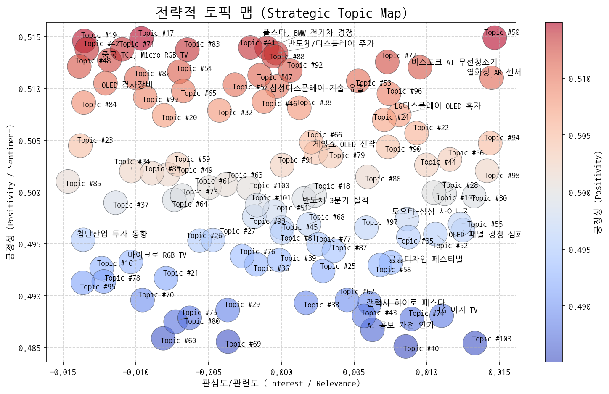
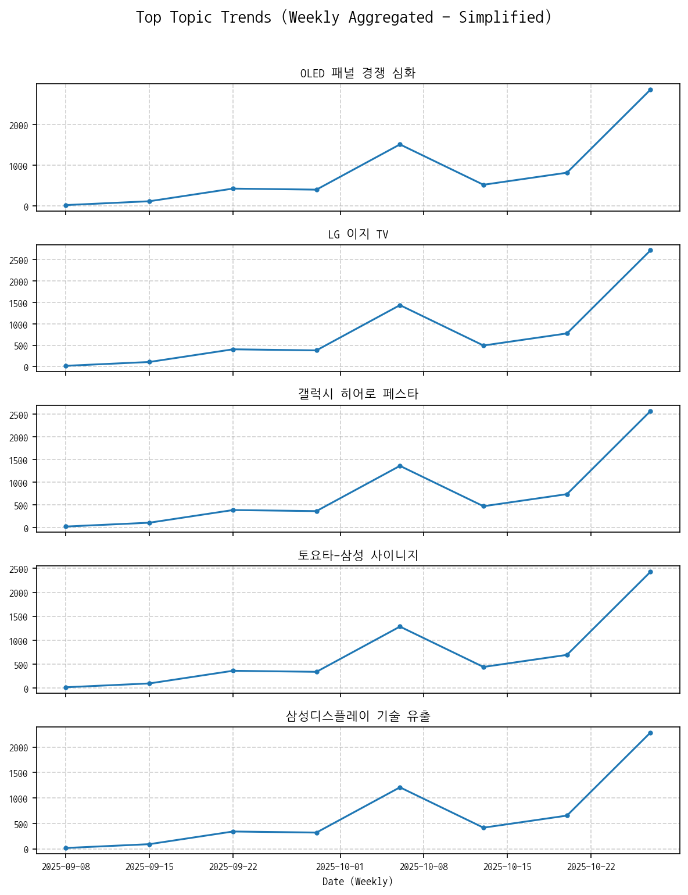
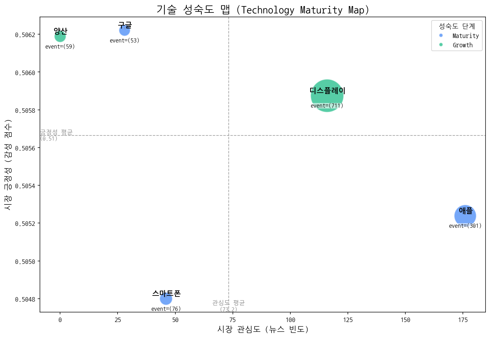
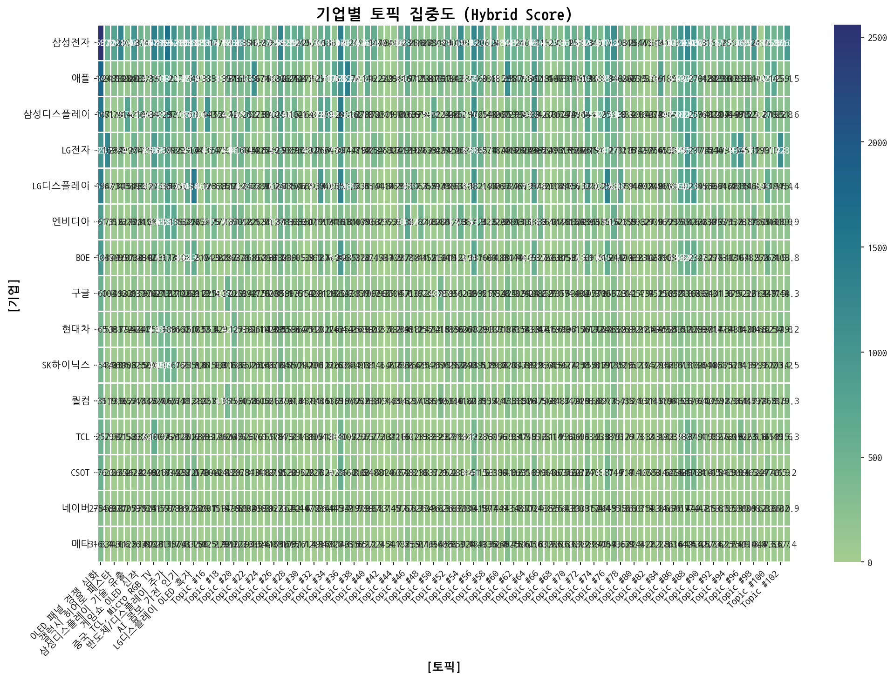
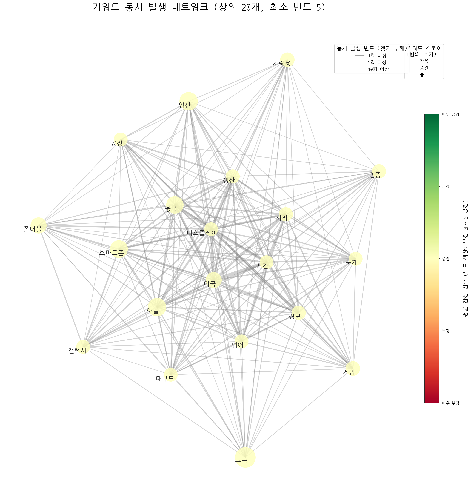
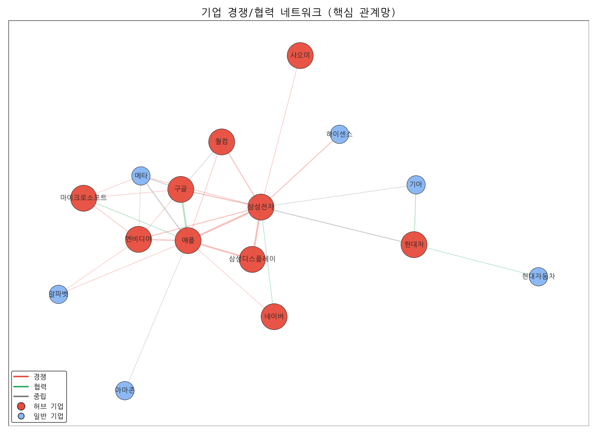
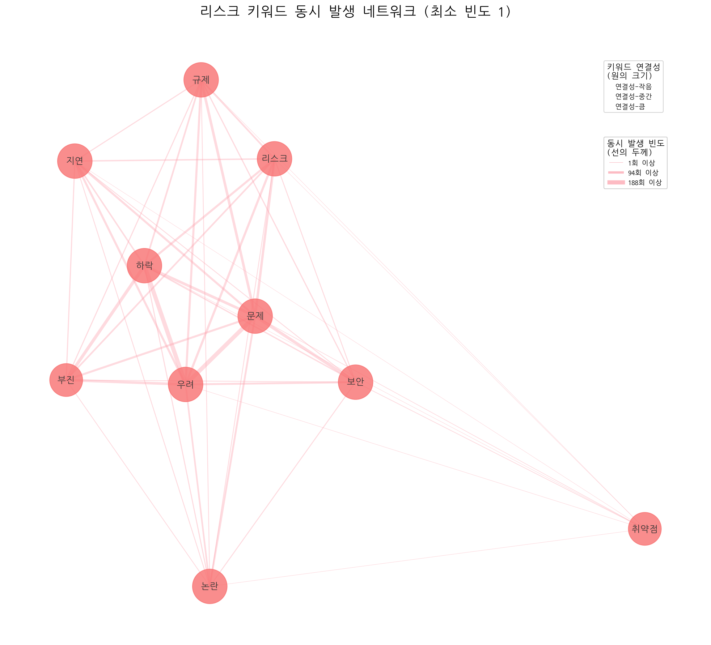
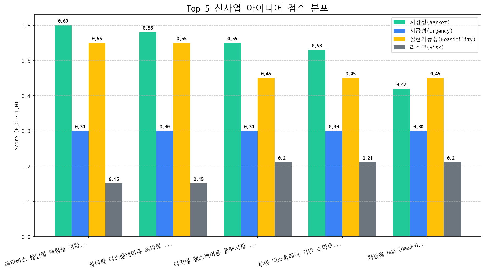

# 월간 상세 해설 리포트

Period: 2025-09-28 ~ 2025-10-27 | Generated by Market Intelligence Team

## Executive Summary

## 월간 전략 보고서 Executive Summary (2025년 9월 28일 ~ 2025년 10월 27일)

**보고 대상:** CEO 및 이사회

**핵심 요약:**

지난 한 달간 시장 분석 결과, **메타버스 몰입형 체험을 위한 초고해상도 VR/AR 디스플레이 모듈** 개발이 가장 유망한 사업 아이디어로 부상했습니다. 아직까지 뚜렷한 위협 요인이나 새로운 기술 동향은 관찰되지 않았지만, 급변하는 시장 상황에 대한 지속적인 모니터링이 필요합니다.

**주요 내용:**

*   **시장 변화:** 메타버스 시장의 성장세가 지속되는 가운데, 사용자들은 더욱 현실감 있는 몰입형 체험을 요구하고 있습니다. 이는 초고해상도 VR/AR 디스플레이 모듈에 대한 수요 증가로 이어질 것으로 예상됩니다.
*   **기회 요인:**
    *   **메타버스 시장 성장:** 메타버스 관련 시장은 지속적으로 성장하고 있으며, 특히 몰입형 체험 관련 기술에 대한 투자가 활발합니다.
    *   **기술적 우위 확보 가능성:** 초고해상도 디스플레이 모듈 개발은 기술적 난이도가 높아 경쟁 우위를 확보할 수 있는 기회입니다.
*   **위협 요인:**
    *   현재까지 뚜렷한 위협 요인은 관찰되지 않았습니다. 다만, 경쟁사의 기술 개발 동향, 관련 규제 변화, 예상치 못한 경제 상황 변동 등에 대한 지속적인 모니터링이 필요합니다.
*   **최우선 전략 방향 (다음 분기):**
    *   **초고해상도 VR/AR 디스플레이 모듈 개발 집중:** 메타버스 시장의 요구에 부응하는 고품질 디스플레이 모듈 개발에 모든 역량을 집중합니다.
    *   **기술 경쟁력 강화:** 핵심 기술 확보를 위한 연구 개발 투자 확대 및 관련 기술 전문가 확보에 주력합니다.
    *   **시장 동향 및 경쟁 환경 모니터링 강화:** 급변하는 시장 상황에 신속하게 대응할 수 있도록 시장 및 경쟁 환경에 대한 지속적인 모니터링 시스템을 구축합니다.

**결론:**

초고해상도 VR/AR 디스플레이 모듈 개발은 회사의 미래 성장 동력 확보에 중요한 기회가 될 수 있습니다. 다음 분기에는 해당 사업 아이디어의 구체적인 실행 계획을 수립하고, 기술 경쟁력 강화 및 시장 모니터링 강화에 집중하여 성공적인 시장 진입을 준비해야 합니다.

**첨부:**

*   월간 시장 분석 보고서 전체 (상세 데이터 및 분석 내용 포함)

## 1. 전략적 시장 포지셔닝 맵

> 시장의 핵심 토픽 지형, 트렌드, 성장률을 통해 거시적인 동향과 기회 영역을 분석합니다.

### 토픽 상세 정보

| 토픽                   | 요약                                                                                               | 핵심 키워드                |
|:---------------------|:-------------------------------------------------------------------------------------------------|:----------------------|
| OLED 패널 경쟁 심화        | 한국 디스플레이 업계 (삼성, LG)와 중국 업계 간의 OLED 패널 기술 경쟁 심화, 특히 AI 스마트폰, 애플 제품 등 차세대 디스플레이 시장에서의 주도권 경쟁을 다룸. | oled, 중국, 디스플레이       |
| LG 이지 TV             | LG전자가 시니어를 위한 '이지 TV'를 출시하고 관련 헬프 기능을 제공하는 내용.                                                   | 시니어, 이지, lg           |
| 갤럭시 히어로 페스타          | 갤럭시 시리즈 할인 행사로, 일반 병사까지 혜택을 받을 수 있는 히어로 페스타 관련 소식.                                               | 히어로, 갤럭시, 할인된         |
| 토요타-삼성 사이니지          | 토요타 자동차 매장 및 전시장에 삼성전자의 사이니지 기술이 적용된 사례 및 디자인 관련 내용.                                             | 사이니지, 토요타, 사이니지를      |
| 삼성디스플레이 기술 유출        | 삼성디스플레이 기술이 중국으로 유출된 혐의로 경찰이 수사 중이며, 산업기술보호법 위반 혐의로 압수수색을 진행했다.                                  | 유출, 삼성디스플레이, 경찰은      |
| 마이크로 RGB TV          | 마이크로 RGB 기술을 적용한 TV 및 관련 컬러, AI 기술 동향.                                                           | rgb, 마이크로 rgb, 마이크로   |
| 게임쇼 OLED 신작          | 도쿄 게임쇼에서 공개된 엔씨소프트의 신작 게임과 OMEN OLED 게이밍 기기의 속도감을 강조하는 내용으로 추정됩니다.                               | 게이밍, 브레이커스, 도쿄게임쇼     |
| 폴스타, BMW 전기차 경쟁      | 폴스타, BMW 등 전기차 브랜드의 SUV, MINI 등 다양한 모델 판매 경쟁과 관련 차량 동향 (전주 GV80 언급)                              | 주행, 폴스타, bmw          |
| 중국 TCL, Micro RGB TV | 중국 TCL이 홍콩에서 프리미엄 마이크로 RGB LED TV를 출시하며 가전 시장 경쟁에 뛰어들었다는 내용으로 추정됩니다.                             | rgb, tv, 중국           |
| 첨단산업 투자 동향           | 반도체, 로봇, 배터리 등 첨단 부품, 소재, 장비 관련 기업들의 사업 확장 및 신규 설립 동향 분석. 거래일 변동과 투자 관련 내용 포함.                   | 반도체, 로봇, 거래일          |
| 반도체/디스플레이 주가         | 한국거래소에서 반도체, 디스플레이, 소재 관련 장비 및 핵심 기술 관련 주가 변동에 대한 시장의 주목을 받고 있다는 내용입니다.                          | 장비, 반도체, 디스플레이        |
| 반도체 3분기 실적           | 3분기 반도체 실적, 특히 파운드리, HBM, D램 등 메모리 반도체 분야의 영업이익과 관련된 내용.                                         | 3분기, 파운드리, hbm        |
| AI 콤보 가전 인기          | 호주에서 소비자들에게 가장 사랑받는 AI 콤보 가전(8K, 비스포크 AI 포함)에 대한 뉴스.                                             | 사랑받는, 가장 사랑받는, 호주     |
| OLED 검사장비            | 탑런에이피솔루션의 OLED 디스플레이 검사장비 양산 및 패턴 검사 관련 내용. 특히 Carrier 시스템 관련 기술이 포함됨.                           | 장비, 검사, 패턴            |
| LG디스플레이 OLED 흑자      | LG디스플레이의 3분기 OLED 패널 수익성 개선 및 실적 흑자 전환 전망을 다룬 내용입니다.                                             | oled, lg디스플레이의, 3분기   |
| 비스포크 AI 무선청소기        | 삼성 비스포크 AI 제트 무선청소기, 특히 400W 성능 모델에 대한 정보 및 청소 기능 관련 토픽.                                         | 청소기, 청소, 무선           |
| Topic #16            | (LLM 해석 실패)                                                                                      | 이재용, 삼성디스플레이, 생산라인을   |
| Topic #17            | (LLM 해석 실패)                                                                                      | ai, ai 팩토리, 팩토리       |
| Topic #18            | (LLM 해석 실패)                                                                                      | 게이밍, rog, 모니터         |
| Topic #19            | (LLM 해석 실패)                                                                                      | xr, 갤럭시, 갤럭시 xr       |
| Topic #20            | (LLM 해석 실패)                                                                                      | 아이디어, 반도체, 전시회        |
| Topic #21            | (LLM 해석 실패)                                                                                      | ai, 에너지, 선보인다         |
| Topic #22            | (LLM 해석 실패)                                                                                      | oled, oled 서밋, 모니터    |
| Topic #23            | (LLM 해석 실패)                                                                                      | 아이폰17, 프로, 아이폰        |
| Topic #24            | (LLM 해석 실패)                                                                                      | 김치냉장고, 정수, 미식컬렉션      |
| Topic #25            | (LLM 해석 실패)                                                                                      | sns, 대한민국 sns, 대한민국   |
| Topic #26            | (LLM 해석 실패)                                                                                      | 머크, 신소재공학과, 학생은       |
| Topic #27            | (LLM 해석 실패)                                                                                      | 2025년, 반도체, 2024년     |
| Topic #28            | (LLM 해석 실패)                                                                                      | re100, 유치, 기업이        |
| Topic #29            | (LLM 해석 실패)                                                                                      | 신뢰성, 복합, 상장           |
| Topic #30            | (LLM 해석 실패)                                                                                      | 퍼플렉시티, tv와, 2025년형    |
| 공공디자인 페스티벌           | 문체부 주최, 국립현대미술관 등 전국에서 열리는 공공디자인 페스티벌(2025 포함) 관련 전시 및 체험 행사 소식. 사회적 의미를 담은 공공디자인 강조.            | 공공디자인, 전시, 문체부        |
| Topic #32            | (LLM 해석 실패)                                                                                      | 디자인, 상을, 레드닷          |
| Topic #33            | (LLM 해석 실패)                                                                                      | 정철동, 디스플레이의, 사장은      |
| Topic #34            | (LLM 해석 실패)                                                                                      | 차량용, iaa, 차량용 oled    |
| Topic #35            | (LLM 해석 실패)                                                                                      | 애플워치, 수면, 운동          |
| Topic #36            | (LLM 해석 실패)                                                                                      | oled, 중국, 6세대         |
| Topic #37            | (LLM 해석 실패)                                                                                      | 아이폰17, 아이폰, 애플        |
| Topic #38            | (LLM 해석 실패)                                                                                      | 패널, 출하량이, 3분기         |
| Topic #39            | (LLM 해석 실패)                                                                                      | 삼성은, 채용, 청년           |
| Topic #40            | (LLM 해석 실패)                                                                                      | 아이폰, 갤럭시, 스마트폰        |
| Topic #41            | (LLM 해석 실패)                                                                                      | 상품을, 선보인다, 브랜드        |
| Topic #42            | (LLM 해석 실패)                                                                                      | 괴수, 스팀, 게임            |
| Topic #43            | (LLM 해석 실패)                                                                                      | ef, 홈프로젝터, 프로젝터       |
| Topic #44            | (LLM 해석 실패)                                                                                      | samsung, display, its |
| Topic #45            | (LLM 해석 실패)                                                                                      | 구광모, 회장은, 사업          |
| Topic #46            | (LLM 해석 실패)                                                                                      | 상승, 트럼프, 미국           |
| Topic #47            | (LLM 해석 실패)                                                                                      | sns, 대한민국 sns, 사람     |
| Topic #48            | (LLM 해석 실패)                                                                                      | apec, ceo, ceo 서밋     |
| Topic #49            | (LLM 해석 실패)                                                                                      | 에센셜, 프로, dell         |

### 토픽 성장/하락 추세

|   topic_id | topic_name      |   momentum_score |
|-----------:|:----------------|-----------------:|
|         33 | Topic #33       |            1.752 |
|         76 | Topic #76       |            1.083 |
|         14 | LG디스플레이 OLED 흑자 |            1.083 |
|         89 | Topic #89       |            0.619 |
|          0 | OLED 패널 경쟁 심화   |            0.515 |
|         36 | Topic #36       |            0.515 |
|         65 | Topic #65       |            0.359 |
|         22 | Topic #22       |            0.307 |
|         16 | Topic #16       |            0.074 |
|          4 | 삼성디스플레이 기술 유출   |            0.074 |
|         50 | Topic #50       |            0     |
|         69 | Topic #69       |            0     |
|         68 | Topic #68       |            0     |
|         67 | 열화상 AR 센서       |            0     |
|         66 | Topic #66       |            0     |
|         53 | Topic #53       |            0     |
|         55 | Topic #55       |            0     |
|         58 | Topic #58       |            0     |
|         64 | Topic #64       |            0     |
|         72 | Topic #72       |            0     |
|         54 | Topic #54       |            0     |
|         63 | Topic #63       |            0     |
|         62 | Topic #62       |            0     |
|         60 | Topic #60       |            0     |
|         59 | Topic #59       |            0     |
|         71 | Topic #71       |            0     |
|         77 | Topic #77       |            0     |
|         74 | Topic #74       |            0     |
|         75 | Topic #75       |            0     |
|        102 | Topic #102      |            0     |
|        101 | Topic #101      |            0     |
|         99 | Topic #99       |            0     |
|         98 | Topic #98       |            0     |
|         95 | Topic #95       |            0     |
|         93 | Topic #93       |            0     |
|         92 | Topic #92       |            0     |
|         91 | Topic #91       |            0     |
|         90 | Topic #90       |            0     |
|         86 | Topic #86       |            0     |
|         85 | Topic #85       |            0     |
|         83 | Topic #83       |            0     |
|         82 | Topic #82       |            0     |
|         81 | Topic #81       |            0     |
|         79 | Topic #79       |            0     |
|         78 | Topic #78       |            0     |
|         48 | Topic #48       |            0     |
|         49 | Topic #49       |            0     |
|         52 | Topic #52       |            0     |
|         47 | Topic #47       |            0     |
|         17 | Topic #17       |            0     |

### 포지셔닝 및 트렌드 종합 해설 (AI)

## 시장 전략 컨설팅 보고서

### 종합 시장 동향 해석

*   **주요 동력 (Driving Force):** 현재 시장의 주요 동력은 크게 **OLED 기술 경쟁 심화**와 **반도체/디스플레이 업황 회복 기대감**으로 볼 수 있습니다.

    *   **OLED 기술 경쟁 심화:** "OLED 패널 경쟁 심화" 토픽은 꾸준히 언급되며, 특히 삼성과 LG를 비롯한 한국 기업과 중국 기업 간의 경쟁 구도가 핵심입니다. AI 스마트폰, 애플 제품 등 차세대 디스플레이 시장을 둘러싼 주도권 경쟁은 지속적인 투자와 기술 혁신을 유도하며 시장 성장을 이끌고 있습니다.
    *   **반도체/디스플레이 업황 회복 기대감:** "반도체/디스플레이 주가", "반도체 3분기 실적", "LG디스플레이 OLED 흑자" 등의 토픽들은 반도체 및 디스플레이 산업의 실적 개선에 대한 기대감을 반영합니다. 특히 LG디스플레이의 OLED 흑자 전환 가능성은 긍정적인 신호로 해석될 수 있으며, 관련 투자 및 기술 개발을 촉진하는 요인이 될 것입니다.
*   **부상하는 기회 (Emerging Opportunity):** 새롭게 부상하는 기회는 **AI 기반 가전제품**과 **특화된 타겟 고객 (시니어)** 시장입니다.

    *   **AI 기반 가전제품:** "AI 콤보 가전 인기"와 "비스포크 AI 무선청소기" 토픽은 AI 기술이 가전 제품에 적용되어 소비자들의 관심을 끌고 있음을 보여줍니다. 8K 해상도, 맞춤형 기능, 고성능 등의 특징을 가진 AI 가전은 프리미엄 시장을 중심으로 성장 가능성이 높습니다.
    *   **특화된 타겟 고객 (시니어):** "LG 이지 TV" 토픽은 시니어 고객을 위한 맞춤형 제품 출시를 의미합니다. 고령화 사회로 진입하면서 시니어 시장의 중요성이 커지고 있으며, 이들을 위한 편리하고 사용하기 쉬운 제품과 서비스에 대한 수요가 증가할 것으로 예상됩니다.

### 전략적 제언

*   **집중 영역 (Focus Areas):**
    *   **OLED 기술 경쟁력 강화:** OLED 패널 기술 경쟁에서 우위를 확보하기 위해 차세대 디스플레이 기술 (예: Micro RGB) 개발 및 투자에 집중해야 합니다. 특히 AI 스마트폰, AR/VR 기기 등 고성능 디스플레이 수요가 높은 시장을 타겟으로 기술 개발 방향을 설정하는 것이 중요합니다. 또한, "OLED 검사장비" 토픽에서 언급된 검사장비 기술 역시 OLED 패널 품질 향상에 필수적이므로, 관련 기술 확보에도 노력을 기울여야 합니다.
    *   **AI 가전 제품 포트폴리오 확장:** AI 기술을 접목한 가전 제품 라인업을 확장하고, AI 기반 맞춤형 기능 및 사용자 경험을 강화해야 합니다. 특히 "비스포크 AI 무선청소기"와 같은 특정 제품의 성공 사례를 분석하여, 다른 가전 제품에도 AI 기능을 효과적으로 적용할 수 있도록 노력해야 합니다.

*   **모니터링 영역 (Monitoring Areas):**
    *   **기술 유출 리스크 관리:** "삼성디스플레이 기술 유출" 토픽에서 알 수 있듯이, 기술 유출은 기업의 경쟁력을 약화시키는 심각한 문제입니다. 보안 시스템 강화, 임직원 교육 강화 등 기술 유출 방지를 위한 노력을 지속적으로 기울여야 합니다.
    *   **중국 경쟁 업체 동향:** "중국 TCL, Micro RGB TV" 토픽은 중국 업체의 기술력 향상과 시장 진출 확대를 보여줍니다. 중국 업체의 기술 개발 동향, 시장 전략 등을 꾸준히 모니터링하고, 경쟁 우위를 유지하기 위한 차별화 전략을 수립해야 합니다.
    *   **LLM 해석 실패 토픽:** "Topic #16"에서 "#60" 및 기타 LLM 해석에 실패한 토픽들은 추가적인 데이터 확보 및 분석을 통해 숨겨진 시장 동향을 파악해야 합니다. 이러한 토픽들은 현재 중요하지 않거나 노이즈로 판단될 수 있지만, 잠재적인 기회 또는 위협 요소를 내포하고 있을 가능성이 있습니다.

**추가 제언:**

*   LLM 해석 실패 토픽들을 해결하기 위해 데이터 수집 방법 개선, LLM 모델 재학습 또는 교체, 추가적인 전문가 검토 등의 방법을 고려해야 합니다.
*   "공공디자인 페스티벌"과 같은 디자인 관련 토픽은 장기적인 관점에서 브랜드 이미지 개선 및 사회적 책임 활동 강화에 활용할 수 있습니다.
*   "열화상 AR 센서"와 같은 새로운 기술 트렌드는 미래 시장 변화를 예측하고 새로운 사업 기회를 발굴하는 데 도움이 될 수 있습니다.

## 2. 기술 수명 주기 및 R&D 투자 타이밍 분석

> 주요 기술의 시장 성숙도 단계를 진단하고, R&D 및 사업화 투자 시점을 판단합니다.

| 기술    | 단계       | 판단 근거                                                                                |
|:------|:---------|:-------------------------------------------------------------------------------------|
| 애플    | Maturity | 출시 이벤트가 잦고 투자 빈도가 높은 반면, 수주 빈도가 낮으며 뉴스 언급 빈도와 시장 감성 점수가 중간 수준이므로 성숙기에 접어든 것으로 판단됩니다. |
| 양산    | Growth   | 뉴스 언급은 없지만, 투자, 출시, 수주 이벤트가 비교적 활발하게 발생하고 시장 감성 점수가 중간 수준이므로 성장기에 있다고 판단됩니다.         |
| 스마트폰  | Maturity | 스마트폰은 뉴스 언급 빈도가 비교적 낮고 시장 감성 점수도 중간 수준이며, 출시 이벤트가 투자를 압도하는 것으로 보아 성숙기에 접어들었다고 판단됩니다. |
| 디스플레이 | Growth   | 높은 투자 및 출시 건수와 비교적 낮은 수주 건수는 디스플레이 기술이 성장기에 진입하여 시장 확장을 위한 활발한 활동이 이루어지고 있음을 시사합니다.  |
| 구글    | Maturity | 구글은 뉴스 언급 빈도가 낮지 않지만 시장 감성 점수가 중간 수준이고 출시 이벤트가 많아 성숙 단계에 접어든 기술로 판단됩니다.              |

## 3. 경쟁사 전략적 의도 및 파트너 관계망 분석

> 경쟁사의 토픽 집중도와 키워드 연관성, 기업 간 관계망을 통해 경쟁 구도와 전략을 분석합니다.

### 기업-토픽 집중도

#### 집중도 매트릭스 (상위 5개사)

| org   | topic_0     |   topic_1 | topic_10    |   topic_100 | topic_102   |   topic_103 | topic_11    |   topic_12 |   topic_13 |   topic_14 |   topic_16 |   topic_17 | topic_18   |   topic_19 |   topic_20 |   topic_21 | topic_22   |   topic_23 |   topic_25 |   topic_26 | topic_27   |   topic_28 |   topic_29 |   topic_3 |   topic_30 |   topic_31 |   topic_33 | topic_34   | topic_36   |   topic_37 |   topic_38 |   topic_4 |   topic_40 |   topic_41 |   topic_42 |   topic_44 |   topic_45 | topic_46    |   topic_47 |   topic_48 |   topic_49 |   topic_5 |   topic_51 |   topic_52 |   topic_53 |   topic_54 | topic_56   | topic_57    |   topic_59 | topic_6    |   topic_60 |   topic_61 |   topic_62 |   topic_63 |   topic_64 | topic_65   | topic_66    |   topic_68 |   topic_69 | topic_7     |   topic_70 |   topic_71 | topic_73   |   topic_74 |   topic_75 | topic_76   | topic_77    |   topic_78 | topic_8    | topic_80     |   topic_81 |   topic_84 |   topic_85 |   topic_86 | topic_87   | topic_88   | topic_89   | topic_9    |   topic_90 |   topic_91 |   topic_92 |   topic_93 |   topic_94 |   topic_95 |   topic_96 |   topic_98 |   topic_99 |
|:------|:------------|----------:|:------------|------------:|:------------|------------:|:------------|-----------:|-----------:|-----------:|-----------:|-----------:|:-----------|-----------:|-----------:|-----------:|:-----------|-----------:|-----------:|-----------:|:-----------|-----------:|-----------:|----------:|-----------:|-----------:|-----------:|:-----------|:-----------|-----------:|-----------:|----------:|-----------:|-----------:|-----------:|-----------:|-----------:|:------------|-----------:|-----------:|-----------:|----------:|-----------:|-----------:|-----------:|-----------:|:-----------|:------------|-----------:|:-----------|-----------:|-----------:|-----------:|-----------:|-----------:|:-----------|:------------|-----------:|-----------:|:------------|-----------:|-----------:|:-----------|-----------:|-----------:|:-----------|:------------|-----------:|:-----------|:-------------|-----------:|-----------:|-----------:|-----------:|:-----------|:-----------|:-----------|:-----------|-----------:|-----------:|-----------:|-----------:|-----------:|-----------:|-----------:|-----------:|-----------:|
| AMD   | 232.90 (1%) |       nan | 179.45 (2%) |         nan | nan         |         nan | 164.90 (3%) |        nan |        nan |        nan |        nan |        nan | nan        |        nan |        nan |        nan | nan        |        nan |        nan |        nan | nan        |        nan |        nan |       nan |        nan |        nan |        nan | nan        | nan        |        nan |        nan |       nan |        nan |        nan |        nan |        nan |        nan | 197.42 (3%) |        nan |        nan |        nan |       nan |        nan |        nan |        nan |        nan | nan        | 145.93 (2%) |        nan | nan        |        nan |        nan |        nan |        nan |        nan | nan        | 130.48 (3%) |        nan |        nan | nan         |        nan |        nan | nan        |        nan |        nan | nan        | 147.71 (2%) |        nan | nan        | 286.71 (13%) |        nan |        nan |        nan |        nan | nan        | nan        | nan        | nan        |        nan |        nan |        nan |        nan |        nan |        nan |        nan |        nan |        nan |
| ASUS  | 79.02 (0%)  |       nan | nan         |         nan | nan         |         nan | nan         |        nan |        nan |        nan |        nan |        nan | 68.47 (6%) |        nan |        nan |        nan | 62.29 (1%) |        nan |        nan |        nan | 39.80 (0%) |        nan |        nan |       nan |        nan |        nan |        nan | nan        | 58.72 (0%) |        nan |        nan |       nan |        nan |        nan |        nan |        nan |        nan | nan         |        nan |        nan |        nan |       nan |        nan |        nan |        nan |        nan | nan        | nan         |        nan | 48.61 (1%) |        nan |        nan |        nan |        nan |        nan | 47.11 (1%) | nan         |        nan |        nan | nan         |        nan |        nan | nan        |        nan |        nan | nan        | nan         |        nan | nan        | nan          |        nan |        nan |        nan |        nan | nan        | 44.22 (0%) | nan        | nan        |        nan |        nan |        nan |        nan |        nan |        nan |        nan |        nan |        nan |
| AUO   | 49.21 (0%)  |       nan | 30.72 (0%)  |         nan | nan         |         nan | nan         |        nan |        nan |        nan |        nan |        nan | nan        |        nan |        nan |        nan | nan        |        nan |        nan |        nan | nan        |        nan |        nan |       nan |        nan |        nan |        nan | nan        | 46.39 (0%) |        nan |        nan |       nan |        nan |        nan |        nan |        nan |        nan | nan         |        nan |        nan |        nan |       nan |        nan |        nan |        nan |        nan | 29.27 (0%) | nan         |        nan | nan        |        nan |        nan |        nan |        nan |        nan | nan        | nan         |        nan |        nan | nan         |        nan |        nan | nan        |        nan |        nan | 30.68 (0%) | nan         |        nan | 30.45 (0%) | nan          |        nan |        nan |        nan |        nan | nan        | 33.35 (0%) | 32.62 (0%) | nan        |        nan |        nan |        nan |        nan |        nan |        nan |        nan |        nan |        nan |
| Acer  | 59.61 (0%)  |       nan | 30.72 (0%)  |         nan | nan         |         nan | nan         |        nan |        nan |        nan |        nan |        nan | nan        |        nan |        nan |        nan | 52.17 (1%) |        nan |        nan |        nan | nan        |        nan |        nan |       nan |        nan |        nan |        nan | 38.42 (1%) | 40.59 (0%) |        nan |        nan |       nan |        nan |        nan |        nan |        nan |        nan | nan         |        nan |        nan |        nan |       nan |        nan |        nan |        nan |        nan | 32.84 (0%) | nan         |        nan | nan        |        nan |        nan |        nan |        nan |        nan | nan        | nan         |        nan |        nan | nan         |        nan |        nan | 31.17 (0%) |        nan |        nan | nan        | nan         |        nan | nan        | nan          |        nan |        nan |        nan |        nan | 31.42 (0%) | nan        | nan        | nan        |        nan |        nan |        nan |        nan |        nan |        nan |        nan |        nan |        nan |
| BMW   | 85.26 (0%)  |       nan | 75.41 (1%)  |         nan | 75.53 (2%)  |         nan | nan         |        nan |        nan |        nan |        nan |        nan | nan        |        nan |        nan |        nan | nan        |        nan |        nan |        nan | nan        |        nan |        nan |       nan |        nan |        nan |        nan | 66.69 (1%) | 59.44 (0%) |        nan |        nan |       nan |        nan |        nan |        nan |        nan |        nan | nan         |        nan |        nan |        nan |       nan |        nan |        nan |        nan |        nan | 63.54 (1%) | nan         |        nan | nan        |        nan |        nan |        nan |        nan |        nan | nan        | nan         |        nan |        nan | 125.37 (5%) |        nan |        nan | nan        |        nan |        nan | nan        | nan         |        nan | nan        | nan          |        nan |        nan |        nan |        nan | nan        | nan        | nan        | 75.97 (1%) |        nan |        nan |        nan |        nan |        nan |        nan |        nan |        nan |        nan |

### 키워드 및 기업 관계망

#### 주요 기업 관계 Top 5

| 기업1     | 기업2   |   관계강도(언급빈도) | 관계유형(추정)    |
|:--------|:------|-------------:|:------------|
| 삼성전자    | 애플    |          375 | rivalry     |
| 삼성디스플레이 | 삼성전자  |          268 | rivalry     |
| 구글      | 애플    |          254 | partnership |
| 삼성디스플레이 | 애플    |          243 | rivalry     |
| 애플      | 엔비디아  |          165 | rivalry     |

#### Top 3 경쟁사 전략 방향성 해석 (AI)

| 기업      | 핵심 집중 토픽                               | 전략 방향성 해석                                                                                                                                                   |
|:--------|:---------------------------------------|:------------------------------------------------------------------------------------------------------------------------------------------------------------|
| 삼성전자    | OLED 패널 경쟁 심화, 반도체/디스플레이 주가, Topic #36 | 삼성전자는 OLED 패널 시장 경쟁 심화에 대응하며 반도체 및 디스플레이 사업의 주가 부양을 위해 기술 경쟁력 강화 및 수익성 개선에 집중하고 있으며, 추가적인 핵심 사업 전략 (Topic #36)을 통해 미래 성장 동력을 확보하고자 노력하고 있습니다.               |
| 애플      | OLED 패널 경쟁 심화, Topic #37, Topic #61    | 애플은 OLED 패널 시장 경쟁 심화에 대응하며, Topic #37과 #61을 통해 새로운 성장 동력을 모색하고 기술 경쟁력 우위를 확보하려는 단기 전략을 추진하고 있습니다. 이는 기존 주력 제품 외 신규 사업 분야 확장을 위한 투자 및 연구 개발에 집중하고 있음을 시사합니다. |
| 삼성디스플레이 | OLED 패널 경쟁 심화, Topic #36, Topic #56    | 삼성디스플레이는 OLED 패널 시장 경쟁 심화에 대응하기 위해 새로운 사업 모델 (Topic #36, #56)을 모색하며, 차세대 디스플레이 기술 개발 및 사업 다각화를 통해 경쟁 우위를 확보하고 수익성을 개선하려는 전략을 추진하고 있습니다.                     |

## 4. 전략적 리스크 관리 및 완화 액션 제안

> 데이터 기반으로 탐지된 주요 리스크와 관련 시그널을 분석하고, 대응 방안을 제시합니다.

### 리스크 관련 시그널 시각화

### 탐지된 주요 리스크 목록

> - 데이터 없음

### 리스크 종합 평가 및 대응 제안 (AI)

> 분석할 리스크 데이터가 없습니다.

## 5. 데이터 기반 신사업 아이디어 제안

> 시장 데이터 분석을 통해 도출된 Top 5 신사업 아이디어와 각 아이디어의 사업성을 평가합니다.

| 아이디어                                  | 가치 제안                                                                                                                                                                   |   총점 |
|:--------------------------------------|:------------------------------------------------------------------------------------------------------------------------------------------------------------------------|-----:|
| 메타버스 몰입형 체험을 위한 초고해상도 VR/AR 디스플레이 모듈  | 기존 VR/AR 디스플레이 대비 압도적인 해상도와 시야각을 제공하여 몰입감 넘치는 메타버스 경험을 제공하고, 당사의 디스플레이 기술을 활용하여 초소형, 고효율 디스플레이 모듈을 개발하여 VR/AR 기기의 경량화 및 휴대성을 향상시킨다.                                     |  4.2 |
| 폴더블 디스플레이용 초박형 유리 (UTG) 대체 소재 개발 및 양산 | 당사의 디스플레이 공정 기술을 활용하여 UTG 대비 뛰어난 유연성, 내구성, 가격 경쟁력을 갖춘 새로운 폴더블 디스플레이용 소재를 개발하고, 기존 UTG 공급망에 대한 의존도를 낮춰 고객사의 원가 절감 및 제품 경쟁력 강화에 기여한다.                                     |  4.1 |
| 디지털 헬스케어용 플렉서블 디스플레이 솔루션              | 피부 부착형 웨어러블 기기에 최적화된 초경량, 초박형 플렉서블 디스플레이를 제공하여 착용감을 극대화하고, 실시간 생체 신호 모니터링 및 데이터 시각화를 통해 사용자 편의성을 향상시킨다. 또한, 당사의 디스플레이 기술을 활용하여 고해상도, 저전력 특성을 구현한다.                      |  3.5 |
| 투명 디스플레이 기반 스마트 윈도우 솔루션               | 투명 디스플레이를 창문에 적용하여 에너지 절감 효과를 높이고, 날씨 정보, 광고, 뉴스 등 다양한 정보를 제공하는 스마트 윈도우 솔루션을 제공한다. 당사의 투명 디스플레이 제조 기술을 활용하여 높은 투명도와 선명한 화질을 동시에 구현하며, 건물 외관 디자인을 해치지 않는 심미적인 디자인을 제공한다. |  3.4 |
| 차량용 HUD (Head-Up Display) 증강현실 솔루션    | 기존 AR HUD 대비 넓은 시야각, 고휘도, 고해상도를 제공하는 동시에, 당사의 디스플레이 제조 기술을 활용하여 가격 경쟁력을 확보하고, 운전자 맞춤형 정보 제공 및 직관적인 AR 인터페이스를 제공하여 안전 운전을 지원한다.                                          |  3.1 |

## 6. Top 1 신사업 아이디어 검증 (향후 2주 실행 계획)

> 가장 우선순위가 높은 신사업 아이디어를 검증하기 위한 구체적인 실행 계획을 제시합니다.

| Hypothesis                                                                                              | Target                                                       | KPI                                                               | Owner   | Due        |
|:--------------------------------------------------------------------------------------------------------|:-------------------------------------------------------------|:------------------------------------------------------------------|:--------|:-----------|
| VR/AR 기기 제조사들은 현재 해상도보다 높은 초고해상도 디스플레이 모듈에 대한 구체적인 기술 요구사항과 가격 수준을 가지고 있다.                              | VR/AR 기기 제조사 (Oculus, HTC, Sony)의 제품 개발 및 구매 담당자 5명 이상 인터뷰   | 인터뷰 대상 중 3명 이상으로부터 초고해상도 디스플레이 모듈의 기술 스펙, 성능, 가격에 대한 요구사항 확보      | 사업개발팀   | 2025-11-10 |
| Micro OLED/LED 기반 초고해상도 디스플레이 모듈 개발 및 양산 가능성을 기술적으로 검증할 수 있으며, 시제품 제작에 필요한 예상 비용과 기간을 산정할 수 있다.         | 디스플레이 개발 및 생산 관련 기술 전문가 3명 이상 자문 및 기술 자료 검토                  | Micro OLED/LED 기반 초고해상도 디스플레이 모듈의 개발 로드맵, 시제품 제작 비용 및 기간 산정 결과 확보 | 기술기획팀   | 2025-11-10 |
| 메타버스 플랫폼 사업자들은 자체 플랫폼 내 몰입형 VR/AR 경험 제공을 위해 초고해상도 디스플레이 모듈의 도입을 고려하고 있으며, 콘텐츠 호환성 및 최적화에 대한 요구사항이 존재한다. | 메타버스 플랫폼 사업자 (Meta, Microsoft)의 기술 제휴 및 콘텐츠 개발 담당자 3명 이상 인터뷰 | 인터뷰 대상 중 2명 이상으로부터 자사 메타버스 플랫폼과의 연동 및 콘텐츠 최적화에 대한 구체적인 요구사항 확보    | 사업개발팀   | 2025-11-10 |
