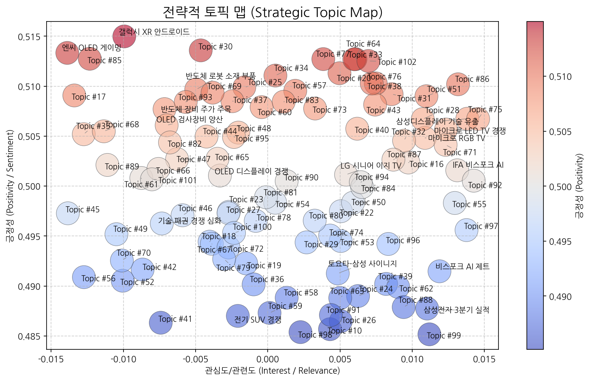
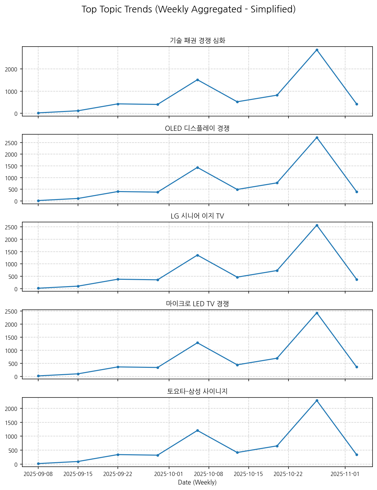
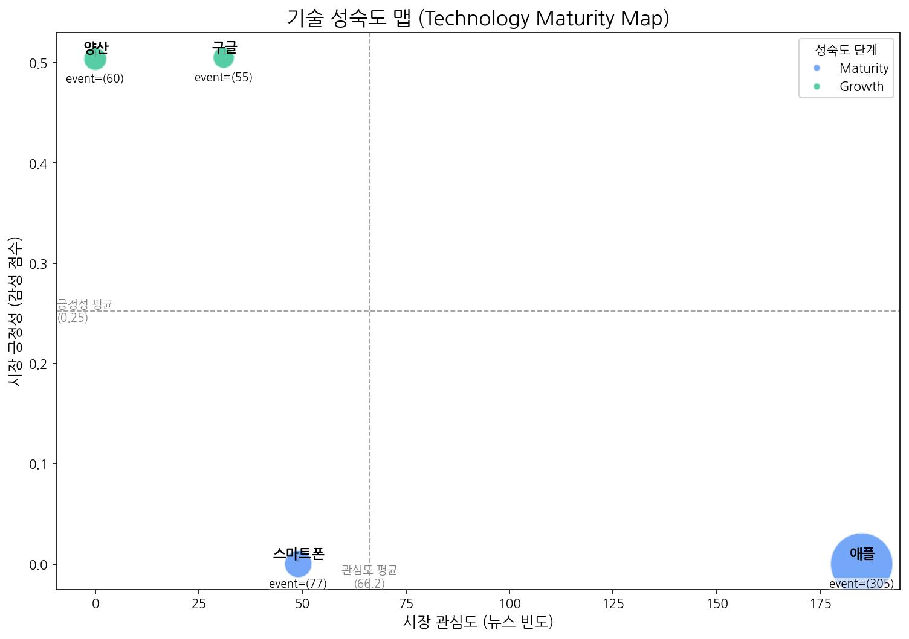
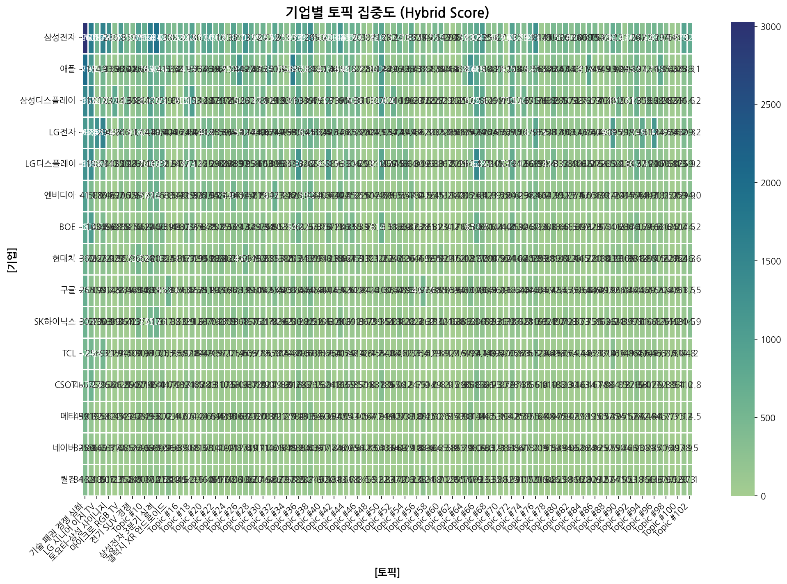
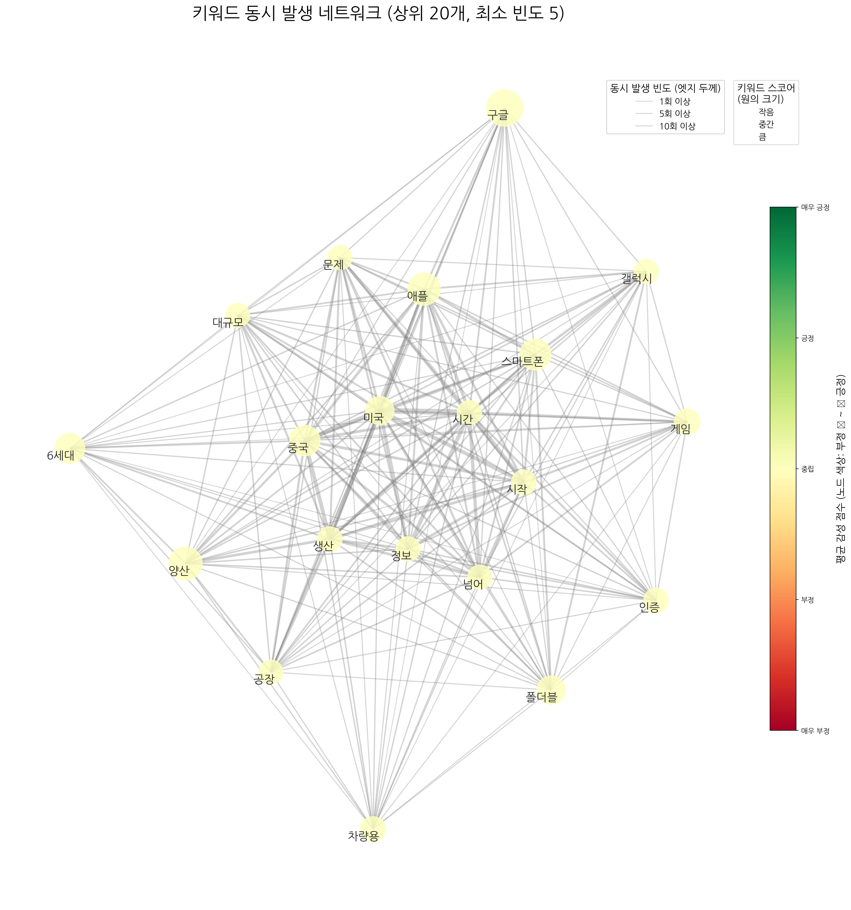
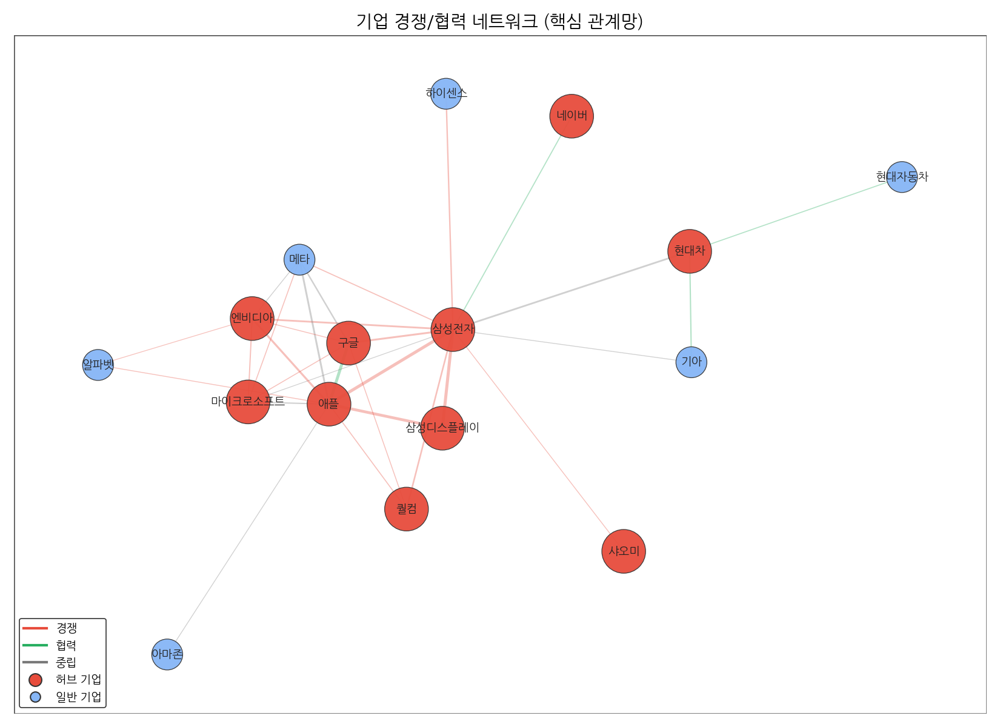
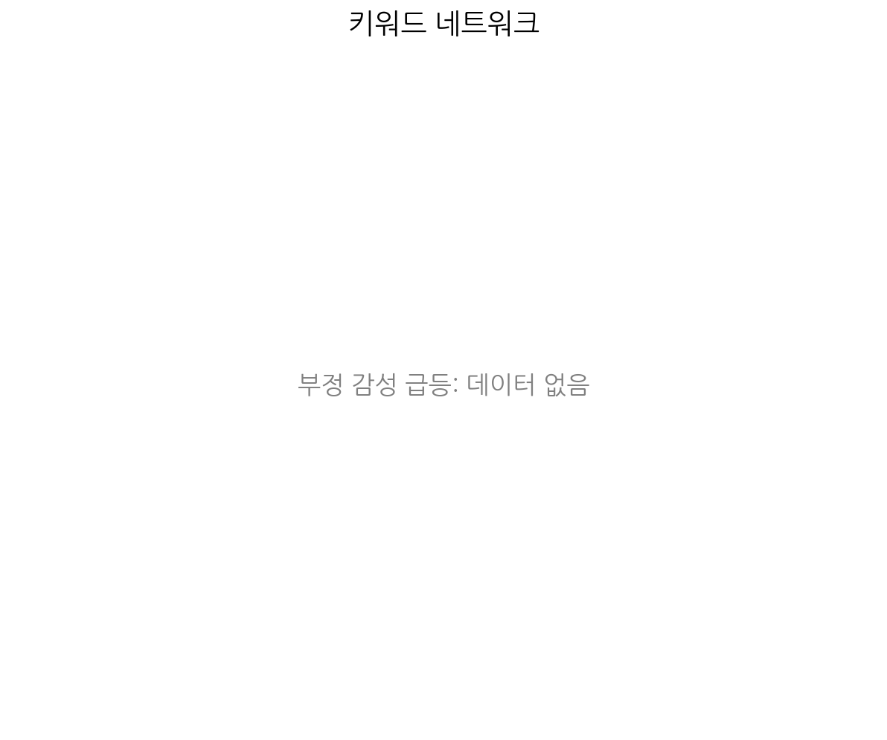
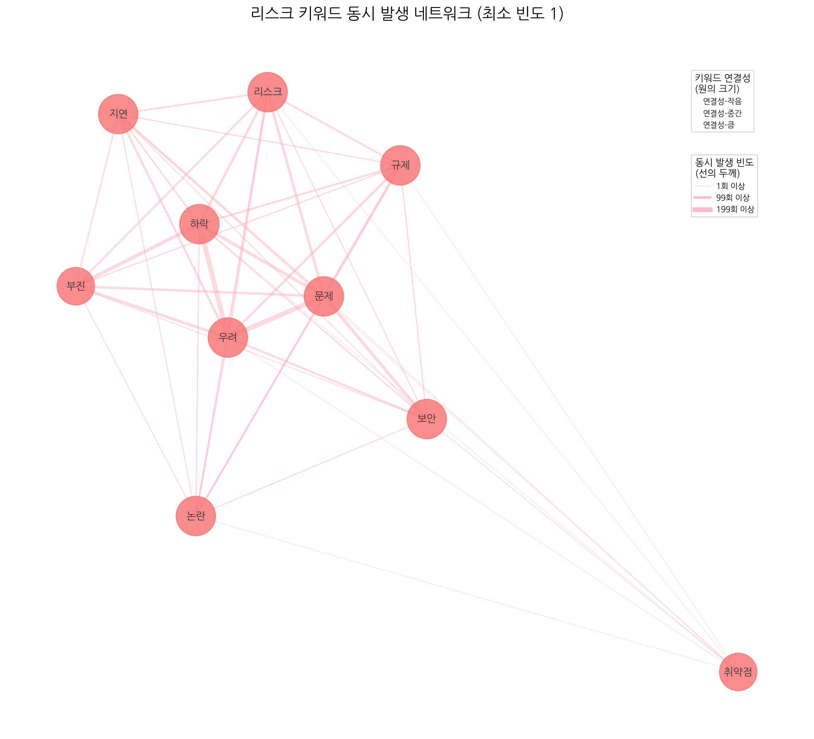
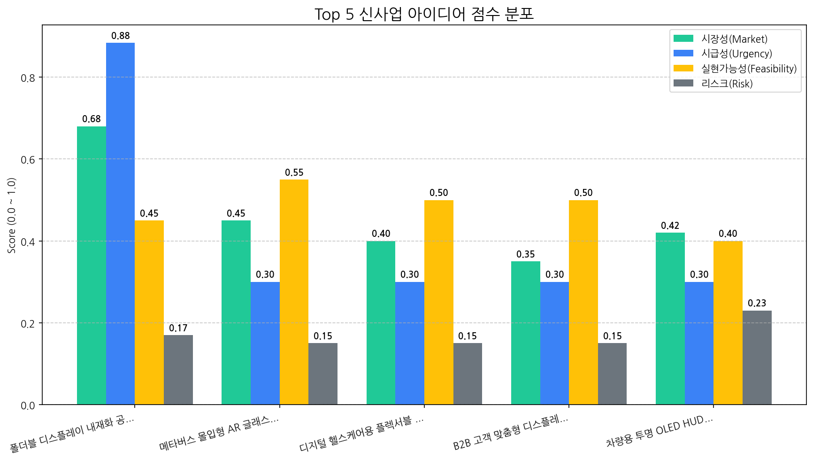

# 월간 상세 해설 리포트

Period: 2025-09-29 ~ 2025-10-28 | Generated by Market Intelligence Team

## Executive Summary

## 월간 전략 보고서 Executive Summary (2025년 9월 29일 ~ 2025년 10월 28일)

**개요:**

본 보고서는 2025년 9월 29일부터 2025년 10월 28일까지의 시장 분석 결과를 요약한 내용입니다. 지난 한 달간 시장 동향을 파악하고, 당사에 중요한 기회와 위협 요인을 식별하여, 다음 분기에 집중해야 할 최우선 전략 방향을 제시합니다.

**핵심 변화:**

*   **새로운 비즈니스 기회 발견:** 폴더블 디스플레이 시장의 성장과 더불어, 당사의 전문성을 활용하여 **폴더블 디스플레이 내재화 공정 기술 컨설팅 서비스**를 제공하는 것이 가장 유망한 비즈니스 아이디어로 부상했습니다. 이는 디스플레이 기술 역량을 강화하고 새로운 수익원을 창출할 수 있는 기회입니다.

**기회 및 위협 요인:**

*   **기회:**
    *   **폴더블 디스플레이 시장 성장:** 폴더블 디스플레이 시장의 지속적인 성장은 당사의 폴더블 디스플레이 관련 기술 및 컨설팅 서비스에 대한 수요 증가로 이어질 수 있습니다.
    *   **내재화 니즈 증가:** 디스플레이 제조사들의 내재화 니즈 증가는 당사의 전문적인 컨설팅 서비스에 대한 높은 수요를 창출할 가능성이 있습니다.
*   **위협 요인:**
    *   현재까지는 식별된 **뚜렷한 위협 요인이 없습니다 (N/A)**. 하지만, 경쟁 심화, 예상치 못한 기술 변화, 거시 경제 변동 등의 잠재적 위협 요인을 지속적으로 모니터링해야 합니다.

**다음 분기 최우선 전략 방향:**

1.  **폴더블 디스플레이 내재화 공정 기술 컨설팅 서비스 집중:** 최고 비즈니스 아이디어로 선정된 폴더블 디스플레이 내재화 공정 기술 컨설팅 서비스의 구체적인 사업 계획을 수립하고, 초기 고객 확보를 위한 마케팅 전략을 실행합니다.
2.  **시장 및 경쟁 환경 모니터링 강화:** 식별된 위협 요인이 없는 상황이지만, 잠재적인 위협 요인을 지속적으로 모니터링하고, 경쟁사 동향을 주시하며, 기술 변화에 대한 대비책을 마련합니다.
3.  **미래 기술 트렌드 조사 및 분석:** **N/A**로 표시된 Emerging Tech 분야에 대한 지속적인 조사를 통해 미래 기술 트렌드를 파악하고, 새로운 성장 동력을 발굴하기 위한 노력을 기울입니다.

**결론:**

새로운 비즈니스 기회를 적극적으로 활용하고 잠재적인 위협 요인에 대한 지속적인 대비를 통해, 당사는 폴더블 디스플레이 시장에서 경쟁 우위를 확보하고 지속적인 성장을 달성할 수 있을 것입니다.

## 1. 전략적 시장 포지셔닝 맵

> 시장의 핵심 토픽 지형, 트렌드, 성장률을 통해 거시적인 동향과 기회 영역을 분석합니다.

### 토픽 상세 정보

| 토픽             | 요약                                                                                                       | 핵심 키워드                 |
|:---------------|:---------------------------------------------------------------------------------------------------------|:-----------------------|
| 기술 패권 경쟁 심화    | OLED 디스플레이, AI, 스마트폰, 반도체 기술을 중심으로 미중 기술 패권 경쟁이 심화되는 가운데 삼성, 애플 등 주요 기업들의 전략 변화를 다루는 내용입니다.              | oled, 중국, 디스플레이        |
| OLED 디스플레이 경쟁  | 중국 BOE의 OLED 투자 확대로 한국과 중국 간 디스플레이, 특히 TV용 OLED 패널 시장 경쟁 심화 가능성을 다룸. LCD 기술과 함께 차세대 디스플레이 시장 주도권 다툼을 전망. | oled, 중국, 디스플레이        |
| LG 시니어 이지 TV   | LG전자가 시니어를 위한 이지 TV를 출시하고, 관련 헬프 기능 등을 제공하는 것에 대한 뉴스.                                                    | 시니어, 이지, lg            |
| 마이크로 LED TV 경쟁 | LG전자와 중국 업체의 프리미엄 마이크로 LED TV 기술 경쟁 및 시장 동향을 다룸. RGB LED와 LCD 기술 비교도 포함.                                 | tv, rgb, 중국            |
| 토요타-삼성 사이니지    | 토요타 자동차 매장 및 전시장에 삼성전자의 사이니지 기술이 적용된 사례 및 디자인 관련 뉴스.                                                     | 사이니지, 토요타, 사이니지를       |
| 삼성디스플레이 기술 유출  | 경찰이 삼성디스플레이 기술을 중국으로 유출한 혐의로 관련자를 수사하고 압수수색을 진행 중이며, 산업기술보호법 위반 혐의가 적용된 것으로 보입니다.                        | 유출, 삼성디스플레이, 경찰은       |
| 마이크로 RGB TV    | 차세대 디스플레이 기술인 마이크로 RGB를 적용한 TV와 관련된 정보 (컬러, AI 등 포함)                                                     | rgb, 마이크로 rgb, 마이크로    |
| 엔씨 OLED 게이밍    | 엔씨소프트 신작 게임과 도쿄게임쇼, OMEN OLED 게이밍 모니터를 통해 속도감 있는 게이밍 경험을 제공하는 브레이커스 관련 소식.                               | 게이밍, 브레이커스, 도쿄게임쇼      |
| 전기 SUV 경쟁      | 폴스타, AMG 등 다양한 브랜드의 전기 SUV 모델 출시 및 판매 경쟁 상황, GV80, MINI 등 경쟁 차종 언급. 전주 관련 내용 포함.                         | 주행, 폴스타, suv           |
| 반도체 로봇 소재 부품   | 반도체, 로봇 산업과 관련된 기업들의 소재, 부품, 장비, 배터리 사업 및 거래일 동향 분석.                                                     | 반도체, 로봇, 거래일           |
| Topic #10      | (LLM 해석 실패)                                                                                              | 히어로, 갤럭시, 할인           |
| 반도체 장비 주가 주목   | 한국거래소에서 반도체, 디스플레이, 소재 관련 장비 및 핵심 기술을 보유한 기업의 주가가 주목받고 있음을 나타낸다.                                         | 장비, 반도체, 디스플레이         |
| 삼성전자 3분기 실적    | 삼성전자의 3분기 실적, 특히 반도체(HBM, D램, 파운드리) 및 메모리 사업 부문의 영업이익 관련 내용을 다룬다.                                        | 3분기, hbm, 실적           |
| OLED 검사장비 양산   | 탑런에이피솔루션의 OLED 디스플레이 검사장비 양산 및 관련 패턴 검사 기술 동향 분석.                                                        | 장비, 검사, 패턴             |
| 갤럭시 XR 안드로이드   | 삼성 갤럭시의 XR 기기(헤드셋)에 안드로이드 운영체제와 구글 기술을 활용한 멀티모달 경험 제공에 대한 내용입니다.                                         | xr, 갤럭시, 갤럭시 xr        |
| 비스포크 AI 제트     | 삼성 비스포크 AI 제트 무선 청소기, 400W 스틱 청소기 등 관련 제품 및 기능(AI)에 대한 정보.                                               | 청소기, 청소, 무선            |
| Topic #16      | (LLM 해석 실패)                                                                                              | 히어로, 히어로 페스타, 페스타      |
| Topic #17      | (LLM 해석 실패)                                                                                              | oled, oled 서밋, 모니터     |
| Topic #18      | (LLM 해석 실패)                                                                                              | 이재용, 삼성디스플레이, 생산라인을    |
| Topic #19      | (LLM 해석 실패)                                                                                              | 게이밍, 모니터, rog          |
| Topic #20      | (LLM 해석 실패)                                                                                              | ai, ai 팩토리, 팩토리        |
| IFA 비스포크 AI    | IFA에서 공개된 삼성 비스포크 AI 가전 및 관련 AI 에너지 절감 기술, 미래 비전 등을 다룬 내용. 수면 관련 기술도 포함.                                 | ai, 에너지, 선보인다          |
| Topic #22      | (LLM 해석 실패)                                                                                              | 사랑받는, 가장 사랑받는, most    |
| Topic #23      | (LLM 해석 실패)                                                                                              | re100, 아산, 기업이         |
| Topic #24      | (LLM 해석 실패)                                                                                              | 김치냉장고, 정수, 보관          |
| Topic #25      | (LLM 해석 실패)                                                                                              | 코스피, 실적, 외국인           |
| Topic #26      | (LLM 해석 실패)                                                                                              | 아이폰17, 프로, 아이폰         |
| Topic #27      | (LLM 해석 실패)                                                                                              | 인도, 반도체, fix           |
| Topic #28      | (LLM 해석 실패)                                                                                              | 트라이폴드폰, 접는, 폴더블        |
| Topic #29      | (LLM 해석 실패)                                                                                              | 머크, 신소재공학과, 학생은        |
| Topic #30      | (LLM 해석 실패)                                                                                              | 신뢰성, 복합, 장비            |
| Topic #31      | (LLM 해석 실패)                                                                                              | 애플워치, 수면, 운동           |
| Topic #32      | (LLM 해석 실패)                                                                                              | apec, ceo, ceo 서밋      |
| Topic #33      | (LLM 해석 실패)                                                                                              | sns, 대한민국 sns, 사람      |
| Topic #34      | (LLM 해석 실패)                                                                                              | 삼성은, 청년, 채용            |
| Topic #35      | (LLM 해석 실패)                                                                                              | 아이폰17, 아이폰, 애플         |
| Topic #36      | (LLM 해석 실패)                                                                                              | oled, 연구원은, lg디스플레이    |
| Topic #37      | (LLM 해석 실패)                                                                                              | 퍼플렉시티, tv와, 2025년형     |
| Topic #38      | (LLM 해석 실패)                                                                                              | ai, 광학, 피해             |
| Topic #39      | (LLM 해석 실패)                                                                                              | 디자인, 상을, 레드닷           |
| Topic #40      | (LLM 해석 실패)                                                                                              | 에센셜, 프로, dell          |
| Topic #41      | (LLM 해석 실패)                                                                                              | 정철동, 사장은, 디스플레이의       |
| Topic #42      | (LLM 해석 실패)                                                                                              | 상품을, 선보인다, 브랜드         |
| Topic #43      | (LLM 해석 실패)                                                                                              | 이재용, 회장이, 취임           |
| Topic #44      | (LLM 해석 실패)                                                                                              | 패널, 출하량이, 3분기          |
| Topic #45      | (LLM 해석 실패)                                                                                              | 특허, 상대로, 미국            |
| Topic #46      | (LLM 해석 실패)                                                                                              | iaa, 차량용, 차량용 oled     |
| Topic #47      | (LLM 해석 실패)                                                                                              | 공공디자인, 문체부, 공공디자인 페스티벌 |
| Topic #48      | (LLM 해석 실패)                                                                                              | ef, 홈프로젝터, 프로젝터        |
| Topic #49      | (LLM 해석 실패)                                                                                              | 호주, 사랑받는, 가장 사랑받는      |

### 토픽 성장/하락 추세

|   topic_id | topic_name     |   momentum_score |
|-----------:|:---------------|-----------------:|
|          2 | LG 시니어 이지 TV   |            2.097 |
|          3 | 마이크로 LED TV 경쟁 |            2.097 |
|         89 | Topic #89      |            2.097 |
|         11 | 반도체 장비 주가 주목   |            0.823 |
|         67 | Topic #67      |            0.823 |
|         72 | Topic #72      |            0.823 |
|         95 | Topic #95      |            0.823 |
|         13 | OLED 검사장비 양산   |            0.823 |
|          0 | 기술 패권 경쟁 심화    |            0.784 |
|         28 | Topic #28      |            0.71  |
|         60 | Topic #60      |            0.622 |
|          1 | OLED 디스플레이 경쟁  |            0.299 |
|         10 | Topic #10      |            0.172 |
|         16 | Topic #16      |            0.172 |
|         14 | 갤럭시 XR 안드로이드   |            0.107 |
|         63 | Topic #63      |            0     |
|         73 | Topic #73      |            0     |
|         99 | Topic #99      |            0     |
|         71 | Topic #71      |            0     |
|         70 | Topic #70      |            0     |
|         69 | Topic #69      |            0     |
|         68 | Topic #68      |            0     |
|        100 | Topic #100     |            0     |
|         94 | Topic #94      |            0     |
|         62 | Topic #62      |            0     |
|         74 | Topic #74      |            0     |
|        101 | Topic #101     |            0     |
|         59 | Topic #59      |            0     |
|         58 | Topic #58      |            0     |
|         56 | Topic #56      |            0     |
|         55 | Topic #55      |            0     |
|         54 | Topic #54      |            0     |
|         61 | Topic #61      |            0     |
|         76 | Topic #76      |            0     |
|         75 | Topic #75      |            0     |
|         77 | Topic #77      |            0     |
|         93 | Topic #93      |            0     |
|         92 | Topic #92      |            0     |
|         91 | Topic #91      |            0     |
|         90 | Topic #90      |            0     |
|         96 | Topic #96      |            0     |
|         88 | Topic #88      |            0     |
|         87 | Topic #87      |            0     |
|         86 | Topic #86      |            0     |
|         84 | Topic #84      |            0     |
|         83 | Topic #83      |            0     |
|         53 | Topic #53      |            0     |
|         81 | Topic #81      |            0     |
|         98 | Topic #98      |            0     |
|         79 | Topic #79      |            0     |

### 포지셔닝 및 트렌드 종합 해설 (AI)

## 시장 전략 컨설팅 보고서

### 데이터 요약

제공된 데이터는 다음을 포함합니다.

*   **주요 토픽 목록**: 총 102개의 토픽으로 구성, 각 토픽은 이름과 간략한 요약 정보를 포함. (다만, 72개 토픽은 LLM 해석 실패)
*   **토픽 모멘텀 요약**: 각 토픽별 모멘텀 점수 변화를 나타내며, 상승/하락 토픽을 구분.
*   **토픽 포지셔닝 맵 (버블 차트)**: (데이터 미제공) 토픽의 관심도/긍정도를 시각적으로 표현.
*   **미니 트렌드 차트**: (데이터 미제공) 토픽별 시간 흐름에 따른 트렌드 변화를 나타냄.

*참고: 버블 차트와 미니 트렌드 차트 데이터가 없어, 제한적인 분석을 수행합니다.*

#### 종합 시장 동향 해석

*   **주요 동력 (Driving Force)**:

    *   **OLED 디스플레이 경쟁**: 중국 BOE의 투자 확대로 촉발된 한국-중국 간 OLED 디스플레이 경쟁은 여전히 주요 동력입니다. 특히, TV용 OLED 패널 시장에서의 경쟁 심화는 관련 기술 혁신과 시장 변화를 가속화할 것으로 예상됩니다. 이는 디스플레이 기술 전반에 걸쳐 투자와 연구 개발을 촉진하는 요인으로 작용할 수 있습니다.
    *   **기술 패권 경쟁 심화**: 미국과 중국 간의 기술 패권 경쟁은 OLED, AI, 스마트폰, 반도체 등 다양한 기술 분야에 걸쳐 영향을 미치고 있습니다. 주요 기업들의 전략 변화를 유도하며, 정부 정책 및 투자 방향에도 중요한 영향을 미칩니다. 이는 기업들이 기술 경쟁력 확보를 위해 R&D 및 전략적 파트너십에 집중하게 만드는 요인입니다.
    *   **삼성전자 3분기 실적**: 삼성전자의 3분기 실적은 전체 IT 시장의 분위기를 가늠하는 주요 지표입니다. 특히 반도체(HBM, D램, 파운드리) 및 메모리 사업 부문의 영업이익은 관련 산업 투자 및 성장 전망에 대한 중요한 시그널을 제공합니다.

*   **부상하는 기회 (Emerging Opportunity)**:

    *   **LG 시니어 이지 TV**: 고령화 사회 진입에 따라 시니어 계층을 위한 맞춤형 제품 및 서비스에 대한 수요가 증가하고 있습니다. LG전자의 시니어 이지 TV 출시 및 헬프 기능 제공은 이 시장을 공략하기 위한 움직임으로 해석됩니다. 이는 시니어 맞춤형 기술 및 제품 개발에 대한 새로운 기회를 제시합니다.
    *   **마이크로 LED TV 경쟁**: LG전자와 중국 업체의 마이크로 LED TV 기술 경쟁은 프리미엄 TV 시장의 새로운 성장 동력으로 작용할 수 있습니다. RGB LED와 LCD 기술 비교를 통해 고화질 디스플레이 기술에 대한 소비자들의 관심이 높아지고 있으며, 이는 관련 기술 개발 및 시장 확대의 기회를 제공합니다.
    *   **갤럭시 XR 안드로이드**: 삼성 갤럭시의 XR 기기에 안드로이드 운영체제와 구글 기술을 활용한 멀티모달 경험 제공은 확장현실(XR) 시장의 성장 가능성을 보여줍니다. 이는 XR 하드웨어와 소프트웨어, 콘텐츠 개발에 대한 투자 기회를 창출하며, 새로운 사용자 경험 및 애플리케이션 개발을 촉진할 수 있습니다.
    *   **비스포크 AI 제트 & IFA 비스포크 AI**: AI 기술을 가전 제품에 접목하여 편의성과 효율성을 높이는 트렌드는 지속될 것으로 예상됩니다. 삼성 비스포크 AI 제트 청소기 및 IFA에서 공개된 비스포크 AI 가전은 AI 기반 스마트홈 시장의 성장을 촉진하며, AI 에너지 절감 기술, 수면 관련 기술 등 다양한 분야에서 새로운 사업 기회를 제공합니다.

#### 전략적 제언

*   **집중 영역**:

    *   **OLED 디스플레이 기술 혁신 및 차별화**: 중국과의 경쟁 심화에 대응하기 위해 고부가 가치 OLED 기술 (ex. 마이크로 LED) 개발 및 차별화된 제품 라인업 구축에 집중해야 합니다.
    *   **AI 기반 스마트홈 생태계 확장**: AI 기술을 활용하여 가전 제품의 성능을 향상시키고, 사용자 맞춤형 서비스를 제공하여 스마트홈 생태계를 확장해야 합니다.
    *   **XR (확장현실) 시장 선점**: 갤럭시 XR 기기를 통해 XR 시장에 진출하고, 안드로이드 운영체제와 구글 기술을 활용한 멀티모달 경험을 제공하여 XR 시장을 선점해야 합니다.

*   **모니터링 영역**:

    *   **미중 기술 패권 경쟁**: 기술 패권 경쟁 심화에 따른 정책 변화 및 시장 동향을 지속적으로 모니터링해야 합니다.
    *   **반도체 시장 동향**: 삼성전자 3분기 실적 및 반도체 시장 전반의 동향을 주시하며 투자 전략 및 생산 계획을 조정해야 합니다.
    *   **시니어 시장**: LG 시니어 이지 TV의 시장 반응을 주시하며, 시니어 맞춤형 제품 및 서비스 개발 가능성을 타진해야 합니다.

**참고사항**:

*   제공된 데이터가 제한적이므로, 보다 정확한 분석을 위해서는 토픽 포지셔닝 맵(버블 차트)과 미니 트렌드 차트 데이터가 필요합니다.
*   LLM 해석에 실패한 토픽들은 추가적인 분석 및 해석을 통해 시장 동향 파악에 활용해야 합니다.

## 2. 기술 수명 주기 및 R&D 투자 타이밍 분석

> 주요 기술의 시장 성숙도 단계를 진단하고, R&D 및 사업화 투자 시점을 판단합니다.

| 기술   | 단계       | 판단 근거                                                                              |
|:-----|:---------|:-----------------------------------------------------------------------------------|
| 스마트폰 | Maturity | 뉴스 언급 빈도가 낮고 시장 감성 점수가 매우 낮으며, 출시 이벤트 빈도가 투자 이벤트 빈도보다 높아 성장 동력이 둔화된 성숙 시장으로 판단됩니다. |
| 양산   | Growth   | 뉴스 언급은 없지만, 투자 및 출시 이벤트가 활발하고 수주도 발생하고 있어 시장 성장기에 있다고 판단됩니다.                       |
| 애플   | Maturity | 뉴스 언급 빈도가 높고, 출시 이벤트가 다수 발생한 반면, 시장 감성 점수가 낮아 성장세가 둔화된 성숙기에 접어들었다고 판단됩니다.          |
| 구글   | Growth   | 활발한 출시 이벤트와 투자가 이루어지고 있는 반면, 뉴스 언급 빈도와 시장 감성 점수가 중간 수준인 것으로 보아 성장기에 해당한다고 판단됩니다.   |

## 3. 경쟁사 전략적 의도 및 파트너 관계망 분석

> 경쟁사의 토픽 집중도와 키워드 연관성, 기업 간 관계망을 통해 경쟁 구도와 전략을 분석합니다.

### 기업-토픽 집중도

#### 집중도 매트릭스 (상위 5개사)

| org   | topic_0     | topic_1    |   topic_101 |   topic_102 | topic_11    | topic_12    |   topic_13 |   topic_14 | topic_17   |   topic_18 | topic_19   |   topic_2 |   topic_20 |   topic_21 |   topic_22 |   topic_23 | topic_25    |   topic_26 | topic_27    |   topic_28 |   topic_29 | topic_3    |   topic_30 |   topic_32 |   topic_33 |   topic_35 |   topic_36 |   topic_37 | topic_38    |   topic_4 |   topic_40 |   topic_41 |   topic_42 |   topic_43 |   topic_44 |   topic_45 | topic_46   |   topic_49 |   topic_5 | topic_50   |   topic_51 |   topic_53 |   topic_54 | topic_55    |   topic_56 |   topic_57 |   topic_58 |   topic_59 |   topic_6 |   topic_60 |   topic_61 |   topic_63 |   topic_64 |   topic_65 | topic_66   | topic_67   |   topic_68 |   topic_69 | topic_7    |   topic_70 |   topic_71 | topic_72   |   topic_73 | topic_74   |   topic_75 |   topic_76 |   topic_77 |   topic_78 |   topic_79 | topic_8    | topic_80     |   topic_81 |   topic_84 |   topic_85 |   topic_86 |   topic_88 |   topic_89 | topic_9    |   topic_90 |   topic_92 |   topic_93 |   topic_94 | topic_96   |   topic_97 |   topic_98 |   topic_99 |
|:------|:------------|:-----------|------------:|------------:|:------------|:------------|-----------:|-----------:|:-----------|-----------:|:-----------|----------:|-----------:|-----------:|-----------:|-----------:|:------------|-----------:|:------------|-----------:|-----------:|:-----------|-----------:|-----------:|-----------:|-----------:|-----------:|-----------:|:------------|----------:|-----------:|-----------:|-----------:|-----------:|-----------:|-----------:|:-----------|-----------:|----------:|:-----------|-----------:|-----------:|-----------:|:------------|-----------:|-----------:|-----------:|-----------:|----------:|-----------:|-----------:|-----------:|-----------:|-----------:|:-----------|:-----------|-----------:|-----------:|:-----------|-----------:|-----------:|:-----------|-----------:|:-----------|-----------:|-----------:|-----------:|-----------:|-----------:|:-----------|:-------------|-----------:|-----------:|-----------:|-----------:|-----------:|-----------:|:-----------|-----------:|-----------:|-----------:|-----------:|:-----------|-----------:|-----------:|-----------:|
| AMD   | 323.01 (2%) | nan        |         nan |         nan | 185.03 (2%) | 177.69 (2%) |        nan |        nan | nan        |        nan | nan        |       nan |        nan |        nan |        nan |        nan | 167.11 (3%) |        nan | 127.08 (2%) |        nan |        nan | nan        |        nan |        nan |        nan |        nan |        nan |        nan | 178.23 (2%) |       nan |        nan |        nan |        nan |        nan |        nan |        nan | nan        |        nan |       nan | nan        |        nan |        nan |        nan | 131.21 (3%) |        nan |        nan |        nan |        nan |       nan |        nan |        nan |        nan |        nan |        nan | nan        | nan        |        nan |        nan | nan        |        nan |        nan | nan        |        nan | nan        |        nan |        nan |        nan |        nan |        nan | nan        | 293.06 (13%) |        nan |        nan |        nan |        nan |        nan |        nan | nan        |        nan |        nan |        nan |        nan | nan        |        nan |        nan |        nan |
| ASUS  | 70.01 (0%)  | 55.69 (0%) |         nan |         nan | 37.70 (0%)  | nan         |        nan |        nan | 63.07 (1%) |        nan | 69.43 (5%) |       nan |        nan |        nan |        nan |        nan | nan         |        nan | nan         |        nan |        nan | nan        |        nan |        nan |        nan |        nan |        nan |        nan | nan         |       nan |        nan |        nan |        nan |        nan |        nan |        nan | nan        |        nan |       nan | 45.98 (1%) |        nan |        nan |        nan | nan         |        nan |        nan |        nan |        nan |       nan |        nan |        nan |        nan |        nan |        nan | nan        | nan        |        nan |        nan | 48.97 (1%) |        nan |        nan | 39.14 (1%) |        nan | nan        |        nan |        nan |        nan |        nan |        nan | nan        | nan          |        nan |        nan |        nan |        nan |        nan |        nan | nan        |        nan |        nan |        nan |        nan | nan        |        nan |        nan |        nan |
| AUO   | 54.76 (0%)  | 53.55 (0%) |         nan |         nan | 34.21 (0%)  | nan         |        nan |        nan | nan        |        nan | nan        |       nan |        nan |        nan |        nan |        nan | nan         |        nan | nan         |        nan |        nan | 40.29 (0%) |        nan |        nan |        nan |        nan |        nan |        nan | nan         |       nan |        nan |        nan |        nan |        nan |        nan |        nan | nan        |        nan |       nan | 25.63 (0%) |        nan |        nan |        nan | nan         |        nan |        nan |        nan |        nan |       nan |        nan |        nan |        nan |        nan |        nan | 25.90 (0%) | 26.03 (0%) |        nan |        nan | nan        |        nan |        nan | 29.72 (0%) |        nan | nan        |        nan |        nan |        nan |        nan |        nan | nan        | nan          |        nan |        nan |        nan |        nan |        nan |        nan | nan        |        nan |        nan |        nan |        nan | nan        |        nan |        nan |        nan |
| Acer  | 52.68 (0%)  | 40.70 (0%) |         nan |         nan | 30.72 (0%)  | nan         |        nan |        nan | 52.43 (1%) |        nan | nan        |       nan |        nan |        nan |        nan |        nan | nan         |        nan | nan         |        nan |        nan | nan        |        nan |        nan |        nan |        nan |        nan |        nan | nan         |       nan |        nan |        nan |        nan |        nan |        nan |        nan | nan        |        nan |       nan | 30.15 (0%) |        nan |        nan |        nan | nan         |        nan |        nan |        nan |        nan |       nan |        nan |        nan |        nan |        nan |        nan | nan        | 30.25 (0%) |        nan |        nan | nan        |        nan |        nan | 31.17 (0%) |        nan | 29.63 (1%) |        nan |        nan |        nan |        nan |        nan | nan        | nan          |        nan |        nan |        nan |        nan |        nan |        nan | nan        |        nan |        nan |        nan |        nan | nan        |        nan |        nan |        nan |
| BMW   | 99.81 (0%)  | 64.26 (0%) |         nan |         nan | 81.69 (1%)  | nan         |        nan |        nan | nan        |        nan | nan        |       nan |        nan |        nan |        nan |        nan | nan         |        nan | 66.33 (1%)  |        nan |        nan | nan        |        nan |        nan |        nan |        nan |        nan |        nan | nan         |       nan |        nan |        nan |        nan |        nan |        nan |        nan | 64.52 (2%) |        nan |       nan | nan        |        nan |        nan |        nan | nan         |        nan |        nan |        nan |        nan |       nan |        nan |        nan |        nan |        nan |        nan | nan        | nan        |        nan |        nan | nan        |        nan |        nan | nan        |        nan | nan        |        nan |        nan |        nan |        nan |        nan | 84.95 (3%) | nan          |        nan |        nan |        nan |        nan |        nan |        nan | 84.41 (1%) |        nan |        nan |        nan |        nan | 77.77 (2%) |        nan |        nan |        nan |

### 키워드 및 기업 관계망

#### 주요 기업 관계 Top 5

| 기업1     | 기업2   |   관계강도(언급빈도) | 관계유형(추정)    |
|:--------|:------|-------------:|:------------|
| 삼성전자    | 애플    |          386 | rivalry     |
| 삼성디스플레이 | 삼성전자  |          272 | rivalry     |
| 구글      | 애플    |          259 | partnership |
| 삼성디스플레이 | 애플    |          247 | rivalry     |
| 애플      | 엔비디아  |          177 | rivalry     |

#### Top 3 경쟁사 전략 방향성 해석 (AI)

| 기업      | 핵심 집중 토픽                                | 전략 방향성 해석                                                                                                                                                         |
|:--------|:----------------------------------------|:------------------------------------------------------------------------------------------------------------------------------------------------------------------|
| 삼성전자    | 기술 패권 경쟁 심화, 삼성전자 3분기 실적, OLED 디스플레이 경쟁 | 삼성전자는 심화되는 기술 패권 경쟁 속에서 수익성 방어를 위해 OLED 디스플레이 기술 경쟁 우위를 확보하고, 3분기 실적을 바탕으로 사업 효율성을 극대화하는 단기 전략을 추진하고 있습니다.                                                        |
| 애플      | 기술 패권 경쟁 심화, Topic #35, Topic #65       | LLM 분석 실패: 429 Resource exhausted. Please try again later. Please refer to https://cloud.google.com/vertex-ai/generative-ai/docs/error-code-429 for more details. |
| 삼성디스플레이 | 기술 패권 경쟁 심화, OLED 디스플레이 경쟁, Topic #18   | 삼성디스플레이는 심화되는 기술 패권 경쟁 속에서 OLED 디스플레이 기술 우위를 확보하고, Topic #18과 관련된 새로운 사업 기회를 모색하며 차세대 디스플레이 시장을 선점하려는 전략을 추진하고 있습니다.                                              |

## 4. 전략적 리스크 관리 및 완화 액션 제안

> 데이터 기반으로 탐지된 주요 리스크와 관련 시그널을 분석하고, 대응 방안을 제시합니다.

### 리스크 관련 시그널 시각화

### 탐지된 주요 리스크 목록

> - 데이터 없음

### 리스크 종합 평가 및 대응 제안 (AI)

> 분석할 리스크 데이터가 없습니다.

## 5. 데이터 기반 신사업 아이디어 제안

> 시장 데이터 분석을 통해 도출된 Top 5 신사업 아이디어와 각 아이디어의 사업성을 평가합니다.

| 아이디어                                  | 가치 제안                                                                                                                                  |   총점 |
|:--------------------------------------|:---------------------------------------------------------------------------------------------------------------------------------------|-----:|
| 폴더블 디스플레이 내재화 공정 기술 컨설팅 서비스           | 당사의 폴더블 디스플레이 양산 경험과 노하우를 바탕으로 UTG 가공, 힌지 설계, 디스플레이 접합 등 폴더블 디스플레이 내재화 전반에 대한 맞춤형 컨설팅 제공, 기술 이전 및 협력 모델 구축, 경쟁사 대비 합리적인 비용             |  5.7 |
| 메타버스 몰입형 AR 글래스용 초고해상도 Micro-OLED     | 초고해상도 Micro-OLED 기술을 통해 몰입감 높은 AR/VR 경험 제공, 소형/경량 디자인으로 착용감 향상, 넓은 시야각과 높은 밝기로 실외 사용성 강화, 경쟁사 대비 낮은 전력 소비                              |  3.6 |
| 디지털 헬스케어용 플렉서블 OLED 패치                | 피부에 부드럽게 밀착되는 플렉서블 OLED 기반의 생체 신호 측정 패치 제공, 심전도, 체온, 혈압 등 다양한 생체 신호 측정 가능, 저전력 설계로 장시간 사용 가능, 경쟁사 대비 높은 해상도와 정확도                       |  3.3 |
| B2B 고객 맞춤형 디스플레이 성능 분석 및 개선 서비스       | 당사의 디스플레이 전문가들이 고객사의 제품에 적용된 디스플레이 패널의 성능을 정밀하게 분석하고, 문제점을 파악하여 맞춤형 개선 방안을 제공, 색 정확도, 밝기 균일도, 시야각 등 다양한 성능 지표 분석, 경쟁사 대비 빠른 분석 속도와 정확도 |  3.2 |
| 차량용 투명 OLED HUD (Head-Up Display) 솔루션 | 투명 OLED를 통해 넓은 시야각과 선명한 AR 정보 제공, 운전자 시선 추적 기술 연동으로 최적화된 정보 표시, 기존 HUD 대비 얇고 가벼운 디자인으로 차량 디자인 자유도 향상, 경쟁사 대비 가격 경쟁력 확보                 |  2.9 |

## 6. Top 1 신사업 아이디어 검증 (향후 2주 실행 계획)

> 가장 우선순위가 높은 신사업 아이디어를 검증하기 위한 구체적인 실행 계획을 제시합니다.

| Hypothesis                                                                                                   | Target                                         | KPI                                                            | Owner        | Due        |
|:-------------------------------------------------------------------------------------------------------------|:-----------------------------------------------|:---------------------------------------------------------------|:-------------|:-----------|
| 중국, 인도 중소형 스마트폰 제조사들은 UTG 가공 및 접합 기술 확보에 어려움을 겪고 있으며, 합리적인 비용의 컨설팅 서비스에 대한 수요가 존재한다.                         | 중국, 인도 스마트폰 제조사 10곳 대상 콜드 콜/이메일 마케팅 및 온라인 설문조사 | 설문조사 응답률 20% 이상, 콜드 콜/이메일 통해 컨설팅 서비스 논의 의사 표명 3건 이상 확보         | 사업개발팀        | 2025-11-11 |
| 폴더블 디스플레이 내재화를 고려하는 중소형 스마트폰 제조사들은 당사의 UTG 가공, 힌지 설계, 디스플레이 접합 기술 컨설팅을 통해 경쟁사 대비 차별화된 폴더블 제품 개발이 가능하다고 인식한다. | 컨설팅 서비스 논의 의사를 표명한 제조사 3곳 대상 심층 인터뷰 및 기술 시연    | 인터뷰 대상 3곳 모두 당사의 컨설팅 서비스가 기술 내재화 및 경쟁력 강화에 기여할 것이라는 긍정적 피드백 확보 | 기술기획팀, 사업개발팀 | 2025-11-11 |
| 폴더블 디스플레이 내재화 공정 기술 컨설팅 서비스의 가격 민감도는 높으며, 경쟁사 대비 10~20% 낮은 가격으로 제공할 경우 계약 성사 가능성이 높아진다.                      | 심층 인터뷰를 진행한 3개 제조사 대상 데모 컨설팅 및 맞춤형 견적 제안       | 견적을 제시한 3개 제조사 중 1개 이상과 계약 조건 협의 시작 (NDA 체결 등)                 | 사업개발팀        | 2025-11-11 |
