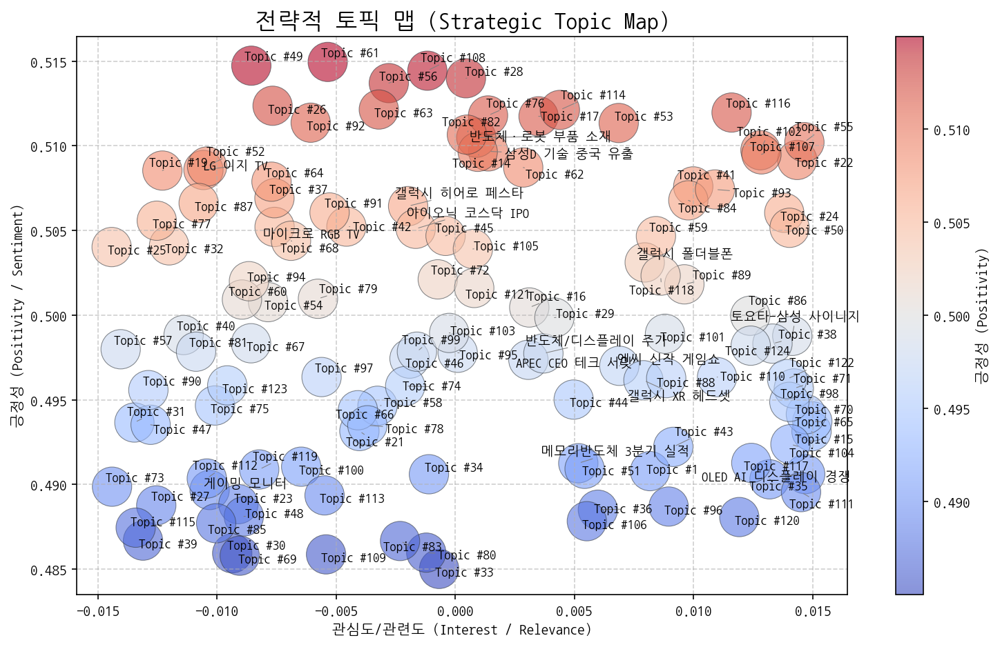
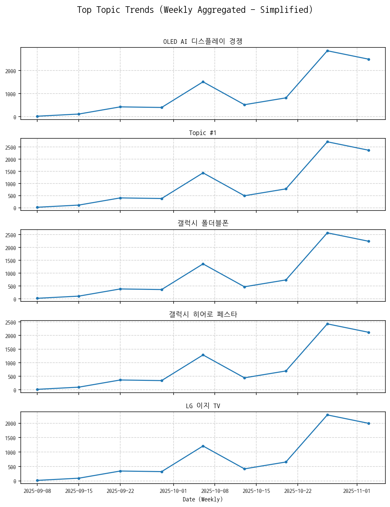
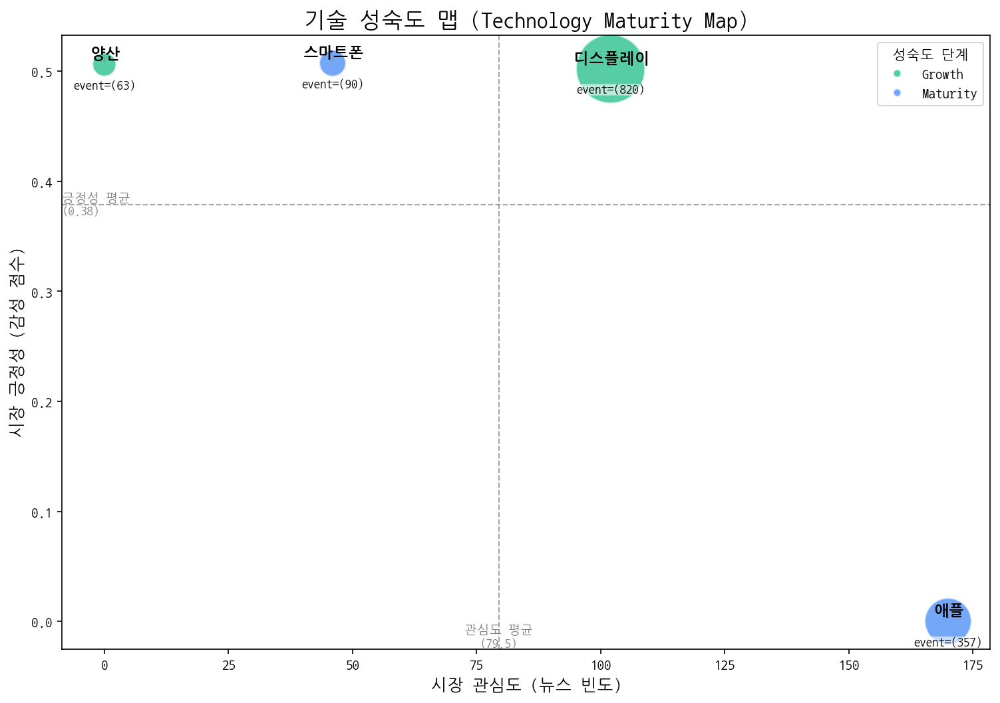
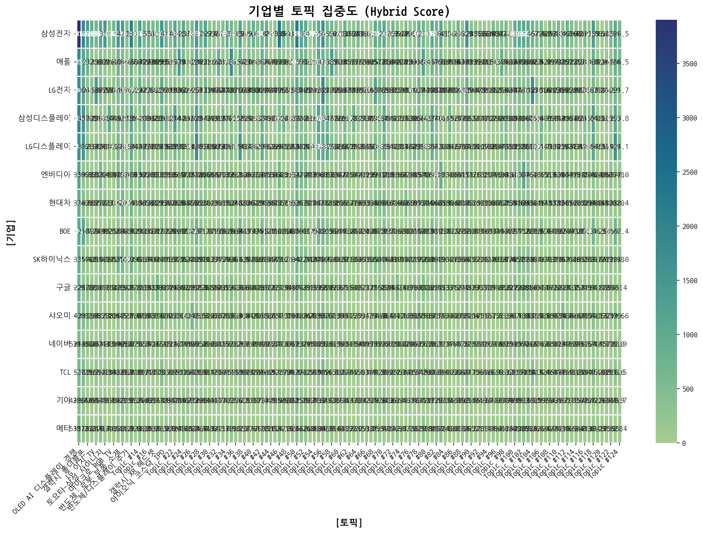
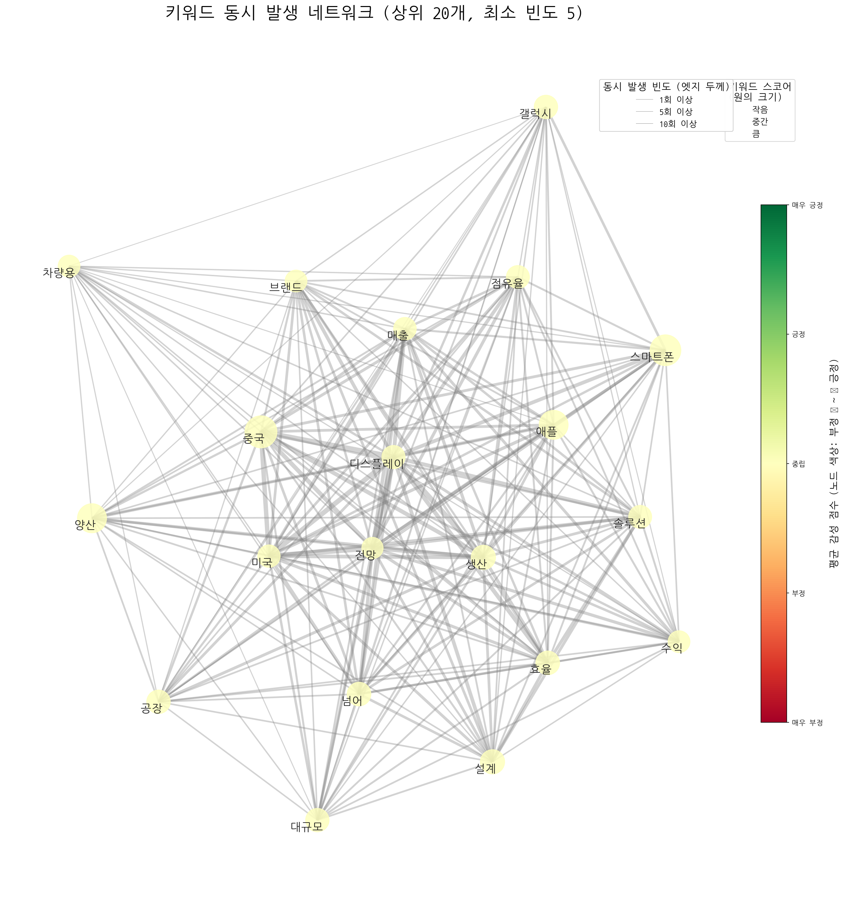
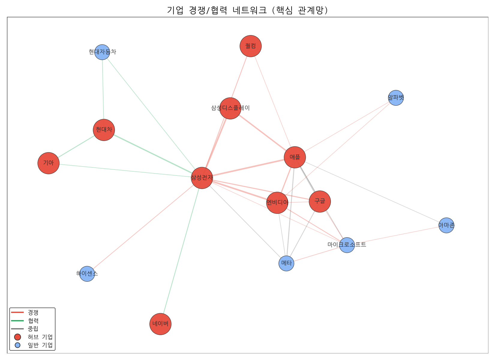
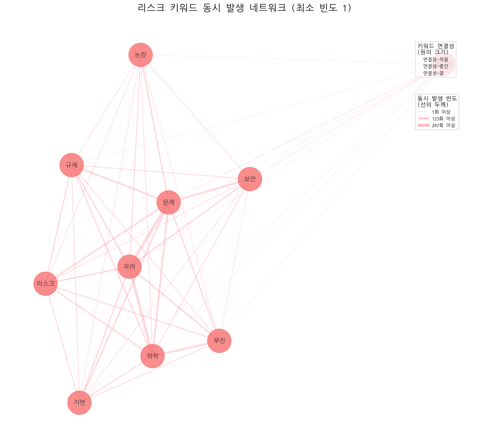
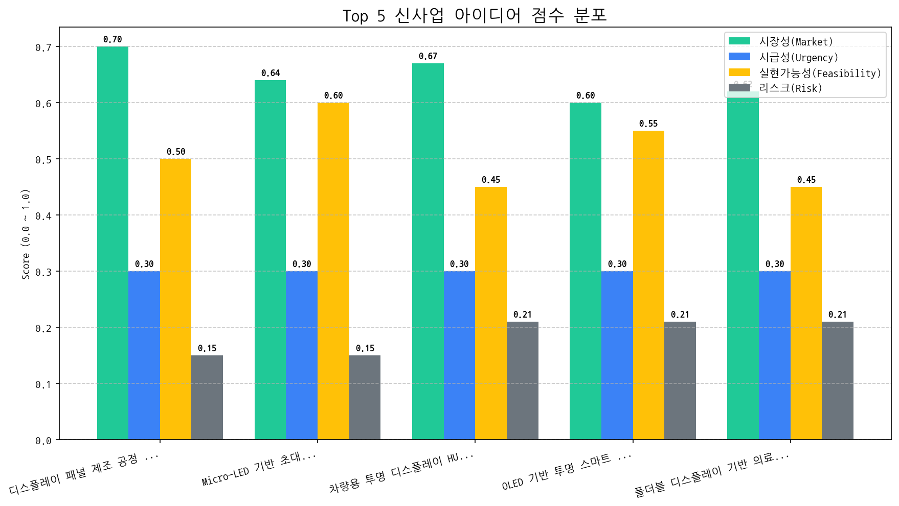

# 월간 상세 해설 리포트

Period: 2025-10-05 ~ 2025-11-03 | Generated by Market Intelligence Team

## Executive Summary

## 월간 전략 보고서 Executive Summary (2025년 11월)

**보고 기간:** 2025년 10월 5일 ~ 2025년 11월 3일

**주요 내용:**

지난 한 달간의 시장 분석 결과, **디스플레이 패널 제조 공정의 AI 기반 수율 예측 및 불량 검출 시스템**이 가장 유망한 사업 아이디어로 부상했습니다. 이는 당사의 핵심 역량과 시장의 요구를 효과적으로 연결할 수 있는 기회로 판단됩니다.

**기회 요인:**

*   **디스플레이 패널 시장의 지속적인 성장:** 고해상도, 고품질 디스플레이에 대한 수요가 증가하며 시장 규모 확대 예상.
*   **제조 공정 효율성 개선의 중요성 증대:** 경쟁 심화로 인해 수율 향상 및 비용 절감에 대한 니즈 증가.
*   **AI 및 머신러닝 기술의 발전:** 제조 공정의 자동화 및 최적화를 위한 기반 기술 확보.

**위협 요인:**

*   **현재 시장 분석 결과, 즉각적인 위협 요인은 발견되지 않았습니다.** 다만, 경쟁사의 유사 솔루션 출시 가능성, AI 기술 관련 규제 변화, 데이터 보안 문제 등에 대한 지속적인 모니터링이 필요합니다.

**다음 분기 최우선 전략 방향:**

1.  **AI 기반 수율 예측 및 불량 검출 시스템 사업화 집중:**
    *   시장 수요 및 기술적 타당성 검토를 위한 PoC(Proof of Concept) 진행.
    *   잠재 고객과의 협력 관계 구축 및 파일럿 테스트 추진.
    *   AI 및 머신러닝 기술 전문가 확보 및 내부 역량 강화.

2.  **경쟁 환경 및 기술 동향 지속적 모니터링:**
    *   경쟁사의 솔루션 개발 동향 파악 및 차별화 전략 수립.
    *   새로운 기술 트렌드 및 규제 변화에 대한 정보 수집 및 분석.
    *   잠재적인 위협 요인에 대한 사전 대비책 마련.

3.  **데이터 확보 및 관리 전략 강화:**
    *   AI 모델 학습 및 성능 향상을 위한 양질의 데이터 확보 방안 마련.
    *   데이터 보안 및 개인 정보 보호를 위한 체계 구축.
    *   데이터 활용 및 분석 능력 강화.

**결론:**

AI 기반 수율 예측 및 불량 검출 시스템 사업화는 당사의 성장 동력을 확보하고 시장 경쟁력을 강화할 수 있는 핵심 전략입니다. 위에 제시된 최우선 전략 방향을 중심으로 집중적인 투자와 노력을 기울여 시장 선점 효과를 확보해야 합니다. 또한, 변화하는 시장 환경에 대한 지속적인 모니터링과 유연한 대응을 통해 잠재적인 위협 요인을 최소화하고 지속적인 성장을 이루어낼 수 있도록 하겠습니다.

## 1. 전략적 시장 포지셔닝 맵

> 시장의 핵심 토픽 지형, 트렌드, 성장률을 통해 거시적인 동향과 기회 영역을 분석합니다.

### 토픽 상세 정보

| 토픽               | 요약                                                                                      | 핵심 키워드                |
|:-----------------|:----------------------------------------------------------------------------------------|:----------------------|
| OLED AI 디스플레이 경쟁 | 한국, 미국, 중국이 차세대 OLED 디스플레이 기술, 특히 AI와 결합된 핵심 기술을 놓고 경쟁하는 상황을 다룬 뉴스. 삼성 등이 주요 기업으로 언급됨.  | oled, ai, 디스플레이       |
| Topic #1         | (LLM 해석 실패)                                                                             | oled, 중국, 디스플레이       |
| 갤럭시 폴더블폰         | 삼성 갤럭시 폴더블폰의 최신 트렌드(트라이폴드폰 포함) 및 아이폰과의 경쟁 구도 관련 뉴스.                                     | 갤럭시, 스마트폰, 폴더블폰       |
| 갤럭시 히어로 페스타      | 갤럭시 시리즈를 대상으로 군인(일반 병사 포함)에게 특별 할인 혜택을 제공하는 히어로 페스타 관련 소식.                              | 히어로, 할인된, 갤럭시         |
| LG 이지 TV         | LG전자가 시니어 계층을 위해 출시한 '이지 TV'에 대한 뉴스 기사. 헬프 기능 등 사용 편의성을 강조한 제품으로 보임.                    | 시니어, 이지, lg           |
| APEC CEO 테크 서밋   | 경주에서 열리는 APEC CEO 서밋에서 AI 기술 쇼케이스를 통해 투명성을 강조하는 행사 관련 내용.                               | apec, ceo, 경주         |
| 토요타-삼성 사이니지      | 토요타 자동차 매장/전시장에 설치된 삼성전자 사이니지 디자인 및 전시 관련 내용.                                           | 사이니지, 토요타, 사이니지를      |
| 삼성D 기술 중국 유출     | 경찰이 삼성디스플레이 기술 유출 혐의를 포착하고 수사에 착수, 산업기술보호법 위반 혐의로 압수수색을 진행하는 사건. 중국으로의 기술 유출 여부가 핵심 쟁점. | 유출, 삼성디스플레이, 경찰은      |
| 마이크로 RGB TV      | 마이크로 RGB 기술을 적용한 TV 관련 뉴스를 다룸. 컬러 구현 방식과 관련된 특징을 포함.                                    | rgb, 마이크로 rgb, 마이크로   |
| 메모리반도체 3분기 실적    | 3분기 메모리 반도체(D램, HBM) 시장의 수요와 판매, 매출 실적 및 파운드리 사업 관련 분석.                                 | 메모리, 분기, 3분기          |
| 반도체·로봇 부품 소재     | 반도체 및 로봇 산업 관련 부품, 소재, 장비, 배터리 등을 다루는 기업 설립 및 사업 동향 분석. 거래일 기준 시장 상황 포함.                | 반도체, 로봇, 기업으로         |
| 엔씨 신작 게임쇼        | 엔씨소프트 신작 '브레이커스'가 도쿄 게임쇼에서 공개되었으며, OLED 게이밍 환경에서 속도감을 강조한 게임으로 소개됨.                     | 브레이커스, 도쿄게임쇼, 게이밍     |
| 반도체/디스플레이 주가     | 반도체, 디스플레이 소재 및 핵심 기술 관련 장비 기업들의 주가 변동과 한국거래소에서의 동향에 대한 분석 및 전망.                        | 장비, 반도체, 디스플레이        |
| 게이밍 모니터          | ROG STRIX, MSI 등 고성능 게이밍 모니터(QD-OLED, DP, USB 지원) 관련 정보.                                | 게이밍, 모니터, rog         |
| Topic #14        | (LLM 해석 실패)                                                                             | ai, 데이터, ai 팩토리       |
| Topic #15        | (LLM 해석 실패)                                                                             | oled, oled 서밋, ut     |
| Topic #16        | (LLM 해석 실패)                                                                             | 자산운용, 추석, 증권          |
| Topic #17        | (LLM 해석 실패)                                                                             | 사랑받는, 가장 사랑받는, 호주     |
| 갤럭시 XR 헤드셋       | 구글 안드로이드 기반의 갤럭시 XR 헤드셋 개발 및 멀티모달 기술 관련 뉴스 토픽.                                          | xr, 갤럭시, 갤럭시 xr       |
| Topic #19        | (LLM 해석 실패)                                                                             | rgb, tv, 마이크로         |
| 아이오닉 코스닥 IPO     | 아이오닉이라는 회사가 디스플레이 장비 관련 기술 신뢰성을 바탕으로 코스닥에 상장(IPO)하며, 공모가를 결정하는 복합적인 과정을 다루는 뉴스.         | 신뢰성, 상장, 복합           |
| Topic #21        | (LLM 해석 실패)                                                                             | 청소기, 청소, 제트           |
| Topic #22        | (LLM 해석 실패)                                                                             | 이재용, 삼성디스플레이, 생산라인을   |
| Topic #23        | (LLM 해석 실패)                                                                             | 아이폰17, 프로, 아이폰        |
| Topic #24        | (LLM 해석 실패)                                                                             | 코스피, 사상, 김현정          |
| Topic #25        | (LLM 해석 실패)                                                                             | 주행, mini, 전기          |
| Topic #26        | (LLM 해석 실패)                                                                             | 샤오미, 주석은, 시진핑         |
| Topic #27        | (LLM 해석 실패)                                                                             | oled, 연간, 패널          |
| Topic #28        | (LLM 해석 실패)                                                                             | 장비, 검사, 패턴            |
| Topic #29        | (LLM 해석 실패)                                                                             | ai, 에너지, 비스포크 ai      |
| Topic #30        | (LLM 해석 실패)                                                                             | 붉은사막, amd, 팝업스토어      |
| Topic #31        | (LLM 해석 실패)                                                                             | sns, 대한민국 sns, 사람     |
| Topic #32        | (LLM 해석 실패)                                                                             | 애플워치, 수면, 운동          |
| Topic #33        | (LLM 해석 실패)                                                                             | 머크, 학생은, 신소재공학과       |
| Topic #34        | (LLM 해석 실패)                                                                             | 퍼플렉시티, tv와, 2025년형    |
| Topic #35        | (LLM 해석 실패)                                                                             | 아이폰, 아이폰17, 애플        |
| Topic #36        | (LLM 해석 실패)                                                                             | 디자인, 상을, 레드닷          |
| Topic #37        | (LLM 해석 실패)                                                                             | oled, 연구원은, 북미        |
| Topic #38        | (LLM 해석 실패)                                                                             | samsung, display, its |
| Topic #39        | (LLM 해석 실패)                                                                             | 중고폰, 선진, 전년           |
| Topic #40        | (LLM 해석 실패)                                                                             | 구광모, 부회장, 회장은         |
| Topic #41        | (LLM 해석 실패)                                                                             | 그랜드십일절, 인기, 매일        |
| Topic #42        | (LLM 해석 실패)                                                                             | 패널, 출하량이, 패널 출하량이     |
| Topic #43        | (LLM 해석 실패)                                                                             | 아산, 기업이, 유치           |
| Topic #44        | (LLM 해석 실패)                                                                             | ef, 라이프스튜디오, 홈프로젝터    |
| Topic #45        | (LLM 해석 실패)                                                                             | 최우수, 동반성장지수, 등급을      |
| Topic #46        | (LLM 해석 실패)                                                                             | 이재용, 회장이, 회장은         |
| Topic #47        | (LLM 해석 실패)                                                                             | 차량용, iaa, 차량용 oled    |
| Topic #48        | (LLM 해석 실패)                                                                             | 할인, 빅스마일데이, g마켓       |
| Topic #49        | (LLM 해석 실패)                                                                             | 할인, 구매, 가전절           |

### 토픽 성장/하락 추세

|   topic_id | topic_name   |   momentum_score |
|-----------:|:-------------|-----------------:|
|         26 | Topic #26    |            3.146 |
|        111 | Topic #111   |            3.146 |
|         58 | Topic #58    |            0.074 |
|        119 | Topic #119   |            0.074 |
|         55 | Topic #55    |            0.002 |
|         62 | Topic #62    |            0     |
|         76 | Topic #76    |            0     |
|         87 | Topic #87    |            0     |
|         86 | Topic #86    |            0     |
|         85 | Topic #85    |            0     |
|         84 | Topic #84    |            0     |
|         83 | Topic #83    |            0     |
|         82 | Topic #82    |            0     |
|         80 | Topic #80    |            0     |
|         78 | Topic #78    |            0     |
|         77 | Topic #77    |            0     |
|         74 | Topic #74    |            0     |
|         75 | Topic #75    |            0     |
|         89 | Topic #89    |            0     |
|         73 | Topic #73    |            0     |
|         72 | Topic #72    |            0     |
|         71 | Topic #71    |            0     |
|         69 | Topic #69    |            0     |
|         67 | Topic #67    |            0     |
|         66 | Topic #66    |            0     |
|         65 | Topic #65    |            0     |
|         64 | Topic #64    |            0     |
|         63 | Topic #63    |            0     |
|         60 | Topic #60    |            0     |
|         88 | Topic #88    |            0     |
|         92 | Topic #92    |            0     |
|         90 | Topic #90    |            0     |
|         91 | Topic #91    |            0     |
|        122 | Topic #122   |            0     |
|        121 | Topic #121   |            0     |
|        120 | Topic #120   |            0     |
|        118 | Topic #118   |            0     |
|        117 | Topic #117   |            0     |
|        115 | Topic #115   |            0     |
|        114 | Topic #114   |            0     |
|        113 | Topic #113   |            0     |
|        110 | Topic #110   |            0     |
|        109 | Topic #109   |            0     |
|        108 | Topic #108   |            0     |
|        107 | Topic #107   |            0     |
|        106 | Topic #106   |            0     |
|        105 | Topic #105   |            0     |
|        104 | Topic #104   |            0     |
|        103 | Topic #103   |            0     |
|        101 | Topic #101   |            0     |

### 포지셔닝 및 트렌드 종합 해설 (AI)

## 분석 결과 (Markdown):

#### 종합 시장 동향 해석

- **주요 동력**: 현재 시장의 주요 동력은 크게 **OLED 기술 경쟁 및 혁신**, **폴더블폰 시장 성장**, 그리고 **특정 고객층을 타겟팅한 제품 전략**이라고 볼 수 있습니다.
    * **OLED 기술 경쟁 및 혁신:** 'OLED AI 디스플레이 경쟁' 토픽은 한국, 미국, 중국 간의 차세대 디스플레이 기술 경쟁을 보여주며, AI 기술과의 결합이라는 점에서 높은 성장 잠재력을 시사합니다. 또한 '마이크로 RGB TV' 토픽은 디스플레이 기술의 진보를 나타내며, 고화질 디스플레이에 대한 소비자 니즈를 충족시킬 수 있는 가능성을 제시합니다. '엔씨 신작 게임쇼' 토픽에서 OLED 게이밍 환경이 강조된 점 역시 OLED 기술이 특정 시장에서 중요한 경쟁력으로 작용하고 있음을 보여줍니다.
    * **폴더블폰 시장 성장:** '갤럭시 폴더블폰' 토픽은 폴더블폰 시장의 지속적인 성장과 삼성과 애플 간의 경쟁 심화를 나타냅니다. 폴더블폰은 프리미엄 스마트폰 시장에서 차별화된 경험을 제공하며, 새로운 폼팩터에 대한 소비자들의 관심과 수요를 이끌어내고 있습니다.
    * **특정 고객층을 타겟팅한 제품 전략:** 'LG 이지 TV' 토픽은 시니어 계층을 위한 맞춤형 제품 출시를 통해 특정 고객층의 니즈를 충족시키려는 전략을 보여줍니다. 이는 인구 고령화 시대에 특정 계층을 위한 맞춤형 제품 및 서비스 개발이 중요해지고 있음을 시사합니다. '갤럭시 히어로 페스타' 역시 군인이라는 특정 고객층에 대한 혜택 제공을 통해 브랜드 충성도를 높이고 시장 점유율을 확대하려는 전략으로 해석할 수 있습니다.
    * **반도체 산업 회복의 조짐:** '메모리반도체 3분기 실적' 및 '반도체/디스플레이 주가' 토픽은 반도체 시장의 회복 가능성을 시사합니다. 메모리 반도체 수요 증가와 함께 파운드리 사업의 중요성이 부각되고 있으며, 관련 기업들의 주가 변동 역시 시장의 기대감을 반영하고 있습니다.

- **부상하는 기회**: 새롭게 부상하는 기회는 **XR 헤드셋 시장**, **기술 유출 방지 및 보안 강화**, 그리고 **ESG 경영 트렌드**와 관련된 영역에서 찾을 수 있습니다.
    * **XR 헤드셋 시장:** '갤럭시 XR 헤드셋' 토픽은 구글 안드로이드 기반의 XR 헤드셋 개발을 다루며, 확장현실(XR) 시장의 성장 가능성을 보여줍니다. 멀티모달 기술과의 결합은 XR 헤드셋이 미래 컴퓨팅 플랫폼으로 자리매김할 수 있음을 시사합니다.
    * **기술 유출 방지 및 보안 강화:** '삼성D 기술 중국 유출' 토픽은 기술 유출 문제의 심각성을 드러내며, 기업의 기술 보호 및 보안 강화의 중요성을 강조합니다. 이는 보안 기술 및 솔루션 시장의 성장 기회를 제공할 수 있습니다.
    * **APEC CEO 테크 서밋 (AI 투명성 쇼케이스):** 비록 APEC CEO 테크 서밋 자체는 꾸준히 진행되는 행사이지만, AI 기술 쇼케이스에서 '투명성'을 강조하는 점은 ESG 경영 트렌드를 반영하는 것으로 보입니다. 기업의 사회적 책임에 대한 요구가 높아짐에 따라, 투명하고 윤리적인 AI 기술 개발 및 활용이 중요한 경쟁력으로 부상할 수 있습니다.
    * **주목해야 할 모멘텀 상승 토픽:** 모멘텀 점수가 급격히 상승한 Topic #26, Topic #111, Topic #58은 현재로서는 LLM 해석에 실패했지만, 해당 토픽들의 내용을 파악하는 것이 중요합니다. 긍정적인 모멘텀을 보이는 만큼, 숨겨진 시장 기회가 존재할 가능성이 높습니다.

#### 전략적 제언

- **집중 영역**: 다음 분기에 우리 회사가 자원을 집중해야 할 토픽 영역은 **OLED 기술 경쟁력 강화**, **폴더블폰 시장 선점**, 그리고 **맞춤형 제품 개발 및 고객 경험 개선**입니다.
    * **OLED 기술 경쟁력 강화:** AI와 결합된 차세대 OLED 디스플레이 기술 개발에 투자하고, 고화질 디스플레이 시장에서의 경쟁 우위를 확보해야 합니다. 특히, 게이밍 시장에서의 OLED 기술 활용 가능성을 적극적으로 모색해야 합니다.
    * **폴더블폰 시장 선점:** 폴더블폰의 디자인 및 기능 혁신을 통해 시장 경쟁력을 강화하고, 다양한 고객 니즈를 충족시킬 수 있는 제품 라인업을 구축해야 합니다.
    * **맞춤형 제품 개발 및 고객 경험 개선:** 특정 고객층(시니어, 군인 등)을 위한 맞춤형 제품 및 서비스 개발에 투자하고, 고객 경험을 향상시키는 데 주력해야 합니다.

- **모니터링 영역**: 주의 깊게 모니터링해야 할 토픽 영역은 **XR 헤드셋 시장 동향**, **기술 유출 방지 노력 및 관련 규제 변화**, **반도체 시장 회복 추세**, 그리고 **ESG 경영 관련 이슈**입니다.
    * **XR 헤드셋 시장 동향:** 갤럭시 XR 헤드셋 개발 및 시장 반응을 면밀히 관찰하고, 확장현실(XR) 시장의 성장 가능성에 대비해야 합니다. 멀티모달 기술과의 결합 등 기술 트렌드를 지속적으로 파악하고, 관련 시장 진출 전략을 검토해야 합니다.
    * **기술 유출 방지 노력 및 관련 규제 변화:** 기술 유출 방지를 위한 보안 시스템 강화에 투자하고, 관련 법규 및 규제 변화에 대한 정보를 꾸준히 업데이트해야 합니다.
    * **반도체 시장 회복 추세:** 메모리 반도체 수요 및 가격 변동을 주시하고, 파운드리 사업의 성장 가능성에 대한 분석을 지속해야 합니다. 반도체 시장의 회복 추세에 따른 투자 전략을 수립해야 합니다.
    * **ESG 경영 관련 이슈:** AI 기술의 투명성 및 윤리적 문제에 대한 사회적 요구를 파악하고, ESG 경영 관련 정책 변화에 대한 정보를 지속적으로 모니터링해야 합니다.
    * **하락세 토픽 분석:** 모멘텀 점수가 급격히 하락한 Topic #102, Topic #37, Topic #123의 하락 원인을 분석하고, 해당 토픽과 관련된 위험 요소를 파악해야 합니다.

## 2. 기술 수명 주기 및 R&D 투자 타이밍 분석

> 주요 기술의 시장 성숙도 단계를 진단하고, R&D 및 사업화 투자 시점을 판단합니다.

| 기술    | 단계       | 판단 근거                                                                              |
|:------|:---------|:-----------------------------------------------------------------------------------|
| 양산    | Growth   | 뉴스 언급은 없지만 투/출/수 이벤트가 활발하게 발생하고 시장 감성 점수가 0.5 이상으로 긍정적이므로 성장기에 해당한다고 판단됩니다.        |
| 스마트폰  | Maturity | 스마트폰은 뉴스 언급 빈도가 비교적 낮고 시장 감성 점수가 중간 수준이며 출시 이벤트가 투자를 크게 상회하는 등 성숙기에 접어든 것으로 판단됩니다. |
| 디스플레이 | Growth   | 디스플레이 기술은 높은 투자 및 출시 건수를 보이며, 뉴스 언급 빈도와 시장 감성 점수가 중간 수준으로 성장기에 해당합니다.              |
| 애플    | Maturity | 높은 출시 빈도와 비교적 낮은 투자 및 수주 빈도, 그리고 매우 낮은 시장 감성 점수는 애플 기술이 성숙기에 접어들었음을 시사합니다.         |

## 3. 경쟁사 전략적 의도 및 파트너 관계망 분석

> 경쟁사의 토픽 집중도와 키워드 연관성, 기업 간 관계망을 통해 경쟁 구도와 전략을 분석합니다.

### 기업-토픽 집중도

#### 집중도 매트릭스 (상위 5개사)

| org   | topic_0     | topic_1    | topic_10    |   topic_100 | topic_101   | topic_102   |   topic_103 |   topic_104 |   topic_109 | topic_11   |   topic_110 |   topic_111 | topic_112   |   topic_113 |   topic_114 | topic_118   | topic_12    |   topic_122 | topic_123   | topic_13    | topic_14   | topic_15   |   topic_16 |   topic_17 |   topic_18 | topic_19   |   topic_2 |   topic_20 |   topic_22 |   topic_23 | topic_24    | topic_25    |   topic_26 |   topic_27 |   topic_28 |   topic_29 |   topic_3 | topic_30     |   topic_31 |   topic_33 |   topic_34 |   topic_35 |   topic_37 |   topic_38 |   topic_39 |   topic_4 |   topic_40 |   topic_41 |   topic_42 |   topic_43 |   topic_46 |   topic_47 |   topic_48 |   topic_5 | topic_50    |   topic_51 |   topic_52 | topic_54   |   topic_55 |   topic_56 |   topic_57 |   topic_58 |   topic_61 |   topic_62 |   topic_68 |   topic_69 | topic_70    |   topic_72 |   topic_73 |   topic_75 |   topic_76 |   topic_77 |   topic_78 |   topic_79 |   topic_8 |   topic_80 | topic_81   | topic_83    |   topic_84 |   topic_87 |   topic_89 | topic_9     |   topic_91 |   topic_95 |   topic_99 |
|:------|:------------|:-----------|:------------|------------:|:------------|:------------|------------:|------------:|------------:|:-----------|------------:|------------:|:------------|------------:|------------:|:------------|:------------|------------:|:------------|:------------|:-----------|:-----------|-----------:|-----------:|-----------:|:-----------|----------:|-----------:|-----------:|-----------:|:------------|:------------|-----------:|-----------:|-----------:|-----------:|----------:|:-------------|-----------:|-----------:|-----------:|-----------:|-----------:|-----------:|-----------:|----------:|-----------:|-----------:|-----------:|-----------:|-----------:|-----------:|-----------:|----------:|:------------|-----------:|-----------:|:-----------|-----------:|-----------:|-----------:|-----------:|-----------:|-----------:|-----------:|-----------:|:------------|-----------:|-----------:|-----------:|-----------:|-----------:|-----------:|-----------:|----------:|-----------:|:-----------|:------------|-----------:|-----------:|-----------:|:------------|-----------:|-----------:|-----------:|
| AMD   | 367.54 (1%) | nan        | nan         |         nan | nan         | 219.37 (3%) |         nan |         nan |         nan | nan        |         nan |         nan | nan         |         nan |         nan | nan         | 218.34 (1%) |         nan | nan         | nan         | nan        | nan        |        nan |        nan |        nan | nan        |       nan |        nan |        nan |        nan | 244.33 (3%) | nan         |        nan |        nan |        nan |        nan |       nan | 453.99 (15%) |        nan |        nan |        nan |        nan |        nan |        nan |        nan |       nan |        nan |        nan |        nan |        nan |        nan |        nan |        nan |       nan | 245.72 (2%) |        nan |        nan | nan        |        nan |        nan |        nan |        nan |        nan |        nan |        nan |        nan | nan         |        nan |        nan |        nan |        nan |        nan |        nan |        nan |       nan |        nan | nan        | 249.91 (3%) |        nan |        nan |        nan | 215.73 (2%) |        nan |        nan |        nan |
| ASUS  | 169.32 (1%) | nan        | nan         |         nan | nan         | 75.23 (1%)  |         nan |         nan |         nan | 99.04 (4%) |         nan |         nan | 129.37 (2%) |         nan |         nan | nan         | 80.41 (1%)  |         nan | nan         | 100.08 (6%) | nan        | nan        |        nan |        nan |        nan | nan        |       nan |        nan |        nan |        nan | nan         | nan         |        nan |        nan |        nan |        nan |       nan | 122.26 (4%)  |        nan |        nan |        nan |        nan |        nan |        nan |        nan |       nan |        nan |        nan |        nan |        nan |        nan |        nan |        nan |       nan | 115.63 (1%) |        nan |        nan | nan        |        nan |        nan |        nan |        nan |        nan |        nan |        nan |        nan | nan         |        nan |        nan |        nan |        nan |        nan |        nan |        nan |       nan |        nan | nan        | nan         |        nan |        nan |        nan | nan         |        nan |        nan |        nan |
| AUO   | 64.70 (0%)  | 50.65 (0%) | nan         |         nan | nan         | nan         |         nan |         nan |         nan | nan        |         nan |         nan | nan         |         nan |         nan | 34.02 (0%)  | 36.74 (0%)  |         nan | 34.28 (0%)  | nan         | nan        | nan        |        nan |        nan |        nan | 33.30 (0%) |       nan |        nan |        nan |        nan | nan         | nan         |        nan |        nan |        nan |        nan |       nan | nan          |        nan |        nan |        nan |        nan |        nan |        nan |        nan |       nan |        nan |        nan |        nan |        nan |        nan |        nan |        nan |       nan | 30.28 (0%)  |        nan |        nan | nan        |        nan |        nan |        nan |        nan |        nan |        nan |        nan |        nan | nan         |        nan |        nan |        nan |        nan |        nan |        nan |        nan |       nan |        nan | 32.82 (0%) | nan         |        nan |        nan |        nan | nan         |        nan |        nan |        nan |
| Acer  | 104.62 (0%) | 49.22 (0%) | nan         |         nan | nan         | nan         |         nan |         nan |         nan | nan        |         nan |         nan | 90.00 (2%)  |         nan |         nan | nan         | 45.75 (0%)  |         nan | nan         | nan         | 40.90 (0%) | 53.04 (1%) |        nan |        nan |        nan | nan        |       nan |        nan |        nan |        nan | nan         | nan         |        nan |        nan |        nan |        nan |       nan | 42.25 (1%)   |        nan |        nan |        nan |        nan |        nan |        nan |        nan |       nan |        nan |        nan |        nan |        nan |        nan |        nan |        nan |       nan | 52.31 (0%)  |        nan |        nan | nan        |        nan |        nan |        nan |        nan |        nan |        nan |        nan |        nan | nan         |        nan |        nan |        nan |        nan |        nan |        nan |        nan |       nan |        nan | nan        | nan         |        nan |        nan |        nan | nan         |        nan |        nan |        nan |
| BMW   | 177.58 (1%) | nan        | 114.49 (1%) |         nan | 80.73 (1%)  | nan         |         nan |         nan |         nan | nan        |         nan |         nan | nan         |         nan |         nan | nan         | 110.90 (1%) |         nan | nan         | nan         | nan        | nan        |        nan |        nan |        nan | nan        |       nan |        nan |        nan |        nan | nan         | 138.91 (5%) |        nan |        nan |        nan |        nan |       nan | nan          |        nan |        nan |        nan |        nan |        nan |        nan |        nan |       nan |        nan |        nan |        nan |        nan |        nan |        nan |        nan |       nan | 106.00 (1%) |        nan |        nan | 91.94 (2%) |        nan |        nan |        nan |        nan |        nan |        nan |        nan |        nan | 147.68 (2%) |        nan |        nan |        nan |        nan |        nan |        nan |        nan |       nan |        nan | nan        | nan         |        nan |        nan |        nan | nan         |        nan |        nan |        nan |

### 키워드 및 기업 관계망

#### 주요 기업 관계 Top 5

| 기업1     | 기업2   |   관계강도(언급빈도) | 관계유형(추정)   |
|:--------|:------|-------------:|:-----------|
| 삼성전자    | 애플    |          427 | rivalry    |
| 삼성전자    | 엔비디아  |          298 | rivalry    |
| 삼성디스플레이 | 삼성전자  |          291 | rivalry    |
| 구글      | 애플    |          272 | neutral    |
| 삼성디스플레이 | 애플    |          258 | rivalry    |

#### Top 3 경쟁사 전략 방향성 해석 (AI)

| 기업   | 핵심 집중 토픽                                | 전략 방향성 해석                                                                                                                                          |
|:-----|:----------------------------------------|:---------------------------------------------------------------------------------------------------------------------------------------------------|
| 삼성전자 | OLED AI 디스플레이 경쟁, Topic #46, Topic #50  | 삼성전자는 OLED 디스플레이 기술에 AI를 접목하여 경쟁 우위를 확보하고, 디스플레이 시장에서의 기술 리더십을 강화하는 데 집중하고 있습니다. 이를 통해 프리미엄 디스플레이 시장에서의 점유율을 확대하고 새로운 수익 모델을 창출하려는 단기 전략을 추진 중입니다. |
| 애플   | OLED AI 디스플레이 경쟁, Topic #35, Topic #23  | 애플은 OLED 디스플레이와 AI 기술 융합에 집중하며 디스플레이 경쟁력 강화 및 AI 기반 사용자 경험 혁신을 통해 프리미엄 시장에서의 입지를 더욱 공고히 하려는 단기 전략을 추진하고 있습니다.                                      |
| LG전자 | Topic #56, OLED AI 디스플레이 경쟁, Topic #104 | LG전자는 OLED 디스플레이 기술력을 AI와 결합하여 차별화된 프리미엄 TV 시장 경쟁력을 강화하고 있으며, 구체적인 다른 토픽(#104)과의 연계를 통해 시너지 창출을 모색하고 있습니다.                                         |

## 4. 전략적 리스크 관리 및 완화 액션 제안

> 데이터 기반으로 탐지된 주요 리스크와 관련 시그널을 분석하고, 대응 방안을 제시합니다.

### 리스크 관련 시그널 시각화

### 탐지된 주요 리스크 목록

> - 데이터 없음

### 리스크 종합 평가 및 대응 제안 (AI)

> 분석할 리스크 데이터가 없습니다.

## 5. 데이터 기반 신사업 아이디어 제안

> 시장 데이터 분석을 통해 도출된 Top 5 신사업 아이디어와 각 아이디어의 사업성을 평가합니다.

| 아이디어                                   | 가치 제안                                                                                                 |   총점 |
|:---------------------------------------|:------------------------------------------------------------------------------------------------------|-----:|
| 디스플레이 패널 제조 공정 AI 기반 수율 예측 및 불량 검출 시스템 | 수율 예측 정확도 향상, 불량 발생 원인 조기 진단, 공정 최적화 및 자동 제어, 생산 비용 절감, 숙련된 엔지니어의 의존도 감소                              |  4.4 |
| Micro-LED 기반 초대형 디지털 사이니지              | 압도적인 화질 (높은 밝기, 명암비, 색재현율), 뛰어난 내구성 및 긴 수명, 모듈형 설계로 다양한 크기 및 형태 구현 가능, 에너지 효율성 향상, 경쟁사 대비 우수한 가격 경쟁력  |  4.4 |
| 차량용 투명 디스플레이 HUD (Head-Up Display) 솔루션 | 전방 시야 방해 최소화, AR/VR 기반 몰입형 정보 제공, 차량 디자인 통합 용이성, 운전자 맞춤형 정보 표시, 경쟁사 대비 높은 투명도 및 선명도 제공                |  3.9 |
| OLED 기반 투명 스마트 윈도우                     | 높은 투명도 및 선명한 화질, 넓은 시야각, 에너지 효율성 향상 (태양광 제어, 단열 효과), 다양한 콘텐츠 표시 (정보, 광고, 엔터테인먼트), 건물 디자인 차별화          |  3.9 |
| 폴더블 디스플레이 기반 의료용 웨어러블 기기               | 휴대성 극대화, 필요에 따라 화면 크기 확장 가능, 다양한 의료 정보 (생체 신호, 진단 결과) 표시, 환자 맞춤형 건강 관리 서비스 제공, 경쟁사 대비 높은 내구성 및 신뢰성 확보 |  3.7 |

## 6. Top 1 신사업 아이디어 검증 (향후 2주 실행 계획)

> 가장 우선순위가 높은 신사업 아이디어를 검증하기 위한 구체적인 실행 계획을 제시합니다.

| Hypothesis                                                                              | Target                                                             | KPI                                                                    | Owner   | Due        |
|:----------------------------------------------------------------------------------------|:-------------------------------------------------------------------|:-----------------------------------------------------------------------|:--------|:-----------|
| 디스플레이 패널 제조 사업부는 AI 기반 수율 예측 및 불량 검출 시스템 도입 시 현재 문제 해결 및 생산성 향상에 긍정적인 영향을 미칠 것이라고 판단한다. | 자사 디스플레이 패널 제조 사업부의 공정 엔지니어, 품질 관리 담당자, 생산 관리자 각 3명 이상 인터뷰         | 인터뷰 대상 9명 중 7명 이상이 시스템 도입에 따른 기대 효과 (수율 향상, 비용 절감, 효율 증대)에 대해 긍정적으로 평가 | 사업개발팀   | 2025-11-17 |
| AI 기반 수율 예측 모델 개발 및 불량 검출 시스템 구축에 필요한 데이터 확보 및 품질 관리가 기술적으로 가능하다.                       | 자사 디스플레이 패널 제조 사업부의 공정 데이터 (센서 데이터, 이미지 데이터) 샘플 확보 및 데이터 분석 전문가 검토 | 확보된 데이터 샘플의 80% 이상이 AI 모델 학습에 적합하며, 데이터 분석 전문가가 데이터 품질 관리 방안 제시        | 기술기획팀   | 2025-11-17 |
| 기존 시스템과의 통합 시, 인터페이스 개발 및 데이터 연동에 대한 기술적 어려움과 추가 비용이 예상 범위 내에 존재한다.                     | 자사 IT 부서 및 외부 SI 업체와 기존 디스플레이 패널 제조 시스템 분석 및 통합 방안 검토              | 기존 시스템과 AI 기반 시스템 통합에 필요한 인터페이스 개발 및 데이터 연동 비용 견적 확보 및 예상 비용의 ±10% 이내  | 기술기획팀   | 2025-11-17 |
