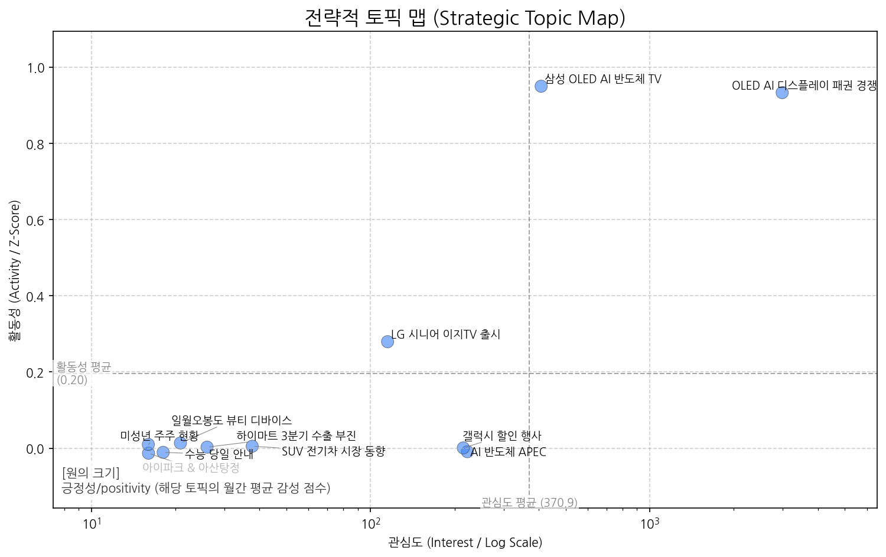
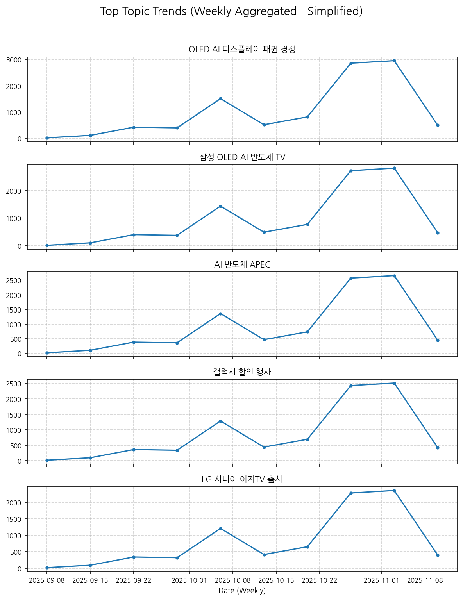
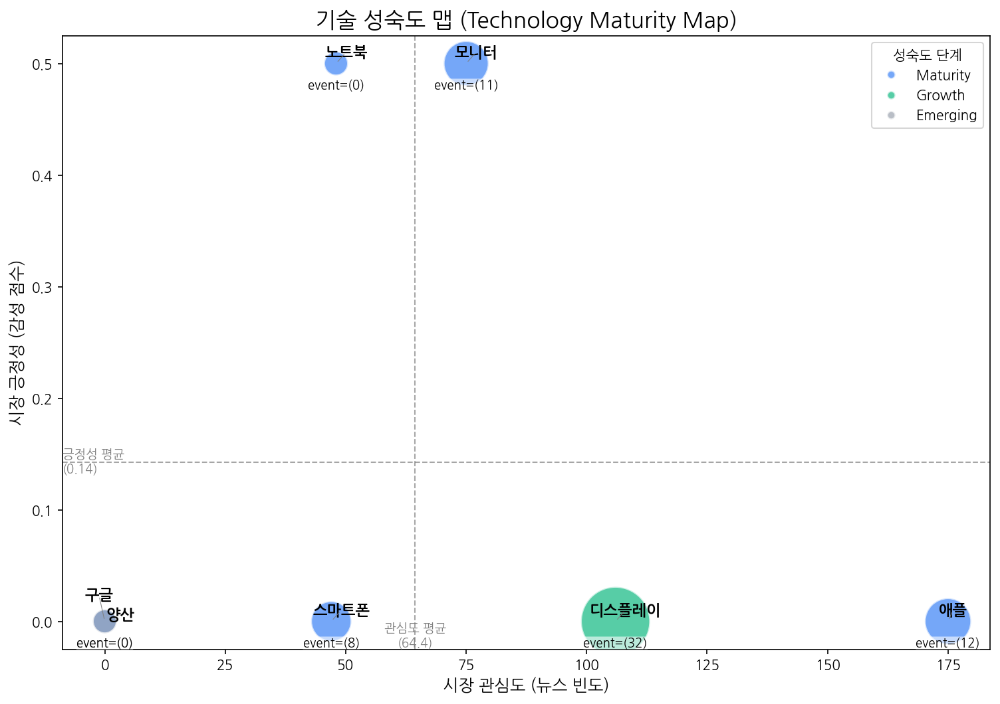
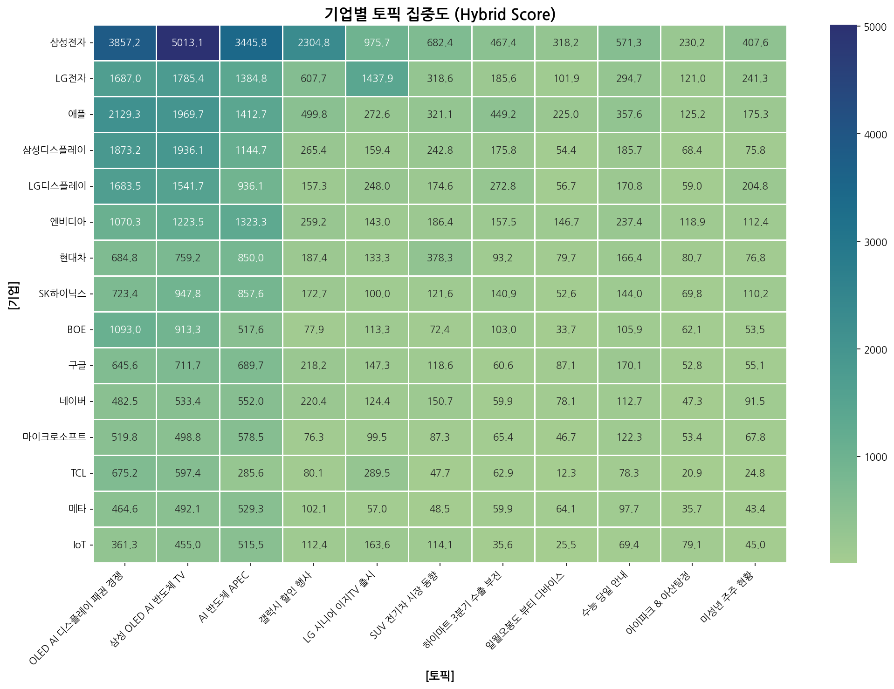
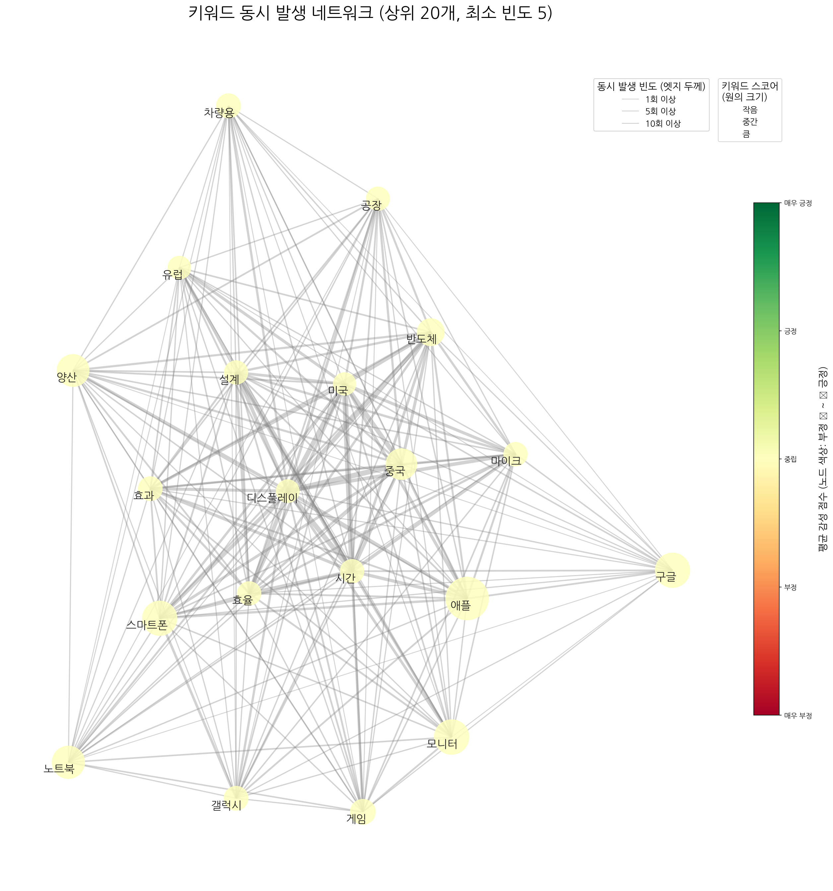
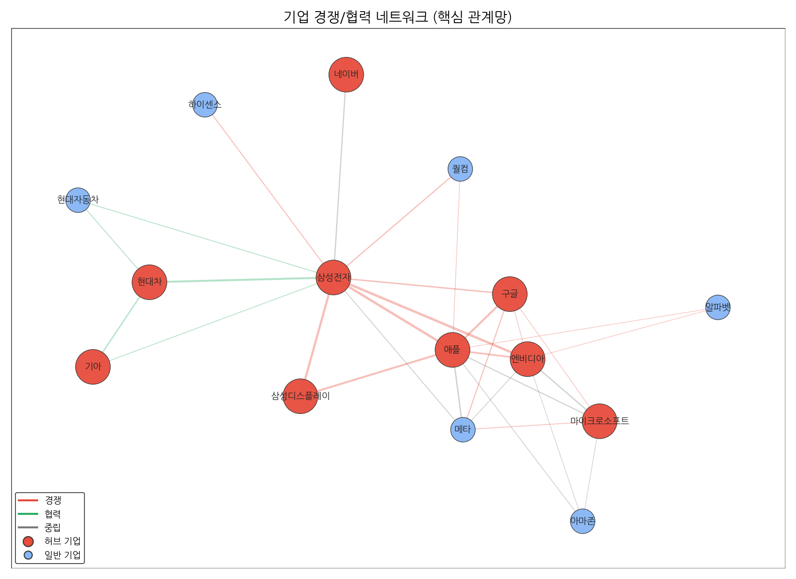
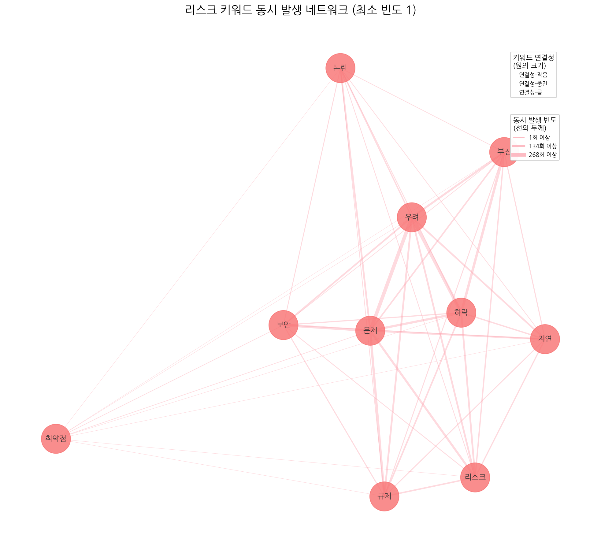
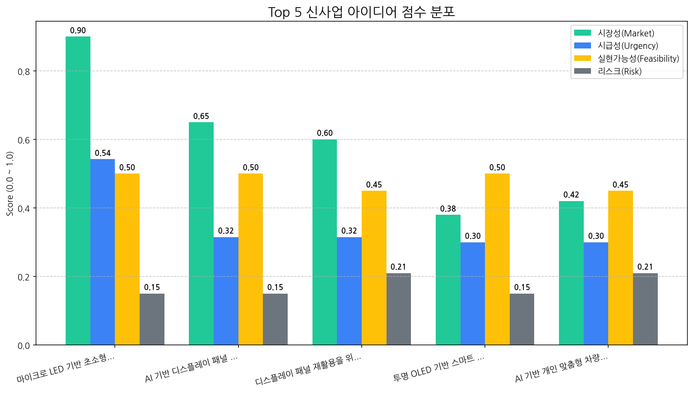

# 월간 상세 해설 리포트

Period: 2025-10-07 ~ 2025-11-05 | Generated by Market Intelligence Team

## Executive Summary

## 월간 전략 보고서 Executive Summary (2025년 10월 7일 ~ 2025년 11월 5일)

**개요:**

본 보고서는 지난 한 달간의 시장 분석 결과를 요약하고, CEO 및 이사회의 의사 결정을 지원하기 위한 핵심 전략 방향을 제시합니다.

**주요 시장 변화:**

*   지난 한 달 동안, **마이크로 LED 기반 초소형 AR 글래스 모듈**이 가장 유망한 사업 아이템으로 부상했습니다. 이는 AR/VR 시장의 성장과 함께, 휴대성과 편의성을 극대화한 초소형 기기에 대한 수요가 증가하고 있음을 시사합니다.
*   새로운 기술 트렌드로는 **양산**이 주목받고 있습니다. 이는 개발 단계를 넘어 실제 시장 출시 및 확장을 위한 생산 능력 확보가 중요한 시점임을 의미합니다.

**기회 요인:**

*   **마이크로 LED 기반 초소형 AR 글래스 모듈 시장 선점:** 경쟁사 대비 기술 우위를 확보하고, 초기 시장 진입에 성공함으로써 높은 성장 잠재력을 가진 신규 시장을 선점할 수 있습니다.
*   **양산 능력 확보를 통한 시장 경쟁력 강화:** 안정적인 생산 시스템 구축 및 규모의 경제 실현을 통해 가격 경쟁력을 확보하고, 급증하는 수요에 효과적으로 대응할 수 있습니다.

**위협 요인:**

*   **현재 파악된 주요 리스크는 없습니다.** 하지만 급변하는 시장 환경과 경쟁 상황을 지속적으로 모니터링하고, 잠재적인 위험 요소를 사전에 파악하여 선제적으로 대응해야 합니다. (예: 경쟁 심화, 기술 변화, 규제 변화 등)

**최우선 전략 방향 (다음 분기):**

1.  **마이크로 LED 기반 초소형 AR 글래스 모듈 상용화 집중:**
    *   기술 개발 및 성능 개선에 박차를 가하고, 시제품 제작 및 테스트를 통해 완성도를 높입니다.
    *   잠재 고객 및 파트너와의 협력을 강화하고, 시장 수요를 파악하여 제품 개발에 반영합니다.
2.  **안정적인 양산 체계 구축:**
    *   생산 시설 확보 및 생산 라인 구축을 통해 양산 능력을 확보합니다.
    *   생산 비용 절감 및 품질 관리를 위한 프로세스를 최적화합니다.
    *   파트너사와의 협력을 통해 안정적인 부품 공급망을 구축합니다.

**결론:**

마이크로 LED 기반 초소형 AR 글래스 모듈 시장은 높은 성장 잠재력을 가지고 있으며, 당사는 기술 우위 및 양산 능력을 바탕으로 시장을 선도할 수 있는 기회를 가지고 있습니다. 다음 분기에는 상용화 준비와 안정적인 양산 체계 구축에 집중하여 시장 경쟁력을 강화해야 합니다.

## 1. 전략적 시장 포지셔닝 맵

> 시장의 핵심 토픽 지형, 트렌드, 성장률을 통해 거시적인 동향과 기회 영역을 분석합니다.

### 토픽 상세 정보

| 토픽                  | 요약                                                                                                        | 핵심 키워드             |
|:--------------------|:----------------------------------------------------------------------------------------------------------|:-------------------|
| OLED AI 디스플레이 패권 경쟁 | OLED 디스플레이 시장, 특히 TV와 스마트폰 패널 분야에서 AI 기술을 접목한 기술 경쟁이 심화되고 있으며, 한국, 미국 기업과 중국 기업 간의 주도권 다툼이 벌어지고 있음을 나타낸다. | oled, ai, 디스플레이    |
| 삼성 OLED AI 반도체 TV   | 삼성전자가 OLED, AI, 반도체 기술을 활용하여 TV 디스플레이 시장에서 중국과의 경쟁 속에서 핵심 기술 우위를 확보하려는 동향을 다룹니다.                          | oled, ai, 반도체      |
| AI 반도체 APEC         | APEC을 배경으로 AI 기술과 반도체 산업의 발전, 관련 기업 및 CEO, 데이터, 디스플레이 기술 동향을 다룹니다.                                        | ai, apec, 기반       |
| 갤럭시 할인 행사           | 삼성전자가 갤럭시 상품을 대상으로 할인 혜택을 제공하는 행사를 선보인다.                                                                  | 할인, 혜택을, 구매        |
| LG 시니어 이지TV 출시      | LG전자가 시니어를 위한 간편 기능 중심의 이지 TV를 출시했다는 내용입니다.                                                               | 시니어, tv, 이지        |
| SUV 전기차 시장 동향       | 주행 성능이 강조된 SUV 형태의 전기차 시장, 특히 MINI와 포르쉐 모델을 중심으로 판매 및 새로운 모델 출시, 시트 등 차량 관련 특징에 대한 정보를 다루는 뉴스 토픽.         | 주행, suv, 전기차       |
| 하이마트 3분기 수출 부진      | 롯데하이마트의 3분기 실적과 관련된 내용으로, 전년 누계 대비 수출 부진, ICT 제품, 안심 Care 관련 일회성 이슈 등을 다루고 있음을 시사합니다.                     | 누계, 전년, 하이마트       |
| 일월오봉도 뷰티 디바이스       | 일월오봉도 디자인을 적용한 뷰티 디바이스(부스터 프로, V1 등) 에디션 출시 및 APEC 관련 홍보 내용.                                              | 일월오봉도, 부스터, 부스터 프로 |
| 수능 당일 안내            | 수능 당일 수험생이 시험장에서 지켜야 할 사항 (수험표, 물품 등) 안내.                                                                 | 시험, 수능, 시험장        |
| 아이파크 & 아산탕정         | 운정 아이파크, 아이파크 시티, 아산탕정 동일하이빌 등 아이파크 관련 분양 및 GTX 호재 지역 정보.                                                 | 아이파크, 운정 아이파크, 운정  |
| 미성년 주주 현황           | 상장사 미성년 주주의 시가총액 보유 현황 및 1인당 평균 보유액 분석.                                                                   | 미성년자, 주주, 1인당      |

### 토픽 성장/하락 추세

|   topic_id | topic_name          |   momentum_score |
|-----------:|:--------------------|-----------------:|
|          0 | OLED AI 디스플레이 패권 경쟁 |            0.945 |
|          1 | 삼성 OLED AI 반도체 TV   |            0.945 |
|          4 | LG 시니어 이지TV 출시      |            0.274 |
|          2 | AI 반도체 APEC         |            0     |
|          3 | 갤럭시 할인 행사           |            0     |
|          5 | SUV 전기차 시장 동향       |            0     |
|          6 | 하이마트 3분기 수출 부진      |            0     |
|          7 | 일월오봉도 뷰티 디바이스       |            0     |
|          8 | 수능 당일 안내            |            0     |
|          9 | 아이파크 & 아산탕정         |            0     |
|         10 | 미성년 주주 현황           |            0     |

### 포지셔닝 및 트렌드 종합 해설 (AI)

## 분석 결과 (Markdown):

#### 종합 시장 동향 해석

- **주요 동력**: **OLED AI 디스플레이 패권 경쟁 및 삼성 OLED AI 반도체 TV** 가 현재 시장을 이끄는 주요 동력입니다. 높은 모멘텀 점수(0.94)는 이 두 토픽에 대한 관심과 긍정적 여론이 매우 빠르게 증가하고 있음을 나타냅니다. 특히, OLED 디스플레이에 AI 기술과 반도체 기술을 융합하여 기술 경쟁력을 확보하려는 시도는 삼성전자와 같이 시장 선도 기업에게 중요한 전략적 방향성을 제시합니다. 중국과의 경쟁 심화라는 맥락 속에서 기술 우위를 강조하는 점 역시 시장의 핵심 관심사로 작용하고 있습니다. 버블맵 상의 위치 (관심도/긍정성) 정보를 함께 고려하면 더욱 정확한 분석이 가능하지만, 현재 데이터만으로도 강력한 시장 추진력임을 알 수 있습니다.

- **부상하는 기회**: **LG 시니어 이지TV 출시** 가 새로운 기회 영역으로 부상하고 있습니다. 모멘텀 점수는 0.27로, 주요 동력만큼 높지는 않지만, 꾸준한 상승세를 보이고 있다는 점이 중요합니다. 고령화 사회로 진입하면서 시니어 계층을 위한 맞춤형 제품에 대한 수요가 증가하고 있으며, LG전자의 이지TV는 이러한 트렌드에 부합하는 제품입니다. 버블맵 상에서 얼마나 높은 관심도와 긍정성을 가지는지를 파악하는 것이 중요하며, 만약 틈새 시장을 공략하기에 충분한 수준이라면, 이 토픽은 잠재력이 높은 기회 영역으로 평가할 수 있습니다.

#### 전략적 제언

- **집중 영역**: **OLED AI 디스플레이 패권 경쟁 및 삼성 OLED AI 반도체 TV** 영역에 자원을 집중해야 합니다. 이 두 토픽은 높은 모멘텀과 시장의 핵심 관심사를 반영하고 있습니다. 따라서 다음과 같은 전략을 고려할 수 있습니다.

    *   **기술 개발 투자**: AI, 반도체 기술과 OLED 디스플레이를 융합하는 기술 개발에 적극적으로 투자하여 경쟁 우위를 확보합니다.
    *   **마케팅 및 홍보 강화**: AI 기술이 적용된 OLED 디스플레이의 혁신성과 사용자 편의성을 강조하는 마케팅 캠페인을 전개합니다.
    *   **파트너십 구축**: AI 반도체 기술력을 가진 기업과의 협력을 통해 시너지 효과를 창출합니다.
    *   **시장 조사 및 분석 강화**: 경쟁사 동향을 면밀히 분석하고, 시장 트렌드를 예측하여 신제품 개발 및 마케팅 전략에 반영합니다.

- **모니터링 영역**: **LG 시니어 이지TV 출시 및 SUV 전기차 시장 동향** 영역을 주의 깊게 모니터링해야 합니다.

    *   **LG 시니어 이지TV**: 시니어 시장의 성장 가능성을 주시하고, 경쟁사 제품과 차별화되는 기능 및 서비스를 개발합니다. 시장 반응과 소비자 피드백을 지속적으로 모니터링하여 제품 개선에 반영합니다.
    *   **SUV 전기차 시장 동향**: 전기차 시장의 성장과 함께 SUV 형태의 전기차에 대한 수요가 증가할 가능성을 염두에 두고 시장 동향을 지속적으로 관찰합니다. 배터리 기술, 충전 인프라, 자율 주행 기술 등 관련 기술 발전에 대한 정보도 꾸준히 업데이트해야 합니다. (만약 우리 회사가 자동차 산업과 관련이 있다면 더욱 중요합니다.)

이 분석 결과는 현재 제공된 정보에 기반하며, 실제 시장 상황과 회사 역량에 따라 전략적 판단은 달라질 수 있습니다. 버블맵 정보를 추가적으로 고려하여 분석의 정확성을 높일 수 있습니다.

## 2. 기술 수명 주기 및 R&D 투자 타이밍 분석

> 주요 기술의 시장 성숙도 단계를 진단하고, R&D 및 사업화 투자 시점을 판단합니다.

| 기술    | 단계       | 판단 근거                                                                                        |
|:------|:---------|:---------------------------------------------------------------------------------------------|
| 구글    | Maturity | 최근 뉴스 언급, 시장 감성 점수, 주요 이벤트 발생 비율이 모두 매우 낮아 구글 기술이 시장에서 성숙기에 접어들어 새로운 성장 동력이 필요한 시점임을 시사합니다.  |
| 디스플레이 | Growth   | 뉴스 언급 빈도가 높고 투자 및 출시 이벤트가 활발하지만, 시장 감성 점수가 낮아 성장 단계로 판단됩니다.                                  |
| 스마트폰  | Maturity | 낮은 시장 감성 점수와 투자 및 출시 이벤트의 낮은 빈도는 스마트폰 시장이 성숙기에 접어들었음을 시사합니다.                                 |
| 모니터   | Maturity | 뉴스 언급 빈도가 높고, 투자 이벤트가 적으며, 시장 감성 점수가 중간 수준인 것으로 보아 모니터 시장은 성숙기에 접어든 것으로 판단됩니다.               |
| 애플    | Maturity | 낮은 시장 감성 점수와 투자/출시 이벤트 빈도를 고려할 때, 애플 기술은 이미 성숙기에 접어들어 혁신적인 성장보다는 안정적인 유지에 집중하고 있는 것으로 판단됩니다. |
| 양산    | Emerging | 최근 뉴스 언급, 시장 감성, 주요 이벤트 발생이 모두 없어 시장 관심과 활동이 극히 저조한 초기 단계로 판단됩니다.                            |
| 노트북   | Maturity | 노트북은 뉴스 언급 빈도가 비교적 낮고, 투자, 출시, 수주 이벤트가 없어 성숙기에 접어든 기술로 판단됩니다.                                |

## 3. 경쟁사 전략적 의도 및 파트너 관계망 분석

> 경쟁사의 토픽 집중도와 키워드 연관성, 기업 간 관계망을 통해 경쟁 구도와 전략을 분석합니다.

### 기업-토픽 집중도

#### 집중도 매트릭스 (상위 5개사)

| org   | topic_0     | topic_1     | topic_10   | topic_2     | topic_3     | topic_4    | topic_5     | topic_6    | topic_7   | topic_8    |   topic_9 |
|:------|:------------|:------------|:-----------|:------------|:------------|:-----------|:------------|:-----------|:----------|:-----------|----------:|
| AMD   | 347.58 (1%) | 372.36 (1%) | nan        | 402.64 (2%) | 103.61 (2%) | 67.38 (1%) | 64.16 (1%)  | 54.55 (2%) | nan       | 94.00 (2%) |       nan |
| ASUS  | 143.16 (1%) | 145.92 (1%) | nan        | 149.36 (1%) | 14.70 (0%)  | 21.47 (0%) | 14.92 (0%)  | 13.64 (0%) | nan       | 19.40 (0%) |       nan |
| AUO   | 61.95 (0%)  | 64.01 (0%)  | nan        | 48.87 (0%)  | 6.61 (0%)   | 11.11 (0%) | 7.46 (0%)   | nan        | 4.93 (0%) | 8.95 (0%)  |       nan |
| Acer  | 89.48 (0%)  | 89.48 (0%)  | nan        | 75.02 (0%)  | 5.14 (0%)   | 11.11 (0%) | 5.22 (0%)   | 10.61 (0%) | nan       | 5.97 (0%)  |       nan |
| BMW   | 136.97 (1%) | 139.72 (1%) | 24.05 (1%) | 141.79 (1%) | 34.54 (1%)  | 27.39 (0%) | 161.90 (3%) | nan        | nan       | 44.76 (1%) |       nan |

### 키워드 및 기업 관계망

#### 주요 기업 관계 Top 5

| 기업1     | 기업2   |   관계강도(언급빈도) | 관계유형(추정)   |
|:--------|:------|-------------:|:-----------|
| 삼성전자    | 애플    |          439 | rivalry    |
| 삼성전자    | 엔비디아  |          333 | rivalry    |
| 삼성디스플레이 | 삼성전자  |          294 | rivalry    |
| 구글      | 애플    |          273 | rivalry    |
| 삼성디스플레이 | 애플    |          262 | rivalry    |

#### Top 3 경쟁사 전략 방향성 해석 (AI)

| 기업   | 핵심 집중 토픽                                               | 전략 방향성 해석                                                                                                                                                                                          |
|:-----|:-------------------------------------------------------|:---------------------------------------------------------------------------------------------------------------------------------------------------------------------------------------------------|
| 삼성전자 | 삼성 OLED AI 반도체 TV, OLED AI 디스플레이 패권 경쟁, AI 반도체 APEC    | 삼성전자는 AI 기술을 중심으로 OLED 디스플레이 경쟁 우위를 확보하고, AI 반도체 시장에서 주도적인 입지를 확보하여 프리미엄 제품 시장을 선점하려는 전략을 추진하고 있습니다.                                                                                               |
| LG전자 | 삼성 OLED AI 반도체 TV, OLED AI 디스플레이 패권 경쟁, LG 시니어 이지TV 출시 | LG전자는 OLED 기술 리더십을 강화하고 AI를 접목하여 프리미엄 TV 시장에서 삼성전자와의 경쟁 우위를 확보하는 동시에, 고령층을 위한 맞춤형 제품을 통해 신규 시장을 공략하는 전략을 추진하고 있습니다.                                                                                |
| 애플   | OLED AI 디스플레이 패권 경쟁, 삼성 OLED AI 반도체 TV, AI 반도체 APEC    | 애플은 OLED 디스플레이 기술과 AI 반도체 역량 강화를 통해 차세대 디스플레이 시장에서 경쟁 우위를 확보하고, AI 기능을 통합한 프리미엄 제품으로 시장을 선도하려는 전략을 추진하고 있습니다. 특히, 삼성과의 경쟁 속에서 AI 기술을 접목한 디스플레이 혁신을 통해 차별화를 꾀하며, AI 반도체 분야에서도 주도권을 확보하려는 것으로 해석됩니다. |

## 4. 전략적 리스크 관리 및 완화 액션 제안

> 데이터 기반으로 탐지된 주요 리스크와 관련 시그널을 분석하고, 대응 방안을 제시합니다.

### 리스크 관련 시그널 시각화

### 탐지된 주요 리스크 목록

> - 데이터 없음

### 리스크 종합 평가 및 대응 제안 (AI)

> 분석할 리스크 데이터가 없습니다.

## 5. 데이터 기반 신사업 아이디어 제안

> 시장 데이터 분석을 통해 도출된 Top 5 신사업 아이디어와 각 아이디어의 사업성을 평가합니다.

| 아이디어                                   | 가치 제안                                                                                                              |   총점 |
|:---------------------------------------|:-------------------------------------------------------------------------------------------------------------------|-----:|
| 마이크로 LED 기반 초소형 AR 글래스 모듈              | 초소형, 경량 디자인으로 편안한 착용감 제공, 고휘도, 고해상도 디스플레이로 몰입감 있는 AR 경험 제공. 기존 AR 글래스 대비 월등한 디스플레이 성능 및 휴대성 제공.                    |  5.8 |
| AI 기반 디스플레이 패널 불량 예측 및 공정 최적화 솔루션      | 실시간 불량 예측으로 불량률 감소, 공정 최적화로 생산성 향상, 원가 절감 효과 극대화. 기존 통계 기반 분석 대비 월등한 예측 정확도 및 공정 제어 능력 제공.                         |  4.3 |
| 디스플레이 패널 재활용을 위한 친환경 해체 및 소재 회수 기술     | 환경 오염 감소, 자원 재활용률 극대화, 폐기 비용 절감 효과. 기존 재활용 방식 대비 월등한 효율 및 친환경성 제공.                                                 |  3.7 |
| 투명 OLED 기반 스마트 윈도우 (건축/상업용)            | 건물 외관 디자인 유지, 에너지 절감 효과 극대화, 고해상도 정보 표시 기능 제공. 광고, 안내, 엔터테인먼트 등 다양한 콘텐츠 표시 가능. 기존 스마트 윈도우 대비 월등한 투명도 및 화질 제공.      |  3.3 |
| AI 기반 개인 맞춤형 차량용 HUD (Head-Up Display) | 운전자 맞춤형 정보 제공으로 안전 운전 지원 및 편의성 극대화. 시선 분산 최소화, 인지 부하 감소, 실시간 위험 예측 및 경고 제공. 기존 HUD 대비 월등한 정보 처리 능력 및 사용자 인터페이스 제공. |  3.1 |

## 6. Top 1 신사업 아이디어 검증 (향후 2주 실행 계획)

> 가장 우선순위가 높은 신사업 아이디어를 검증하기 위한 구체적인 실행 계획을 제시합니다.

| Hypothesis                                                                                                              | Target                                                 | KPI                                                                                                        | Owner   | Due        |
|:------------------------------------------------------------------------------------------------------------------------|:-------------------------------------------------------|:-----------------------------------------------------------------------------------------------------------|:--------|:-----------|
| 북미 빅테크 기업들은 현재 AR 글래스 기술의 한계(크기, 무게, 디스플레이 성능)를 인지하고 있으며, 마이크로 LED 기반 초소형 AR 글래스 모듈에 대한 높은 수요가 존재한다.                    | Apple, Meta, Google의 AR/VR 관련 제품 개발 및 구매 담당자 (각 3명 이상) | 9명 이상의 인터뷰 대상 중 최소 6명 이상이 마이크로 LED 기반 초소형 AR 글래스 모듈에 대한 기술적 관심 및 협업 가능성을 표명 (기술 미팅 요청, NDA 체결 의사 등)        | 사업개발팀   | 2025-11-19 |
| 마이크로 LED 수율 및 광학 기술과의 통합 난이도는 예상 범위 내에 있으며, 현재 기술 수준으로 초소형 AR 글래스 모듈 개발이 가능하다.                                          | 사내 마이크로 LED 및 광학 기술 전문가, 외부 마이크로 LED 패널 제조사 (3곳 이상)    | 사내 전문가 및 외부 제조사 인터뷰 결과, 현재 기술 수준으로 목표 성능 (밝기, 해상도, 시야각 등)을 충족하는 AR 글래스 모듈 개발 가능성을 긍정적으로 평가 (기술적 제약 사항 최소화) | 기술기획팀   | 2025-11-19 |
| 제안하는 마이크로 LED 기반 AR 글래스 모듈은 경쟁사 대비 (예: Jade Bird Display, Plessey), 성능, 전력 효율, 크기 측면에서 우위를 점할 수 있으며, 가격 경쟁력 또한 확보 가능하다. | 경쟁사 제품 스펙 분석 및 시장 조사, 자체 개발 모듈의 예상 스펙 시뮬레이션            | 경쟁사 대비 최소 2가지 이상의 핵심 성능 지표 (밝기, 해상도, 전력 소비, 부피)에서 10% 이상 우위를 점하고, 유사 스펙 제품 대비 10% 이내의 가격 경쟁력 확보 가능성을 확인    | 제품전략팀   | 2025-11-19 |
