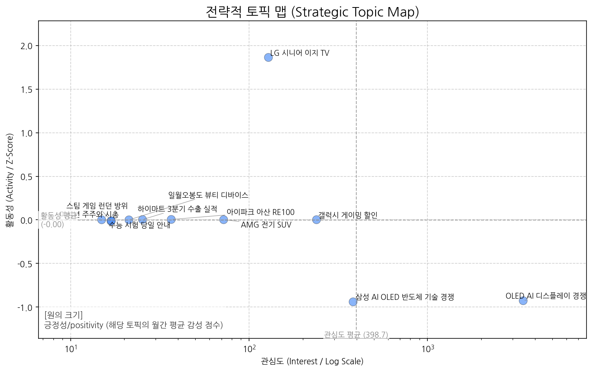
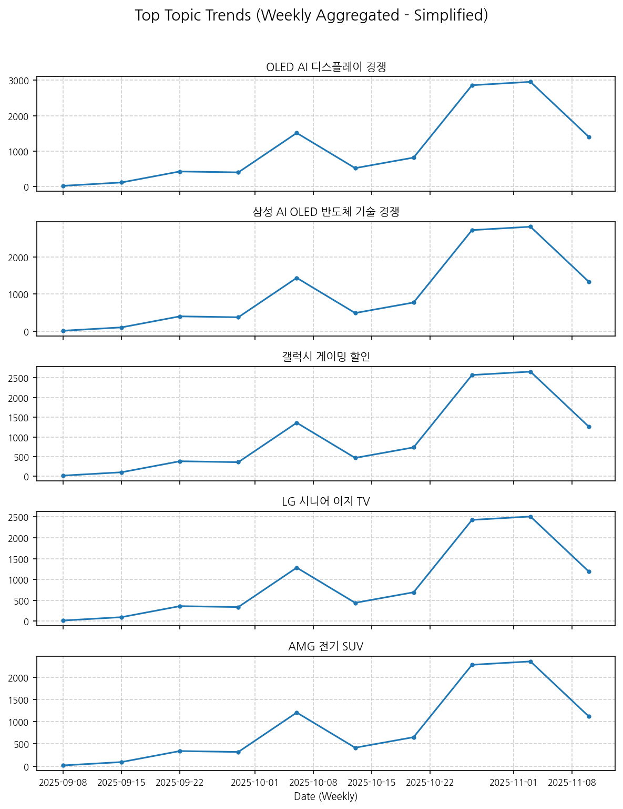
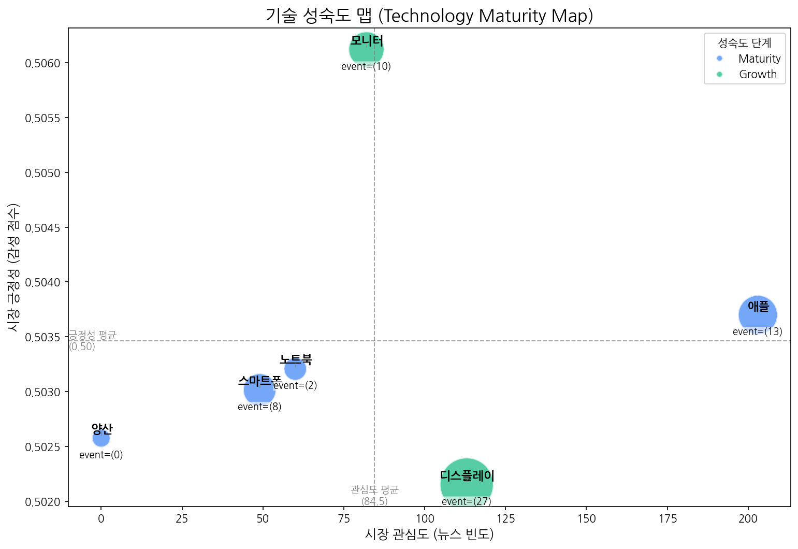
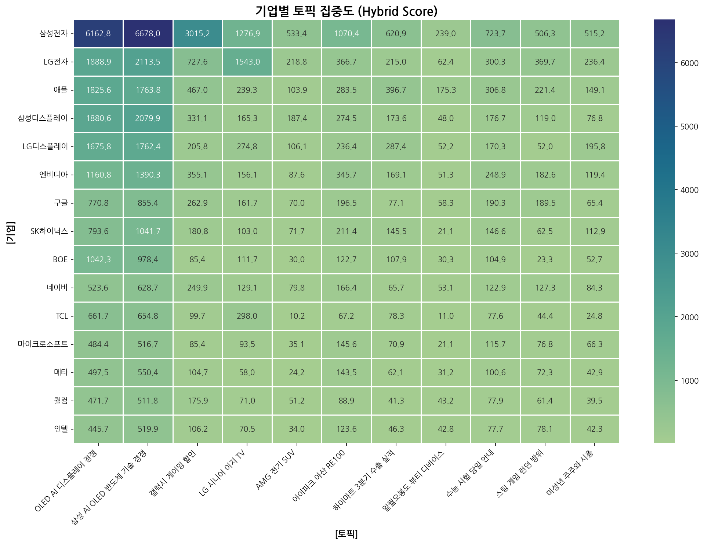
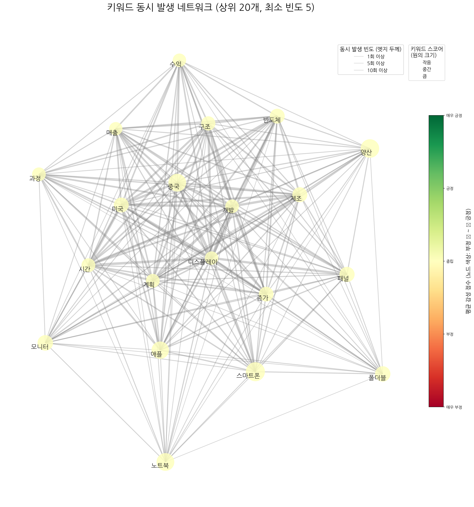
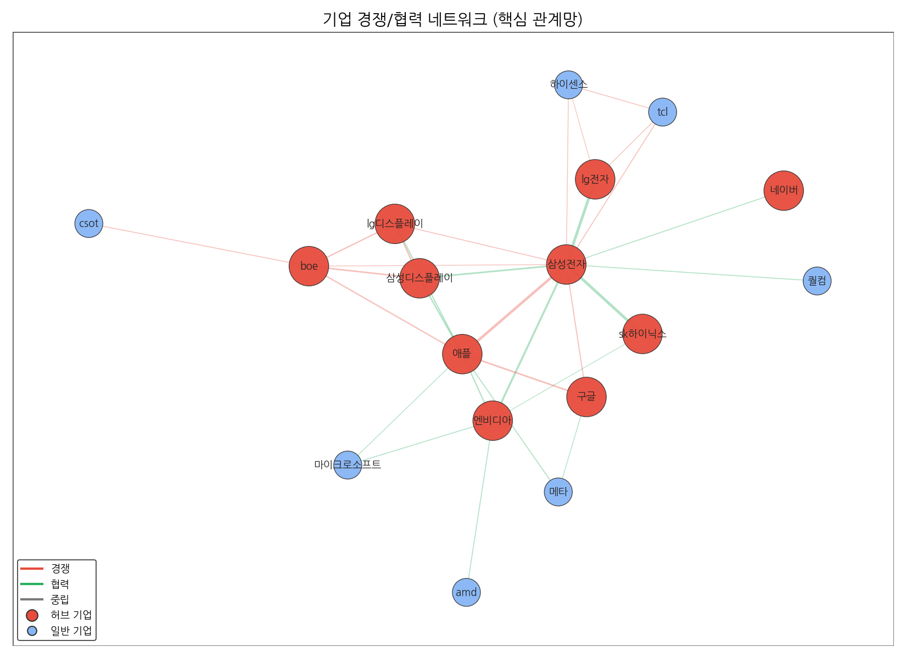
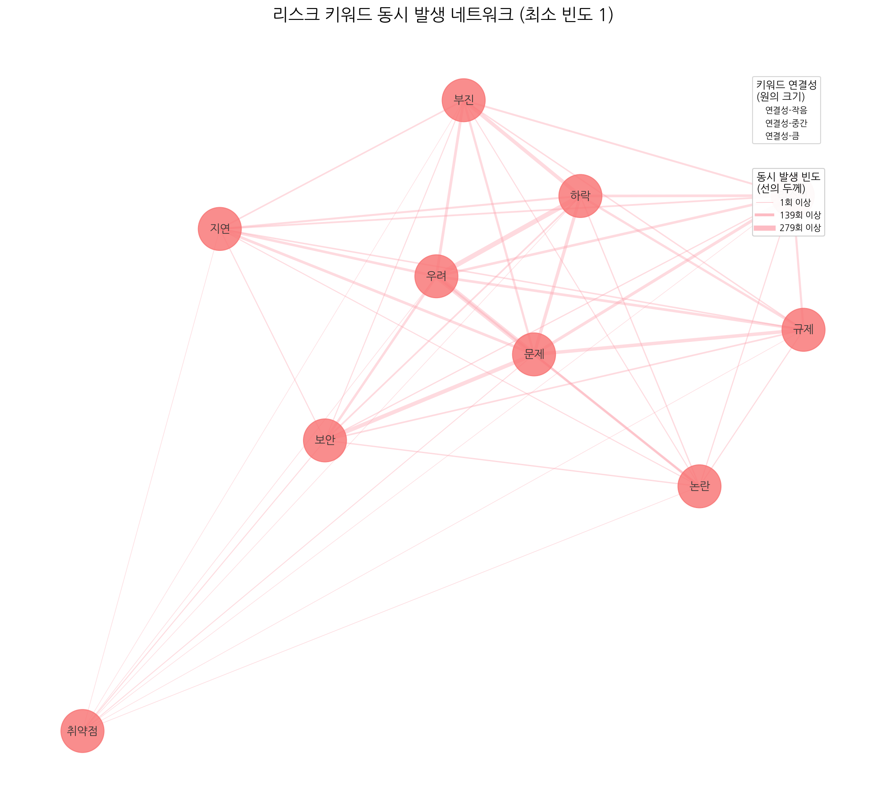
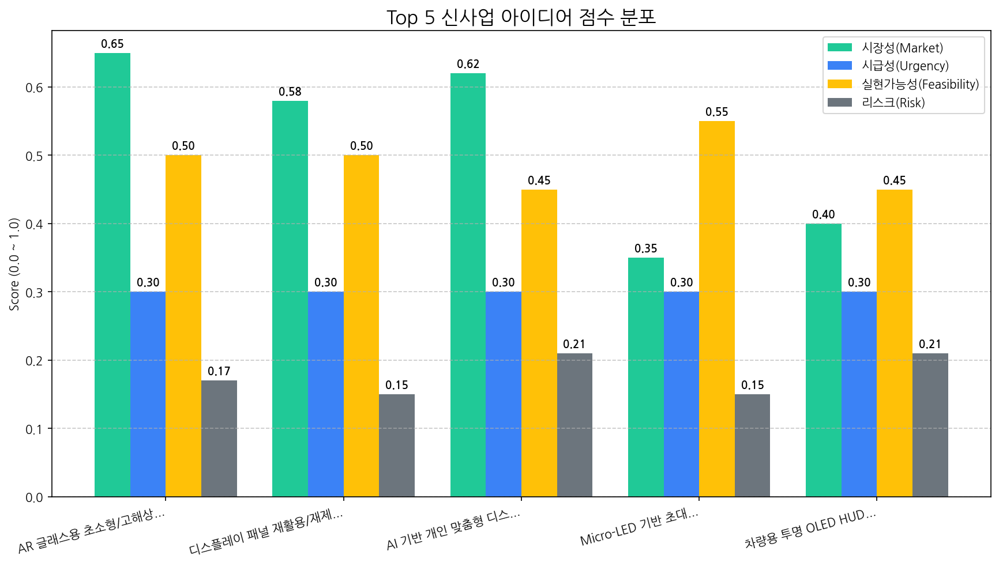

# 월간 상세 해설 리포트

Period: 2025-10-09 ~ 2025-11-07 | Generated by Market Intelligence Team

## Executive Summary

## 월간 전략 보고서 Executive Summary (2025년 10월 9일 ~ 2025년 11월 7일)

**개요:**

본 보고서는 2025년 10월 9일부터 2025년 11월 7일까지의 시장 분석 결과를 요약하고, 당사의 전략적 방향에 대한 권고 사항을 제시합니다. 지난 한 달간 시장의 핵심적인 변화를 파악하고, 우리에게 가장 큰 기회와 위협 요인을 식별하여 다음 분기에 집중해야 할 최우선 전략 방향을 제시하는 데 목적을 둡니다.

**주요 분석 결과:**

*   **최고 사업 아이템:** AR 글래스용 초소형/고해상도 OLED 마이크로 디스플레이 기술은 여전히 시장에서 높은 잠재력을 가진 사업 아이템으로 평가됩니다. 이는 AR 글래스 시장의 성장과 함께 수요가 증가할 것으로 예상되며, 당사의 기술 경쟁력을 바탕으로 시장 선점 효과를 누릴 수 있는 기회입니다.

*   **주요 위험 요인:** 현재까지는 시장 분석 결과에서 특별히 두드러지는 위험 요인은 발견되지 않았습니다. 하지만, 기술 변화의 속도, 경쟁 심화 가능성, 거시 경제 변동성 등 잠재적인 위험 요인에 대한 지속적인 모니터링이 필요합니다.

*   **주요 신기술:** 현재까지는 시장 분석 결과에서 특별히 두드러지는 신기술 동향은 발견되지 않았습니다. 하지만, 관련 기술 분야의 혁신적인 발전 가능성을 지속적으로 주시하며, 미래 경쟁력 확보를 위한 기술 투자 전략을 검토해야 합니다.

**기회 및 위협:**

*   **기회:** AR 글래스 시장의 성장과 함께 고성능 마이크로 디스플레이에 대한 수요가 증가할 것으로 예상됩니다. 당사의 기술력을 바탕으로 AR 글래스 제조사와의 협력을 강화하고, 시장 점유율을 확대할 수 있는 기회를 적극적으로 활용해야 합니다.

*   **위협:** 현재까지는 뚜렷한 위협 요인이 부각되지 않았지만, 경쟁사의 기술 혁신, 신규 진입자의 등장, 부품 공급망의 불안정 등은 잠재적인 위협 요인으로 작용할 수 있습니다. 이에 대한 대비책을 마련하고, 경쟁 우위를 유지하기 위한 노력을 지속해야 합니다.

**최우선 전략 방향 (다음 분기):**

다음 분기에는 다음과 같은 전략 방향에 집중해야 합니다.

1.  **AR 글래스용 마이크로 디스플레이 시장 선점:** AR 글래스 제조사와의 협력 관계를 구축하고, 제품 성능을 향상시키는 데 집중하여 시장 경쟁력을 강화해야 합니다.
2.  **미래 기술 경쟁력 확보:** 관련 기술 분야의 혁신 동향을 지속적으로 모니터링하고, 필요한 기술 투자를 통해 미래 경쟁력을 확보해야 합니다.
3.  **위험 관리 시스템 강화:** 잠재적인 위험 요인에 대한 모니터링 시스템을 강화하고, 발생 가능한 위협에 대한 대응 계획을 수립해야 합니다.

**결론:**

AR 글래스용 마이크로 디스플레이 시장은 당사에게 중요한 성장 기회를 제공합니다. 경쟁 우위를 확보하고, 미래 기술 경쟁력을 강화하며, 잠재적인 위험 요인에 대한 대비책을 마련하는 데 집중하여 지속적인 성장을 이루어 나가겠습니다.

**보고자:** [당신의 이름], 최고 전략 책임자 (CSO)

## 1. 전략적 시장 포지셔닝 맵

> 시장의 핵심 토픽 지형, 트렌드, 성장률을 통해 거시적인 동향과 기회 영역을 분석합니다.

### 토픽 상세 정보

| 토픽                   | 요약                                                                                               | 핵심 키워드             |
|:---------------------|:-------------------------------------------------------------------------------------------------|:-------------------|
| OLED AI 디스플레이 경쟁     | 삼성전자 갤럭시, 중국 디스플레이 업체와 미국 시장에서 OLED 패널 기술 경쟁 심화, AI 기술 접목된 TV 시장 동향 분석.                          | oled, ai, 중국       |
| 삼성 AI OLED 반도체 기술 경쟁 | 삼성전자가 AI, OLED, 반도체 등 핵심 기술을 활용하여 TV 및 디스플레이 시장에서 중국과의 경쟁을 심화하고 있다는 내용입니다.                       | ai, oled, 반도체      |
| 갤럭시 게이밍 할인           | 삼성전자가 갤럭시 게이밍 상품을 대상으로 할인 및 혜택을 제공하는 구매 행사 소식.                                                   | 할인, 혜택을, 구매        |
| LG 시니어 이지 TV         | LG전자가 시니어를 위한 이지 TV를 출시하고, 관련 기능 및 헬프 서비스 등을 제공하는 내용입니다.                                         | 시니어, tv, 이지        |
| AMG 전기 SUV           | 메르세데스-AMG의 전기 SUV 차량 (T30 모델 포함)의 주행 성능, 렌즈(카메라 관련), 시트 등 차량 전반에 대한 내용.                          | 주행, suv, amg       |
| 아이파크 아산 RE100        | 아이파크가 아산 및 운정 지역 산업단지에 RE100을 도입하고, 코닝정밀소재 등 기업들이 참여하는 내용입니다.                                    | 기업, 아이파크, 아산       |
| 하이마트 3분기 수출 실적       | 롯데하이마트의 3분기 수출 누계 실적과 전년 대비 변화, 그리고 '안심 care ict' 관련 일회성 요인 등을 다루는 내용입니다.                        | 누계, 전년, 하이마트       |
| 일월오봉도 뷰티 디바이스        | 일월오봉도 디자인을 적용한 뷰티 디바이스 '부스터 프로' 또는 관련 제품 (예: 일월오봉도 에디션)에 대한 뉴스.                                  | 일월오봉도, 부스터, 부스터 프로 |
| 수능 시험 당일 안내          | 수능 시험 당일 수험생이 알아야 할 준비물, 유의사항 등 안내.                                                              | 시험, 수능, 시험장        |
| 스팀 게임 런던 방위          | 스팀 플랫폼에서 정식 출시된 게임으로, 런던을 배경으로 캐릭터를 활용한 방위 게임일 가능성이 높습니다. 전작의 특징을 이어받아 새로운 플랫폼에서 선보이는 게임으로 보입니다. | 스팀, 정식, 게임         |
| 미성년 주주와 시총           | 미성년자가 상장사 주식을 보유한 현황 분석. 특히 시가총액 상위 기업 주식을 보유한 미성년 주주의 평균 보유량 관련 내용 추정.                          | 미성년자, 상장사, 주주      |

### 토픽 성장/하락 추세

|   topic_id | topic_name           |   momentum_score |
|-----------:|:---------------------|-----------------:|
|          3 | LG 시니어 이지 TV         |            1.853 |
|          4 | AMG 전기 SUV           |            0     |
|          2 | 갤럭시 게이밍 할인           |            0     |
|          7 | 일월오봉도 뷰티 디바이스        |            0     |
|          8 | 수능 시험 당일 안내          |            0     |
|          5 | 아이파크 아산 RE100        |            0     |
|          6 | 하이마트 3분기 수출 실적       |            0     |
|          9 | 스팀 게임 런던 방위          |            0     |
|         10 | 미성년 주주와 시총           |            0     |
|          1 | 삼성 AI OLED 반도체 기술 경쟁 |           -0.936 |
|          0 | OLED AI 디스플레이 경쟁     |           -0.936 |

### 포지셔닝 및 트렌드 종합 해설 (AI)

## 분석 결과 (Markdown):

#### 종합 시장 동향 해석

- **주요 동력**: 현재 시장의 주요 동력은 **특정 타겟 고객층을 위한 맞춤형 제품 및 서비스** 개발 경쟁입니다. LG 시니어 이지 TV의 높은 모멘텀은 고령화 사회에 맞춰 증가하는 시니어 계층의 니즈를 충족시키는 제품에 대한 시장의 긍정적인 반응을 보여줍니다. 이는 단순히 제품의 기능적 개선뿐 아니라, 사용 편의성, 접근성, 정보 제공 등 종합적인 경험 설계를 통해 차별화를 꾀하는 것이 중요함을 시사합니다.

- **부상하는 기회**: **기술 경쟁 심화 속 틈새 시장 공략**이 새로운 기회로 부상하고 있습니다. 삼성과 중국 업체의 AI, OLED, 반도체 기술 경쟁이 심화되는 가운데, LG의 시니어 TV와 같이 특정 니즈를 가진 소비자를 위한 제품은 경쟁의 직접적인 충돌을 피하면서 시장 점유율을 확보할 수 있는 전략적 선택이 될 수 있습니다. 또한, 갤럭시 게이밍 할인과 같이 특정 사용자를 위한 프로모션 또한 긍정적인 반응을 이끌어 낼 수 있습니다.  다른 예시로, 아이파크의 RE100 도입처럼 ESG 경영에 대한 사회적 요구에 부응하는 움직임 또한 새로운 기회를 창출할 수 있습니다.

#### 전략적 제언

- **집중 영역**: **고객 맞춤형 제품 및 서비스 개발과 연계된 마케팅 전략**에 자원을 집중해야 합니다. 단순히 제품의 스펙 경쟁이 아닌, 고객의 실제 사용 경험을 개선하고 삶의 질을 향상시킬 수 있는 가치를 제공하는 데 초점을 맞춰야 합니다. LG 시니어 이지 TV의 성공 요인을 분석하여, 우리 회사의 제품 및 서비스에도 적용할 수 있는 방안을 모색해야 합니다.  구체적으로는,  타겟 고객층의 니즈를 깊이 이해하고, 그들의 요구에 맞는 제품 및 서비스 기능을 개발하며, 사용 편의성을 극대화하는 디자인을 적용해야 합니다.  또한,  마케팅 메시지를 통해 제품 및 서비스가 제공하는 실질적인 가치를 명확하게 전달해야 합니다.

- **모니터링 영역**: **삼성과 중국 업체의 OLED, AI, 반도체 기술 경쟁 동향**과 **미성년 주주 및 시총 변화**를 주의 깊게 모니터링해야 합니다. 기술 경쟁 동향은 시장의 전반적인 기술 트렌드를 파악하고 미래 시장을 예측하는 데 중요한 정보를 제공합니다. 미성년 주주 및 시총 변화는 미래 소비 트렌드를 예측하고 잠재 고객층을 파악하는 데 도움이 될 수 있습니다.  또한, 하이마트 3분기 수출 실적처럼 시장 전체의 경제 상황을 파악하고 위기 상황에 대비하는 것도 중요합니다.

## 2. 기술 수명 주기 및 R&D 투자 타이밍 분석

> 주요 기술의 시장 성숙도 단계를 진단하고, R&D 및 사업화 투자 시점을 판단합니다.

| 기술    | 단계       | 판단 근거                                                                                               |
|:------|:---------|:----------------------------------------------------------------------------------------------------|
| 노트북   | Maturity | 비교적 안정적인 뉴스 언급 빈도와 중립적인 시장 감성 점수, 그리고 낮은 주요 이벤트 발생 비율은 노트북 시장이 성숙기에 접어들었음을 시사합니다.                   |
| 양산    | Maturity | 뉴스 언급 빈도와 주요 이벤트 발생 비율이 모두 0회로, 시장 관심도가 낮고 안정화 단계에 접어든 것으로 판단됩니다.                                   |
| 스마트폰  | Maturity | 스마트폰은 뉴스 언급 빈도가 비교적 낮고, 시장 감성 점수가 중간 수준이며, 투자 및 출시 이벤트는 발생하지만 수주 이벤트가 없는 것으로 보아 성숙기에 접어든 기술로 판단됩니다. |
| 모니터   | Growth   | 뉴스 언급 빈도가 비교적 높고 출시 이벤트가 꾸준히 발생하며 시장 감성 점수가 중간 수준인 것으로 보아 성장기에 해당한다고 판단됩니다.                         |
| 디스플레이 | Growth   | 비교적 높은 뉴스 언급 빈도와 투자 및 출시 이벤트 발생 건수를 고려할 때, 디스플레이 기술 시장은 성장기에 있다고 판단됩니다.                             |
| 애플    | Maturity | 애플은 높은 뉴스 언급 빈도, 중립적인 시장 감성, 그리고 제한적인 성장 이벤트 발생 비율을 보여 성숙기에 접어든 기술로 판단됩니다.                          |

## 3. 경쟁사 전략적 의도 및 파트너 관계망 분석

> 경쟁사의 토픽 집중도와 키워드 연관성, 기업 간 관계망을 통해 경쟁 구도와 전략을 분석합니다.

### 기업-토픽 집중도

#### 집중도 매트릭스 (상위 5개사)

| org   | topic_0     | topic_1     | topic_10   | topic_2     | topic_3    | topic_4   | topic_5     | topic_6    | topic_7   | topic_8    | topic_9     |
|:------|:------------|:------------|:-----------|:------------|:-----------|:----------|:------------|:-----------|:----------|:-----------|:------------|
| AMD   | 377.22 (1%) | 413.64 (1%) | nan        | 188.67 (3%) | 68.88 (1%) | nan       | 110.90 (2%) | 55.41 (2%) | nan       | 95.56 (2%) | 118.97 (4%) |
| ASE   | 20.61 (0%)  | 26.80 (0%)  | 3.01 (0%)  | 6.41 (0%)   | nan        | 5.12 (0%) | 7.62 (0%)   | 2.96 (0%)  | nan       | nan        | 3.01 (0%)   |
| ASUS  | 141.54 (1%) | 183.46 (1%) | nan        | 62.65 (1%)  | 21.75 (0%) | nan       | 47.83 (1%)  | 14.78 (0%) | nan       | 21.55 (1%) | 67.01 (2%)  |
| AUO   | 61.15 (0%)  | 70.77 (0%)  | nan        | 6.41 (0%)   | 10.88 (0%) | nan       | 9.70 (0%)   | 5.17 (0%)  | 5.06 (0%) | 8.62 (0%)  | nan         |
| Acer  | 85.89 (0%)  | 108.56 (0%) | nan        | 18.51 (0%)  | 11.60 (0%) | nan       | 12.48 (0%)  | 12.56 (0%) | nan       | 7.90 (0%)  | 26.35 (1%)  |

### 키워드 및 기업 관계망

#### 주요 기업 관계 Top 5

| 기업1     | 기업2   |   관계강도(언급빈도) | 관계유형(추정)    |
|:--------|:------|-------------:|:------------|
| lg전자    | 삼성전자  |          663 | partnership |
| sk하이닉스  | 삼성전자  |          517 | partnership |
| 삼성전자    | 애플    |          458 | rivalry     |
| 삼성전자    | 엔비디아  |          363 | partnership |
| 삼성디스플레이 | 삼성전자  |          306 | partnership |

#### Top 3 경쟁사 전략 방향성 해석 (AI)

| 기업   | 핵심 집중 토픽                                             | 전략 방향성 해석                                                                                                                                                               |
|:-----|:-----------------------------------------------------|:------------------------------------------------------------------------------------------------------------------------------------------------------------------------|
| 삼성전자 | 삼성 AI OLED 반도체 기술 경쟁, OLED AI 디스플레이 경쟁, 갤럭시 게이밍 할인   | 삼성전자는 AI 기술을 중심으로 OLED 디스플레이 경쟁력을 강화하고, 반도체 기술 우위를 확보하며, 갤럭시는 게이밍 시장을 중심으로 단기적 판매 확대를 꾀하는 전략을 추진하고 있습니다. 즉, AI 기술을 활용한 고부가 가치 제품 개발과 특정 시장 공략을 통해 수익성을 개선하려는 것으로 해석됩니다. |
| LG전자 | 삼성 AI OLED 반도체 기술 경쟁, OLED AI 디스플레이 경쟁, LG 시니어 이지 TV | LG전자는 삼성과의 AI, OLED, 반도체 기술 경쟁 심화 속에서, 프리미엄 디스플레이 시장 선점을 위한 AI OLED 기술 혁신과 더불어 시니어 시장을 겨냥한 맞춤형 TV 제품으로 시장 다변화를 동시에 추구하고 있습니다.                                           |
| 애플   | OLED AI 디스플레이 경쟁, 삼성 AI OLED 반도체 기술 경쟁, 갤럭시 게이밍 할인   | 애플은 디스플레이 기술 경쟁력 강화를 위해 AI 기반 OLED 기술 개발에 집중하고 있으며, 경쟁사(삼성)의 게이밍 시장 공략에 대응하기 위한 전략을 모색하고 있습니다. 궁극적으로는 AI 기술을 접목한 디스플레이 혁신을 통해 프리미엄 시장에서 우위를 유지하려는 것으로 판단됩니다.            |

## 4. 전략적 리스크 관리 및 완화 액션 제안

> 데이터 기반으로 탐지된 주요 리스크와 관련 시그널을 분석하고, 대응 방안을 제시합니다.

### 리스크 관련 시그널 시각화

### 탐지된 주요 리스크 목록

> - 데이터 없음

### 리스크 종합 평가 및 대응 제안 (AI)

> 분석할 리스크 데이터가 없습니다.

## 5. 데이터 기반 신사업 아이디어 제안

> 시장 데이터 분석을 통해 도출된 Top 5 신사업 아이디어와 각 아이디어의 사업성을 평가합니다.

| 아이디어                              | 가치 제안                                                                                                            |   총점 |
|:----------------------------------|:-----------------------------------------------------------------------------------------------------------------|-----:|
| AR 글래스용 초소형/고해상도 OLED 마이크로 디스플레이  | 초소형, 고해상도 OLED 마이크로 디스플레이를 통해 AR 글래스의 몰입감 및 휴대성 향상. 저전력 설계로 배터리 사용 시간 극대화.                                       |  4.1 |
| 디스플레이 패널 재활용/재제조 서비스 (B2B)        | 폐기 디스플레이 패널 회수, 분해, 재활용/재제조를 통해 자원 순환 경제 구축 및 환경 규제 준수 지원. 신규 패널 대비 저렴한 가격으로 재제조 패널 공급.                          |  4   |
| AI 기반 개인 맞춤형 디스플레이 솔루션            | AI 기반 실시간 분석을 통해 사용자 시력 보호, 콘텐츠 몰입도 향상, 전력 효율 최적화. 기존 디스플레이 대비 차별화된 사용자 경험 제공 및 제품 경쟁력 강화.                       |  3.7 |
| Micro-LED 기반 초대형 디지털 사이니지         | Micro-LED 기술을 활용하여 크기, 해상도, 밝기 제한 없는 초대형 디지털 사이니지 구현. 뛰어난 시인성 및 내구성으로 옥외 광고 효과 극대화.                              |  3.3 |
| 차량용 투명 OLED HUD (Head-Up Display) | 투명 OLED를 활용하여 넓은 시야각과 선명한 화질 제공, AR 기반 내비게이션, 위험 경고, 엔터테인먼트 정보 제공으로 운전 안전성 및 편의성 향상. 경쟁사 대비 차별화된 프리미엄 HUD 경험 제공. |  3   |

## 6. Top 1 신사업 아이디어 검증 (향후 2주 실행 계획)

> 가장 우선순위가 높은 신사업 아이디어를 검증하기 위한 구체적인 실행 계획을 제시합니다.

| Hypothesis                                                                                        | Target                                                                                        | KPI                                                                                                                                        | Owner   | Due        |
|:--------------------------------------------------------------------------------------------------|:----------------------------------------------------------------------------------------------|:-------------------------------------------------------------------------------------------------------------------------------------------|:--------|:-----------|
| 북미 빅테크 AR 글래스 개발사는 현재 기술 수준으로는 구현하기 어려운 초소형/고해상도 OLED 마이크로 디스플레이 기술에 대한 높은 수요가 존재한다.              | 북미 빅테크 AR 글래스 개발사 (Meta, Apple, Google)의 디스플레이 기술 담당 의사 결정권자 5명 이상                            | 5명 이상의 의사 결정권자 인터뷰를 통해, 최소 3개 기업으로부터 긍정적인 기술 도입 검토 의사 (구체적인 기술 사양 및 협업 가능성 논의) 확보.                                                         | 사업개발팀   | 2025-11-21 |
| OLED on Silicon 기술 기반의 마이크로 디스플레이 시제품 제작 시, 목표 해상도 및 전력 소모 수준을 달성 가능하며, 기존 기술 대비 경쟁 우위를 확보할 수 있다. | 내부 기술팀 (디스플레이, 회로 설계, 광학)                                                                     | 목표 해상도 (예: 8K 이상) 및 전력 소모 (예: 1W 이하) 성능을 충족하는 OLED on Silicon 기반 마이크로 디스플레이 시제품 프로토타입 개발 완료. 개발 결과 보고서에 경쟁사 대비 기술적 우위 (해상도, 전력 효율, 크기) 입증. | 기술기획팀   | 2025-11-21 |
| AR 글래스 시장 성장률에 대한 시장조사 결과, 향후 3년 이내에 상용화 가능한 수준의 기술 개발 및 양산 체계 구축이 투자 대비 충분한 수익성을 확보할 수 있다.       | 신뢰성 있는 시장조사기관 (예: Gartner, IDC)의 AR 글래스 시장 성장률 전망 보고서 및 경쟁사 (예: Sony, eMagin)의 투자 및 개발 동향 분석. | 최소 2개 이상의 시장조사 보고서에서 향후 3년 내 AR 글래스 시장의 연평균 성장률(CAGR)이 30% 이상으로 예측. 경쟁사 기술 개발 동향 분석 결과, 당사의 기술 경쟁력이 시장 진입에 유리함을 입증.                        | 마케팅팀    | 2025-11-21 |
