# Weekly/New Biz Report (2025-10-09)

## Executive Summary

- 이번 기간 핵심 토픽과 키워드, 주요 시사점을 요약합니다.

## 데일리 인텔리전스 브리핑

**1. 핵심 맥락:**

*   **프리미엄 디스플레이 시장 경쟁 심화:** OLED TV, AI 가전 등 프리미엄 제품군을 중심으로 경쟁이 격화되고 있으며, 특히 삼성디스플레이와 애플의 차세대 디스플레이 기술 협력 및 중국 시장 공략이 주요 흐름입니다.
*   **AI 기반 데이터센터 및 전력 효율 중요성 증대:** AI 기술 발전과 데이터센터 확장에 따라 전력 소비 문제가 부각되고 있으며, LG를 비롯한 기업들이 AI 기반 전력 효율 기술 개발에 집중하고 있습니다.
*   **디스플레이 산업 내 반도체 기술 중요성 확대:** 디스플레이 성능 향상을 위한 전용 반도체 개발 경쟁이 치열하며, 특히 고성능 디스플레이 구현에 필요한 반도체 장비 및 핵심 기술 확보가 중요해지고 있습니다.

**2. 최근 변화/스파이크:**

*   **2025년 9월 30일 및 10월 1일 기사 수 급증:** 이 시기에 "애플", "패널", "삼성", "디스플레이" 키워드가 높은 빈도로 등장한 것으로 보아, 삼성디스플레이의 애플 차세대 디스플레이 패널 공급 관련 대규모 계약 발표 또는 신기술 공개와 관련된 시장의 높은 관심이 반영된 것으로 추론됩니다.

**3. 실무 인사이트:**

*   **사업 개발:**
    *   **차세대 디스플레이 기술 협력 기회 모색:** 삼성디스플레이-애플 협력 사례를 벤치마킹하여, 폴더블, 마이크로 LED 등 차세대 디스플레이 기술 분야에서 경쟁 우위를 확보할 수 있는 기술 파트너십 및 투자 기회를 적극적으로 발굴해야 합니다.
*   **기술 기획:**
    *   **AI 기반 전력 효율 기술 개발 투자 확대:** 데이터센터 및 AI 가전 시장 확대를 고려하여, 디스플레이 구동 전력 효율을 극대화할 수 있는 AI 기반 기술 개발에 대한 투자를 확대하고, 관련 특허 확보 전략을 수립해야 합니다.
    *   **디스플레이 구동 전용 반도체 기술 경쟁력 강화:** 고성능 디스플레이 구현에 필수적인 전용 반도체 기술 경쟁력 강화를 위해, 관련 기술 개발 로드맵을 구체화하고, 외부 전문 기업과의 협력 및 M&A를 통해 기술 포트폴리오를 확장해야 합니다.

## Key Metrics

- 기간: 2025-09-08 ~ 2025-10-08
- 총 기사 수: 2,711
- 문서 수: N/A
- 키워드 수(상위): 15
- 토픽 수: 8
- 시계열 데이터 일자 수: 31

## Top Keywords

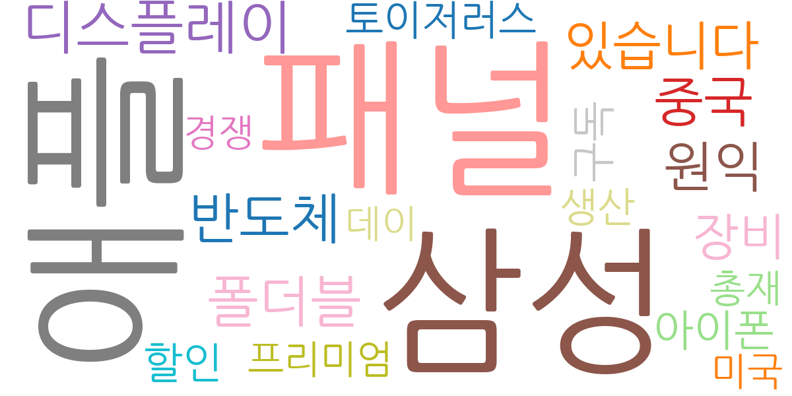

| Rank | Keyword | Score |
|---:|---|---:|
| 1 | 애플 | 0.991 |
| 2 | 패널 | 0.955 |
| 3 | 삼성 | 0.853 |
| 4 | 디스플레이 | 0.730 |
| 5 | 폴더블 | 0.669 |
| 6 | 반도체 | 0.649 |
| 7 | 원익 | 0.632 |
| 8 | 중국 | 0.619 |
| 9 | 있습니다 | 0.601 |
| 10 | 장비 | 0.542 |
| 11 | 구독 | 0.415 |
| 12 | 아이폰 | 0.402 |
| 13 | 할인 | 0.386 |
| 14 | 토이저러스 | 0.376 |
| 15 | 생산 | 0.367 |

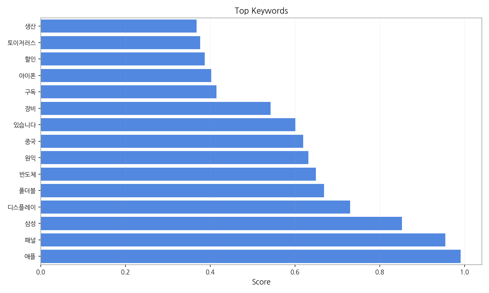

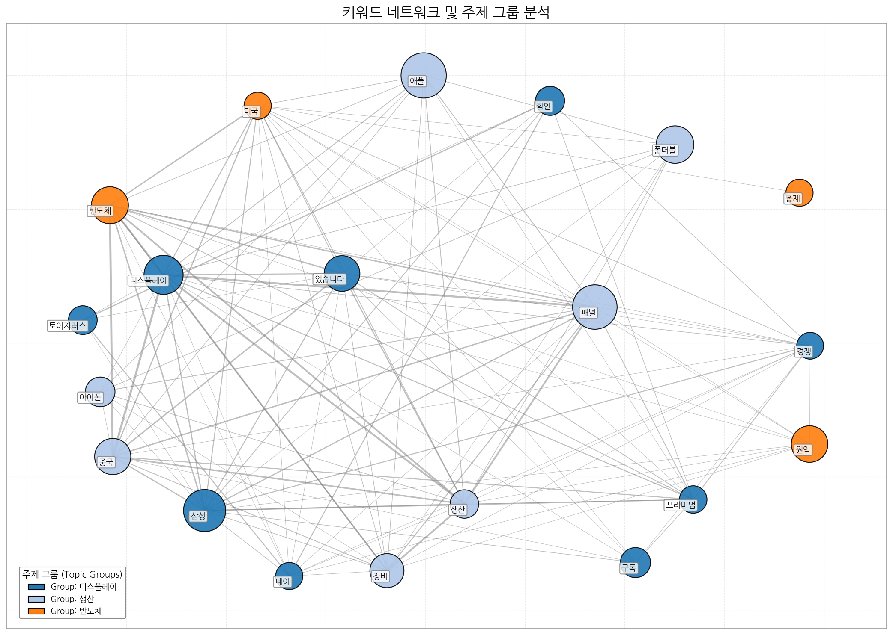

## Topics

- 반도체, 장비, 기술 (#0)
  - 대표 단어: 반도체, 장비, 기술, 디스플레이, 핵심, 생산
- ai, 데이터센터, 전력 (#1)
  - 대표 단어: ai, 데이터센터, 전력, lg, 기술, 미래
- 기능을, 디스플레이, 성능을 (#2)
  - 대표 단어: 기능을, 디스플레이, 성능을, 프로, 역시, 가장
- ai, 명절, 이달 (#3)
  - 대표 단어: ai, 명절, 이달, led, 기업, 할인
- 기술과, 삼성디스플레이, 기술을 (#4)
  - 대표 단어: 기술과, 삼성디스플레이, 기술을, 차세대, 애플, 부품
- oled, tv, 패널 (#5)
  - 대표 단어: oled, tv, 패널, lcd, 디스플레이, 중국
- tv, ai, 가전 (#6)
  - 대표 단어: tv, ai, 가전, 프리미엄, 추석, 한국
- ai, 미국, 반도체 (#7)
  - 대표 단어: ai, 미국, 반도체, 전기차, 삼성, 경우

## 기업×토픽 집중도 매트릭스 (주간)

**핵심 요약:**

- **가장 경쟁이 치열한 토픽:** **ai, 데이터센터** (가장 많은 기업들이 주목)

- **가장 집중도가 높은 기업:** **삼성전자** (다양한 토픽에 걸쳐 높은 관련성)

- **주목할 만한 조합:** **삼성전자 @ topic_5** (가장 높은 단일 연관 점수 기록)

각 기업별 상위 8개 토픽의 연관 점수와 해당 토픽 내에서의 점유율(%)을 나타냅니다.

| org     | topic_0     | topic_1     | topic_2     | topic_3     | topic_4     | topic_5     | topic_6     | topic_7     |
|:--------|:------------|:------------|:------------|:------------|:------------|:------------|:------------|:------------|
| BOE     | 12.02 (5%)  | 6.93 (4%)   | 13.25 (6%)  | 11.31 (6%)  | 7.93 (4%)   | 27.41 (8%)  | 12.48 (5%)  | 16.94 (8%)  |
| BYD     | 1.41 (1%)   | 1.39 (1%)   | 2.21 (1%)   | 2.12 (1%)   | 3.61 (2%)   | 5.05 (2%)   | 4.85 (2%)   | 1.47 (1%)   |
| CES     | 1.41 (1%)   | 0.69 (0%)   | nan         | 0.71 (0%)   | 2.16 (1%)   | 0.72 (0%)   | 1.39 (1%)   | 0.74 (0%)   |
| CSOT    | 9.90 (4%)   | 2.77 (2%)   | 11.04 (5%)  | 7.07 (4%)   | 7.21 (3%)   | 25.97 (8%)  | 9.70 (4%)   | 6.63 (3%)   |
| Dell    | nan         | 0.69 (0%)   | 0.74 (0%)   | 1.41 (1%)   | nan         | nan         | 0.69 (0%)   | 0.74 (0%)   |
| HMI     | 0.71 (0%)   | 2.08 (1%)   | nan         | nan         | 0.72 (0%)   | 0.72 (0%)   | 0.69 (0%)   | nan         |
| IoT     | 3.53 (1%)   | 6.24 (4%)   | 4.42 (2%)   | 3.53 (2%)   | 5.77 (3%)   | 5.77 (2%)   | 6.24 (3%)   | 3.68 (2%)   |
| LG디스플레이 | 12.02 (5%)  | 8.32 (5%)   | 10.31 (5%)  | 7.78 (4%)   | 11.54 (6%)  | 28.85 (9%)  | 11.78 (5%)  | 8.10 (4%)   |
| LG전자    | 21.92 (9%)  | 18.02 (11%) | 18.41 (9%)  | 14.85 (8%)  | 17.31 (8%)  | 38.95 (12%) | 29.81 (13%) | 17.67 (9%)  |
| LG화학    | 5.66 (2%)   | 2.77 (2%)   | 2.21 (1%)   | 0.71 (0%)   | 2.89 (1%)   | 2.89 (1%)   | 2.08 (1%)   | 1.47 (1%)   |
| SID     | 1.41 (1%)   | 0.69 (0%)   | nan         | nan         | 2.16 (1%)   | nan         | nan         | nan         |
| SK하이닉스  | 11.31 (5%)  | 5.55 (3%)   | 3.68 (2%)   | 4.24 (2%)   | 7.21 (3%)   | 3.61 (1%)   | 3.47 (2%)   | 7.36 (4%)   |
| TCL     | 7.78 (3%)   | 2.77 (2%)   | 11.78 (6%)  | 9.90 (5%)   | 6.49 (3%)   | 23.08 (7%)  | 11.09 (5%)  | 8.10 (4%)   |
| 구글      | 3.64 (1%)   | 5.00 (3%)   | 3.80 (2%)   | 7.29 (4%)   | 1.49 (1%)   | 2.23 (1%)   | 2.14 (1%)   | 4.55 (2%)   |
| 기아      | 5.66 (2%)   | 2.77 (2%)   | 3.68 (2%)   | 4.24 (2%)   | 6.49 (3%)   | 5.77 (2%)   | 6.24 (3%)   | 5.15 (3%)   |
| 네이버     | 0.71 (0%)   | 2.08 (1%)   | 6.63 (3%)   | 6.36 (3%)   | nan         | 2.89 (1%)   | 7.62 (3%)   | 3.68 (2%)   |
| 디지타임스   | 2.83 (1%)   | 2.08 (1%)   | 2.21 (1%)   | 0.71 (0%)   | 5.77 (3%)   | 2.89 (1%)   | 0.69 (0%)   | 0.74 (0%)   |
| 마이크로소프트 | 3.53 (1%)   | 3.47 (2%)   | 1.47 (1%)   | 6.36 (3%)   | 1.44 (1%)   | 1.44 (0%)   | 2.08 (1%)   | 4.42 (2%)   |
| 메타      | 5.66 (2%)   | 4.16 (3%)   | 3.68 (2%)   | 9.19 (5%)   | 2.89 (1%)   | 2.89 (1%)   | 4.16 (2%)   | 8.10 (4%)   |
| 벤츠      | nan         | 2.08 (1%)   | 8.84 (4%)   | 14.14 (8%)  | nan         | nan         | 6.24 (3%)   | 5.15 (3%)   |
| 삼성디스플레이 | 22.27 (9%)  | 15.28 (9%)  | 13.92 (6%)  | 6.68 (3%)   | 23.48 (11%) | 21.96 (6%)  | 13.83 (6%)  | 11.60 (6%)  |
| 삼성전자    | 50.86 (13%) | 26.59 (10%) | 45.91 (14%) | 29.38 (10%) | 39.21 (12%) | 76.10 (15%) | 47.65 (13%) | 38.84 (12%) |
| 샤오미     | 2.49 (1%)   | 2.44 (1%)   | 2.59 (1%)   | 3.32 (2%)   | 5.93 (2%)   | 11.01 (3%)  | 7.33 (3%)   | 1.73 (1%)   |
| 샤오펑     | 1.41 (1%)   | 1.39 (1%)   | 2.21 (1%)   | 2.12 (1%)   | 3.61 (2%)   | 5.05 (2%)   | 4.85 (2%)   | 1.47 (1%)   |
| 샤프      | 2.12 (1%)   | nan         | 1.47 (1%)   | 0.71 (0%)   | 1.44 (1%)   | 4.33 (1%)   | 1.39 (1%)   | nan         |
| 선익시스템   | 5.66 (2%)   | 2.77 (2%)   | 2.21 (1%)   | 0.71 (0%)   | 2.89 (1%)   | 2.89 (1%)   | 2.08 (1%)   | 1.47 (1%)   |
| 소니      | 2.12 (1%)   | 2.08 (1%)   | 4.42 (2%)   | 3.53 (2%)   | 1.44 (1%)   | 2.16 (1%)   | 2.08 (1%)   | 3.68 (2%)   |
| 아이씨디    | 5.66 (2%)   | 2.77 (2%)   | 2.21 (1%)   | 0.71 (0%)   | 2.89 (1%)   | 2.89 (1%)   | 2.08 (1%)   | 1.47 (1%)   |
| 애플      | 14.01 (5%)  | 8.40 (5%)   | 15.41 (7%)  | 7.78 (4%)   | 15.09 (7%)  | 11.91 (3%)  | 7.63 (3%)   | 9.73 (4%)   |
| 엔비디아    | 7.01 (2%)   | 6.88 (3%)   | 5.48 (2%)   | 12.27 (5%)  | 3.58 (1%)   | 3.58 (1%)   | 6.02 (2%)   | 13.70 (6%)  |
| 원익IPS   | 18.38 (8%)  | 11.09 (7%)  | 5.89 (3%)   | 3.53 (2%)   | 11.54 (6%)  | 6.49 (2%)   | 5.55 (2%)   | 6.63 (3%)   |
| 인텔      | 1.41 (1%)   | 1.39 (1%)   | 1.47 (1%)   | 1.41 (1%)   | 0.72 (0%)   | 1.44 (0%)   | 1.39 (1%)   | 2.95 (1%)   |
| 하이센스    | 5.66 (2%)   | 2.08 (1%)   | 8.84 (4%)   | 9.90 (5%)   | 5.05 (2%)   | 16.59 (5%)  | 9.70 (4%)   | 7.36 (4%)   |
| 한미반도체   | 5.66 (2%)   | 4.16 (3%)   | 1.47 (1%)   | 0.71 (0%)   | 4.33 (2%)   | 0.72 (0%)   | 1.39 (1%)   | 1.47 (1%)   |
| 현대자동차   | 4.24 (2%)   | 2.08 (1%)   | 2.95 (1%)   | 2.83 (2%)   | 2.89 (1%)   | 2.89 (1%)   | 5.55 (2%)   | 5.15 (3%)   |
| 현대차     | 7.50 (2%)   | 4.60 (2%)   | 5.86 (2%)   | 6.56 (3%)   | 8.61 (3%)   | 7.66 (2%)   | 8.28 (3%)   | 8.79 (3%)   |
| 화웨이     | 0.77 (0%)   | 0.76 (0%)   | nan         | 0.77 (0%)   | 1.58 (1%)   | 4.73 (1%)   | 1.52 (1%)   | nan         |

**코멘트 및 액션 힌트:**

> 특정 토픽에서 높은 점유율을 보이는 기업은 해당 분야의 '주도자(Leader)'일 가능성이 높습니다. 반면, 특정 기업이 소수의 토픽에 높은 점수를 집중하고 있다면, 이는 해당 기업의 '핵심 전략 분야'를 시사합니다. 경쟁사 및 파트너사의 집중 분야를 파악하여 우리의 전략을 점검해볼 수 있습니다.

## 기업×토픽 시각적 분석

### 전체 시장 구도 (Heatmap)

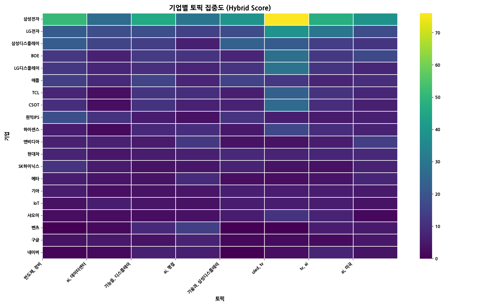

> 전체 기업과 토픽 간의 관계를 한눈에 보여줍니다. 색이 진할수록 연관성이 높습니다.

### 주요 토픽별 경쟁 구도 (Pie Charts)

> 가장 뜨거운 주제를 두고 어떤 기업들이 경쟁하는지 점유율을 보여줍니다.

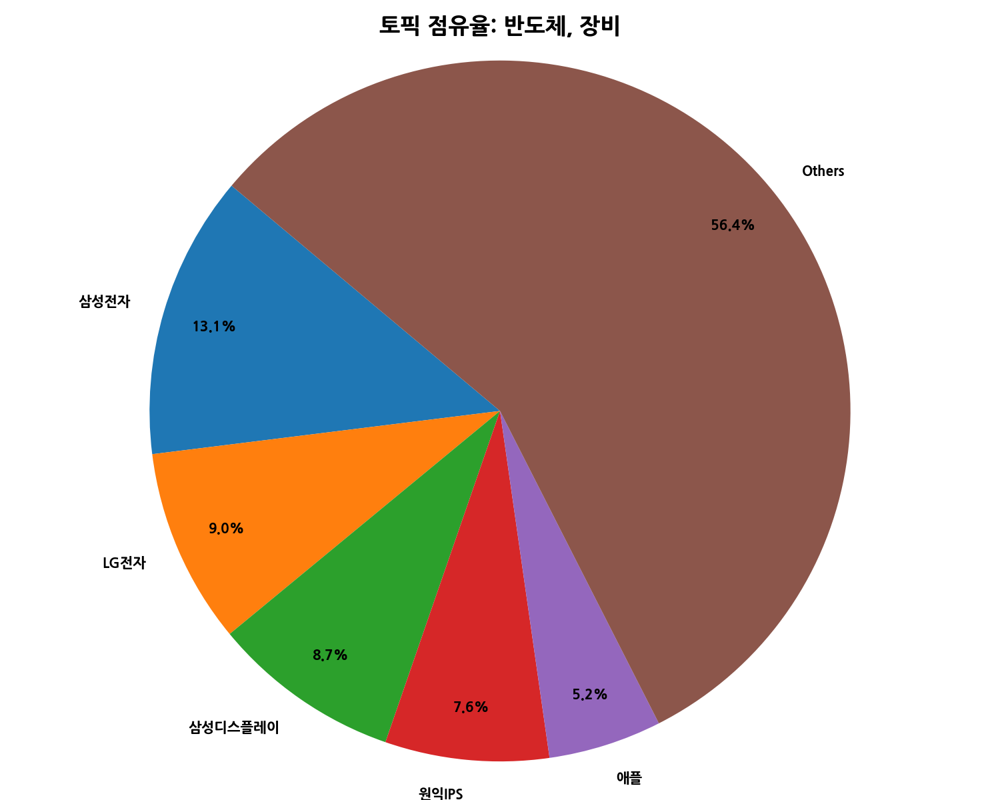
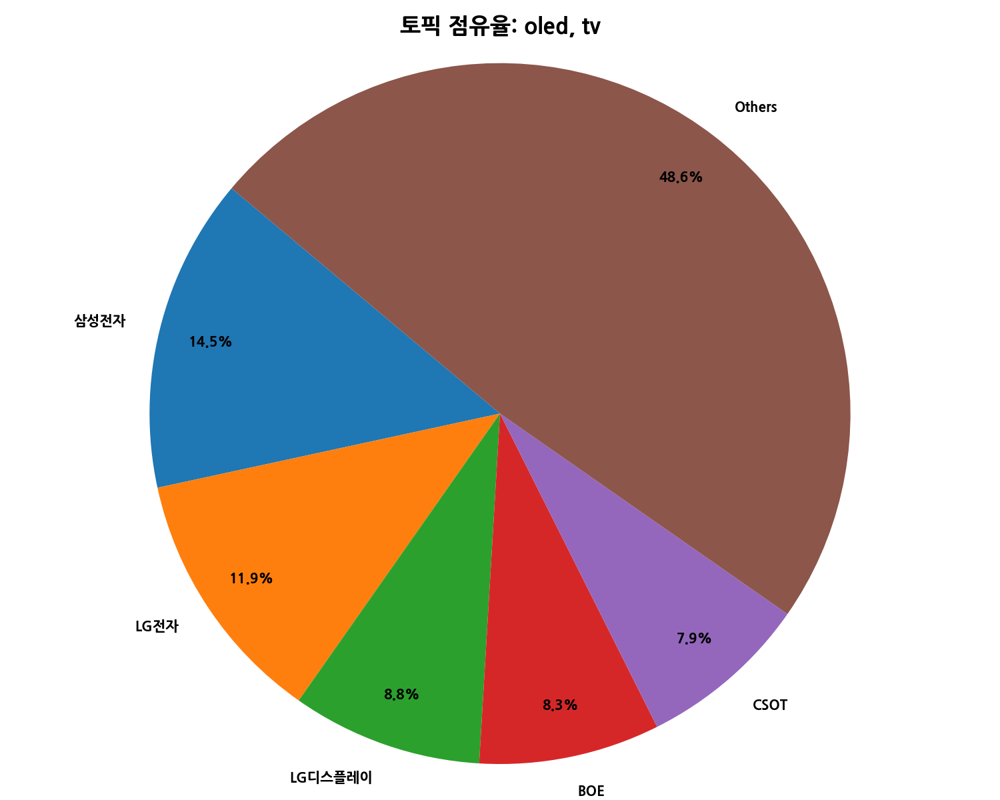
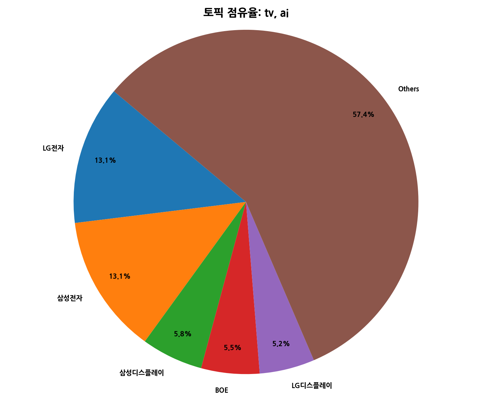

### 주요 기업별 전략 분석 (Bar Charts)

> 시장을 주도하는 주요 기업들이 어떤 토픽에 집중하고 있는지 보여줍니다.

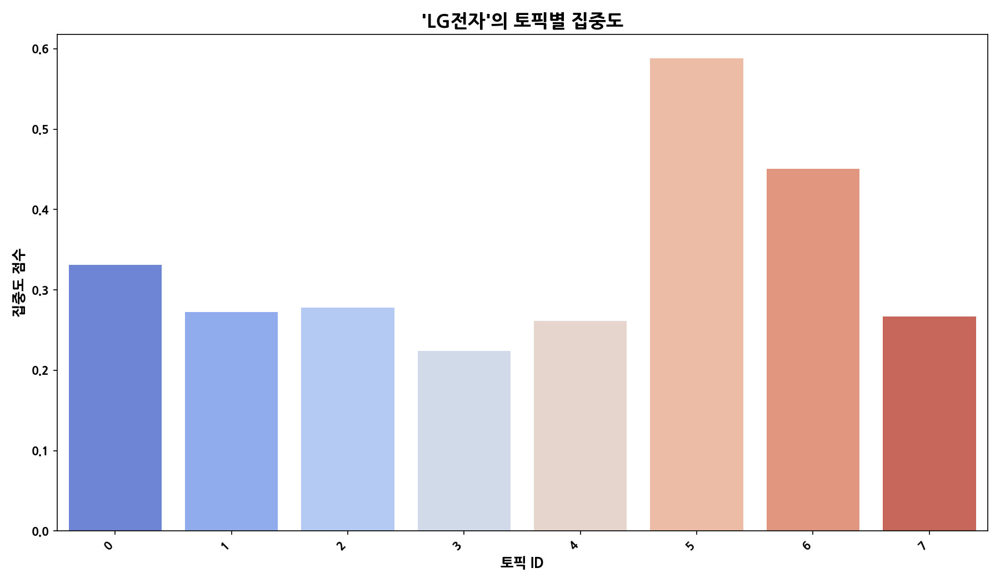
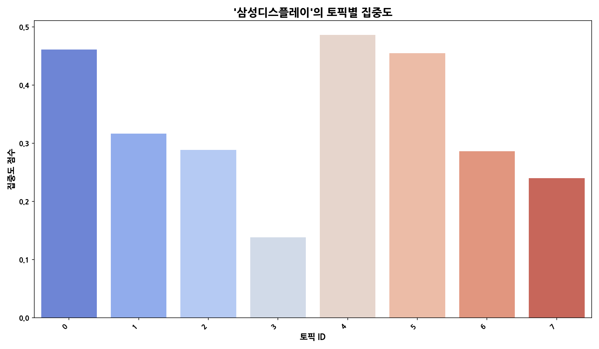
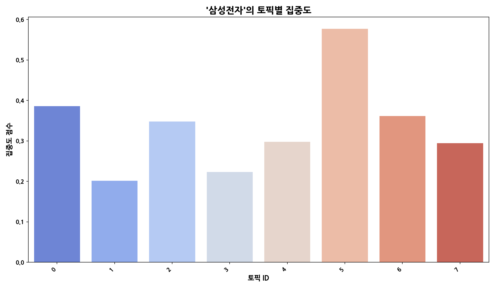

## 관계·경쟁 심화 분석

**핵심 요약**

- **관계망 규모:** 노드 23개 / 엣지 25개

- **가장 강한 관계:** 삼성디스플레이 ↔ 삼성전자 (가중치 6, 유형 partnership)

- **허브 후보:** 삼성전자 (Degree 0.3182)

- **브로커 후보:** 애플 (Betweenness 0.1486)

### 상위 관계쌍(Edge)

> 동일 문서/문장 내에서 함께 언급된 기업 쌍이며, 가중치는 동시출현 빈도입니다. 값이 높을수록 상호 관련성이 강하고, 유형은 키워드 규칙으로 경쟁/협력/중립을 추정합니다.

| Source   | Target   |   Weight | Type        |
|:---------|:---------|---------:|:------------|
| 삼성디스플레이  | 삼성전자     |        6 | partnership |
| 삼성전자     | 애플       |        5 | partnership |
| LG전자     | 삼성전자     |        5 | partnership |
| 삼성디스플레이  | 애플       |        4 | neutral     |
| 메타       | 엔비디아     |        4 | neutral     |
| 삼성전자     | 현대차      |        3 | partnership |
| 기아       | 현대차      |        3 | partnership |
| 기아       | 삼성전자     |        3 | partnership |
| 현대자동차    | 현대차      |        2 | partnership |
| 애플       | 엔비디아     |        2 | partnership |

### 중심성 상위(연결 허브)

> Degree 중심성은 한 노드가 연결된 상대 수의 비율로, 값이 높을수록 다수의 기업과 직접 연결된 허브 성격을 가집니다. 허브는 이슈 확산과 정보 접근성이 높습니다.

| Org     |   DegreeCentrality |
|:--------|-------------------:|
| 삼성전자    |             0.3182 |
| 애플      |             0.2273 |
| LG전자    |             0.1818 |
| 기아      |             0.1818 |
| 메타      |             0.1818 |
| 삼성디스플레이 |             0.1818 |
| 엔비디아    |             0.1818 |
| 현대차     |             0.1818 |
| 구글      |             0.1364 |
| 마이크로소프트 |             0.1364 |

### 매개 중심성 상위(정보 브로커)

> Betweenness는 네트워크 경로의 ‘다리’ 역할 정도를 의미합니다. 값이 높을수록 서로 다른 집단을 연결하는 중개자(브로커)로 해석되며, 거래·협상력과 정보 흐름 장악력이 큽니다.

| Org     |   Betweenness |
|:--------|--------------:|
| 애플      |        0.1486 |
| 삼성전자    |        0.1385 |
| 메타      |        0.039  |
| 엔비디아    |        0.039  |
| 삼성디스플레이 |        0.0267 |
| LG전자    |        0.0043 |
| 하이센스    |        0.0036 |
| 기아      |        0.0014 |
| 현대차     |        0.0014 |
| 구글      |        0      |

### 커뮤니티(관계 클러스터)

> 모듈러리티 기반으로 자동 추출한 관계 집단입니다. 같은 집단 내 기업들은 유사 주제나 공급망 활동을 공유할 가능성이 높습니다.

- C0: 디지타임스, 삼성디스플레이, 삼성전자, 애플, 하이센스 | 해석: 디지타임스 중심의 연관 클러스터
- C1: 구글, 마이크로소프트, 메타, 엔비디아 | 해석: 구글 중심의 연관 클러스터
- C2: LG전자, 기아, 현대자동차, 현대차 | 해석: LG전자 중심의 연관 클러스터
- C3: 네이버 | 해석: 네이버 중심의 연관 클러스터
- C4: 벤츠 | 해석: 벤츠 중심의 연관 클러스터

### 네트워크 시각화

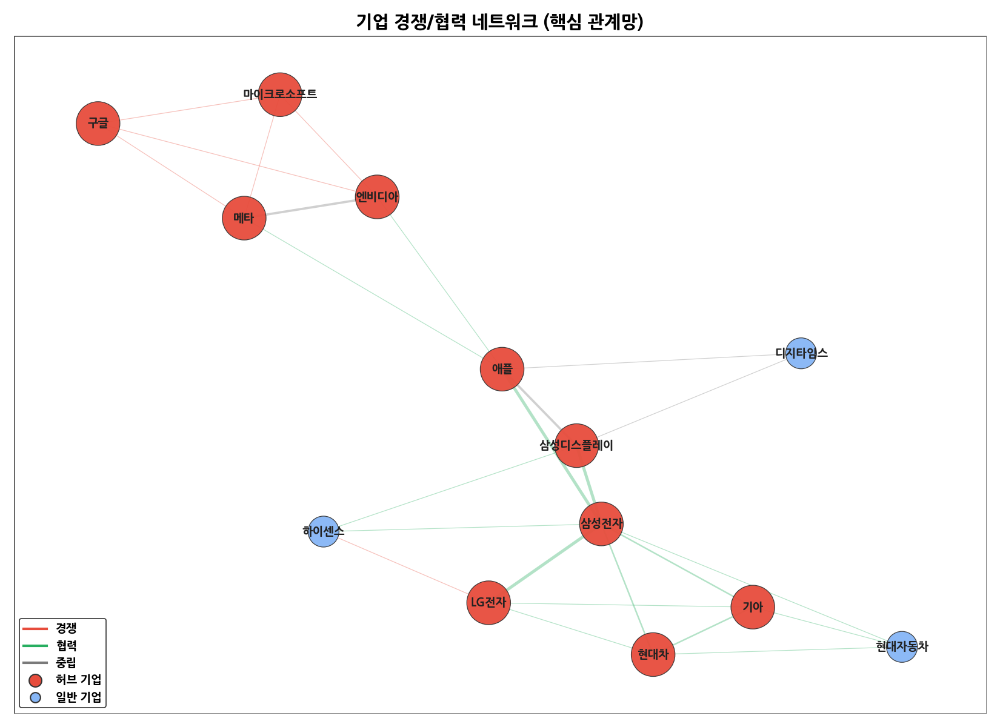

> 동시출현이 높은 쌍은 직접 경쟁 또는 공급망 핵심 협력 가능성을 시사하며, 허브/브로커는 시장 영향력 및 중개 포지션을 의미합니다. 커뮤니티는 전략·밸류체인 단위의 동조 클러스터일 수 있습니다.

## Trend

- 최근 기사 수 추세와 7일 이동평균선을 제공합니다.

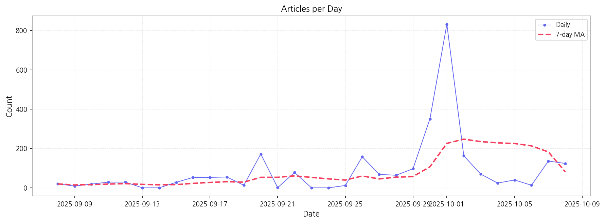

## Insights

## 데일리 인텔리전스 브리핑

**1. 핵심 맥락:**

*   **프리미엄 디스플레이 시장 경쟁 심화:** OLED TV, AI 가전 등 프리미엄 제품군을 중심으로 경쟁이 격화되고 있으며, 특히 삼성디스플레이와 애플의 차세대 디스플레이 기술 협력 및 중국 시장 공략이 주요 흐름입니다.
*   **AI 기반 데이터센터 및 전력 효율 중요성 증대:** AI 기술 발전과 데이터센터 확장에 따라 전력 소비 문제가 부각되고 있으며, LG를 비롯한 기업들이 AI 기반 전력 효율 기술 개발에 집중하고 있습니다.
*   **디스플레이 산업 내 반도체 기술 중요성 확대:** 디스플레이 성능 향상을 위한 전용 반도체 개발 경쟁이 치열하며, 특히 고성능 디스플레이 구현에 필요한 반도체 장비 및 핵심 기술 확보가 중요해지고 있습니다.

**2. 최근 변화/스파이크:**

*   **2025년 9월 30일 및 10월 1일 기사 수 급증:** 이 시기에 "애플", "패널", "삼성", "디스플레이" 키워드가 높은 빈도로 등장한 것으로 보아, 삼성디스플레이의 애플 차세대 디스플레이 패널 공급 관련 대규모 계약 발표 또는 신기술 공개와 관련된 시장의 높은 관심이 반영된 것으로 추론됩니다.

**3. 실무 인사이트:**

*   **사업 개발:**
    *   **차세대 디스플레이 기술 협력 기회 모색:** 삼성디스플레이-애플 협력 사례를 벤치마킹하여, 폴더블, 마이크로 LED 등 차세대 디스플레이 기술 분야에서 경쟁 우위를 확보할 수 있는 기술 파트너십 및 투자 기회를 적극적으로 발굴해야 합니다.
*   **기술 기획:**
    *   **AI 기반 전력 효율 기술 개발 투자 확대:** 데이터센터 및 AI 가전 시장 확대를 고려하여, 디스플레이 구동 전력 효율을 극대화할 수 있는 AI 기반 기술 개발에 대한 투자를 확대하고, 관련 특허 확보 전략을 수립해야 합니다.
    *   **디스플레이 구동 전용 반도체 기술 경쟁력 강화:** 고성능 디스플레이 구현에 필수적인 전용 반도체 기술 경쟁력 강화를 위해, 관련 기술 개발 로드맵을 구체화하고, 외부 전문 기업과의 협력 및 M&A를 통해 기술 포트폴리오를 확장해야 합니다.

## 주요 시그널 분석 (Key Signal Analysis)

### 강한 신호 (Strong Signals)

> 최근 뉴스에서 가장 주목받은 상위 키워드들입니다.

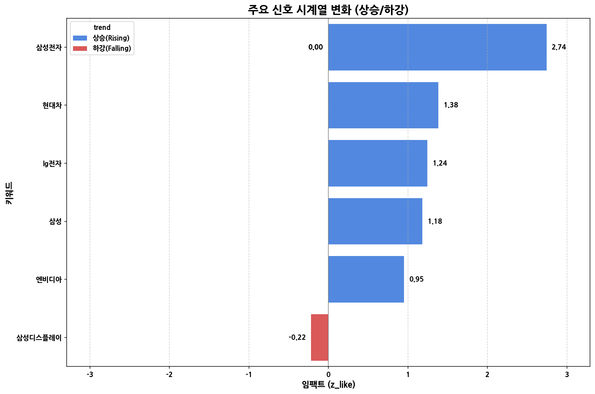

|   순위 | 강한 신호 (Term)   |   최근 언급량 (cur) |   임팩트 (z_like) |
|-----:|:---------------|---------------:|---------------:|
|    1 | 삼성전자           |             11 |          2.743 |
|    2 | 현대차            |              3 |          1.383 |
|    3 | lg전자           |              5 |          1.243 |
|    4 | 삼성             |             12 |          1.18  |
|    5 | 엔비디아           |              2 |          0.95  |
|    6 | sk하이닉스         |              2 |          0.814 |
|    7 | amd            |              2 |          0.814 |
|    8 | 퀄컴             |              2 |          0.814 |
|    9 | lg             |              5 |          0.732 |
|   10 | 샤오미            |              1 |          0.622 |

### 약한 신호 (Weak Signals)

> 총 언급량은 적지만 최근 급부상하여 미래가 기대되는 '틈새 키워드'들입니다.

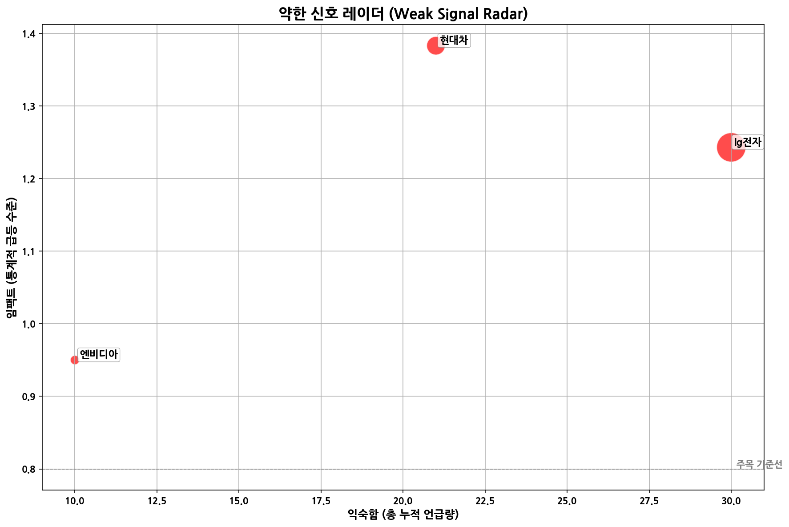

| 약한 신호 (Signal)   | 지표 (cur / z_like)   | LLM의 1줄 요약 (Interpretation)                                                                                                                                                                |
|:-----------------|:--------------------|:-------------------------------------------------------------------------------------------------------------------------------------------------------------------------------------------|
| 현대차              | 3 / 1.38            | 현대차는 차량 구독 서비스('현대 셀렉션', '기아플렉스', '현대 제네시스 셀렉션')와 전기차 배터리 구독·교체 사업('피트인') 등, '소유'에서 '사용'으로 전환되는 미래 모빌리티 생태계 구축에 적극적으로 참여하고 있으며, 이는 향후 자동차 산업의 서비스화 및 지속가능한 에너지 솔루션 제공에 중요한 역할을 할 잠재력을 지닌다. |
| lg전자             | 5 / 1.24            | LG전자는 가전 및 IT 기술 분야에서 꾸준히 혁신을 추구하는 기업으로, 인공지능, 로봇, 메타버스 등의 미래 기술 트렌드와 융합하며 스마트 라이프 솔루션 제공에 더욱 집중할 잠재력을 지닌다.                                                                                |
| 엔비디아             | 2 / 0.95            | 개인 투자자들의 주요 투자 대상이자 AI, 인프라, 생태계 분야에서 강력한 영향력을 가진 '매그넷10' 기업 중 하나로서, 미래 기술 협력 및 투자에 중요한 역할을 할 잠재력을 가진 기업이다.                                                                                |

## 기술 성숙도 분석 (Technology Maturity Analysis)

> 각 기술의 시장 내 위치(X축: 관심도, Y축: 긍정성)와 사업 활발도(버블 크기)를 보여줍니다.

| 기술 (Technology) | 성숙도 단계 (Stage) | 판단 근거 (Rationale) |
|:---|:---|:---|
| 삼성 | **Growth** | 높은 시장 감성 점수와 꾸준한 출시 및 투자 이벤트 발생으로 보아 성장기에 있다고 판단됩니다. |
| 패널 | **Growth** | 높은 시장 감성 점수와 출시 및 수주 이벤트가 발생한 것을 보아 패널 기술은 성장기에 있다고 판단됩니다. |
| 폴더블 | **Growth** | 높은 시장 감성 점수와 출시 및 수주 이벤트 발생은 폴더블 기술이 초기 단계를 지나 성장기에 진입했음을 시사합니다. |
| 애플 | **Maturity** | 높은 시장 감성 점수와 꾸준한 출시 및 수주 활동은 애플 기술이 성숙기에 접어들었음을 시사합니다. |

## 포착된 약한 신호 및 해석 (Emerging Signals & Interpretation)

- **현대차**
  - **해석:** 현대차는 차량 구독 서비스('현대 셀렉션', '기아플렉스', '현대 제네시스 셀렉션')와 전기차 배터리 구독·교체 사업('피트인') 등, '소유'에서 '사용'으로 전환되는 미래 모빌리티 생태계 구축에 적극적으로 참여하고 있으며, 이는 향후 자동차 산업의 서비스화 및 지속가능한 에너지 솔루션 제공에 중요한 역할을 할 잠재력을 지닌다.
- **lg전자**
  - **해석:** LG전자는 가전 및 IT 기술 분야에서 꾸준히 혁신을 추구하는 기업으로, 인공지능, 로봇, 메타버스 등의 미래 기술 트렌드와 융합하며 스마트 라이프 솔루션 제공에 더욱 집중할 잠재력을 지닌다.
- **엔비디아**
  - **해석:** 개인 투자자들의 주요 투자 대상이자 AI, 인프라, 생태계 분야에서 강력한 영향력을 가진 '매그넷10' 기업 중 하나로서, 미래 기술 협력 및 투자에 중요한 역할을 할 잠재력을 가진 기업이다.

## Opportunities (Top 5)

| Idea | Target | Value Prop | Score (Market / Urgency / Feasibility / Risk) |
|---|---|---|---|
| 수직 적층 방식의 초고해상도 VR/AR Micro-OLED 패널 | 북미 빅테크 기업 (VR/AR 기기 제조사) | 수직 적층 방식의 Micro-OLED 기술을 통해 기존 대비 2배 높은 해상도 (8K 이상)와 3배 높은 밝기를 제공하여, 더욱 선명하고 현실감 넘치는 VR/AR 경험을 제공합니다. 얇고 가벼운 디자인으로 기기 착용감 개선에도 기여합니다. | 5.1 (0.75 / 0.469 / 0.55 / 0.15) |
| 차량용 HUD (Head-Up Display) 증강현실 (AR) MicroLED 패널 | 글로벌 완성차 OEM (Tier 1 부품사 포함) | 기존 LCD HUD 대비 10배 높은 밝기, 5배 넓은 시야각, 50% 축소된 부피를 제공하여 몰입감 높은 AR 경험과 안전 운전 환경을 제공합니다. MicroLED의 높은 신뢰성을 바탕으로 극한 환경에서도 안정적인 성능을 보장합니다. | 3.9 (0.47 / 0.415 / 0.5 / 0.15) |
| 투명 디스플레이 기반 스마트 윈도우 | 글로벌 건설사, 건축 설계사무소 | 투명 디스플레이를 통해 건물 에너지 효율을 높이는 동시에, 날씨 정보, 뉴스, 광고 등 다양한 정보를 표시할 수 있는 스마트 윈도우 솔루션을 제공합니다. 건물 외관 디자인을 해치지 않으면서도, 새로운 가치를 창출할 수 있습니다. | 3.8 (0.4 / 0.415 / 0.55 / 0.15) |
| 롤러블 디스플레이 수율 향상을 위한 AI 공정 모니터링 서비스 | 국내외 디스플레이 패널 제조사 | AI 기반의 실시간 공정 모니터링 및 결함 예측 서비스를 통해 롤러블 디스플레이 수율을 최대 20% 향상시키고, 불량률을 감소시킵니다. 고객은 생산 비용을 절감하고, 제품 경쟁력을 강화할 수 있습니다. (Growth 단계인 롤러블 디스플레이 시장에 AI를 접목) | 3.4 (0.4 / 0.3 / 0.55 / 0.15) |
| AI 기반 OLED 번인 예측 및 보상 알고리즘 | 글로벌 디지털 사이니지 제조사, 키오스크 제조사 | AI 기반의 실시간 번인 예측 및 보상 알고리즘을 통해 OLED 패널 수명을 최대 30% 연장하고, 균일한 화질을 유지합니다. 고객은 초기 투자 비용 회수 기간을 늘리고, 유지보수 비용을 절감할 수 있습니다. (Emerging 단계인 AI 기술을 활용) | 3.2 (0.38 / 0.3 / 0.5 / 0.15) |

### 📊 아이디어 점수 분포
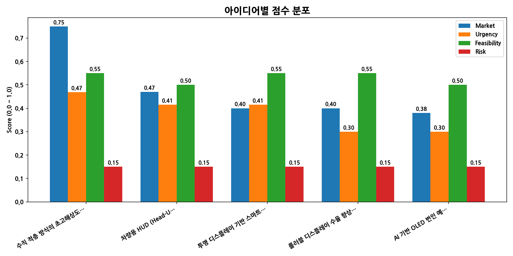

## Appendix

- 데이터: keywords.json, topics.json, trend_timeseries.json, trend_insights.json, biz_opportunities.json