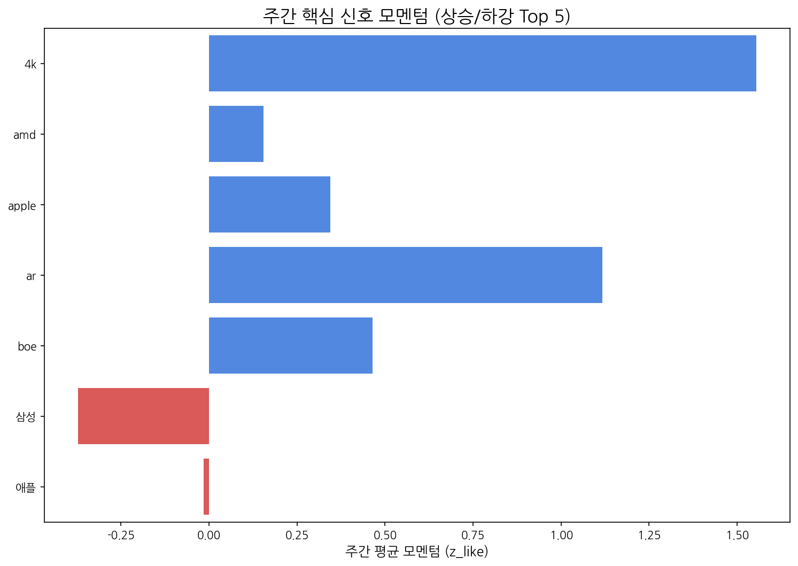

# Weekly Intelligence (2025-10-19)

## 1. 주간 경영 요약 및 전략적 시사점

- **분석 기간:** 2025-10-13 ~ 2025-10-19
- **총 분석 기사 수:** 0
- **주요 이벤트 발생 건수:** 233

#### 핵심 맥락

- 지난 주 키워드 분석 결과, **애플과 삼성**이 디스플레이 시장에서 여전히 강력한 영향력을 행사하고 있음을 시사합니다. 특히 **패널 및 중국** 키워드의 동시 부상은 애플, 삼성의 신제품 출시 및 중국 시장 내 경쟁 심화와 관련된 맥락으로 해석될 수 있습니다. 이는 프리미엄 디스플레이 시장의 경쟁 구도가 더욱 격화될 가능성을 암시합니다.

#### 전략적 인사이트

- **기회 요인:** 애플과 삼성의 신제품 출시 및 중국 시장 경쟁 심화는 고성능 디스플레이 패널에 대한 수요 증가로 이어질 수 있습니다. 따라서 당사의 고성능 디스플레이 기술력을 바탕으로 애플, 삼성 등 주요 고객사와의 협력 강화 및 중국 시장 점유율 확대 기회를 모색해야 합니다.
- **위협 요인:** 중국 디스플레이 업체의 기술력 향상 및 가격 경쟁력 강화는 당사의 시장 경쟁력을 약화시킬 수 있습니다. 특히 중저가 디스플레이 시장에서 중국 업체와의 경쟁 심화에 대비하여 기술 차별화 및 원가 절감 노력을 지속적으로 추진해야 합니다.

#### 추천 Action Items

- **액션 아이템 1:** 애플, 삼성 등 주요 고객사의 신제품 출시 동향 및 디스플레이 패널 사양을 면밀히 분석하여 당사의 기술 로드맵 및 제품 개발 전략에 반영합니다. 특히 차세대 디스플레이 기술 (예: Micro LED, QD-OLED) 개발에 대한 투자를 확대하여 기술 경쟁력을 확보해야 합니다.
- **액션 아이템 2:** 중국 디스플레이 시장의 경쟁 환경 변화를 지속적으로 모니터링하고, 경쟁사 대비 당사의 강점과 약점을 분석합니다. 이를 바탕으로 중국 시장 맞춤형 마케팅 전략 및 가격 정책을 수립하여 시장 점유율을 확대해야 합니다.

## 2. 주간 시장 테마 및 거시적 흐름 분석

| 키워드   |   주간 누적 점수 |
|:------|-----------:|
| 애플    |   0.893598 |
| 삼성    |   0.875531 |
| 패널    |   0.808794 |
| 중국    |   0.609302 |
| 디스플레이 |   0.550557 |
| 반도체   |   0.516043 |
| 한화    |   0.483151 |
| 미국    |   0.416679 |
| 폴더블   |   0.412027 |
| 생산    |   0.3156   |

## 3. 경쟁사 활동 강도 및 전략 전환 경보

> 금주에 감지된 주요 경쟁사 활동이 없습니다.

## 4. 잠재적 미래 성장 동력 및 초기 신호 발견

> 금주에 포착된 신규 약한 신호가 없습니다.

## 5. 핵심 트렌드 모멘텀 변화 및 우선순위 검토

| 핵심 신호   |   주간 총 언급량 |   일별 모멘텀(z_like) 추이 |
|:--------|-----------:|--------------------:|
| lg디스플레이 |          4 |                 1.2 |
| lg      |          2 |                -0.4 |
| oled    |          2 |                -0.4 |
| tcl     |          1 |                 0.6 |
| 비전프로    |          1 |                 0.6 |

