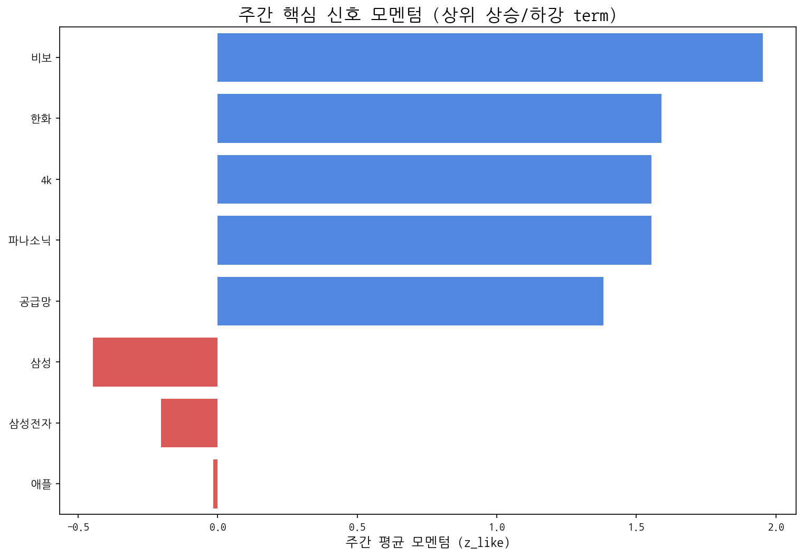

# Weekly Intelligence (2025-10-20)

## 1. 주간 경영 요약 및 전략적 시사점

- **분석 기간:** 2025-10-14 ~ 2025-10-20
- **총 분석 기사 수:** 485
- **주요 이벤트 발생 건수:** 447

#### 핵심 맥락

- 이번 주 시장의 핵심 맥락은 **애플과 삼성의 디스플레이 패널 관련 경쟁 심화 및 중국 시장의 중요성 증가**입니다. "애플", "삼성", "디스플레이", "패널", "중국" 키워드는 이 두 기업의 기술 경쟁과 시장 전략이 디스플레이 산업 전체에 미치는 영향력을 보여줍니다. 특히 중국 시장은 두 기업 모두에게 중요한 전략적 요충지로 작용하고 있음을 시사합니다.

#### 전략적 인사이트

- 애플과 삼성의 디스플레이 기술 경쟁 심화는 우리에게 **고성능 디스플레이 패널 시장 진출 기회**를 제공합니다. 두 기업의 경쟁은 더 높은 품질과 혁신적인 기능을 요구할 것이며, 이는 우리 회사가 차별화된 기술력을 바탕으로 시장 점유율을 확대할 수 있는 기회입니다.
- 반면, 중국 시장의 중요성 증가는 **가격 경쟁 심화 및 중국 패널 제조사들의 성장으로 인한 위협**을 의미합니다. 중국 시장은 규모가 크지만, 동시에 가격에 민감하고 중국 현지 기업들의 기술력이 빠르게 성장하고 있습니다. 이는 우리 회사의 수익성을 악화시키고 시장 경쟁력을 약화시킬 수 있는 요인입니다.
- "한화", "구글", "비보"와 같은 기업들의 활동량이 약한 신호로 감지된 것은 이들이 디스플레이 시장에서 새로운 전략을 모색하거나, 기술 개발에 집중하고 있을 가능성을 시사합니다. 이들은 잠재적인 경쟁자 혹은 협력 파트너가 될 수 있으므로 지속적인 관심과 모니터링이 필요합니다.

#### 추천 Action Items

- **애플, 삼성의 차세대 디스플레이 기술 동향 집중 분석:** 두 기업의 특허 출원, 제품 출시 계획, 시장 전략 등을 면밀히 분석하여 경쟁 우위를 확보할 수 있는 기술 개발 및 제품 전략을 수립해야 합니다. 특히, 폴더블, 마이크로 LED 등 차세대 디스플레이 기술에 대한 투자 검토가 필요합니다.
- **중국 시장 맞춤형 가격 경쟁력 확보 전략 수립:** 중국 시장 진출 전략을 재검토하고, 가격 경쟁력을 확보할 수 있는 방안을 모색해야 합니다. 생산 효율성 향상, 현지 파트너십 강화, 프리미엄 시장 공략 등 다양한 전략을 고려해야 합니다. 동시에 "한화", "구글", "비보"와 같은 기업들의 동향을 지속적으로 모니터링하고, 시장 진출 전략 변화에 대비해야 합니다.

## 2. 주간 시장 테마 및 거시적 흐름 분석

| 키워드   |   주간 누적 점수 |
|:------|-----------:|
| 애플    |   5.41145  |
| 삼성    |   4.07395  |
| 디스플레이 |   3.56514  |
| 패널    |   3.35259  |
| 중국    |   1.94259  |
| 반도체   |   1.67403  |
| 폴더블   |   1.67078  |
| 메타    |   1.21676  |
| 엔비디아  |   1.10644  |
| 생산    |   0.934828 |

## 3. 경쟁사 활동 강도 및 전략 전환 경보

> 금주에 감지된 주요 경쟁사 활동이 없습니다.

## 4. 잠재적 미래 성장 동력 및 초기 신호 발견

| term   |   cur |   z_like |   total |
|:-------|------:|---------:|--------:|
| 한화     |     8 |    3.314 |      37 |
| 구글     |     6 |    2.348 |      19 |
| 비보     |     4 |    1.953 |       4 |
| 4k     |     3 |    1.554 |       3 |
| 파나소닉   |     3 |    1.554 |       3 |

**AI 기반 주요 신호 해석:**

- **한화:** 방산 및 항공우주 산업을 넘어 미래 기술 분야에서 한화의 영향력이 확대될 가능성을 시사하며, 투자 및 기술 개발 동향을 주시해야 한다.
- **구글:** AI, 클라우드, 검색 등 핵심 기술 분야에서의 지속적인 혁신과 시장 지배력 유지를 넘어, 새로운 성장 동력 확보를 위한 움직임을 예의주시해야 한다.
- **비보:** 중국 스마트폰 제조사 비보의 부상은, 글로벌 스마트폰 시장 경쟁 심화와 더불어 혁신적인 기술 및 마케팅 전략을 통한 시장 점유율 확대를 의미한다.

## 5. 핵심 트렌드 모멘텀 변화 및 우선순위 검토

| 핵심 신호   |   주간 총 언급량 | 일별 모멘텀(z_like) 추이                     |
|:--------|-----------:|:--------------------------------------|
| 삼성전자    |         42 | -1.3 → 3.5 → 1.1 → -1.8 → -1.3 → -1.4 |
| 삼성      |         33 | -1.7 → 1.5 → 0.6 → -1.0 → -1.3 → -0.8 |
| lg      |         18 | -0.4 → 0.2 → 1.5 → -0.1               |
| lg전자    |         18 | -0.5 → 1.4 → 1.1 → -0.3 → -0.6        |
| oled    |         17 | -0.4 → 1.6 → 0.1 → -0.6 → 0.3         |

