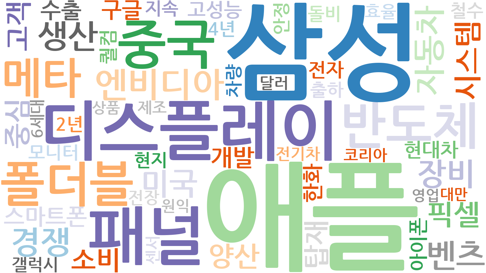
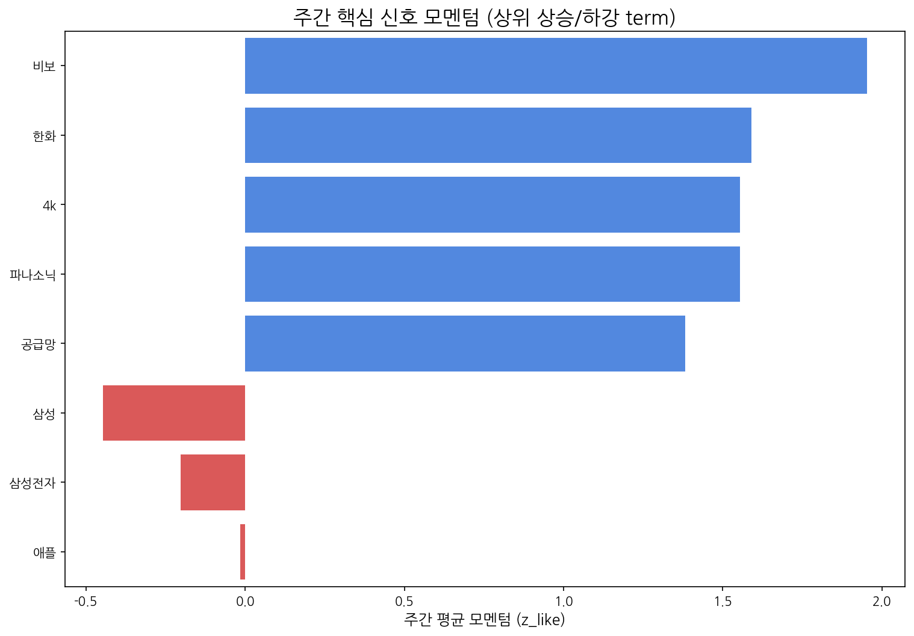

# Weekly Intelligence (2025-10-20)

## 1. 주간 경영 요약 및 전략적 시사점

- **분석 기간:** 2025-10-14 ~ 2025-10-20
- **총 분석 기사 수:** 485
- **주요 이벤트 발생 건수:** 447

#### 핵심 맥락

- 금주 시장의 주요 키워드는 "애플", "삼성", "디스플레이", "패널", "중국"으로, 애플과 삼성의 디스플레이 패널 시장 경쟁 구도가 심화되고 있으며, 중국 업체(BOE)의 영향력이 지속적으로 확대되고 있음을 시사합니다. 특히 애플 관련 키워드가 상위에 랭크된 것은 아이폰 신제품 발표 및 출시와 관련된 시장의 높은 관심도를 반영하는 것으로 보입니다.

#### 전략적 인사이트

- **기회**: 애플과 삼성의 경쟁은 디스플레이 패널 공급업체에게는 가격 협상력 증가 및 점유율 확대의 기회를 제공할 수 있습니다. 특히, 경쟁 우위를 확보할 수 있는 고성능, 저전력, 혁신적인 디스플레이 기술 개발 및 공급 능력 강화가 중요합니다.
- **위협**: 중국 BOE의 지속적인 성장은 우리 기업의 시장 점유율을 위협할 수 있습니다. 가격 경쟁력 뿐만 아니라 기술 경쟁력 확보를 위한 투자가 시급하며, 차세대 디스플레이 기술 선점을 위한 노력이 필요합니다. 또한, 한화, 구글, 비보와 같은 기업들의 약한 신호는 시장 진출 가능성을 내포하고 있으므로, 이들의 움직임을 면밀히 관찰하고 잠재적인 경쟁 위협에 대비해야 합니다.

#### 추천 Action Items

- **애플-삼성 디스플레이 경쟁 심화에 대한 대응 전략 수립:** 아이폰 신제품 관련 시장 동향을 지속적으로 모니터링하고, 애플과 삼성의 요구사항을 충족하는 차세대 디스플레이 기술 개발 및 공급 전략을 구체화해야 합니다.
- **BOE의 기술 경쟁력 분석 및 대응 전략 마련:** BOE의 기술 개발 동향, 생산 능력 확장 계획 등을 심층적으로 분석하고, 가격 경쟁력 및 기술 경쟁력 강화를 위한 구체적인 실행 계획을 수립해야 합니다.

## 2. 주간 시장 테마 및 거시적 흐름 분석

| 키워드   |   주간 누적 점수 |
|:------|-----------:|
| 애플    |   5.41145  |
| 삼성    |   4.07395  |
| 디스플레이 |   3.56514  |
| 패널    |   3.35259  |
| 중국    |   1.94259  |
| 반도체   |   1.67403  |
| 폴더블   |   1.67078  |
| 메타    |   1.21676  |
| 엔비디아  |   1.10644  |
| 생산    |   0.934828 |

## 3. 경쟁사 활동 강도 및 전략 전환 경보

| 경쟁사     |   주간 총 언급량 |   주간 평균 모멘텀 |
|:--------|-----------:|------------:|
| 삼성전자    |         42 |       -0.2  |
| lg디스플레이 |          9 |        0.29 |
| boe     |          1 |        0.47 |

## 4. 잠재적 미래 성장 동력 및 초기 신호 발견

| term   |   cur |   z_like |   total |
|:-------|------:|---------:|--------:|
| 한화     |     8 |    3.314 |      37 |
| 구글     |     6 |    2.348 |      19 |
| 비보     |     4 |    1.953 |       4 |
| 4k     |     3 |    1.554 |       3 |
| 파나소닉   |     3 |    1.554 |       3 |

**AI 기반 주요 신호 해석:**

- **한화:** 방산/에너지 기업 한화가 높은 관심도를 보이는 것은 미래 기술 분야에서 한화의 투자 및 사업 확장 가능성을 시사하며, 특히 우주항공, 친환경 에너지, AI/로봇 등의 분야에서 기술 혁신을 주도할 잠재력을 주목해야 합니다.
- **구글:** 구글에 대한 지속적인 관심은 AI, 클라우드, 검색 기술을 넘어 새로운 하드웨어, 플랫폼, 서비스 영역으로의 혁신을 암시하며, 구글의 미래 기술 개발 방향과 시장 선점 전략을 지속적으로 관찰할 필요가 있습니다.

## 5. 핵심 트렌드 모멘텀 변화 및 우선순위 검토

| 핵심 신호   |   주간 총 언급량 | 일별 모멘텀(z_like) 추이                     |
|:--------|-----------:|:--------------------------------------|
| 삼성전자    |         42 | -1.3 → 3.5 → 1.1 → -1.8 → -1.3 → -1.4 |
| 삼성      |         33 | -1.7 → 1.5 → 0.6 → -1.0 → -1.3 → -0.8 |
| lg      |         18 | -0.4 → 0.2 → 1.5 → -0.1               |
| lg전자    |         18 | -0.5 → 1.4 → 1.1 → -0.3 → -0.6        |
| oled    |         17 | -0.4 → 1.6 → 0.1 → -0.6 → 0.3         |

