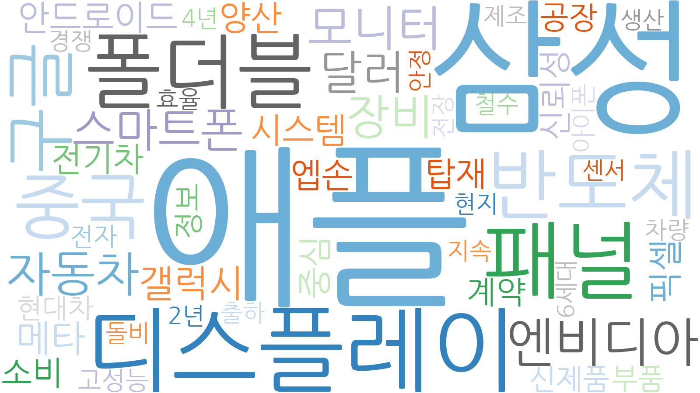
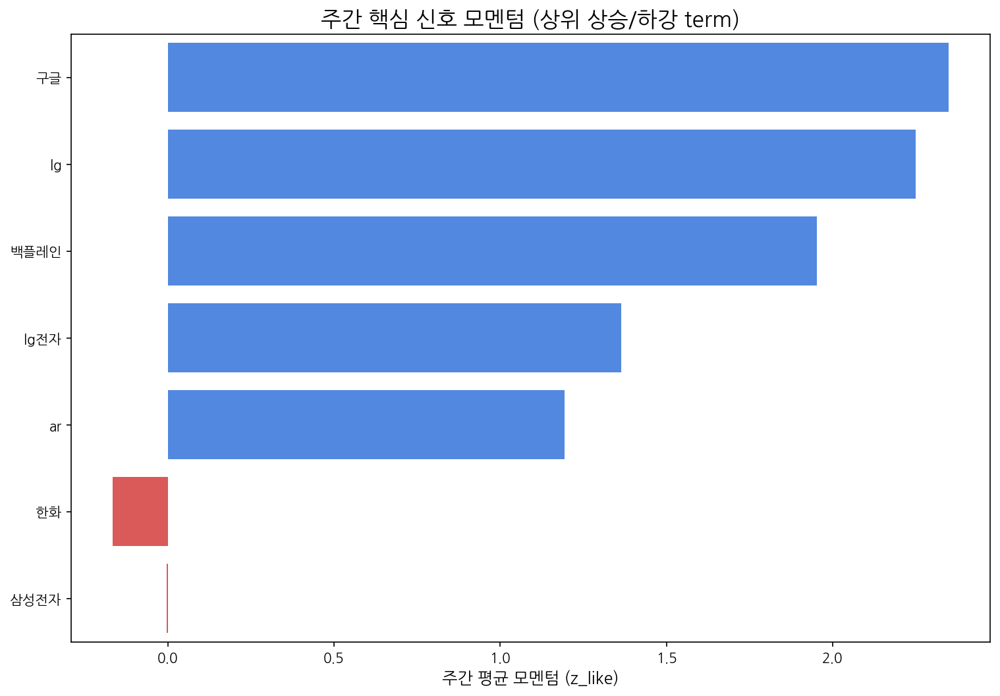

# Weekly Intelligence (2025-10-22)

## 1. 주간 경영 요약 및 전략적 시사점

- **분석 기간:** 2025-10-16 ~ 2025-10-22
- **총 분석 기사 수:** 632
- **주요 이벤트 발생 건수:** 546

LLM 요약 생성 중 오류가 발생했습니다.

## 2. 주간 시장 테마 및 거시적 흐름 분석

| 키워드   |   주간 누적 점수 |
|:------|-----------:|
| 애플    |   6.22022  |
| 삼성    |   3.56169  |
| 디스플레이 |   2.40286  |
| 패널    |   1.8599   |
| 폴더블   |   1.68872  |
| 반도체   |   1.4129   |
| 중국    |   1.17646  |
| 구글    |   1.13297  |
| 엔비디아  |   1.10644  |
| 모니터   |   0.924819 |

## 3. 경쟁사 활동 강도 및 전략 전환 경보

| 경쟁사     |   주간 총 언급량 |   주간 평균 모멘텀 |
|:--------|-----------:|------------:|
| 삼성전자    |         55 |       -0    |
| lg디스플레이 |          9 |        0.66 |
| boe     |          3 |        0.71 |
| 삼성디스플레이 |          1 |        0.62 |
| csot    |          1 |        0.62 |

## 4. 잠재적 미래 성장 동력 및 초기 신호 발견

| term   |   cur |   z_like |   total |
|:-------|------:|---------:|--------:|
| 구글     |     6 |    2.348 |      19 |
| ar     |     5 |    2     |      34 |
| 백플레인   |     4 |    1.953 |       4 |
| 패널     |     5 |    1.864 |      16 |
| 현대차    |     4 |    1.781 |      27 |

**AI 기반 주요 신호 해석:**

- **구글:** 검색 빈도 증가 추이는 구글의 새로운 기술 프로젝트 또는 시장 전략 변화를 암시하며, AI 및 클라우드 기술 경쟁 심화 가능성을 시사합니다.
- **AR:** AR 기술에 대한 관심 증가는 몰입형 경험, 산업 자동화, 원격 지원 등 다양한 분야에서 AR 기술의 상용화 가능성이 높아지고 있음을 나타냅니다.
- **현대차:** 현대차 관련 언급 증가는 전기차, 자율주행차, 도심 항공 모빌리티(UAM) 등 미래 모빌리티 기술 경쟁에 대한 관심이 고조되고 있음을 의미합니다.

## 5. 핵심 트렌드 모멘텀 변화 및 우선순위 검토

| 핵심 신호   |   주간 총 언급량 | 일별 모멘텀(z_like) 추이                    |
|:--------|-----------:|:-------------------------------------|
| 삼성      |         73 | 0.6 → -1.0 → -1.3 → -0.8 → 5.3 → 2.7 |
| 삼성전자    |         55 | 1.1 → -1.8 → -1.3 → -1.4 → 2.5 → 0.9 |
| lg      |         50 | 1.5 → -0.1 → 5.2 → 2.4               |
| lg전자    |         44 | 1.1 → -0.3 → -0.6 → 4.5 → 2.0        |
| oled    |         36 | 1.6 → 0.1 → -0.6 → 0.3 → 2.0 → 1.7   |

