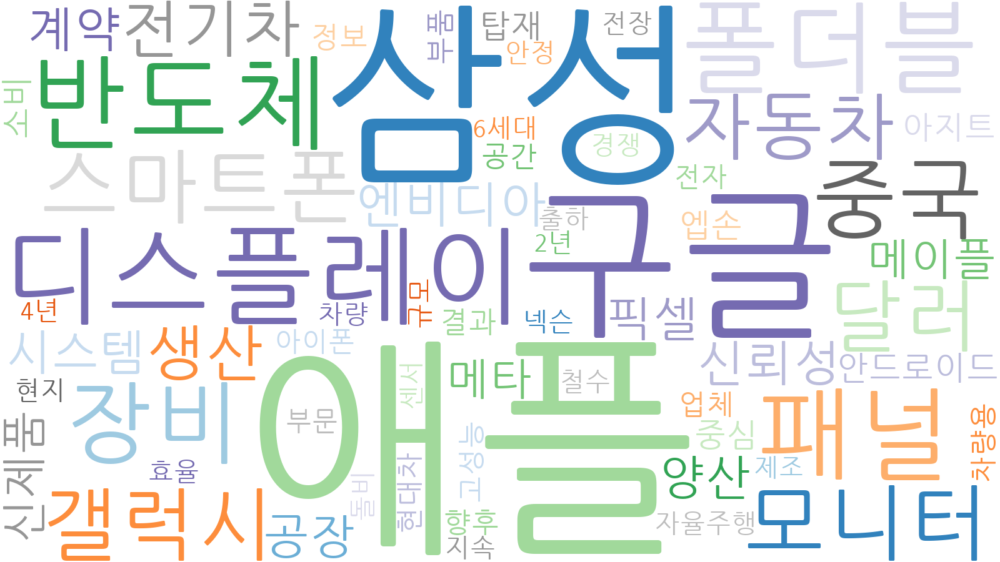
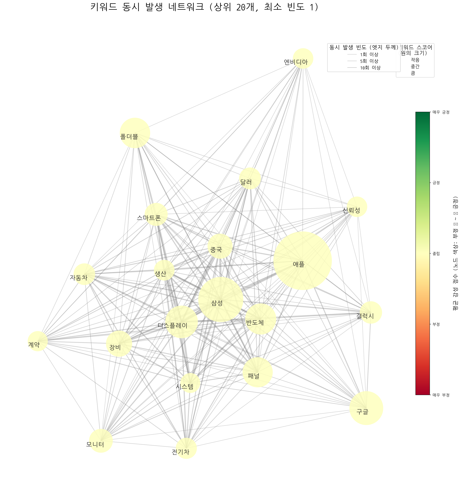
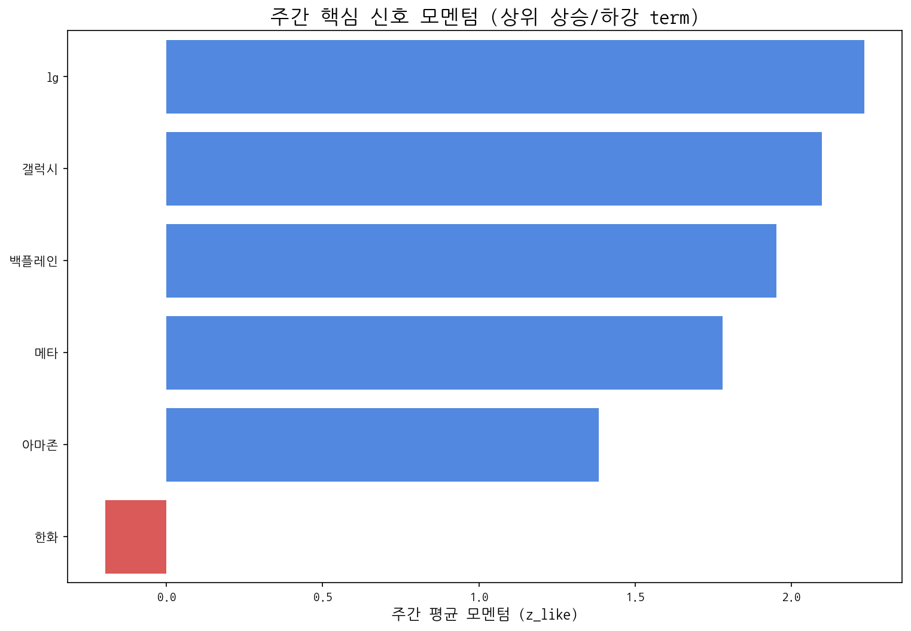

# Weekly Intelligence (2025-10-23)

## 1. 주간 경영 요약 및 전략적 시사점

- **분석 기간:** 2025-10-17 ~ 2025-10-23
- **총 분석 기사 수:** 804
- **주요 이벤트 발생 건수:** 662

#### 핵심 맥락

- **주요 IT 기업 (Apple, Samsung, Google)을 중심으로 디스플레이 및 반도체 시장의 관심이 집중**되고 있으며, 특히 **삼성전자, LG디스플레이, BOE 등 주요 디스플레이 제조사들의 활동량이 활발**하게 나타나고 있습니다. 이는 IT 대기업의 신제품 출시 및 기술 경쟁 심화와 관련된 것으로 분석됩니다. 또한, **게이밍, AR, 아이패드 관련 약한 신호**는 특정 제품군 또는 기술에 대한 잠재적 수요 변화를 암시합니다.

#### 전략적 인사이트

- **기회 요인:** 주요 IT 기업의 신제품 개발 및 출시 계획에 맞춰 고성능 디스플레이 및 관련 기술 개발에 집중하여 시장 점유율을 확대할 수 있습니다. 특히 게이밍 및 AR 시장의 성장 가능성에 주목하여 해당 분야에 최적화된 디스플레이 솔루션을 개발하고 관련 협력을 강화할 필요가 있습니다.
- **위협 요인:** 삼성전자, LG디스플레이, BOE 등 경쟁사들의 활발한 활동은 가격 경쟁 심화 및 기술 경쟁력 확보에 대한 압박으로 이어질 수 있습니다. 또한 아이패드 관련 약한 신호는 태블릿 시장 전반의 성장 둔화 가능성을 시사하며, 이는 디스플레이 수요 감소로 이어질 수 있습니다.

#### 추천 Action Items

- **경쟁사 동향 심층 분석:** 삼성전자, LG디스플레이, BOE 등 주요 경쟁사들의 신규 투자, 기술 개발, 시장 전략을 면밀히 분석하여 우리의 강점과 약점을 파악하고 차별화된 전략을 수립합니다. 특히 그들의 활동량이 증가한 분야를 중심으로 집중 분석합니다.
- **게이밍 및 AR 시장 진출 전략 수립:** 게이밍 및 AR 시장의 성장 가능성을 활용하기 위해, 관련 기술 트렌드 및 소비자 니즈를 분석하고 맞춤형 디스플레이 솔루션 개발 로드맵을 구체화합니다. 잠재 고객과의 협력을 통해 초기 시장 진입을 추진합니다.

## 2. 주간 시장 테마 및 거시적 흐름 분석

| 키워드   |   주간 누적 점수 |
|:------|-----------:|
| 애플    |    9.27705 |
| 삼성    |    5.49073 |
| 구글    |    3.07786 |
| 디스플레이 |    2.84782 |
| 반도체   |    2.58505 |
| 폴더블   |    2.48204 |
| 패널    |    2.43636 |
| 장비    |    1.82381 |
| 중국    |    1.67013 |
| 모니터   |    1.50424 |

### 키워드 연관성 네트워크

> 키워드 간 동시 출현 빈도를 기반으로 주요 테마 클러스터를 시각화합니다.

### 주요 키워드 클러스터

|   cluster_id | keywords                                                                                                                                          |
|-------------:|:--------------------------------------------------------------------------------------------------------------------------------------------------|
|            0 | 결과, 철수, 지속, 안정, 경쟁                                                                                                                                |
|            1 | 애플, 삼성, 구글, 스마트폰, 갤럭시, 안드로이드, 아이폰                                                                                                                 |
|            2 | 자동차, 전기차, 현대차, 차량용, 차량                                                                                                                            |
|            3 | 반도체, 모니터, 픽셀, 센서                                                                                                                                  |
|            4 | 디스플레이, 폴더블, 패널, 장비, 엔비디아, 신뢰성, 계약, 시스템, 양산, 신제품, 메타, 메이플, 중심, 엡손, 탑재, 아지트, 정보, 부품, 향후, 업체, 공간, 고성능, 전자, 넥슨, 규모, 자율주행, 현지, 돌비, 출하, 4년, 2년, 전장, 6세대 |
|            5 | 달러                                                                                                                                                |
|            6 | 생산, 공장, 소비, 부문, 효율, 제조                                                                                                                            |
|            7 | 중국                                                                                                                                                |

## 3. 경쟁사 활동 강도 및 전략 전환 경보

| 경쟁사     |   주간 총 언급량 |   주간 평균 모멘텀 |
|:--------|-----------:|------------:|
| 삼성전자    |         75 |        0.43 |
| lg디스플레이 |          7 |        0.5  |
| boe     |          5 |        0.97 |
| csot    |          2 |        0.54 |
| 삼성디스플레이 |          1 |        0.62 |

## 4. 잠재적 미래 성장 동력 및 초기 신호 발견

| term   |   cur |   z_like |   total |
|:-------|------:|---------:|--------:|
| 게이밍    |     8 |    2.6   |      21 |
| ar     |     5 |    2     |      34 |
| 아이패드   |     5 |    2     |      13 |
| 백플레인   |     4 |    1.953 |       4 |
| 패널     |     5 |    1.864 |      16 |

**AI 기반 주요 신호 해석:**

- **게이밍:** 높은 관심도와 지속적인 성장세를 고려할 때, 게이밍은 단순 엔터테인먼트를 넘어 기술 혁신의 주요 동력으로서 지속적인 주목이 필요합니다.
- **AR:** AR 기술은 엔터테인먼트, 교육, 산업 등 다양한 분야에 적용될 잠재력이 크므로, 관련 기술 발전과 시장 동향을 주시해야 합니다.
- **백플레인:** 백플레인 관련 신호는 서버 및 데이터 센터 기술의 발전, 특히 고성능 컴퓨팅 인프라에 대한 수요 증가를 암시하므로, 관련 기술 투자를 고려해야 합니다.

## 5. 핵심 트렌드 모멘텀 변화 및 우선순위 검토

| 핵심 신호   |   주간 총 언급량 | 일별 모멘텀(z_like) 추이                    |
|:--------|-----------:|:-------------------------------------|
| 삼성      |         86 | -1.0 → -1.3 → -0.8 → 5.3 → 2.7 → 1.2 |
| 삼성전자    |         75 | -1.8 → -1.3 → -1.4 → 2.5 → 0.9 → 3.7 |
| lg      |         58 | -0.1 → 5.2 → 2.4 → 1.5               |
| lg전자    |         45 | -0.3 → -0.6 → 4.5 → 2.0 → -0.4       |
| oled    |         35 | 0.1 → -0.6 → 0.3 → 2.0 → 1.7 → 0.2   |

